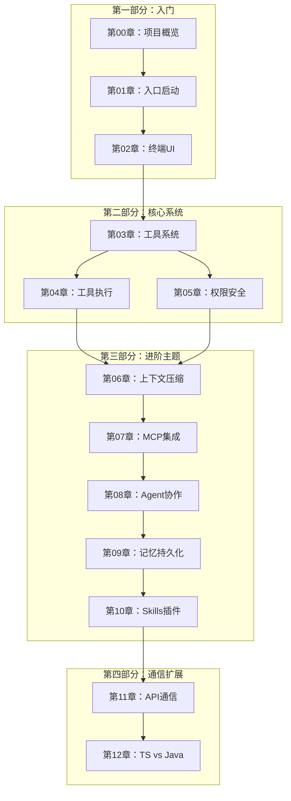

# Claude Code 源码解析 - 书籍架构

> **本文档目标**：定义出版级技术书籍的完整架构，确保教学质量和源码一致性。
>
> **版本**：2.0（增强版）
>
> **更新内容**：按团队负责人要求，增加每章8部分模板详细说明、源码映射表增强、Contributor 成长路径细化

---

## 1. 书籍概述

### 1.1 核心定位

| 项目 | 内容 |
|------|------|
| 书名 | Claude Code 源码解析 |
| 副标题 | 从架构设计到 Contributor 成长之路 |
| 目标读者 | 有编程基础的开发者（会任一语言即可），从新人到 Contributor |
| 核心价值 | 基于真实源码的深度学习，学完后能成为真实 Contributor |
| 学习终点 | 读者学完后能成为该项目的真实 Contributor |
| 总篇幅 | 约 600KB，13 章正文 + 12 附录 |

### 1.2 独特价值

1. **源码唯一事实来源** - 所有内容基于真实源码，禁止臆测
2. **问题驱动教学** - 每章从"为什么存在"开始
3. **真实调用链分析** - 关键函数、类名、方法名全部可验证
4. **工程经验传承** - 包含设计原因、历史包袱、坑点
5. **Contributor 成长路径** - 从学习到贡献的完整指引

### 1.3 技术栈概览

| 技术 | 用途 |
|------|------|
| TypeScript | 主语言 |
| React + Ink | 终端 UI 渲染（Ink = React for CLI） |
| Commander.js | CLI 参数解析 |
| Zod | 参数验证 |
| Anthropic SDK | API 调用 |
| MCP SDK | 外部服务集成 |
| Bun | 运行时/构建（`bun:bundle`） |

---

## 2. 完整目录结构

```
Claude Code 源码解析
│
├── 引言：如何阅读本书
│
├── 第一部分：入门（第 00-02 章）
│   ├── 第 00 章：项目概览与开发环境          [Level 1-2]
│   ├── 第 01 章：入口与启动流程              [Level 2-3]
│   └── 第 02 章：终端 UI 框架                [Level 3-4]
│
├── 第二部分：核心系统（第 03-05 章）
│   ├── 第 03 章：工具系统架构                [Level 4-5]
│   ├── 第 04 章：工具执行引擎                [Level 5-6]
│   └── 第 05 章：权限与安全                  [Level 5-6]
│
├── 第三部分：进阶主题（第 06-10 章）
│   ├── 第 06 章：上下文管理与压缩            [Level 5-6]
│   ├── 第 07 章：MCP 协议集成               [Level 5-6]
│   ├── 第 08 章：Agent 与多 Agent 协作       [Level 6-7]
│   ├── 第 09 章：记忆与持久化               [Level 6-7]
│   └── 第 10 章：Skills 与插件系统           [Level 6-7]
│
├── 第四部分：通信与扩展（第 11-12 章）
│   ├── 第 11 章：API 通信与远程             [Level 6-7]
│   └── 第 12 章：TypeScript vs Java 实战     [Level 7-8]
│
├── 附录（源码详解）
│   ├── A01：启动流程代码
│   ├── A02：UI 渲染代码
│   ├── A03：工具系统代码
│   ├── A04：工具执行代码
│   ├── A05：权限系统代码
│   ├── A06：压缩系统代码
│   ├── A07：MCP 集成代码
│   ├── A08：Agent 代码
│   ├── A09：记忆系统代码
│   ├── A10：插件系统代码
│   ├── A11：API 通信代码
│   └── A13：TypeScript 实战
│
└── 辅助文档
    ├── 引言：如何阅读本书
    ├── 学习路径导航
    ├── 源码映射速查
    └── 贡献指南
```

### 2.1 文件命名规范

| 类型 | 命名格式 | 示例 |
|------|---------|------|
| 引言 | `引言-{标题}.md` | `引言-如何阅读本书.md` |
| 章节 | `第{XX}章-{标题}.md` | `第00章-全局架构总览.md` |
| 附录 | `A{XX}-{标题}.md` | `A01-启动流程代码.md` |
| 进度 | `RalphLoop进度.md` | 迭代进度追踪 |

---

## 3. 学习路径设计

### 3.1 Level 1-9 进阶体系

```
┌─────────────────────────────────────────────────────────────┐
│ Level 1: 知道项目是干什么的                                  │
│     └── 第 00 章：项目概览                                   │
│          └── 理解 Claude Code 是终端 AI 助手                 │
├─────────────────────────────────────────────────────────────┤
│ Level 2: 能运行项目                                          │
│     └── 第 00 章 + 第 01 章                                 │
│          └── 本地运行、调试模式、参数解析                     │
├─────────────────────────────────────────────────────────────┤
│ Level 3: 理解模块边界                                        │
│     └── 第 01 章 + 第 02 章                                 │
│          └── 理解入口、初始化、UI 渲染模块划分                │
├─────────────────────────────────────────────────────────────┤
│ Level 4: 理解核心数据流                                      │
│     └── 第 02 章 + 第 03 章                                 │
│          └── 用户输入 → 工具调用 → API 响应 → 输出           │
├─────────────────────────────────────────────────────────────┤
│ Level 5: 能跟踪源码调用链                                    │
│     └── 第 03 章 + 第 04 章 + 第 05 章                      │
│          └── runToolUse() → checkPermissions() → Tool.execute() │
├─────────────────────────────────────────────────────────────┤
│ Level 6: 能修改小功能                                       │
│     └── 第 06 章 + 第 07 章                                 │
│          └── 添加新工具、修改权限规则                         │
├─────────────────────────────────────────────────────────────┤
│ Level 7: 能独立开发模块                                      │
│     └── 第 08 章 + 第 09 章 + 第 10 章                      │
│          └── 开发新 Agent、开发记忆系统、开发插件             │
├─────────────────────────────────────────────────────────────┤
│ Level 8: 能提交高质量 PR                                     │
│     └── 第 11 章 + 第 12 章 + 附录                           │
│          └── 理解 API 通信、代码风格、测试要求                │
├─────────────────────────────────────────────────────────────┤
│ Level 9: 能参与架构讨论                                      │
│     └── 全部章节 + 工程经验                                   │
│          └── 理解历史包袱、权衡取舍、演进方向                  │
└─────────────────────────────────────────────────────────────┘
```

### 3.2 三条学习路径

#### 路径 A：零基础开发者（推荐）

```
第 00 章 → 第 01 章 → 第 02 章 → 第 03 章 → 第 04 章 → 第 05 章
    ↓          ↓          ↓          ↓          ↓          ↓
  架构概览    启动流程    UI框架     工具系统    工具执行    权限系统

 → 第 06 章 → 第 07 章 → 第 08 章 → 第 09 章 → 第 10 章 → 第 11 章
     ↓          ↓          ↓          ↓          ↓          ↓
   上下文      MCP集成    Agent协作   记忆系统    Skills      API通信

 → 第 12 章 → 附录 A13 → 附录 A01-A11
     ↓          ↓            ↓
 语言对比    TypeScript   源码详解
           实战技巧
```

#### 路径 B：Java 开发者（快速通道）

```
第 00 章 → 引言：Java开发者速览
    ↓
第 01-05 章（对照 Spring 框架理解）
    ↓
第 06-11 章（对照 Java 生态理解）
    ↓
第 12 章（TypeScript vs Java 深度对比）
    ↓
附录 A01-A11（源码对照 Spring 源码理解）
```

#### 路径 C：专家路线（按需查阅）

```
├── 需要什么查什么
├── 附录 A01-A11 为主要参考
└── 第 00 章作为索引入口
```

---

## 4. 章节依赖关系图



### 4.1 依赖矩阵

| 章节 | 前置知识 | 并行可学 |
|------|---------|---------|
| 第 00 章 | 无 | 第 01-12 章 |
| 第 01 章 | 第 00 章 | 第 02 章 |
| 第 02 章 | 第 00 章 | 第 01 章 |
| 第 03 章 | 第 00 章 | 第 04 章 |
| 第 04 章 | 第 03 章 | 第 05 章 |
| 第 05 章 | 第 04 章 | - |
| 第 06 章 | 第 03-05 章 | 第 07 章 |
| 第 07 章 | 第 06 章 | 第 06 章 |
| 第 08 章 | 第 07 章 | 第 09 章 |
| 第 09 章 | 第 08 章 | 第 10 章 |
| 第 10 章 | 第 09 章 | 第 11 章 |
| 第 11 章 | 第 10 章 | 第 12 章 |
| 第 12 章 | 第 11 章 | - |

---

## 5. 源码映射表

### 5.1 核心模块映射

| 章节 | 核心源码文件 | 关键函数/类 | 行号 |
|------|-------------|------------|------|
| 第 00 章 | `src/main.tsx` | CLI 入口、参数解析 | 585 |
| | `src/bootstrap/state.ts` | State, createSignal | - |
| | `src/tools.ts` | getAllBaseTools() | 50 |
| | `src/Tool.ts` | Tool interface | 362 |
| 第 01 章 | `src/main.tsx` | main(), buildCLIProgram() | 585, 450 |
| | `src/entrypoints/init.ts` | init(), memoize | 100 |
| | `src/replLauncher.tsx` | launchRepl() | 50 |
| 第 02 章 | `src/components/App.tsx` | App | - |
| | `src/screens/REPL.tsx` | REPL | - |
| | `src/ink/` | Ink 适配层 | - |
| 第 03 章 | `src/Tool.ts` | Tool interface | 362 |
| | `src/tools.ts` | getAllBaseTools(), assembleToolPool() | 50, 200 |
| | `src/tools/BashTool/` | BashTool | - |
| | `src/tools/FileEditTool/` | FileEditTool | - |
| 第 04 章 | `src/services/tools/toolExecution.ts` | runToolUse(), checkPermissionsAndCallTool() | 337, 599 |
| | `src/services/tools/StreamingToolExecutor.ts` | StreamingToolExecutor | 40 |
| | `src/services/tools/toolHooks.ts` | runPreToolUseHooks(), runPostToolUseHooks() | 50, 80 |
| 第 05 章 | `src/utils/permissions/permissions.ts` | hasPermissionsToUseTool(), checkRuleBasedPermissions() | 50, 100 |
| | `src/utils/permissions/bashClassifier.ts` | classifyBashCommand() | 30 |
| | `src/utils/permissions/denialTracking.ts` | shouldFallbackToPrompting() | 40 |
| 第 06 章 | `src/services/compact/compact.ts` | compactConversation() | 387 |
| | `src/services/compact/grouping.ts` | groupMessagesByApiRound() | 30 |
| | `src/services/compact/microCompact.ts` | applyMicroCompaction() | 60 |
| | `src/services/compact/sessionMemoryCompact.ts` | trySessionMemoryCompaction() | 90 |
| 第 07 章 | `src/services/mcp/client.ts` | connectToServer() | 595 |
| | `src/services/mcp/client.ts` | fetchToolsForClient() | 1743 |
| | `src/services/mcp/client.ts` | getMcpToolsCommandsAndResources() | 2226 |
| 第 08 章 | `src/tools/AgentTool/AgentTool.tsx` | AgentTool.call() | 200 |
| | `src/tools/AgentTool/runAgent.ts` | runAgent() | 306 |
| | `src/tools/AgentTool/forkSubagent.ts` | buildForkedMessages() | 466 |
| | `src/utils/mailbox.ts` | writeToMailbox() | 50 |
| 第 09 章 | `src/services/SessionMemory/` | SessionMemory | - |
| | `src/utils/memory/` | memory utilities | - |
| 第 10 章 | `src/skills/` | Skills system | - |
| | `src/services/plugins/` | Plugin lifecycle | - |
| 第 11 章 | `src/services/api/claude.ts` | createMessageStream(), normalizeMessagesForAPI() | 100, 50 |
| | `src/services/api/withRetry.ts` | withRetry() | 30 |
| | `src/services/tools/toolExecution.ts` | classifyToolError() | 150 |
| 第 12 章 | 跨章节对比 | TypeScript vs Java | - |

### 5.2 快速定位表

| 功能 | 源码位置 | 说明 |
|------|----------|------|
| 工具执行入口 | `src/services/tools/toolExecution.ts:337` | runToolUse() |
| 权限检查 | `src/utils/permissions/permissions.ts:50` | hasPermissionsToUseTool() |
| 上下文压缩 | `src/services/compact/compact.ts:387` | compactConversation() |
| Agent 协作 | `src/tools/AgentTool/AgentTool.tsx:200` | AgentTool.call() |
| API 调用 | `src/services/api/claude.ts:100` | createMessageStream() |
| MCP 连接 | `src/services/mcp/client.ts:595` | connectToServer() |

### 5.3 工具注册表

```
getAllBaseTools() (tools.ts:50)
    │
    ├── AgentTool (AgentTool/)
    ├── TaskOutputTool (TaskOutputTool/)
    ├── BashTool (BashTool/)
    ├── GlobTool (GlobTool/)           ← hasEmbeddedSearchTools() 时排除
    ├── GrepTool (GrepTool/)           ← hasEmbeddedSearchTools() 时排除
    ├── ExitPlanModeV2Tool (ExitPlanModeTool/)
    ├── FileReadTool (FileReadTool/)
    ├── FileEditTool (FileEditTool/)
    ├── FileWriteTool (FileWriteTool/)
    ├── NotebookEditTool (NotebookEditTool/)
    ├── WebFetchTool (WebFetchTool/)
    ├── TodoWriteTool (TodoWriteTool/)
    ├── WebSearchTool (WebSearchTool/)
    ├── TaskStopTool (TaskStopTool/)
    ├── AskUserQuestionTool (AskUserQuestionTool/)
    ├── SkillTool (SkillTool/)
    ├── EnterPlanModeTool (EnterPlanModeTool/)
    ├── [条件加载] TaskCreateTool 等 (TODO_V2)
    ├── [条件加载] EnterWorktreeTool (WORKTREE_MODE)
    ├── getSendMessageTool() (SendMessageTool/)
    ├── [条件加载] TeamCreateTool (AGENT_SWARMS)
    ├── BriefTool (BriefTool/)
    ├── ListMcpResourcesTool (ListMcpResourcesTool/)
    ├── ReadMcpResourceTool (ReadMcpResourceTool/)
    ├── [条件加载] ToolSearchTool (ENABLE_TOOL_SEARCH)
    └── MCPTool (运行时来自 MCP)
```

---

## 6. 每章模板（8个必需部分）

### 6.1 模板结构

每章必须包含以下 **8 个部分**，按顺序组织：

```markdown
# 第XX章：章节标题

> **本章目标**：学完后能做什么（具体、可验证）

---

## 1. 学习目标
- [ ] 目标 1：具体可衡量的能力
- [ ] 目标 2：理解某某机制
- [ ] 目标 3：能够追踪某某调用链

## 2. 背景问题
### 2.1 为什么这个模块存在？
### 2.2 它解决了什么问题？
### 2.3 如果没有它会怎样？

## 3. 源码入口
| 项目 | 内容 |
|------|------|
| 文件路径 | `src/xxx/` |
| 核心类/函数 | `xxx.yyy()` |
| 调用入口 | `zzz()` 调用链 |
| 行号 | #100-200 |

## 4. 架构定位
### 4.1 模块职责
### 4.2 生命周期
### 4.3 模块关系
```text
模块关系图
```

## 5. 核心源码分析
### 5.1 调用链
```text
调用流程图
```
### 5.2 设计原因
### 5.3 历史包袱（如果有）

## 6. 可视化结构

### 6.1 模块结构图
### 6.2 时序图
### 6.3 数据流图

## 7. 工程经验
### 7.1 为什么这么设计？
### 7.2 替代方案
### 7.3 常见坑与避坑指南

## 8. Contributor 指南
### 8.1 适合新手的文件
### 8.2 危险逻辑（修改需谨慎）
### 8.3 调试方法
### 8.4 相关 Issue/PR

---

## 练习
### 练习 1：xxx
### 练习 2：xxx

## 练习答案速查

## 本章 vs Java {对应框架}
| 方面 | Claude Code | Java |
|------|-------------|------|
| ... | ... | ... |

## 下一篇
👉 [第XX章-xxx.md](./第XX章-xxx.md)
```

### 6.2 各部分详细说明

#### 1. 学习目标（What You Will Do）

**格式**：checkbox 列表，每个目标可验证

**示例**：
```
- [ ] 理解 BashTool 的安全检查机制
- [ ] 能够追踪工具执行的完整调用链
- [ ] 知道如何添加一个新工具
```

**标准**：
- 每个目标必须是可验证的
- 包含具体技能而非抽象概念
- 标注与 Level 1-9 的对应关系

#### 2. 背景问题（Why It Exists）

**包含**：
- 为什么这个模块存在？
- 它解决了什么问题？
- 设计动机是什么？

**格式**：markdown 段落

**标准**：
- 从问题出发，而非从实现出发
- 包含历史背景（如果适用）
- 解释为什么用这种方式解决

#### 3. 源码入口（Where to Find）

**格式**：表格

| 项目 | 内容 |
|------|------|
| 文件路径 | `src/xxx/` |
| 核心类 | `XxxClass` |
| 方法 | `xxxMethod()` |
| 调用入口 | 从 `yyy()` 开始 |
| 行号 | #100-200 |

**标准**：
- 所有路径必须可验证
- 行号必须与实际源码一致
- 标注关键类型定义位置

#### 4. 架构定位（How It Fits）

**包含**：
- 模块职责：它负责什么
- 生命周期：何时创建、何时销毁
- 模块关系：与谁交互、依赖谁、被谁依赖

**格式**：文字 + Mermaid 图

**标准**：
- 模块职责不超过 3 句话
- 生命周期用状态图表示
- 模块关系包含上下游依赖

#### 5. 核心源码分析（Deep Dive）

**包含**：
- 真实调用链（带行号）
- 关键代码片段
- 设计原因
- 历史包袱（如有）

**格式**：代码块 + 注释

**标准**：
- 代码片段必须有行号
- 关键逻辑必须有中文注释
- 设计原因必须有具体解释

#### 6. 可视化结构（Visualize）

**包含**：
- Mermaid 模块图
- 时序图（核心流程）
- 数据流图

**格式**：Mermaid 代码块

**标准**：
- 所有图必须有图例说明
- 复杂流程必须有时序图
- 数据流必须标注方向

#### 7. 工程经验（Engineering Wisdom）

**包含**：
- 为什么这么设计？
- 替代方案有哪些？
- 常见坑与避坑指南

**格式**：markdown 列表

**标准**：
- 每项经验必须有具体例子
- 坑点必须包含触发条件
- 替代方案必须说明权衡

#### 8. Contributor 指南（How to Contribute）

**包含**：
- 适合新手的文件（first PR 好地方）
- 危险逻辑（修改需谨慎）
- 调试方法
- 相关 Issue/PR 链接

**格式**：markdown 列表

**标准**：
- 新手友好任务必须具体可执行
- 危险逻辑必须标注风险等级
- 调试方法必须包含具体步骤

---

## 7. Contributor 成长路径

### 7.1 四阶段成长模型

```
┌─────────────────────────────────────────────────────────────┐
│ 阶段 1：读者（Reader）                                      │
│                                                             │
│ 目标：理解项目是干什么的，能运行项目                         │
│ 时间：第 1-2 周                                             │
│ 里程碑：                                                   │
│   - 运行 Claude Code 完成一次对话                           │
│   - 找到工具系统的源码位置                                  │
│   - 理解一次 tool_use → tool_result 循环                   │
└─────────────────────────────────────────────────────────────┘
                          ↓
┌─────────────────────────────────────────────────────────────┐
│ 阶段 2：学习者（Learner）                                   │
│                                                             │
│ 目标：理解核心模块的架构，能跟踪调用链                       │
│ 时间：第 3-8 周                                             │
│ 里程碑：                                                   │
│   - 完成第 00-05 章学习                                    │
│   - 能追踪 BashTool.call() 的完整调用链                     │
│   - 能向他人解释工具执行流程                                 │
└─────────────────────────────────────────────────────────────┘
                          ↓
┌─────────────────────────────────────────────────────────────┐
│ 阶段 3：贡献者（Contributor）                               │
│                                                             │
│ 目标：能修改小功能，提交第一个 PR                           │
│ 时间：第 9-16 周                                            │
│ 里程碑：                                                   │
│   - 完成第 06-11 章学习                                    │
│   - 修复一个文档错误或小 bug                                │
│   - 提交第一个 PR 并被合并                                  │
│   - 适合新手的任务：                                        │
│     * 文档改进（README、注释）                              │
│     * 测试补充                                              │
│     * 工具 prompt 优化                                      │
│     * 错误消息改进                                          │
└─────────────────────────────────────────────────────────────┘
                          ↓
┌─────────────────────────────────────────────────────────────┐
│ 阶段 4：活跃贡献者（Active Contributor）                    │
│                                                             │
│ 目标：能独立开发模块，提交高质量 PR                         │
│ 时间：第 17+ 周                                             │
│ 里程碑：                                                   │
│   - 完成第 12 章和附录学习                                  │
│   - 独立开发一个新工具                                      │
│   - 参与架构讨论                                           │
│   - 指导新人                                               │
└─────────────────────────────────────────────────────────────┘
```

### 7.2 新人任务分级

| 级别 | 任务类型 | 示例 | 相关章节 |
|------|---------|------|---------|
| L1 | 文档改进 | 错别字、格式调整、注释补充 | 所有章节 |
| L2 | 工具文档 | 添加缺失的工具使用说明 | 第 03 章 |
| L3 | 测试覆盖 | 补充单元测试、集成测试 | 第 04 章 |
| L4 | Bug修复 | 修复已知问题、边界条件 | 第 03-05 章 |
| L5 | 功能增强 | 改进现有工具、添加选项 | 第 03 章 |
| L6 | 新功能 | 实现新工具、新模块 | 第 03 章 |
| L7 | 架构优化 | 重构、模块解耦 | 第 06-11 章 |
| L8 | 跨模块 | 多系统联动设计 | 第 08-11 章 |

### 7.3 新手友好任务清单

| 任务类型 | 具体任务 | 相关章节 | 难度 |
|---------|---------|---------|------|
| **文档** | 改进工具 prompt 描述 | 第 03 章 | L1 |
| **文档** | 补充练习题答案 | 所有章节 | L1 |
| **文档** | 改进错误消息 | 第 04 章 | L2 |
| **测试** | 添加工具集成测试 | 第 04 章 | L3 |
| **代码** | 修复小 bug | 第 03-05 章 | L3 |
| **代码** | 添加新工具 | 第 03 章 | L5 |
| **重构** | 提取重复代码 | 第 03-11 章 | L5 |
| **架构** | 模块重构设计 | 第 06-11 章 | L7 |

### 7.4 危险逻辑警示

| 模块 | 危险区域 | 风险等级 | 修改建议 |
|------|---------|---------|---------|
| BashTool | `exec()` 调用 | 🔴 高 | 先做安全检查 |
| toolExecution | `runToolUse()` | 🔴 高 | 确保不绕过权限检查 |
| compact | `compactConversation()` | 🟡 中 | 添加回归测试 |
| permissions | 规则匹配 | 🔴 高 | 先理解再修改 |
| MCP | 传输层 | 🟡 中 | 审查所有网络操作 |

### 7.5 成长检查清单

```
□ 能本地运行 Claude Code
□ 理解工具执行流程
□ 能跟踪函数调用链
□ 能修改小功能并测试
□ 能添加新工具
□ 能编写测试用例
□ 理解权限系统设计
□ 能参与代码审查
□ 能提出架构建议
```

---

## 8. 质量标准

### 8.1 出版级质量检查清单

#### 内容准确性
- [ ] 所有代码示例经过验证（行号、路径）
- [ ] 类型定义与实际源码一致
- [ ] 没有过时或已废弃的 API
- [ ] 练习题答案正确可运行

#### 结构性
- [ ] 每章包含全部 8 个部分
- [ ] 遵循统一模板格式
- [ ] 章节之间依赖关系清晰
- [ ] 链接全部有效（无悬空引用）

#### 可读性
- [ ] 代码注释清晰（中英比例适中）
- [ ] 图表有图例和说明
- [ ] 关键概念首次出现时解释
- [ ] 无拼写/语法错误

#### 学习效果
- [ ] 学习目标可验证
- [ ] 练习题有挑战性但可完成
- [ ] 进阶路径合理（不跳步）
- [ ] Contributor 指南实用

### 8.2 章节质量标准

| 标准 | 最低要求 | 优秀标准 |
|------|---------|---------|
| 学习目标 | 3 个可验证目标 | 5+ 个目标，含自测题 |
| 背景问题 | 1 个为什么 | 3+ 个问题，含历史背景 |
| 源码入口 | 1 个文件+函数 | 3+ 个文件，完整调用链 |
| 架构定位 | 模块职责说明 | 含生命周期+关系图 |
| 源码分析 | 核心代码片段 | 完整调用链+时序图 |
| 可视化 | 1 个示意图 | 3+ 个图（Mermaid） |
| 工程经验 | 1 个设计原因 | 3+ 个原因+替代方案+坑 |
| Contributor | 1 个友好任务 | 3+ 个任务+危险警示 |

### 8.3 代码质量标准

```typescript
// ✅ 正确示例：带行号的源码引用
/**
 * 工具执行入口
 * 文件：src/services/tools/toolExecution.ts:337
 */
async function runToolUse(toolUse: ToolUse): Promise<ToolResult> {
  // ...
}

// ❌ 错误示例：无行号、无文件
/**
 * 执行工具
 */
async function runToolUse(toolUse) {
  // ...
}
```

```markdown
<!-- ✅ 正确示例：完整的源码映射 -->
| 章节 | 主要源码文件 | 关键函数 | 行号 |
|------|------------|---------|------|
| 第 04 章 | toolExecution.ts | runToolUse() | 337 |

<!-- ❌ 错误示例：缺少关键信息 -->
| 章节 | 源码文件 |
|------|---------|
| 第 04 章 | toolExecution.ts |
```

### 8.4 可视化标准

```mermaid
<!-- ✅ 正确示例：带标签的时序图 -->
sequenceDiagram
    participant U as 用户
    participant REPL
    participant API
    participant Tool
    U->>REPL: 输入命令
    REPL->>API: 发送消息
    API->>Tool: tool_use
    Tool-->>API: tool_result
    API-->>REPL: 流式响应
    REPL-->>U: 显示结果

<!-- ❌ 错误示例：无标签、无参与者 -->
sequenceDiagram
    用户 -> REPL
    REPL -> API
```

---

## 9. 附录：完整文件清单

### 9.1 必需文件（书籍正文）

| 文件 | 状态 | 说明 |
|------|------|------|
| `引言-如何阅读本书.md` | ✅ 已完成 | 引言 |
| `第00章-全局架构总览.md` | ✅ 已完成 | 第 00 章 |
| `第01章-入口与启动流程.md` | ✅ 已完成 | 第 01 章 |
| `第02章-终端UI框架.md` | ✅ 已完成 | 第 02 章 |
| `第03章-工具系统.md` | ✅ 已完成 | 第 03 章 |
| `第04章-工具执行与安全.md` | ✅ 已完成 | 第 04 章 |
| `第05章-权限系统.md` | ✅ 已完成 | 第 05 章 |
| `第06章-上下文管理与压缩.md` | ✅ 已完成 | 第 06 章 |
| `第07章-MCP协议集成.md` | ✅ 已完成 | 第 07 章 |
| `第08章-Agent与多Agent协作.md` | ✅ 已完成 | 第 08 章 |
| `第09章-记忆与持久化.md` | ✅ 已完成 | 第 09 章 |
| `第10章-Skills与插件系统.md` | ✅ 已完成 | 第 10 章 |
| `第11章-API通信与远程.md` | ✅ 已完成 | 第 11 章 |
| `第12章-TypeScript实战对比.md` | ✅ 已完成 | 第 12 章 |

### 9.2 附录文件（源码详解）

| 文件 | 状态 | 说明 |
|------|------|------|
| `appendix/A01-启动流程代码.md` | ✅ 已完成 | 启动流程源码 |
| `appendix/A02-UI渲染代码.md` | ✅ 已完成 | UI 渲染源码 |
| `appendix/A03-工具系统代码.md` | ✅ 已完成 | 工具系统源码 |
| `appendix/A04-工具执行代码.md` | ✅ 已完成 | 工具执行源码 |
| `appendix/A05-权限系统代码.md` | ✅ 已完成 | 权限系统源码 |
| `appendix/A06-压缩系统代码.md` | ✅ 已完成 | 压缩系统源码 |
| `appendix/A07-MCP集成代码.md` | ✅ 已完成 | MCP 集成源码 |
| `appendix/A08-Agent代码.md` | ✅ 已完成 | Agent 源码 |
| `appendix/A09-记忆系统代码.md` | ✅ 已完成 | 记忆系统源码 |
| `appendix/A10-插件系统代码.md` | ✅ 已完成 | 插件系统源码 |
| `appendix/A11-API通信代码.md` | ✅ 已完成 | API 通信源码 |
| `appendix/A13-TypeScript实战.md` | ✅ 已完成 | TypeScript 实战 |

### 9.3 辅助文件（参考）

| 文件 | 说明 |
|------|------|
| `book-structure.md` | 书籍结构（旧版，可废弃） |
| `code-walkthrough-index.md` | 代码索引 |
| `quick-start.md` | Java 开发者速览 |
| `RalphLoop进度.md` | 当前进度追踪 |

---

## 10. 版本演进

### 10.1 章节更新策略

- 源码变更时同步更新对应章节
- 每个季度全面审核一次
- 大版本发布时重构相关内容

### 10.2 兼容性处理

- 保持章节编号稳定
- 子版本用日期标记
- 重大变化提前公告

---

**文档版本**：2.0
**最后更新**：2026-05-10
**维护者**：book-restructure team
