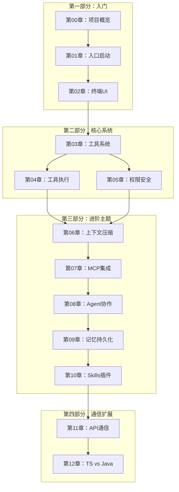

# Claude Code 源码解析 - 书籍架构

> **本文档目标**：定义出版级技术书籍的完整架构，确保教学质量和源码一致性。

---

## 1. 书籍概述

### 1.1 核心定位

| 项目 | 内容 |
|------|------|
| 书名 | Claude Code 源码解析 |
| 副标题 | 从架构设计到 Contributor 成长之路 |
| 目标读者 | 有编程基础的开发者（会任一语言即可） |
| 核心价值 | 基于真实源码的深度学习，从新人到 Contributor |
| 学习终点 | 读者学完后能成为该项目的真实 Contributor |

### 1.2 独特价值

1. **源码唯一事实来源** - 所有内容基于真实源码，禁止臆测
2. **问题驱动教学** - 每章从"为什么存在"开始
3. **真实调用链分析** - 关键函数、类名、方法名全部可验证
4. **工程经验传承** - 包含设计原因、历史包袱、坑点
5. **Contributor 成长路径** - 从学习到贡献的完整指引

---

## 2. 完整目录结构

```
Claude Code 源码解析
│
├── 第一部分：入门（第00-02章）
│   ├── 第00章：项目概览与开发环境          [Level 1-2]
│   ├── 第01章：入口与启动流程              [Level 2-3]
│   └── 第02章：终端 UI 框架                [Level 3-4]
│
├── 第二部分：核心系统（第03-05章）
│   ├── 第03章：工具系统架构                [Level 4-5]
│   ├── 第04章：工具执行引擎                [Level 5-6]
│   └── 第05章：权限与安全                  [Level 5-6]
│
├── 第三部分：进阶主题（第06-10章）
│   ├── 第06章：上下文管理与压缩            [Level 5-6]
│   ├── 第07章：MCP 协议集成               [Level 5-6]
│   ├── 第08章：Agent 与多 Agent 协作       [Level 6-7]
│   ├── 第09章：记忆与持久化               [Level 6-7]
│   └── 第10章：Skills 与插件系统           [Level 6-7]
│
├── 第四部分：通信与扩展（第11-12章）
│   ├── 第11章：API 通信与远程             [Level 6-7]
│   └── 第12章：TypeScript vs Java 实战     [Level 7-8]
│
├── 附录（源码详解）
│   ├── A01：启动流程代码
│   ├── A02：UI 渲染代码
│   ├── A03：工具系统代码
│   ├── A04：工具执行代码
│   ├── A05：权限系统代码
│   ├── A06：压缩系统代码
│   ├── A07：MCP 集成代码
│   ├── A08：Agent 代码
│   ├── A09：记忆系统代码
│   ├── A10：插件系统代码
│   ├── A11：API 通信代码
│   └── A13：TypeScript 实战
│
└── 辅助文档
    ├── 引言：如何阅读本书
    ├── 学习路径导航
    ├── 源码映射速查
    └── 贡献指南
```

---

## 3. 学习路径设计

### 3.1 Level 1-9 进阶体系

```
Level 1: 知道项目是干什么的
    └── 第00章：项目概览
         └── 理解 Claude Code 是终端 AI 助手

Level 2: 能运行项目
    └── 第00章 + 第01章
         └── 本地运行、调试模式、参数解析

Level 3: 理解模块边界
    └── 第01章 + 第02章
         └── 理解入口、初始化、UI 渲染模块划分

Level 4: 理解核心数据流
    └── 第02章 + 第03章
         └── 用户输入 → 工具调用 → API 响应 → 输出

Level 5: 能跟踪源码调用链
    └── 第03章 + 第04章 + 第05章
         └── runToolUse() → checkPermissions() → Tool.execute()

Level 6: 能修改小功能
    └── 第06章 + 第07章
         └── 添加新工具、修改权限规则

Level 7: 能独立开发模块
    └── 第08章 + 第09章 + 第10章
         └── 开发新 Agent、开发记忆系统、开发插件

Level 8: 能提交高质量 PR
    └── 第11章 + 第12章 + 附录
         └── 理解 API 通信、代码风格、测试要求

Level 9: 能参与架构讨论
    └── 全部章节 + 工程经验
         └── 理解历史包袱、权衡取舍、演进方向
```

### 3.2 三条学习路径

#### 路径 A：零基础开发者（推荐）

```
第00章 → 第01章 → 第02章 → 第03章 → 第04章 → 第05章
    ↓          ↓          ↓          ↓          ↓          ↓
 架构概览    启动流程    UI框架     工具系统    工具执行    权限系统

 → 第06章 → 第07章 → 第08章 → 第09章 → 第10章 → 第11章
     ↓          ↓          ↓          ↓          ↓          ↓
   上下文      MCP集成    Agent协作   记忆系统    Skills      API通信

 → 第12章 → 附录A13 → 附录A01-A11
     ↓          ↓            ↓
 语言对比    TypeScript   源码详解
           实战技巧
```

#### 路径 B：Java 开发者（快速通道）

```
第00章 → 引言：Java开发者速览
    ↓
第01-05章（对照Spring框架理解）
    ↓
第06-11章（对照Java生态理解）
    ↓
第12章（TypeScript vs Java深度对比）
    ↓
附录A01-A11（源码对照理解）
```

#### 路径 C：专家路线（按需查阅）

```
├── 需要什么查什么
├── 附录A01-A11为主要参考
└── 第00章作为索引入口
```

---

## 4. 章节依赖关系图



---

## 5. 源码映射表

### 5.1 核心模块映射

| 章节 | 核心源码文件 | 关键函数/类 |
|------|-------------|------------|
| 第00章 | `src/main.tsx` | CLI 入口、参数解析 |
| 第01章 | `src/entrypoints/init.ts` | init()、初始化流程 |
| 第02章 | `src/screens/REPL.tsx` | REPL 主循环、PromptInput |
| 第03章 | `src/tools.ts` | getAllBaseTools()、Tool 接口 |
| 第04章 | `src/services/tools/toolExecution.ts` | runToolUse()、StreamingToolExecutor |
| 第05章 | `src/utils/permissions/permissions.ts` | hasPermissionsToUseTool() |
| 第06章 | `src/services/compact/compact.ts` | compactConversation() |
| 第07章 | `src/services/mcp/mcpCore.ts` | connectToMCPServer() |
| 第08章 | `src/tools/AgentTool/AgentTool.tsx` | AgentTool.call()、runAgent() |
| 第09章 | `src/services/SessionMemory/` | 会话记忆存储 |
| 第10章 | `src/skills/` | Skills 机制、插件生命周期 |
| 第11章 | `src/services/api/claude.ts` | createMessageStream()、withRetry() |
| 第12章 | 全部源码 | TypeScript vs Java 对比 |

### 5.2 快速定位表

| 功能 | 源码位置 |
|------|----------|
| 工具执行入口 | `src/services/tools/toolExecution.ts:337` |
| 权限检查 | `src/utils/permissions/permissions.ts:50` |
| 上下文压缩 | `src/services/compact/compact.ts:100` |
| Agent 协作 | `src/tools/AgentTool/AgentTool.tsx:200` |
| API 调用 | `src/services/api/claude.ts:100` |
| MCP 连接 | `src/services/mcp/mcpCore.ts:50` |

---

## 6. 每章模板（8个必需部分）

### 6.1 模板结构

```markdown
---
title: "第XX章：章节名称"
description: "学完本章后能做什么，解决什么问题"
tags: [module, level, key-concept]
date: 2026-05-10
---

# 第XX章：章节名称

## 1. 学习目标
- 学完后能做什么
- 解决什么问题
- 与后续章节关系

## 2. 背景问题
为什么这个模块存在？

### 2.1 问题起源
### 2.2 设计决策
### 2.3 替代方案

## 3. 源码入口
- 文件路径：
- 类名/方法名：
- 调用入口：
- 初始化位置：

## 4. 架构定位
- 模块职责
- 生命周期
- 与其它模块关系
- 数据流向
- 控制流向

## 5. 核心源码分析

### 5.1 调用链分析
### 5.2 关键代码解读
### 5.3 设计原因
### 5.4 历史包袱
### 5.5 工程权衡

## 6. 可视化结构

### 6.1 模块图
```mermaid
```

### 6.2 时序图
```mermaid
```

### 6.3 状态机/流程图
```mermaid
```

## 7. 工程经验

### 7.1 为什么这么设计
### 7.2 替代方案
### 7.3 坑点警示
### 7.4 实际生产问题

## 8. Contributor 指南

### 8.1 适合新手的文件
### 8.2 危险逻辑
### 8.3 调试方法
### 8.4 日志技巧
### 8.5 测试要点
### 8.6 架构保护

## 附录：源码速查
| 文件 | 关键函数 | 说明 |
|------|---------|------|
```

---

## 7. Contributor 成长路径

### 7.1 新人任务分级

| 级别 | 任务类型 | 示例 |
|------|----------|------|
| L1 | 文档改进 | 错别字、格式调整、注释补充 |
| L2 | 工具文档 | 添加缺失的工具使用说明 |
| L3 | 测试覆盖 | 补充单元测试、集成测试 |
| L4 | Bug修复 | 修复已知问题、边界条件 |
| L5 | 功能增强 | 改进现有工具、添加选项 |
| L6 | 新功能 | 实现新工具、新模块 |
| L7 | 架构优化 | 重构、模块解耦 |
| L8 | 跨模块 | 多系统联动设计 |

### 7.2 成长检查清单

```
□ 能本地运行 Claude Code
□ 理解工具执行流程
□ 能跟踪函数调用链
□ 能修改小功能并测试
□ 能添加新工具
□ 能编写测试用例
□ 理解权限系统设计
□ 能参与代码审查
□ 能提出架构建议
```

---

## 8. 质量标准

### 8.1 内容质量检查

- [ ] 所有代码与源码一致
- [ ] 函数名、类名、方法名可验证
- [ ] 无臆测实现
- [ ] 边界条件覆盖
- [ ] 错误处理说明

### 8.2 教学性检查

- [ ] 从问题出发，不跳步骤
- [ ] 新人能理解
- [ ] 有可视化辅助
- [ ] 练习题可执行

### 8.3 工程性检查

- [ ] 异常情况覆盖
- [ ] 性能影响说明
- [ ] 线程安全提示
- [ ] 生命周期管理

### 8.4 文档性检查

- [ ] 标题层级清晰
- [ ] 术语统一
- [ ] 无重复内容
- [ ] 交叉链接正确

---

## 9. 技术债与改进建议

### 9.1 已知技术债

| 模块 | 问题 | 改进建议 |
|------|------|----------|
| 工具注册 | 循环依赖 | 懒加载模式可推广 |
| 权限系统 | 规则分散 | 集中规则引擎 |
| 压缩系统 | 多种策略 | 统一抽象 |

### 9.2 架构优化建议

详见各章节的"工程经验"部分。

---

## 10. 版本演进

### 10.1 章节更新策略

- 源码变更时同步更新对应章节
- 每个季度全面审核一次
- 大版本发布时重构相关内容

### 10.2 兼容性处理

- 保持章节编号稳定
- 子版本用日期标记
- 重大变化提前公告

---

**文档版本**：1.0
**最后更新**：2026-05-10
**维护者**：book-restructure team
