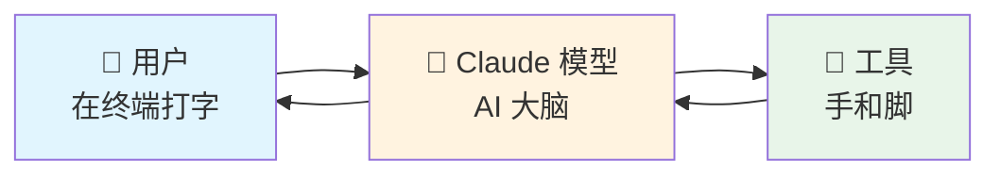
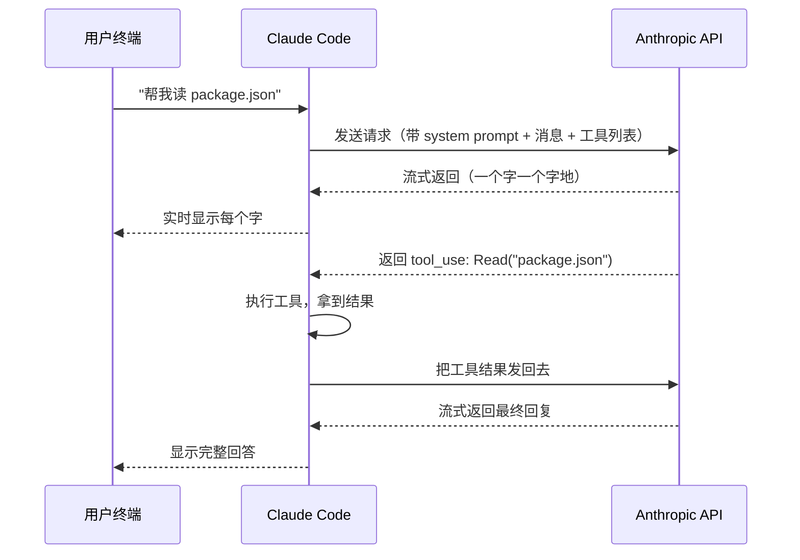

# 第 1 章：什么是 Claude Code

> 源码验证日期：2026-05-15，基于 commit `0d81bb6`

## 1.1 生活类比：一个住在你终端里的超级助手

想象你有一个新同事。你给他发一条消息："帮我检查一下这个项目的测试为什么失败了。"他会：

1. 先看你项目的目录结构，了解代码怎么组织的
2. 运行测试，看哪个用例红了
3. 打开出错的文件，读相关代码
4. 修改代码，再跑一遍测试
5. 如果还有问题，继续调整，直到通过

Claude Code 就是这个"同事"——只不过他住在你的终端里，不喝水不睡觉，24 小时待命。你打字告诉他要做什么，他就用工具（读文件、跑命令、改代码）去完成。

---

## 1.2 动手试试：你的第一次 Claude Code 对话

### 基础级：验证安装

打开终端，运行：

```bash
claude --version
```

如果你看到类似 `2.1.88 (Claude Code)` 的输出，说明已经安装好了。

```bash
# 如果还没安装
npm install -g @anthropic-ai/claude-code
```

### 完整级：第一次对话

```bash
# 启动 Claude Code（需要 API key）
claude

# 进入交互界面后输入：
> 你好，帮我看看当前目录有什么文件
```

Claude Code 会使用它的工具（`Bash`、`Read` 等）来查看你的项目，然后把结果告诉你。

> **没有 API key？** 没关系。本书所有"试一试"环节都提供了无 key 替代方案——你可以直接阅读源码来理解原理。

---

## 1.3 核心概念：Claude Code 的三个组成部分

Claude Code 由三部分组成，缺一不可：



**Claude 模型**：AI 的"大脑"。它理解你的自然语言指令，分析代码，决定下一步做什么。模型本身只会"说话"——生成文本。它不能直接操作你的电脑。

**工具（Tools）**：AI 的"手和脚"。让模型能做事，而不仅仅是说话。Claude Code 内置了五类工具：

| 工具类别 | 能做什么 | 例子 |
|---------|---------|------|
| 文件操作 | 读文件、编辑代码、创建文件 | `Read`、`Edit`、`Write` |
| 搜索 | 按模式查找文件、用正则搜索内容 | `Glob`、`Grep` |
| 执行 | 运行 shell 命令、启动服务器、跑测试 | `Bash` |
| 网络 | 搜索网页、获取文档 | `WebSearch`、`WebFetch` |
| 子代理 | 派出小助手并行处理子任务 | `Agent` |

**Agentic Loop（代理循环）**：把大脑和手脚连接起来的循环。用户给一个任务 → 模型思考需要什么工具 → 调用工具 → 拿到结果 → 再思考 → 再调用 → 直到任务完成。

> **Token 是什么？** AI 模型不按"字"收费，而是按"Token"收费。一个 Token 大约是 3/4 个英文单词或半个中文字。Claude Code 的一次完整对话可能消耗几万到几十万 Token。Token 的经济学影响了很多设计决策——为什么需要缓存？为什么要压缩上下文？为什么子代理只返回摘要？这些在第 7 章和第 9 章会详细展开。

> **一句话总结**：Claude Code = Claude 模型 + 工具 + 循环。模型负责想，工具负责做，循环负责把"想"和"做"串起来。

### Claude Code vs 普通聊天 AI

普通聊天 AI（比如 ChatGPT 网页版）只能和你聊天。Claude Code 不只是聊天——它能**行动**：

```mermaid
graph TB
    subgraph "普通聊天 AI"
        U1["用户：测试失败了"] --> A1["AI：看起来可能是<br/>数据库连接的问题...<br/>（只是猜测）"]
    end

    subgraph "Claude Code"
        U2["用户：测试失败了"] --> A2["AI：让我先运行测试看看"]
        A2 --> T1["🔧 工具：Bash(npm test)"]
        T1 --> A3["AI：第 42 行断言失败。<br/>让我看看源码"]
        A3 --> T2["🔧 工具：Read(auth.ts)"]
        T2 --> A4["AI：找到 bug 了！<br/>边界条件没处理。<br/>让我修复"]
        A4 --> T3["🔧 工具：Edit(auth.ts:42)"]
        T3 --> A5["AI：已修复，再跑一次测试"]
        A5 --> T4["🔧 工具：Bash(npm test)"]
        T4 --> A6["AI：✓ 全部通过"]
    end
```



关键区别：Claude Code 不猜测——它用工具**去看、去试、去改**。

---

## 1.4 Claude Code 的入口：源码长什么样

现在让我们看看 Claude Code 源码的入口文件。不需要完全理解，先有个印象。

### 入口文件：`src/entrypoints/cli.tsx`

当你在终端输入 `claude` 时，程序从这个文件开始运行：

```typescript
// → src/entrypoints/cli.tsx
// （简化版，展示核心逻辑）

async function main(): Promise<void> {
  const args = process.argv.slice(2);

  // 快速路径：--version 直接输出版本号，不加载任何模块
  if (args[0] === '--version' || args[0] === '-v') {
    console.log(`${MACRO.VERSION} (Claude Code)`);
    return;
  }

  // 其他路径：加载主模块
  // → src/main.tsx
  await import('../main.tsx');
}

main();
```

注意两点：
1. **快速路径**（fast path）：`--version` 直接返回，不加载任何其他模块——这就是为什么 `claude --version` 瞬间完成
2. **动态导入**（dynamic import）：真正的启动逻辑在 `src/main.tsx` 中，只有在需要时才加载

### 主模块：`src/main.tsx`

这是 Claude Code 的"心脏"，负责解析命令行参数、初始化所有组件、启动交互界面：

```typescript
// → src/main.tsx
// （简化版，展示导入结构）

// 启动性能追踪
import { profileCheckpoint } from './utils/startupProfiler.js';

// 工具注册
import { getTools } from './tools.js';

// REPL 交互界面启动
import { launchRepl } from './replLauncher.js';

// ... 60+ 个其他导入（模型选择、权限、状态管理等）
```

`src/main.tsx` 导入了 60 多个模块。你不需要现在理解每一个——这正是后续 34 章要做的事。

> **设计一瞥**：为什么要分 `cli.tsx` 和 `main.tsx` 两个文件？
> 因为启动性能。`cli.tsx` 只处理不需要加载大模块的快速路径（如 `--version`），而 `main.tsx` 加载完整的 CLI 功能。`cli.tsx` 中的动态导入确保快速路径不会被拖慢。
> 详见卷二第 13 章。

### 源码目录结构一览

```
src/                              # （主要目录，非完整列表）
├── entrypoints/     # 入口文件（cli.tsx, main.tsx）
├── query.ts         # 核心：agentic loop 就在这里
├── QueryEngine.ts   # 查询引擎：管理 query() 的状态
├── Tool.ts          # 工具接口：所有工具的统一类型定义
├── tools.ts         # 工具注册：把所有工具收集到一起
├── context.ts       # 上下文：system prompt 的构建入口
├── components/      # UI 组件（Ink 终端渲染）
├── screens/         # 屏幕级组件（REPL.tsx 等主界面）
├── ink/             # Ink 框架（React for Terminals 的自定义 fork）
├── services/        # 服务层（API 调用、工具执行、MCP、压缩等）
├── utils/           # 工具函数（权限、消息处理、模型选择、sessionStorage 等）
├── constants/       # 常量（系统提示模板、配置等）
├── state/           # 状态管理（AppState）
├── memdir/          # 自动记忆系统（MEMORY.md）
├── commands/        # 斜杠命令（/help, /compact 等）
├── tools/           # 各个具体工具的实现（BashTool, ReadTool 等）
├── hooks/           # React hooks
├── skills/          # 技能系统
├── plugins/         # 插件系统
├── query/           # 查询相关子模块
├── bridge/          # Agent SDK 桥接层
├── bootstrap/       # 启动初始化
├── coordinator/     # 多 Agent 协调（Coordinator Mode）
├── assistant/       # KAIROS 自主 Agent 模式
├── buddy/           # Buddy System（电子宠物）
├── outputStyles/    # 输出样式系统
├── vim/             # Vim 模式
└── voice/           # 语音模式
```

---

## 1.5 Claude Code 能访问什么

当你在项目目录运行 `claude` 时，Claude Code 可以访问：

| 能力 | 说明 |
|------|------|
| 你的项目文件 | 当前目录及子目录中的所有文件 |
| 你的终端 | 任何你能运行的命令：构建工具、git、包管理器 |
| 你的 git 状态 | 当前分支、未提交的修改、最近的提交历史 |
| CLAUDE.md | 你写的项目特定指令（下一章会详细讲） |
| 自动记忆 | Claude 在工作中自动保存的学习内容 |
| 扩展 | MCP 服务器、技能、子代理等（卷二详解） |

---

## 1.6 流式响应：不等模型说完就开始显示

你可能会注意到，Claude Code 的回复不是等很久才一次性出现，而是一个字一个字地"流"出来。这就是**流式响应（Streaming）**。



流式响应让用户体验好得多——你不需要盯着空白屏幕等 10 秒，而是立刻看到 Claude 在"思考"。

> 这是 Claude Code 快的秘密之一：不仅输出是流式的，**工具调用也是流式的**。模型还在说话的时候，只读工具已经开始执行了——这叫"预测性工具执行"（Speculative Execution）。详见第 8 章。

---

## 1.7 试试看：探索 Claude Code 的源码

### 基础级（3 分钟）

如果你已经安装了 Claude Code，试试这几条命令：

```bash
# 查看版本
claude --version

# 查看 Claude Code 的安装位置
which claude

# 查看帮助信息
claude --help
```

### 完整级（10 分钟）

如果你想直接看源码，可以这样做：

```bash
# 克隆源码仓库（如果你有访问权限）
git clone <repo-url>
cd claude-code

# 查看入口文件
head -50 src/entrypoints/cli.tsx

# 搜索 "async function*" 找到 agentic loop
grep -n "async function\*" src/query.ts

# 查看工具接口
grep -n "interface Tool\|type Tool\|buildTool" src/Tool.ts | head -10

# 列出所有工具实现
ls src/tools/
```

即使没有 API key，你也可以通过阅读源码来理解 Claude Code 的架构。本书的"试一试"环节都设计为可以在无 key 环境下完成。

> **小贴士**：`claude --version` 为什么瞬间完成？因为它走的是"快速路径"——`src/entrypoints/cli.tsx` 中的 `--version` 分支直接输出版本号，不加载任何模块。这个设计原则（快速路径零加载）贯穿整个入口文件，卷一第 3 章会详细分析。

---

## 1.8 检查点

你现在已经理解了：

- **Claude Code 是什么**：一个运行在终端里的 AI 助手，能读文件、跑命令、改代码
- **三个组成部分**：Claude 模型（大脑）+ 工具（手脚）+ Agentic Loop（循环）
- **与普通聊天 AI 的区别**：Claude Code 不只是聊天，它能行动
- **源码入口**：`src/entrypoints/cli.tsx` → `src/main.tsx`
- **流式响应**：为什么回复看起来很流畅

**下一章预告**：我们将深入 Agentic Loop——理解 Claude Code 怎么把"大脑"和"手脚"串起来，形成能自主完成任务的循环。
