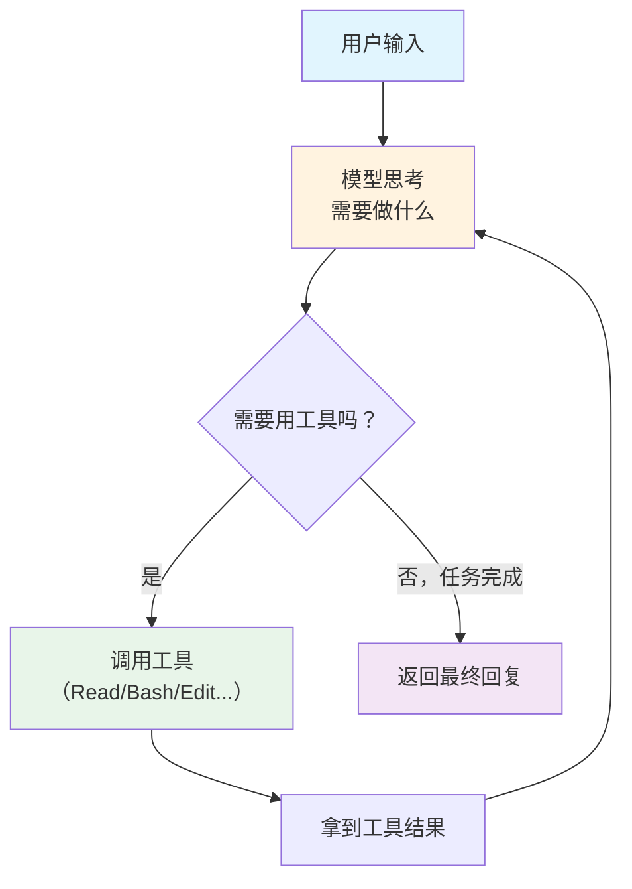
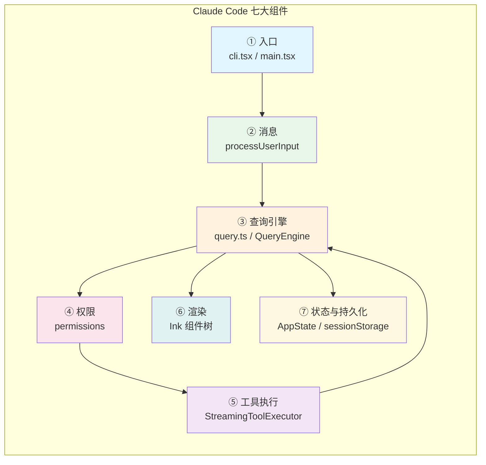
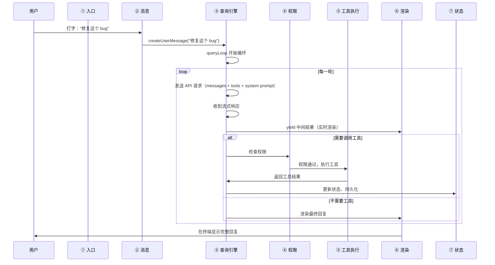
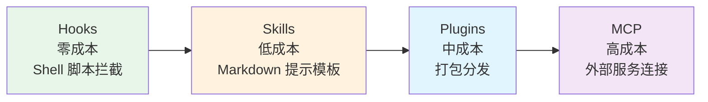

# 第 2 章：什么是 Agentic Loop

> 源码验证日期：2026-05-15，基于 commit `0d81bb6`

## 2.1 生活类比：餐厅后厨

想象一家餐厅：

- **服务员**接到顾客的点单，转告给厨师
- **厨师**（AI 模型）看完菜单，决定需要什么食材和工具
- 如果发现缺盐，厨师不会猜——他会打开储物柜（**工具：Read**）确认
- 发现盐罐是空的，厨师让采购员去超市买（**工具：Bash**）
- 买回来后，厨师继续做菜
- 菜做好后，厨师尝一口（**工具：Bash(npm test)**）——太咸了，再调一下
- 最终端上桌

Agentic Loop（代理循环）就是这个流程：**厨师不断思考→行动→检查→再思考**，直到菜做好。

---

## 2.2 核心概念：Agentic Loop = LLM + 工具 + 循环



三要素：

| 要素 | 角色 | Claude Code 对应 |
|------|------|-----------------|
| **LLM（大语言模型）** | "大脑"——理解指令、决定下一步 | `src/services/api/claude.ts` → Anthropic API |
| **工具（Tools）** | "手脚"——读文件、跑命令、改代码 | `src/Tool.ts`（接口）+ `src/tools/`（实现） |
| **循环（Loop）** | 把"想"和"做"串起来 | `src/query.ts`（`queryLoop()` 函数） |

没有 LLM：有手脚没大脑，不知道做什么
没有工具：有大脑没手脚，只会说不会做
没有循环：做一步就停，无法完成多步任务

---

## 2.3 源码中的 Agentic Loop

让我们看看 Claude Code 源码中 Agentic Loop 的入口。这个函数叫 `query()`：

```typescript
// → src/query.ts:219（简化版）
export async function* query(
  params: QueryParams,
): AsyncGenerator<StreamEvent | Message, Terminal> {
  const terminal = yield* queryLoop(params, consumedCommandUuids)
  return terminal
}
```

两个关键点：

1. **`async function*`**——这是 TypeScript 的 **AsyncGenerator（异步生成器）**。它不是一次性返回结果，而是通过 `yield` 一点点地把中间结果"流"出来。这就是为什么你能在终端看到 Claude 的回复逐字出现。

2. **`queryLoop()`**——真正的循环逻辑在这里面。每一轮循环做的事情就是：发 API 请求 → 拿回复 → 如果有工具调用就执行 → 把结果加到对话中 → 再发 API 请求。

### 循环内部的状态

`queryLoop()` 内部维护了一个 `State` 对象：

```typescript
// → src/query.ts:268（简化版）
let state: State = {
  messages: params.messages,          // 对话历史
  toolUseContext: params.toolUseContext, // 工具使用上下文
  maxOutputTokensOverride: ...,       // 输出 token 上限
  turnCount: 1,                       // 当前轮次
  // ...
}
```

每一轮循环结束，这个状态被更新，然后传入下一轮。这就像厨师一边做菜一边在笔记本上记录进度。

> **设计一瞥**：为什么要用 `async function*`（AsyncGenerator）而不是普通函数？
> 因为 Claude Code 需要**流式输出**。模型回复是逐字到达的，工具执行是异步的。AsyncGenerator 让调用者（UI 层）可以在每收到一个中间结果时就立刻显示，而不是等整个循环结束。详见第 7 章。

---

## 2.4 Claude Code 的七大组件

Claude Code 由七个主要组件组成，它们像齿轮一样咬合在一起：



每个组件的职责：

| # | 组件 | 文件 | 做什么 |
|---|------|------|--------|
| ① | 入口 | `src/entrypoints/cli.tsx` → `src/main.tsx` | 解析命令行参数，初始化所有模块 |
| ② | 消息 | `src/utils/processUserInput/` → `src/utils/messages.ts` | 捕获用户输入，创建消息对象 |
| ③ | 查询引擎 | `src/query.ts` + `src/QueryEngine.ts` | Agentic Loop 的核心——管理循环和状态 |
| ④ | 权限 | `src/utils/permissions/` | 检查工具调用是否被允许 |
| ⑤ | 工具执行 | `src/services/tools/StreamingToolExecutor.ts` | 执行工具（并发安全、Hook 触发） |
| ⑥ | 渲染 | `src/ink/` + `src/components/` | 用 React（Ink）渲染终端输出 |
| ⑦ | 状态与持久化 | `src/state/AppStateStore.ts` + `src/utils/sessionStorage.ts` | 管理会话状态，保存对话到 JSONL 文件 |

### 一次完整的交互流程

当你在终端输入 "帮我修复这个 bug" 时，七大组件按如下顺序协作：



---

## 2.5 工具注册：所有工具从哪来

Claude Code 启动时，会把所有可用工具收集到一个列表里：

```typescript
// → src/tools.ts:271（简化版）
export const getTools = (permissionContext: ToolPermissionContext): Tools => {
  const tools = getAllBaseTools()
    .filter(tool => !specialTools.has(tool.name))
  // ... 加上 MCP 工具、自定义工具等
  return tools
}
```

每个工具都遵循统一的 `Tool` 接口：

```typescript
// → src/Tool.ts（简化版）
interface Tool<Input, Output> {
  name: string                          // 工具名，如 "Bash"
  description: string                   // 描述（模型用来决定何时使用）
  inputSchema: Input                    // Zod schema（定义参数类型）
  isReadOnly(input): boolean            // 是否只读（影响并发策略）
  call(input): Promise<Output>          // 执行工具
}
```

`isReadOnly` 是一个巧妙的设计——只读工具（如 `Read`、`Grep`）可以并行执行，写操作（如 `Write`、`Bash`）必须串行。这将在第 8 章详细展开。

---

## 2.6 动手试试：模拟一个最简 Agentic Loop

不需要 API key，用纯 Node.js 模拟 Claude Code 的核心循环：

```javascript
// minimal_loop.js — 最简 agentic loop 模拟
// 运行: node minimal_loop.js

// 定义工具
const tools = {
  read_file: (path) => `文件内容: console.log("hello")`,
  run_command: (cmd) => `$ ${cmd}\n输出: 成功`,
};

// 模拟 AI 大脑（实际由 Claude API 完成）
function simulateBrain(messages) {
  const last = messages[messages.length - 1];

  // 第 1 轮：用户刚提问 → AI 决定先读文件
  if (last.role === "user") {
    return {
      role: "assistant",
      content: "让我先看看代码。",
      toolCalls: [{ name: "read_file", args: { path: "index.js" } }],
    };
  }

  // 第 2 轮：拿到文件内容 → AI 决定运行测试
  if (last.role === "tool_result") {
    return {
      role: "assistant",
      content: "代码看起来没问题，跑一下测试。",
      toolCalls: [{ name: "run_command", args: { cmd: "node index.js" } }],
    };
  }

  // 第 3 轮：测试通过 → 任务完成
  return {
    role: "assistant",
    content: "测试通过！任务完成。",
  };
}

// Agentic Loop
function agenticLoop(userInput) {
  console.log(`\n用户: ${userInput}\n`);
  const messages = [{ role: "user", content: userInput }];

  for (let turn = 1; turn <= 5; turn++) {
    console.log(`--- 第 ${turn} 轮 ---`);

    const response = simulateBrain(messages);
    messages.push(response);
    console.log(`  AI: ${response.content}`);

    // 没有工具调用 → 循环结束
    if (!response.toolCalls?.length) {
      console.log("\n✓ 任务完成");
      return;
    }

    // 执行工具
    for (const call of response.toolCalls) {
      const result = tools[call.name](call.args.path || call.args.cmd);
      messages.push({ role: "tool_result", content: result });
      console.log(`  工具: ${call.name} → ${result}`);
    }
  }
}

agenticLoop("帮我检查 index.js 有没有问题");
```

运行：

```bash
node minimal_loop.js
```

你会看到类似这样的输出：

```
用户: 帮我检查 index.js 有没有问题

--- 第 1 轮 ---
  AI: 让我先看看代码。
  工具: read_file → 文件内容: console.log("hello")
--- 第 2 轮 ---
  AI: 代码看起来没问题，跑一下测试。
  工具: run_command → $ node index.js
输出: 成功
--- 第 3 轮 ---
  AI: 测试通过！任务完成。

✓ 任务完成
```

这个简化版和 Claude Code 的真实 `queryLoop()` 做的是同一件事——只不过真实版本用真正的 AI 模型代替了 `simulateBrain`，用真正的文件系统和终端代替了模拟工具。

> **关键洞察**：Claude Code 的核心就这么简单。复杂的不是循环本身，而是围绕循环构建的工具系统、权限系统、缓存优化、上下文管理等。这些就是后续 34 章要拆解的内容。

---

## 2.7 扩展机制一览

除了内置工具，Claude Code 还提供四层扩展机制，按上下文成本从低到高排列：



| 扩展 | 成本 | 做什么 | 什么时候用 |
|------|------|--------|-----------|
| **Hooks** | 零 | 在工具执行前后自动运行脚本 | 每次 Edit 后自动跑 lint |
| **Skills** | 低 | Markdown 提示模板，Claude 按需加载 | `/deploy` 跑部署流程 |
| **Plugins** | 中 | 打包 Skills + Hooks + MCP 分享给他人 | 团队共享开发环境配置 |
| **MCP** | 高 | 连接外部服务（数据库、Slack 等） | 让 Claude 查你的数据库 |

卷二（第 17-19 章）会详细拆解每层扩展机制。

---

## 2.8 检查点

你现在已经理解了：

- **Agentic Loop 的三要素**：LLM（大脑）+ 工具（手脚）+ 循环（串联）
- **源码入口**：`src/query.ts` 的 `query()` 和 `queryLoop()` 函数
- **七大组件**：入口→消息→查询引擎→权限→工具执行→渲染→状态
- **工具接口**：每个工具都有 `name`、`inputSchema`、`isReadOnly`、`call()`
- **四层扩展**：Hooks → Skills → Plugins → MCP（成本递增）

**卷一预告**：从下一章开始，我们将跟随一次 `async function* query()` 调用，从用户按下 Enter 键到收到完整回复，一站一站地读源码。第一站：准备工具箱（入口文件和初始化流程）。
