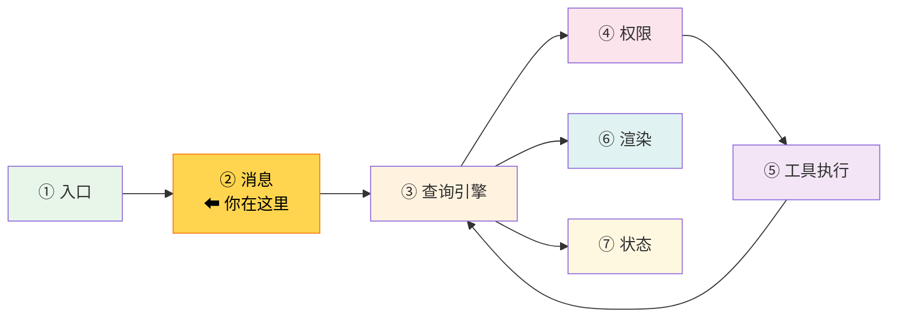
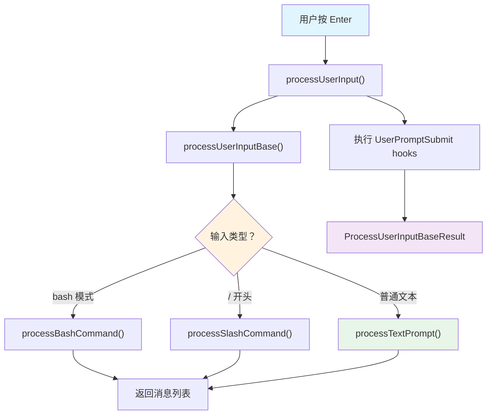

# 第 4 章：第 1 站——输入捕获

> 源码验证日期：2026-05-15，基于 commit `0d81bb6`

本章内部结构模板（卷一统一）：
1. 路线图 — 流程图高亮当前站
2. 知识补全（按需）— React 事件处理
3. 源码入口 — 文件路径、接口名、关键方法
4. 逐行阅读 — 按真实调用链读源码
5. 调试实践 — 断点位置、日志方法
6. 试一试 — 修改源码验证理解
7. 检查点 — 自检练习
8. 下一站预告

---

## 路线图



上一章我们追踪了从终端输入 `claude` 到 REPL 启动的完整路径。现在 REPL 已经就绪，用户开始在终端打字。当用户按下 Enter 键，这个按键是如何变成一个 `UserMessage` 对象的？

---

## 知识补全：React 事件处理

如果你已经熟悉 React 的 `onSubmit` / `onChange` 模式，跳过本节。

Claude Code 的终端 UI 用 Ink（React for Terminals）构建。虽然运行在终端而非浏览器，但事件处理机制和 React 完全一样：

```typescript
// Ink 中的事件处理，和 React 一样
function MyInput({ onSubmit }) {
  const [value, setValue] = React.useState('')

  // 用户按 Enter 时触发
  const handleSubmit = () => {
    onSubmit(value)  // 把输入值传给父组件
    setValue('')     // 清空输入框
  }

  // 用户打字时触发
  const handleChange = (newValue) => {
    setValue(newValue)
  }

  return <TextInput value={value} onChange={handleChange} onSubmit={handleSubmit} />
}
```

关键概念：
- **状态提升**：子组件（TextInput）不负责处理逻辑，只负责通知父组件
- **回调函数**：父组件通过 `onSubmit` 属性传入回调，子组件在适当时机调用
- **受控组件**：输入值由 React 状态控制，而非 DOM 直接管理

Claude Code 的输入处理遵循这个模式：`PromptInput` 组件负责渲染和捕获按键，`REPL` 组件负责处理逻辑。

---

## 源码入口

本章追踪的调用链：

```
用户按 Enter
  → src/components/PromptInput/PromptInput.tsx  (Ink 输入组件)
    → src/utils/handlePromptSubmit.ts            (handlePromptSubmit 函数)
      → src/utils/processUserInput/processUserInput.ts  (processUserInput 函数)
        → 分支路由：
          ├── processTextPrompt.ts    (普通文本 → UserMessage)
          ├── processBashCommand.tsx  (bash 模式 → BashTool 调用)
          └── processSlashCommand.tsx (斜杠命令 → 命令执行)
        → src/utils/messages.ts       (createUserMessage — 消息对象工厂)
```

---

## 逐行阅读

### 4.1 PromptInput：终端输入组件

当 REPL 启动后，Ink 渲染的第一个交互组件是 `PromptInput`：

```
// → src/components/PromptInput/PromptInput.tsx
```

这个组件用 Ink 的 `useInput` hook 捕获按键事件。它负责：

| 功能 | 实现方式 |
|------|---------|
| 文本输入 | Ink `useInput` hook |
| 历史记录 | `useArrowKeyHistory`（上下键翻历史） |
| 自动补全 | `useTypeahead`（Tab 补全斜杠命令） |
| 图片粘贴 | 剪贴板监听 |
| 模式切换 | `PromptInputMode` 类型控制 |

用户按 Enter 时，`PromptInput` 调用父组件传入的 `onSubmit` 回调，把当前输入文本传递给上层。

### 4.2 PromptInputMode：四种输入模式

```typescript
// → src/types/textInputTypes.ts:265
export type PromptInputMode =
  | 'bash'                    // Bash 命令模式（! 开头）
  | 'prompt'                  // 普通提示模式（默认）
  | 'orphaned-permission'     // 孤立权限请求（工具权限弹窗）
  | 'task-notification'       // 任务通知（计划任务触发）
```

大多数时候你处于 `prompt` 模式。输入 `!` 开头的文本会切换到 `bash` 模式。另外两种模式由系统内部使用——权限请求和计划任务通知。

### 4.3 handlePromptSubmit：提交处理中枢

`PromptInput` 的 `onSubmit` 回调指向 `handlePromptSubmit` 函数：

```typescript
// → src/utils/handlePromptSubmit.ts:120（简化版）
export async function handlePromptSubmit(
  params: HandlePromptSubmitParams,
): Promise<void> {
  const input = params.input ?? ''
  const mode = params.mode ?? 'prompt'

  // 空输入直接返回
  if (input.trim() === '') return

  // 退出命令特殊处理
  if (['exit', 'quit', ':q', ':q!'].includes(input.trim())) {
    // 触发退出流程
  }

  // 图片引用检查：只保留文本中仍存在的 [Image #N] 对应的图片
  const referencedIds = new Set(parseReferences(input).map(r => r.id))
  const pastedContents = /* 过滤未引用的图片 */

  // 调用核心处理函数
  await processUserInput({
    input,
    mode,
    pastedContents,
    context,
    messages,
    // ...
  })
}
```

这里有一个巧妙的细节：`parseReferences(input)` 解析文本中的 `[Image #N]` 占位符。如果你粘贴了图片但后来删掉了占位符，这张图片就不会被发送给模型——避免浪费 token。

### 4.4 processUserInput：输入处理的中央调度

`processUserInput` 是输入处理的"调度员"——它根据输入类型路由到不同的处理器：

```typescript
// → src/utils/processUserInput/processUserInput.ts:85（简化版）
export async function processUserInput({
  input, mode, context, pastedContents, messages, ...
}): Promise<ProcessUserInputBaseResult> {

  // 立即显示用户输入（不等处理完成）
  if (mode === 'prompt' && typeof input === 'string') {
    setUserInputOnProcessing?.(input)
  }

  // 核心处理逻辑委托给 processUserInputBase
  const result = await processUserInputBase(input, mode, ...)

  // 执行 UserPromptSubmit hooks（用户自定义钩子）
  for await (const hookResult of executeUserPromptSubmitHooks(input, ...)) {
    if (hookResult.blockingError) {
      // Hook 阻止了提交 → 返回错误消息
      return { messages: [createSystemMessage(blockingMessage)], shouldQuery: false }
    }
    if (hookResult.preventContinuation) {
      // Hook 阻止继续但保留原始输入
      result.shouldQuery = false
      return result
    }
    // Hook 返回额外上下文 → 附加到消息中
    if (hookResult.additionalContexts) {
      result.messages.push(createAttachmentMessage(...))
    }
  }

  return result
}
```

返回类型 `ProcessUserInputBaseResult` 的结构：

```typescript
// → src/utils/processUserInput/processUserInput.ts:64-83
type ProcessUserInputBaseResult = {
  messages: (UserMessage | AssistantMessage | AttachmentMessage | SystemMessage)[]
  shouldQuery: boolean      // 是否触发 API 调用
  allowedTools?: string[]   // 这次调用允许的工具
  model?: string            // 覆盖模型
  effort?: EffortValue      // 推理力度
  resultText?: string       // 非交互模式的输出文本
  nextInput?: string        // 下一次自动输入（命令链）
}
```

### 4.5 processUserInputBase：分支路由

`processUserInputBase` 内部是一条清晰的分支链：

```typescript
// → src/utils/processUserInput/processUserInput.ts:281（简化版）
async function processUserInputBase(input, mode, ...) {
  // 1. 图片处理（如果是多模态输入）
  //    - 调整图片大小（maybeResizeAndDownsampleImageBlock）
  //    - 存储到磁盘（storeImages）以便工具引用

  // 2. Bash 命令模式
  if (mode === 'bash') {
    return processBashCommand(inputString, ...)
  }

  // 3. 斜杠命令（以 / 开头）
  if (inputString.startsWith('/')) {
    return processSlashCommand(inputString, ...)
  }

  // 4. 普通文本提示（最常见路径）
  return processTextPrompt(input, imageContentBlocks, attachmentMessages, ...)
}
```



### 4.6 processTextPrompt：创建 UserMessage

普通文本路径是最常见的，它的处理非常简洁：

```typescript
// → src/utils/processUserInput/processTextPrompt.ts:19（简化版）
export function processTextPrompt(
  input: string | ContentBlockParam[],
  imageContentBlocks: ContentBlockParam[],
  imagePasteIds: number[],
  attachmentMessages: AttachmentMessage[],
  uuid?: string,
  permissionMode?: PermissionMode,
  isMeta?: boolean,
): { messages: (UserMessage | AttachmentMessage)[], shouldQuery: boolean } {

  // 生成 promptId（用于追踪）
  const promptId = randomUUID()
  setPromptId(promptId)

  // 如果有粘贴图片，创建包含图片的消息
  if (imageContentBlocks.length > 0) {
    const userMessage = createUserMessage({
      content: [...textContent, ...imageContentBlocks],
      uuid,
      imagePasteIds,
    })
    return { messages: [userMessage, ...attachmentMessages], shouldQuery: true }
  }

  // 纯文本消息
  const userMessage = createUserMessage({
    content: input,
    uuid,
    permissionMode,
  })

  return { messages: [userMessage, ...attachmentMessages], shouldQuery: true }
}
```

注意：这个函数总是返回 `shouldQuery: true`——普通文本提示一定会触发 API 调用。

### 4.7 createUserMessage：消息对象工厂

所有路径最终都通过 `createUserMessage` 创建消息对象：

```typescript
// → src/utils/messages.ts:460（简化版）
export function createUserMessage({
  content,
  isMeta,
  uuid,
  timestamp,
  imagePasteIds,
  permissionMode,
  origin,
}: {
  content: string | ContentBlockParam[]
  isMeta?: true                   // 对用户隐藏，对模型可见
  uuid?: UUID
  timestamp?: string
  imagePasteIds?: number[]
  permissionMode?: PermissionMode
  origin?: MessageOrigin           // 来源：人类 vs 系统生成
}): UserMessage {
  const m: UserMessage = {
    type: 'user',
    message: {
      role: 'user',
      content: content || NO_CONTENT_MESSAGE,  // 确保不发送空消息
    },
    uuid: uuid || randomUUID(),
    timestamp: timestamp ?? new Date().toISOString(),
    isMeta,
    imagePasteIds,
    permissionMode,
    origin,
  }
  return m
}
```

`UserMessage` 对象的核心结构：

```typescript
// → src/types/message.js（Bun 虚拟模块，构建时解析）
type UserMessage = {
  type: 'user'                    // 消息类型标识
  message: {
    role: 'user'                  // Anthropic API 角色
    content: string | ContentBlockParam[]  // 文本或多媒体内容
  }
  uuid: UUID                      // 唯一标识（用于回溯和调试）
  timestamp: string               // ISO 时间戳
  isMeta?: true                   // 元消息（系统生成，用户不可见）
  imagePasteIds?: number[]        // 粘贴图片的 ID 列表
  permissionMode?: PermissionMode // 发送时的权限模式
  origin?: MessageOrigin          // 消息来源
}
```

> **注意**：`UserMessage` 类型定义在 `src/types/message.js` 中，这是一个由 Bun 打包器在构建时解析的虚拟模块。源码中不存在对应的 `.ts` 文件——这是 Bun 的特性，类型通过构建系统从其他来源注入。

### 4.8 附件系统：@ 提及和 IDE 选择

在普通文本路径之外，`processUserInputBase` 还会收集附件消息：

```typescript
// → src/utils/processUserInput/processUserInput.ts:496-514
const shouldExtractAttachments =
  !skipAttachments &&
  inputString !== null &&
  (mode !== 'prompt' || !inputString.startsWith('/'))  // 非斜杠命令时提取

const attachmentMessages = shouldExtractAttachments
  ? await toArray(getAttachmentMessages(
      inputString,
      context,
      ideSelection ?? null,
      [],
      messages,
      querySource,
    ))
  : []
```

附件包括：
- **@agent-xxx 提及**：通过 `@agent-explore` 语法指定子代理类型
- **IDE 选择**：在 VS Code/JetBrains 中选中代码后发送
- **Hook 附加上下文**：UserPromptSubmit hooks 返回的额外信息

这些附件以 `AttachmentMessage` 类型存在，和 `UserMessage` 一起传递给 `query()`。

---

## 调试实践

### 断点位置

| 位置 | 看什么 |
|------|--------|
| `handlePromptSubmit.ts:120` | `handlePromptSubmit` 入口——看参数结构 |
| `processUserInput.ts:85` | `processUserInput` 入口——看输入模式 |
| `processUserInput.ts:281` | `processUserInputBase`——看分支路由 |
| `processTextPrompt.ts:19` | `processTextPrompt`——看 UserMessage 创建 |
| `messages.ts:460` | `createUserMessage`——看消息对象结构 |

### 日志方法

```typescript
// 在 processUserInput.ts 的 processUserInput() 函数开头
console.log('[DEBUG] processUserInput called:', {
  input: typeof input === 'string' ? input.substring(0, 100) : '[multimodal]',
  mode,
})

// 在 processTextPrompt.ts 的 return 之前
console.log('[DEBUG] processTextPrompt result:', {
  messageCount: result.messages.length,
  shouldQuery: result.shouldQuery,
})
```

---

## 试一试

### 修改 1：观察输入路由

在 `src/utils/processUserInput/processUserInput.ts` 的 `processUserInputBase` 函数中，在分支判断处（约第 517 行 bash 检查之前）加一行：

```typescript
console.log('[DEBUG] inputString:', inputString?.substring(0, 50), 'mode:', mode)
```

然后分别尝试：
```
> 你好                    # 普通文本 → 走 processTextPrompt
> !ls -la                 # Bash 命令 → 走 processBashCommand
> /help                   # 斜杠命令 → 走 processSlashCommand
```

### 修改 2：查看消息对象结构

在 `src/utils/processUserInput/processTextPrompt.ts` 的 `return` 语句之前加：

```typescript
console.log('[DEBUG] UserMessage created:', JSON.stringify(userMessage, null, 2))
```

然后发送一条消息，观察 `UserMessage` 的完整结构——注意 `uuid`、`timestamp`、`type` 等字段。

---

## 检查点

你现在已经理解了：

- **输入组件架构**：`PromptInput`（捕获）→ `handlePromptSubmit`（处理）→ `processUserInput`（路由）
- **四种输入模式**：`prompt`、`bash`、`orphaned-permission`、`task-notification`
- **三条处理路径**：普通文本 → `processTextPrompt`，Bash → `processBashCommand`，斜杠命令 → `processSlashCommand`
- **消息工厂**：`createUserMessage()` 构造 `UserMessage` 对象（type + role + content + uuid + timestamp）
- **图片处理**：粘贴图片自动调整大小、存储到磁盘、通过 `[Image #N]` 占位符关联
- **Hook 系统**：`UserPromptSubmit` hooks 可以阻止、修改或附加信息到用户输入
- **附件系统**：`@` 提及、IDE 选择、Hook 附加上下文以 `AttachmentMessage` 传递

**下一站预告**：第 5 章将追踪系统提示（System Prompt）的构建——从 `getSystemPrompt()` 到 CLAUDE.md 加载，理解 Claude 如何获得它的"人格"和"指令"。
