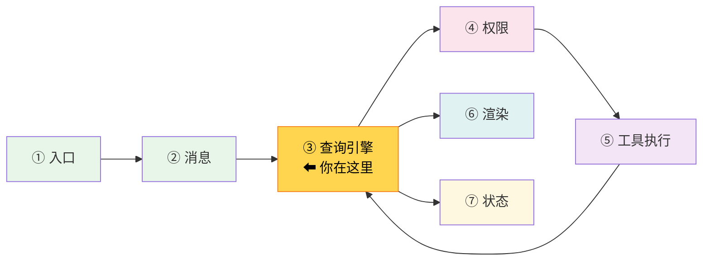
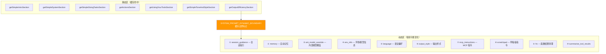
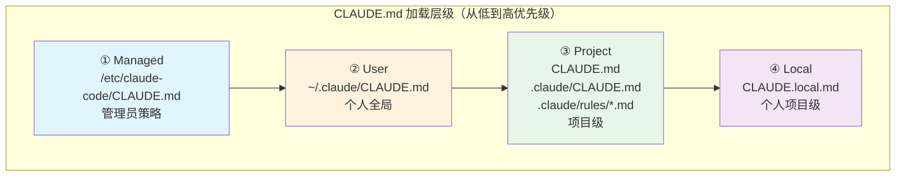

# 第 5 章：第 2 站——系统提示

> 源码验证日期：2026-05-15，基于 commit `0d81bb6`


---

## 路线图



上一章追踪了用户输入如何变成 `UserMessage`。现在我们进入查询引擎的领地，先看一个关键准备工作：**系统提示（System Prompt）的构建**。

每次 API 调用都会携带 system prompt——它告诉 Claude "你是谁"、"你应该怎么做"、"有什么规则"。这个 prompt 有 10K-15K tokens，由静态模板和动态内容两部分组成。

---

## 知识补全：System Prompt vs User Context

如果你已经了解 Anthropic API 的 `system` 参数，跳过本节。

Anthropic API 的消息格式有三个层级：

```typescript
// API 调用时的参数结构
{
  system: "你是一个编程助手...",     // system prompt（每轮不变）
  messages: [
    { role: "user", content: "..." },    // 用户消息
    { role: "assistant", content: "..." } // 模型回复
  ]
}
```

- **System prompt**：告诉模型它的身份、行为规则、约束条件。对用户不可见，但深刻影响模型行为。
- **User message**：用户发给模型的内容。
- **Assistant message**：模型的回复。

Claude Code 的 system prompt 不是一段固定文本，而是在每次查询开始时动态组装的。

---

## 源码入口

本章追踪的调用链：

```
query() 调用前的准备阶段
  → src/constants/prompts.ts       (getSystemPrompt — 组装 system prompt)
    → src/context.ts               (getSystemContext — git 状态等)
    → src/context.ts               (getUserContext — CLAUDE.md 等)
      → src/utils/claudemd.ts     (getMemoryFiles → getClaudeMds — CLAUDE.md 加载)
    → src/memdir/memdir.ts        (loadMemoryPrompt — 自动记忆)
```

---

## 逐行阅读

### 5.1 getSystemPrompt：两大分区架构

`getSystemPrompt()` 返回一个字符串数组，每个元素是一个 prompt section：

```typescript
// → src/constants/prompts.ts 的 getSystemPrompt() 函数（简化版，上半部分）
export async function getSystemPrompt(
  tools: Tools,
  model: string,
  additionalWorkingDirectories?: string[],
  mcpClients?: MCPServerConnection[],
): Promise<string[]> {
  // --bare 模式：极简 prompt
  if (process.env.CLAUDE_CODE_SIMPLE) {
    return [`You are Claude Code...\nCWD: ${getCwd()}\nDate: ...`]
  }

  // 并行加载：技能命令 + 输出样式 + 环境信息
  const [skillToolCommands, outputStyleConfig, envInfo] = await Promise.all([
    getSkillToolCommands(cwd),
    getOutputStyleConfig(),
    computeSimpleEnvInfo(model, additionalWorkingDirectories),
  ])

  // ... 继续下一段
```

上半部分展示了函数签名、`--bare` 模式的快速返回、以及三个资源的并行加载。下半部分展示返回值的组装——注意静态区和动态区之间的缓存边界标记：

```typescript
// → src/constants/prompts.ts 的 getSystemPrompt() 返回值组装（下半部分）
  // Proactive/KAIROS 模式有完全不同的 prompt 结构，此处省略

  return [
    // --- 静态内容（可缓存）---
    getSimpleIntroSection(outputStyleConfig),      // 身份 + 安全指令
    getSimpleSystemSection(),                      // 系统行为规则
    getSimpleDoingTasksSection(),                   // 编码任务指南
    getActionsSection(),                           // 风险评估
    getUsingYourToolsSection(enabledTools),         // 工具使用指引
    getSimpleToneAndStyleSection(),                 // 语气风格
    getOutputEfficiencySection(),                  // 输出效率
    // === 缓存边界标记（仅在使用全局缓存范围时插入）===
    ...(shouldUseGlobalCacheScope() ? [SYSTEM_PROMPT_DYNAMIC_BOUNDARY] : []),
    // --- 动态内容（注册表管理）---
    ...resolvedDynamicSections,
  ].filter(s => s !== null)
}
```

**关键设计**：System prompt 被分为两部分，中间有一个 `SYSTEM_PROMPT_DYNAMIC_BOUNDARY` 边界标记。



**为什么这样设计？** Anthropic 的 Prompt Cache 按"前缀匹配"工作——如果 system prompt 的前 N 个字节和上次完全相同，这部分就可以从缓存读取（省钱、省延迟）。静态区几乎不变，可以稳定命中缓存。动态区每轮可能变化（比如 MCP 连接变化），放在后面不会影响前面的缓存。

> **设计一瞥**：这个缓存边界标记是 `__SYSTEM_PROMPT_DYNAMIC_BOUNDARY__`（一个特殊字符串）。Anthropic API 识别这个标记，把它作为缓存分区的断点。详见第 7 章。

### 5.2 getSystemContext：Git 状态和环境

```typescript
// → src/context.ts 的 getSystemContext() 函数（简化版）
export const getSystemContext = memoize(async () => {
  // Git 状态（并行获取 5 条命令）
  const gitStatus = await getGitStatus()

  // 缓存破坏器（仅内部版本）
  const injection = feature('BREAK_CACHE_COMMAND')
    ? getSystemPromptInjection()
    : null

  return {
    ...(gitStatus && { gitStatus }),
    ...(injection ? { cacheBreaker: `[CACHE_BREAKER: ${injection}]` } : {}),
  }
})
```

`getGitStatus()` 并行执行 5 个 git 命令：

```typescript
// → src/context.ts 的 getGitStatus() 函数
const [branch, mainBranch, status, log, userName] = await Promise.all([
  getBranch(),                          // 当前分支
  getDefaultBranch(),                   // 主分支
  execFileNoThrow(gitExe(), ['status', '--short']),  // 文件状态（截断到 2000 字符）
  execFileNoThrow(gitExe(), ['log', '--oneline', '-n', '5']),  // 最近 5 条提交
  execFileNoThrow(gitExe(), ['config', 'user.name']),  // git 用户名
])
```

这些信息让 Claude 知道当前分支、有没有未提交的修改、最近的提交历史——对于理解项目上下文非常重要。

注意：`getSystemContext` 是 `memoize` 的——整个对话期间只执行一次，后续调用返回缓存结果。

### 5.3 getUserContext：CLAUDE.md 加载

```typescript
// → src/context.ts 的 getUserContext() 函数（简化版）
export const getUserContext = memoize(async () => {
  // 检查是否禁用 CLAUDE.md
  const shouldDisableClaudeMd =
    isEnvTruthy(process.env.CLAUDE_CODE_DISABLE_CLAUDE_MDS) ||
    (isBareMode() && getAdditionalDirectoriesForClaudeMd().length === 0)

  // 加载所有 CLAUDE.md 文件
  const claudeMd = shouldDisableClaudeMd
    ? null
    : getClaudeMds(filterInjectedMemoryFiles(await getMemoryFiles()))

  return {
    ...(claudeMd && { claudeMd }),
    currentDate: `Today's date is ${getLocalISODate()}.`,
  }
})
```

这也是 memoized 的——对话期间只加载一次。`currentDate` 确保模型知道当前日期。

> **注意**：CLAUDE.md 内容以 **user context** 传递（`getUserContext`），而非 system prompt。这是有意为之——user context 在 Anthropic API 中属于可变部分，放在动态区。

### 5.4 CLAUDE.md 四级加载层级

```typescript
// → src/utils/claudemd.ts 的文件头注释
// 文件按以下顺序加载：
// 1. Managed memory (/etc/claude-code/CLAUDE.md) — 全局策略指令（管理员设置）
// 2. User memory (~/.claude/CLAUDE.md) — 用户的私有全局指令
// 3. Project memory (CLAUDE.md, .claude/CLAUDE.md, .claude/rules/*.md) — 项目指令（可提交到代码库）
// 4. Local memory (CLAUDE.local.md) — 个人的项目特定指令（不提交）
```



**加载流程**（`getMemoryFiles()` 在 `claudemd.ts` 的 `getMemoryFiles()` 函数）：

1. **Managed 文件**：从 `/etc/claude-code/CLAUDE.md` 加载（需要管理员权限设置）
2. **Managed rules**：`/etc/claude-code/rules/*.md` 目录中的规则文件
3. **User 文件**：`~/.claude/CLAUDE.md`（个人全局指令）
4. **User rules**：`~/.claude/rules/*.md`
5. **Project 文件**：从当前目录向上遍历到根目录，在每个目录中查找：
   - `CLAUDE.md`（项目根级别）
   - `.claude/CLAUDE.md`
   - `.claude/rules/*.md`（规则文件）
6. **Local 文件**：`CLAUDE.local.md`（加入 `.gitignore` 的个人偏好）

**越靠近当前目录的文件优先级越高**——因为后加载的内容在 prompt 中更靠后，模型更关注。

### 5.5 @include 语法和条件规则

CLAUDE.md 支持 `@` 语法导入其他文件：

```typescript
// → src/utils/claudemd.ts 的 @include 语法注释
// Memory @include directive:
// - Syntax: @path, @./relative/path, @~/home/path, or @/absolute/path
// - Included files are added as separate entries before the including file
// - Circular references are prevented by tracking processed files
```

`.claude/rules/*.md` 文件支持 YAML frontmatter 做条件匹配：

```markdown
---
paths: ['src/**/*.ts', 'test/**/*.ts']
---
Always add explicit return types to TypeScript functions.
```

这条规则只在编辑 `src/` 或 `test/` 下的 `.ts` 文件时生效。

**@include 嵌套示例**：

```markdown
# CLAUDE.md（项目根目录）
遵循 @./docs/coding-standards.md 中的编码规范
使用 @./docs/api-patterns.md 中描述的 API 模式

# docs/coding-standards.md
## TypeScript 规则
- 使用 strict 模式
- 优先使用 const 而非 let
另见：@./naming-conventions.md

# docs/naming-conventions.md
## 命名约定
- 变量和函数使用 camelCase
- 类和接口使用 PascalCase
- 常量使用 UPPER_SNAKE_CASE
```

加载顺序：`naming-conventions.md` → `coding-standards.md` → `api-patterns.md` → `CLAUDE.md`。被 include 的文件总是排在 include 它的文件**之前**，这样外层文件的指令可以覆盖内层的默认值。循环引用会被自动检测并跳过。

### 5.6 getClaudeMds：格式化输出

`getClaudeMds()` 把加载到的文件格式化为注入给模型的文本：

```typescript
// → src/utils/claudemd.ts 的 getClaudeMds() 函数（简化版）
export const getClaudeMds = (memoryFiles: MemoryFileInfo[]): string => {
  const memories: string[] = []

  for (const file of memoryFiles) {
    if (file.content) {
      // 根据类型添加描述标签
      const description =
        file.type === 'Project'
          ? ' (project instructions, checked into the codebase)'
          : file.type === 'Local'
            ? " (user's private project instructions, not checked in)"
            : file.type === 'AutoMem'
              ? " (user's auto-memory, persists across conversations)"
              : " (user's private global instructions for all projects)"

      memories.push(`Contents of ${file.path}${description}:\n\n${file.content}`)
    }
  }

  if (memories.length === 0) return ''

  return `${MEMORY_INSTRUCTION_PROMPT}\n\n${memories.join('\n\n')}`
}
```

每个文件都会被标注类型——模型能看到"这是项目指令"还是"这是个人全局指令"。

### 5.7 自动记忆：MEMORY.md

```typescript
// → src/memdir/memdir.ts 的 loadMemoryPrompt() 函数（简化版）
// loadMemoryPrompt() — 根据启用的记忆系统构建 prompt
```

自动记忆系统存储在 `.claude/memory/` 目录中。加载时有大小限制：

```typescript
// → src/memdir/memdir.ts 的 MEMORY.md 截断限制
// MEMORY.md 截断限制：最多 200 行 AND 25KB
```

超过限制的内容会被截断，并附加警告信息。

---

## 调试实践

### 断点位置

| 位置 | 看什么 |
|------|--------|
| `prompts.ts` 的 `getSystemPrompt()` 函数 | `getSystemPrompt` 入口——看完整组装流程 |
| `prompts.ts` 的返回值 | 返回值——看最终 section 列表 |
| `context.ts` 的 `getSystemContext()` 函数 | `getSystemContext`——看 git 状态获取 |
| `context.ts` 的 `getUserContext()` 函数 | `getUserContext`——看 CLAUDE.md 加载 |
| `claudemd.ts` 的 `getMemoryFiles()` 函数 | `getMemoryFiles`——看文件遍历 |
| `claudemd.ts` 的 `getClaudeMds()` 函数 | `getClaudeMds`——看格式化输出 |

### 日志方法

```typescript
// 在 getSystemPrompt() 的 return 之前
const result = [/* ... */].filter(s => s !== null)
console.log('[DEBUG] System prompt sections:', result.map(s => s?.substring(0, 50) + '...'))
console.log('[DEBUG] Total system prompt length:', result.reduce((sum, s) => sum + (s?.length ?? 0), 0))
```

---

## 试一试

### 修改 1：观察 CLAUDE.md 加载

创建一个测试用的 CLAUDE.md：

```bash
# 在项目根目录创建 CLAUDE.md
echo "这是一个测试指令：回复时总是以 [TEST] 开头" > CLAUDE.md
```

然后在 `src/utils/claudemd.ts` 的 `getClaudeMds` 函数中加日志：

```typescript
console.log('[DEBUG] Memory files loaded:', memoryFiles.map(f => ({ type: f.type, path: f.path })))
```

运行后你应该看到类似输出：

```
[DEBUG] Memory files loaded: [
  { type: 'Project', path: '/home/user/my-project/CLAUDE.md' },
  { type: 'User', path: '/home/user/.claude/CLAUDE.md' }
]
```

启动 Claude Code 后，观察加载了哪些文件。

### 修改 2：观察 system prompt 结构

在 `src/constants/prompts.ts` 的 `getSystemPrompt()` 返回前加：

```typescript
console.log('[DEBUG] System prompt has', result.length, 'sections')
for (let i = 0; i < result.length; i++) {
  console.log(`  Section ${i}: ${(result[i] ?? '').substring(0, 80)}...`)
}
```

运行后你应该看到类似输出：

```
[DEBUG] System prompt has 18 sections
  Section 0: You are Claude Code, Anthropic's official CLI for Claude. You are an agent for...
  Section 1: # System Behavior...
  Section 2: # Doing Tasks...
  Section 3: # Actions...
```

### 修改 3：实验 @include 语法

创建多层 CLAUDE.md 文件，验证加载顺序：

```bash
echo "全局指令：总是使用 TypeScript strict 模式" > ~/.claude/CLAUDE.md
echo "项目指令：测试文件放在 test/ 目录" > CLAUDE.md
echo "本地指令：我偏好用 pnpm 而非 npm" > CLAUDE.local.md
```

---

## 检查点

你现在已经理解了：

- **System prompt 两区架构**：静态区（可缓存）+ 动态区（每轮变化），中间有缓存边界标记
- **静态区 7 个 section**：身份、系统行为、编码指南、风险评估、工具指引、语气风格、输出效率
- **动态区 10 个 section**：① session_guidance（会话指引）② memory（自动记忆）③ ant_model_override（内部模型覆盖）④ env_info_simple（环境信息）⑤ language（语言偏好）⑥ output_style（输出样式）⑦ mcp_instructions（MCP 指令）⑧ scratchpad（草稿板指令）⑨ frc（函数结果清理）⑩ summarize_tool_results（工具结果摘要）
- **CLAUDE.md 四级加载**：Managed → User → Project → Local，越靠近当前目录优先级越高
- **文件发现机制**：从当前目录向上遍历，支持 `@include` 语法和条件规则（YAML frontmatter）
- **自动记忆**：MEMORY.md 最多 200 行 / 25KB
- **Memoize 优化**：`getSystemContext` 和 `getUserContext` 对话期间只执行一次

**下一站预告**：第 6 章将追踪工具注册——`Tool` 接口的完整定义、`getTools()` 如何组装工具列表、Zod schema 如何定义工具参数。
