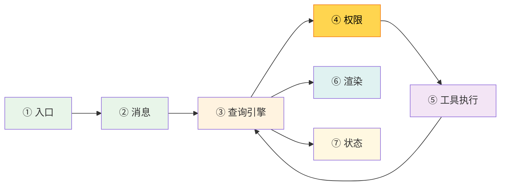

# 第 6 章：第 3 站——工具注册

> 源码验证日期：2026-05-15，基于 commit `0d81bb6`

本章内部结构模板（卷一统一）：
1. 路线图 — 流程图高亮当前站
2. 知识补全（按需）— Zod schema 基础
3. 源码入口 — 文件路径、接口名、关键方法
4. 逐行阅读 — 按真实调用链读源码
5. 调试实践 — 断点位置、日志方法
6. 试一试 — 修改源码验证理解
7. 检查点 — 自检练习
8. 下一站预告

---

## 路线图



上一章我们追踪了 system prompt 的构建。在 API 调用之前，还有一项关键准备工作：**工具列表的组装**。模型能使用哪些工具、每个工具接受什么参数、什么时候可以并行执行——这些都在注册阶段决定。

---

## 知识补全：Zod Schema 基础

如果你已经熟悉 Zod，跳过本节。

Zod 是一个 TypeScript 优先的 schema 验证库。Claude Code 用它定义工具的输入参数：

```typescript
import { z } from 'zod'

// 定义 schema
const UserSchema = z.object({
  name: z.string(),                    // 必填字符串
  age: z.number().optional(),          // 可选数字
  role: z.enum(['admin', 'user']),     // 枚举
})

// 从 schema 推导 TypeScript 类型
type User = z.infer<typeof UserSchema>
// 等价于: { name: string; age?: number; role: 'admin' | 'user' }

// 验证
const result = UserSchema.safeParse({ name: 'Alice', role: 'admin' })
if (result.success) {
  console.log(result.data)  // { name: 'Alice', role: 'admin' }
}
```

Claude Code 使用 Zod 的三个关键能力：
1. **类型推导**：`z.infer<typeof schema>` 自动生成 TypeScript 类型，不需要手写
2. **运行时验证**：`safeParse()` 验证输入是否符合 schema
3. **JSON Schema 生成**：Zod schema 可以转换为 JSON Schema，这是 Anthropic API 要求的工具参数格式

---

## 源码入口

本章追踪的调用链：

```
main.tsx 初始化阶段
  → src/tools.ts              (getTools — 组装工具列表)
    → src/tools.ts            (getAllBaseTools — 收集所有内置工具)
    → src/tools.ts            (assembleToolPool — 合并内置 + MCP 工具)
      → src/Tool.ts           (buildTool — 工具工厂函数)
      → src/tools/BashTool/   (BashTool — 具体工具实现示例)
```

---

## 逐行阅读

### 6.1 Tool 类型：统一的工具接口

所有工具都遵循 `Tool` 类型定义。它是一个泛型类型，有三个类型参数：

```typescript
// → src/Tool.ts:362（简化版，展示核心字段）
export type Tool<
  Input extends AnyObject = AnyObject,   // Zod schema 类型
  Output = unknown,                       // 输出类型
  P extends ToolProgressData = ToolProgressData,  // 进度类型
> = {
  // === 基础属性 ===
  readonly name: string                   // 工具名，如 "Bash"
  aliases?: string[]                      // 别名（重命名后向后兼容）
  searchHint?: string                     // 搜索提示（用于 Dynamic Tool Search）

  // === 核心方法 ===
  call(args, context, canUseTool, parentMessage, onProgress?): Promise<ToolResult<Output>>
                                          // 执行工具
  description(input, options): Promise<string>
                                          // 返回工具描述（模型用于决定何时使用）
  readonly inputSchema: Input             // Zod schema（定义参数类型）

  // === 行为标记 ===
  isReadOnly(input): boolean              // 是否只读（影响并发策略）
  isConcurrencySafe(input): boolean       // 是否并发安全
  isDestructive?(input): boolean          // 是否破坏性操作
  isEnabled(): boolean                    // 当前是否启用

  // === 中断行为 ===
  interruptBehavior?(): 'cancel' | 'block'
                                          // 用户发新消息时：取消 or 等待

  // === 其他 ===
  outputSchema?: z.ZodType<unknown>       // 输出 schema（验证结果）
  isMcp?: boolean                         // 是否 MCP 工具
  shouldDefer?: boolean                   // 是否延迟加载（Dynamic Tool Search）
  alwaysLoad?: boolean                    // 是否总是加载（不被延迟）
  maxResultSizeChars?: number             // 结果持久化阈值（超过则存到文件）
}
```

**关键设计决策**：

| 方法 | 默认值 | 含义 |
|------|--------|------|
| `isReadOnly` | `false` | 默认假设是写操作——安全第一 |
| `isConcurrencySafe` | `false` | 默认不能并行——避免竞态条件 |
| `isDestructive` | `false` | 默认非破坏性 |
| `isEnabled` | `true` | 默认启用 |

> **设计一瞥**：为什么 `isReadOnly` 默认是 `false`？因为"默认不安全"比"默认安全"更安全——如果开发者忘了标记，工具会被当作写操作处理（串行执行），而不是意外并行执行导致竞态条件。

### 6.2 buildTool：工具工厂函数

`buildTool` 是创建工具的标准方式。它接收一个 `ToolDef` 对象，填充默认值：

```typescript
// → src/Tool.ts:783（简化版）
const TOOL_DEFAULTS = {
  isEnabled: () => true,
  isConcurrencySafe: (_input?: unknown) => false,
  isReadOnly: (_input?: unknown) => false,
  isDestructive: (_input?: unknown) => false,
  checkPermissions: (input) => Promise.resolve({ behavior: 'allow', updatedInput: input }),
  toAutoClassifierInput: (_input?: unknown) => '',
  userFacingName: (_input?: unknown) => '',
}

export function buildTool<D extends AnyToolDef>(def: D): BuiltTool<D> {
  return {
    ...TOOL_DEFAULTS,   // 先铺上默认值
    userFacingName: () => def.name,
    ...def,             // 然后用具体实现覆盖
  } as BuiltTool<D>
}
```

这个模式让每个工具只需要定义自己特殊的部分。比如 `ReadTool` 只需要 `isReadOnly: () => true`，其他都用默认值。

### 6.3 BashTool：一个完整的工具实现

BashTool 是最复杂的工具之一，展示了 Zod schema 的典型用法：

```typescript
// → src/tools/BashTool/BashTool.tsx:227（简化版）
const fullInputSchema = lazySchema(() => z.strictObject({
  command: z.string().describe('The command to execute'),
  timeout: z.number().optional().describe('Optional timeout in milliseconds'),
  description: z.string().optional().describe('Clear, concise description...'),
  run_in_background: z.boolean().optional().describe('Set to true to run in background'),
  dangerouslyDisableSandbox: z.boolean().optional(),
  _simulatedSedEdit: z.object({
    filePath: z.string(),
    newContent: z.string()
  }).optional().describe('Internal: pre-computed sed edit result'),
}))
```

这里有几个有趣的设计：

**1. `lazySchema()`**：延迟求值。schema 不是在模块加载时创建，而是在第一次使用时才创建。这避免了循环依赖和启动时的不必要计算。

**2. `_simulatedSedEdit` 被从模型 schema 中移除**：

```typescript
// → src/tools/BashTool/BashTool.tsx:249-253
// Always omit _simulatedSedEdit from the model-facing schema. It is an internal-only
// field set by SedEditPermissionRequest after the user approves a sed edit preview.
// Exposing it would let the model bypass permission checks.
const inputSchema = lazySchema(() => fullInputSchema().omit({
  _simulatedSedEdit: true
}))
```

这个字段只供内部使用——如果暴露给模型，模型就能绕过权限检查直接写入任意文件。

**3. `buildTool()` 调用**：

```typescript
// → src/tools/BashTool/BashTool.tsx:420
export const BashTool = buildTool({
  name: 'Bash',
  searchHint: 'execute shell commands',
  maxResultSizeChars: 30_000,  // 超过 30K 字符时结果存到文件
  strict: true,
  isReadOnly(input) {
    const result = checkReadOnlyConstraints(input)
    return result.behavior === 'allow'
  },
  isConcurrencySafe(input) {
    return this.isReadOnly?.(input) ?? false  // 只读命令才能并发
  },
  async call(args, context, canUseTool, parentMessage) {
    // ...执行 bash 命令的完整逻辑
  },
  // ...
})
```

`isConcurrencySafe` 直接复用 `isReadOnly`——只有只读的 bash 命令（如 `ls`、`cat`）才能并行执行，写命令（如 `rm`、`npm install`）必须串行。

### 6.4 getAllBaseTools：收集所有内置工具

`getAllBaseTools()` 返回所有内置工具的数组。工具的条件包含展示了 feature flag 的使用：

```typescript
// → src/tools.ts:193（简化版）
export function getAllBaseTools(): Tools {
  return [
    // === 核心工具（始终存在）===
    AgentTool,               // 子代理
    TaskOutputTool,          // 后台任务输出
    BashTool,                // Shell 命令
    FileReadTool,            // 读文件
    FileEditTool,            // 编辑文件
    FileWriteTool,           // 写文件
    NotebookEditTool,        // Jupyter notebook
    WebFetchTool,            // 网页获取
    TodoWriteTool,           // Todo 列表
    WebSearchTool,           // 网页搜索
    TaskStopTool,            // 停止后台任务
    AskUserQuestionTool,     // 向用户提问
    SkillTool,               // 技能系统
    EnterPlanModeTool,       // 进入计划模式
    getSendMessageTool(),    // 发消息给子代理
    BriefTool,               // Brief 模式

    // === 条件工具 ===
    ...(hasEmbeddedSearchTools() ? [] : [GlobTool, GrepTool]),
    ...(process.env.USER_TYPE === 'ant' ? [ConfigTool] : []),
    ...(isWorktreeModeEnabled() ? [EnterWorktreeTool, ExitWorktreeTool] : []),
    ...(isAgentSwarmsEnabled() ? [TeamCreateTool, TeamDeleteTool] : []),
    ...(SleepTool ? [SleepTool] : []),           // KAIROS/PROACTIVE feature
    ...cronTools,                                 // AGENT_TRIGGERS feature
    ...(ToolSearchTool ? [ToolSearchTool] : []),  // Dynamic Tool Search

    // MCP 工具接口
    ListMcpResourcesTool,
    ReadMcpResourceTool,

    // === 测试专用 ===
    ...(process.env.NODE_ENV === 'test' ? [TestingPermissionTool] : []),
  ]
}
```

**工具分类一览**：

| 类别 | 工具 | 特点 |
|------|------|------|
| **文件操作** | Read, Edit, Write, NotebookEdit | Read 是只读，其他是写操作 |
| **搜索** | Glob, Grep | 只读，可并行（但如果内嵌了 bfs/ugrep 则不需要） |
| **执行** | Bash | 根据 `isReadOnly()` 动态判断 |
| **网络** | WebFetch, WebSearch | 只读 |
| **子代理** | Agent | 发起子任务 |
| **交互** | AskUserQuestion, TodoWrite | 需要用户交互 |
| **MCP** | MCPTool（动态） | 外部工具 |
| **内部** | TaskOutput, TaskStop, TeamCreate | 系统管理 |

### 6.5 getTools：过滤和组装

`getTools()` 是获取最终工具列表的入口：

```typescript
// → src/tools.ts:271（简化版）
export const getTools = (permissionContext: ToolPermissionContext): Tools => {
  // --bare 模式：只有 Bash + Read + Edit
  if (process.env.CLAUDE_CODE_SIMPLE) {
    if (isReplModeEnabled() && REPLTool) {
      return [REPLTool]  // REPL 模式用 VM 包装基本工具
    }
    return [BashTool, FileReadTool, FileEditTool]
  }

  // 获取所有基础工具，移除特殊工具
  const specialTools = new Set([
    ListMcpResourcesTool.name,
    ReadMcpResourceTool.name,
    SYNTHETIC_OUTPUT_TOOL_NAME,
  ])
  const tools = getAllBaseTools().filter(tool => !specialTools.has(tool.name))

  // 按 deny 规则过滤
  let allowedTools = filterToolsByDenyRules(tools, permissionContext)

  // REPL 模式隐藏原始工具（用 VM 包装）
  if (isReplModeEnabled()) { /* ... */ }

  // 只保留启用的工具
  return allowedTools.filter((_, i) => allowedTools[i].isEnabled())
}
```

### 6.6 assembleToolPool：合并内置 + MCP 工具

```typescript
// → src/tools.ts:345（简化版）
export function assembleToolPool(
  permissionContext: ToolPermissionContext,
  mcpTools: Tool[],
): Tools {
  const builtinTools = getTools(permissionContext)  // 内置工具
  const allowedMcpTools = filterToolsByDenyRules(mcpTools, permissionContext)  // MCP 工具

  // 按名称去重（内置工具优先）
  const seen = new Set(builtinTools.map(t => t.name))
  const dedupedMcp = allowedMcpTools.filter(t => !seen.has(t.name))

  // 各自排序后合并（排序保证 prompt cache 稳定性）
  return [...builtinTools.sort(byName), ...dedupedMcp.sort(byName)]
}
```

**排序的原因**：工具列表的顺序影响 prompt cache。如果每次工具顺序不同，整个 system prompt 的缓存就会失效。按名称排序确保缓存稳定。

> **设计一瞥**：为什么内置工具优先于 MCP 工具？因为 MCP 工具来自外部服务器，可能不稳定。如果 MCP 服务器定义了一个叫 "Bash" 的工具，它不应该覆盖内置的 BashTool。这是防御性设计。

---

## 调试实践

### 断点位置

| 位置 | 看什么 |
|------|--------|
| `Tool.ts:362` | `Tool` 类型定义——看所有字段 |
| `Tool.ts:783` | `buildTool` 工厂——看默认值填充 |
| `tools.ts:193` | `getAllBaseTools`——看所有工具的条件包含 |
| `tools.ts:271` | `getTools`——看过滤和组装流程 |
| `tools.ts:345` | `assembleToolPool`——看内置 + MCP 合并 |
| `BashTool.tsx:420` | `BashTool`——看完整工具实现 |

### 日志方法

```typescript
// 在 getTools() 的 return 之前
const tools = /* ... */
console.log('[DEBUG] Registered tools:', tools.map(t => t.name))
console.log('[DEBUG] Tool count:', tools.length)
```

---

## 试一试

### 修改 1：打印所有已注册工具

在 `src/tools.ts` 的 `getTools()` 函数 return 之前加：

```typescript
console.log('[DEBUG] Active tools:', result.map(t => t.name).join(', '))
console.log('[DEBUG] Tool count:', result.length)
```

然后启动 Claude Code，观察输出了哪些工具。尝试不同模式：
```bash
claude                    # 完整模式
claude --bare             # 极简模式（只有 Bash + Read + Edit）
```

### 修改 2：检查工具属性

在同一个位置，检查每个工具的 `isReadOnly` 属性：

```typescript
for (const tool of result) {
  try {
    const ro = tool.isReadOnly({})
    console.log(`[DEBUG] ${tool.name}: isReadOnly=${ro}`)
  } catch { /* 有些工具需要具体输入 */ }
}
```

### 修改 3：查看 BashTool 的 schema

在 `src/tools/BashTool/BashTool.tsx` 的 `buildTool` 调用前加：

```typescript
console.log('[DEBUG] BashTool inputSchema:', JSON.stringify(inputSchema(), null, 2))
```

观察 Zod schema 如何转换为 JSON 格式——这就是发送给 Anthropic API 的工具参数定义。

---

## 检查点

你现在已经理解了：

- **Tool 接口**：统一的方法签名（`call`、`description`、`inputSchema`）和行为标记（`isReadOnly`、`isConcurrencySafe`、`isDestructive`）
- **buildTool 工厂**：填充默认值（默认不安全），具体工具只需定义特殊部分
- **Zod schema**：`lazySchema()` 延迟求值，`.describe()` 生成模型可见的描述，`.omit()` 隐藏内部字段
- **工具注册流程**：`getAllBaseTools()` → `getTools()` → `assembleToolPool()`
- **条件包含**：`feature()` 编译时消除、`process.env.USER_TYPE` 运行时检查、`isEnabled()` 动态检查
- **工具过滤**：deny 规则、模式过滤（--bare、REPL）、排序保证 prompt cache 稳定性
- **内置 vs MCP**：内置工具优先，MCP 工具按名称去重，各自排序后合并

**下一站预告**：第 7 章将追踪 API 调用——`query()` 的 AsyncGenerator 模式、流式响应、Prompt Cache 机制。
