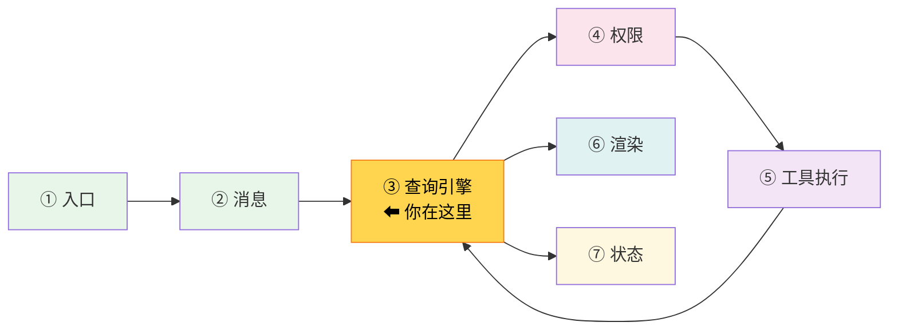
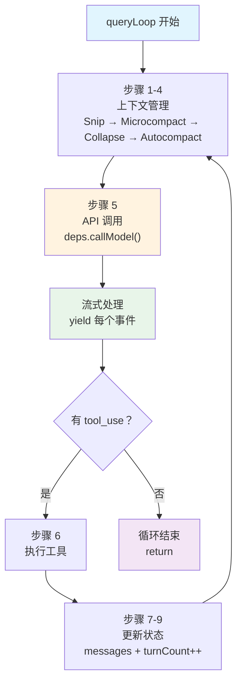

# 第 7 章：第 4 站——API 调用

> 源码验证日期：2026-05-15，基于 commit `0d81bb6`


---

## 路线图



现在我们到达了 Claude Code 的核心——**Agentic Loop** 本身。上一章准备好了 system prompt 和工具列表，本章追踪 API 调用：消息怎么发送给模型、流式响应怎么处理、循环怎么运转。

> **阅读建议**：本章是全书信息密度最高的一章，涉及 AsyncGenerator、流式响应、上下文压缩等概念。建议先通读一遍建立整体印象，再逐段精读。

---

## 知识补全：AsyncGenerator

如果你已经熟悉 `async function*` 和 `yield*`，跳过本节。

Claude Code 的核心循环使用 AsyncGenerator（异步生成器）：

```typescript
// 异步生成器：可以 yield 多个值，每个值异步产出
async function* numbers(): AsyncGenerator<number> {
  yield 1           // 产出一个值，暂停
  yield 2           // 产出一个值，暂停
  return 3          // 最终返回值
}

// 消费方式 1：for await...of（自动迭代）
for await (const num of numbers()) {
  console.log(num)  // 1, 2（不包含 return 值）
}

// 消费方式 2：yield* 委托（在另一个生成器中转发）
async function* wrapper(): AsyncGenerator<number> {
  const finalValue = yield* numbers()  // 转发所有 yield，获取 return 值
  console.log(finalValue)              // 3
}
```

**为什么用 AsyncGenerator？** 因为 Claude Code 需要**流式输出**。模型回复是一个字一个字到达的——AsyncGenerator 让调用者可以在每个字到达时就立刻处理，而不是等整个回复完成。

---

## 源码入口

本章追踪的调用链：

```
REPL.tsx 调用 query()
  → src/query.ts                    (query — AsyncGenerator 入口)
    → src/query.ts                  (queryLoop — while(true) 循环)
      → src/query/deps.ts           (productionDeps — 依赖注入)
        → src/services/api/claude.ts (queryModelWithStreaming — API 调用)
```

---

## 逐行阅读

### 7.1 query()：AsyncGenerator 入口

```typescript
// → src/query.ts 的 query() 函数
export async function* query(
  params: QueryParams,
): AsyncGenerator<
  StreamEvent | RequestStartEvent | Message | TombstoneMessage | ToolUseSummaryMessage,
  Terminal
> {
  const consumedCommandUuids: string[] = []
  const terminal = yield* queryLoop(params, consumedCommandUuids)
  // queryLoop 正常返回后才执行（throw 和 .return() 会跳过）
  for (const uuid of consumedCommandUuids) {
    notifyCommandLifecycle(uuid, 'completed')
  }
  return terminal
}
```

`query()` 是一个薄包装——它用 `yield*` 把所有工作委托给 `queryLoop()`。`yield*` 的意思是"把内层生成器的所有 yield 值直接转发给外层消费者"。

### queryLoop 骨架：先看全貌

在深入每一行之前，先用伪代码看整个循环的骨架：

```
queryLoop(params):
  state = { messages, turnCount: 1, ... }

  while (true):
    // 步骤 1-4：上下文管理（预防溢出）
    裁剪过大工具结果 → Snip 压缩旧结果 → Microcompact → Autocompact

    // 步骤 5：API 调用（核心）
    for await (event of callModel(messages, systemPrompt, tools)):
      yield event  → UI 立即渲染

    // 步骤 6：工具执行（如果有 tool_use）
    if (有工具调用):
      检查权限 → 执行工具 → 收集结果
      state = { ...state, messages: [...结果], turnCount++ }
      continue  // 回到 while(true) 开头

    // 步骤 7-9：循环控制（准备退出）
    if (没有工具调用):
      错误恢复（三阶段）→ stop hooks → token budget
      return { reason: 'completed' }
```

记住这个骨架——接下来每一节都是对骨架中某一行的展开。

### 7.2 queryLoop()：while(true) 的九步循环

`queryLoop` 是 Claude Code 的心脏。它是一个 `while (true)` 循环，每轮执行以下步骤：

```typescript
// → src/query.ts 的 queryLoop() 函数（简化版）
async function* queryLoop(params, consumedCommandUuids) {
  // 不可变参数（循环期间不变）
  const { systemPrompt, userContext, systemContext, canUseTool, maxTurns } = params
  const deps = params.deps ?? productionDeps()

  // 可变状态（每轮更新）
  let state: State = {
    messages: params.messages,
    toolUseContext: params.toolUseContext,
    turnCount: 1,
    maxOutputTokensRecoveryCount: 0,
    hasAttemptedReactiveCompact: false,
    // ...
  }

  while (true) {
    // 每轮开始时解构状态
    let { toolUseContext } = state
    const { messages, turnCount, ... } = state

    // === 步骤 1-4：上下文管理 ===
    // 步骤 1: 工具结果预算（applyToolResultBudget）
    // 步骤 2: Snip 压缩（裁剪旧工具结果）
    // 步骤 3: Microcompact（小范围缓存编辑）
    // 步骤 4: Autocompact（大范围摘要压缩）

    // === 步骤 5：API 调用 ===
    for await (const message of deps.callModel({
      messages: prependUserContext(messagesForQuery, userContext),
      systemPrompt: fullSystemPrompt,
      tools: toolUseContext.options.tools,
      // ...
    })) {
      // 处理每个流式事件
      if (message.type === 'assistant') {
        assistantMessages.push(message)
        // 检查是否有 tool_use blocks
        const toolBlocks = message.message.content.filter(c => c.type === 'tool_use')
        if (toolBlocks.length > 0) {
          toolUseBlocks.push(...toolBlocks)
          needsFollowUp = true  // 标记需要工具执行
        }
      }
      yield message  // 转发给 UI 层渲染
    }

    // === 步骤 6：工具执行 ===
    // （如果 needsFollowUp，执行工具，见第 8 章）

    // === 步骤 7-9：循环控制 ===
    // 如果没有工具调用 → 循环结束
    if (!needsFollowUp) {
      // 处理 stop hooks、返回最终结果
      return { reason: 'end_turn' }
    }

    // 更新状态，进入下一轮
    state = {
      ...state,
      messages: [...messages, ...assistantMessages, ...toolResults],
      turnCount: turnCount + 1,
    }
  }
}
```



### 7.3 上下文管理：四层压缩管线

每轮循环开始前，有四层上下文管理按成本从低到高执行：

| 层级 | 名称 | 成本 | 做什么 |
|------|------|------|--------|
| 1 | Tool Result Budget | 零 | 裁剪过大的工具输出 |
| 2 | Snip | 极低 | 用轻量摘要替换旧工具结果 |
| 3 | Microcompact | 低 | 缓存编辑，小范围压缩 |
| 4 | Autocompact | 高 | 调用模型生成完整摘要 |

每层在前一层不够时触发。如果 Snip 已经释放了足够空间，就不会触发 Autocompact——这节省了 API 调用和 token。

### 7.4 API 调用：deps.callModel()

`deps` 是依赖注入机制——生产环境用真实 API，测试环境可以注入 mock：

```typescript
// → src/query/deps.ts:33
export function productionDeps(): QueryDeps {
  return {
    callModel: queryModelWithStreaming,  // 真实 API 调用
    microcompact: microcompactMessages,   // Microcompact
    autocompact: autoCompactIfNeeded,     // Autocompact
    uuid: randomUUID,
  }
}
```

`queryModelWithStreaming` 是实际的 API 调用：

```typescript
// → src/services/api/claude.ts:752（简化版）
export async function* queryModelWithStreaming({
  messages, systemPrompt, thinkingConfig, tools, signal, options,
}): AsyncGenerator<StreamEvent | AssistantMessage> {
  return yield* withStreamingVCR(async function* () {
    yield* queryModel(messages, systemPrompt, thinkingConfig, tools, signal, options)
  })
}
```

它也是一个 AsyncGenerator——用 `yield*` 转发内层 `queryModel()` 的所有事件。

### 7.5 流式响应处理

API 调用的核心是 `for await...of` 循环：

```typescript
// → src/query.ts 的 queryLoop() 内部（简化版）
for await (const message of deps.callModel({
  messages: prependUserContext(messagesForQuery, userContext),
  systemPrompt: fullSystemPrompt,
  tools: toolUseContext.options.tools,
  signal: toolUseContext.abortController.signal,
  options: {
    model: currentModel,
    toolChoice: undefined,
    isNonInteractiveSession: ...,
    // ...
  },
})) {
  // 处理每个流式事件
  yield message  // 立即转发给 UI 渲染
}
```

每个流式事件可能是：
- **文本块**：模型输出的文字（逐字到达）
- **tool_use 块**：模型请求调用工具
- **thinking 块**：模型的内部推理（extended thinking）
- **错误消息**：API 错误（如 prompt-too-long）

> **关键洞察**：`yield message` 让 UI 层在收到每个事件时就**立刻渲染**。用户看到的"逐字显示"效果就是这样实现的——不是等模型说完才一次性显示。

### 7.6 消息组装：发给 API 的完整结构

每次 API 调用发送的完整结构：

```typescript
{
  system: [                    // System prompt
    { type: 'text', text: '...' },                    // 静态区
    { type: 'text', text: '__SYSTEM_PROMPT_DYNAMIC_BOUNDARY__' },  // 缓存边界
    { type: 'text', text: '...' },                    // 动态区
  ],
  messages: [                  // 对话历史
    { role: 'user', content: [...] },     // 用户消息
    { role: 'assistant', content: [...] }, // 模型回复
    { role: 'user', content: [...] },     // 工具结果（以 user 角色发送）
    // ... 更多轮次
  ],
  tools: [...],                // 工具列表（JSON Schema 格式）
  model: 'claude-sonnet-4-6',  // 当前模型
  stream: true,                // 流式响应
  // ... 其他参数
}
```

`prependUserContext()` 把 CLAUDE.md 内容和日期作为 user context 前置到消息列表中。

### 7.7 Prompt Cache：缓存边界标记

上一章提到的 `SYSTEM_PROMPT_DYNAMIC_BOUNDARY` 在这里发挥作用。Anthropic API 的 Prompt Cache 机制：

1. **前缀匹配**：如果 system prompt 的前 N 字节和上次完全相同，这部分从缓存读取
2. **缓存边界**：`__SYSTEM_PROMPT_DYNAMIC_BOUNDARY__` 字符串标记了静态区和动态区的分界
3. **静态区**：7 个静态 section 几乎不变 → 稳定命中缓存
4. **动态区**：每轮可能变化（MCP 连接、记忆更新等）

这意味着绝大多数 API 调用只需要重新处理动态区，静态区直接从缓存读取——**显著减少 token 消耗和延迟**。

---

## 调试实践

### 断点位置

| 位置 | 看什么 |
|------|--------|
| `query.ts` 的 `query()` 函数 | 入口——看参数结构 |
| `query.ts` 的 `queryLoop()` 函数开头 | `while(true)` 开始——看每轮初始化 |
| `query.ts` 的 `for await...of` 循环 | API 调用和流式事件 |
| `query.ts` 的 `!needsFollowUp` 检查 | 循环退出条件 |
| `deps.ts` 的 `productionDeps()` | 依赖注入 |
| `claude.ts` 的 `queryModelWithStreaming()` | 真实 API 调用 |

### 日志方法

```typescript
// 在 queryLoop 的 while(true) 开头
console.log('[DEBUG] queryLoop turn:', state.turnCount, 'messages:', state.messages.length)

// 在 for await 循环内
console.log('[DEBUG] stream event type:', message.type)
```

---

## 试一试

### 修改 1：观察每轮 API 调用

在 `src/query.ts` 的 `while(true)` 循环内，`deps.callModel` 调用之前加：

```typescript
console.log('[DEBUG] API call - turn:', turnCount, 'messages:', messagesForQuery.length)
```

然后发送一个需要多轮的任务，观察每轮的消息数量变化。

### 修改 2：追踪流式事件类型

在 `for await` 循环内，`yield message` 之前加：

```typescript
if (message.type === 'assistant') {
  const blockTypes = message.message.content.map(b => b.type).join(', ')
  console.log('[DEBUG] assistant blocks:', blockTypes)
}
```

观察模型每轮回复包含哪些类型的 block（text、tool_use、thinking）。

---

## 检查点

你现在已经理解了：

- **query() 和 queryLoop()**：AsyncGenerator 模式，`yield*` 委托，`while(true)` 循环
- **九步循环**：上下文管理（4 层压缩）→ API 调用 → 流式处理 → 工具执行 → 状态更新
- **依赖注入**：`productionDeps()` 提供真实 API，测试可注入 mock
- **流式响应**：`for await...of` 逐事件处理，`yield` 立即转发 UI
- **消息结构**：system prompt + messages + tools 的完整组装
- **上下文管理**：Tool Result Budget → Snip → Microcompact → Autocompact（成本递增）
- **Prompt Cache**：静态/动态分区、缓存边界标记、前缀匹配机制
- **循环退出**：`needsFollowUp` 为 false 时循环结束

**下一站预告**：第 8 章将深入工具执行——StreamingToolExecutor 的并发分区算法、预测性工具执行、Bash 安全分析管线。
