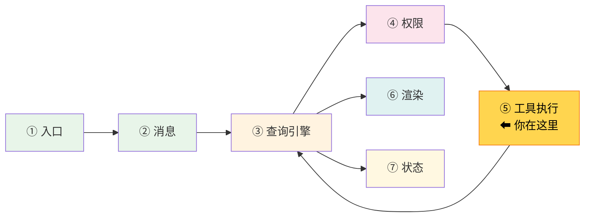
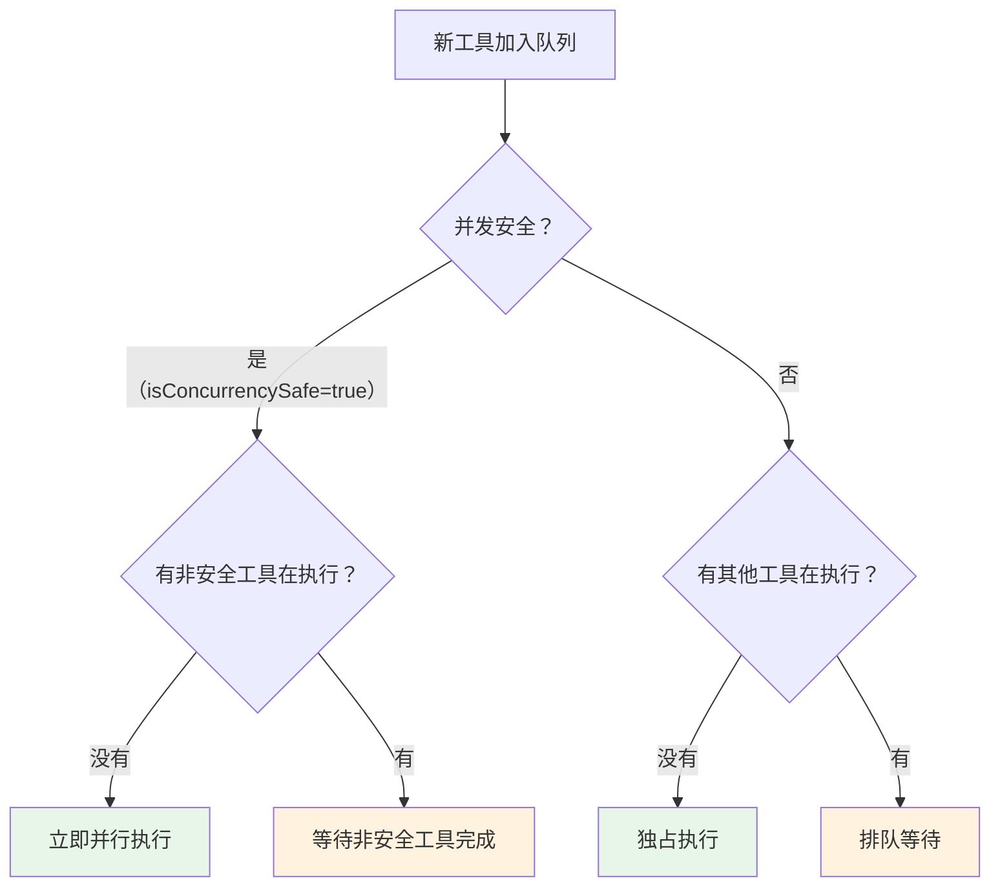
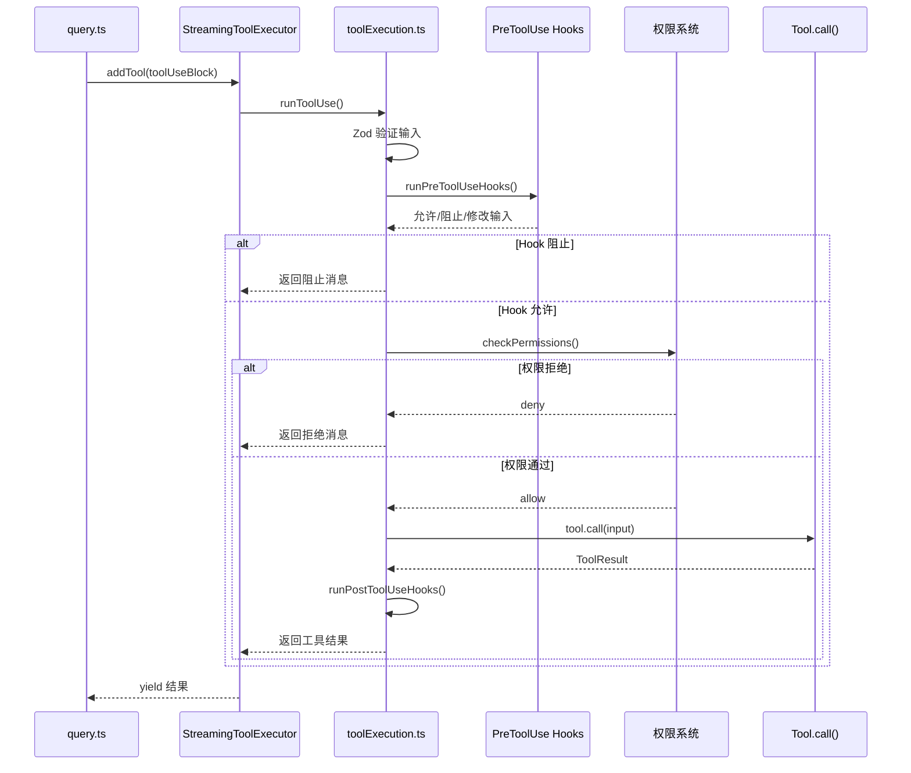

# 第 8 章：第 5 站——工具执行

> 源码验证日期：2026-05-15，基于 commit `0d81bb6`


---

## 路线图



上一章我们追踪了 API 调用——模型返回了 `tool_use` blocks。现在这些工具调用需要被实际执行。本章追踪从 `tool_use` block 到工具结果的全过程。

---

## 知识补全：并发控制

如果你已经熟悉 Promise.all 和串行执行，跳过本节。

```typescript
// 串行执行：一个一个来（安全但慢）
for (const tool of tools) {
  await execute(tool)  // 等前一个完成才开始下一个
}

// 并行执行：同时开始（快但可能不安全）
await Promise.all(tools.map(tool => execute(tool)))

// 有条件的并行：只读工具并行，写工具串行
const readOnlyTools = tools.filter(t => t.isReadOnly)
const writeTools = tools.filter(t => !t.isReadOnly)
await Promise.all(readOnlyTools.map(t => execute(t)))  // 并行
for (const tool of writeTools) {
  await execute(tool)  // 串行
}
```

Claude Code 用第三种方式——根据 `isConcurrencySafe` 标记决定并行还是串行。

---

## 源码入口

本章追踪的调用链：

```
query.ts 检测到 tool_use blocks
  → src/services/tools/StreamingToolExecutor.ts  (StreamingToolExecutor 类)
    → src/services/tools/toolExecution.ts        (runToolUse 函数)
      → runPreToolUseHooks()                     (执行前置 hooks)
      → checkPermissionsAndCallTool()            (权限检查 + 工具调用)
        → tool.call()                            (实际工具执行)
      → runPostToolUseHooks()                    (执行后置 hooks)
```

---

## 逐行阅读

### 8.1 StreamingToolExecutor：流式工具执行器

上一章看到 `query.ts` 在流式循环中把 `tool_use` blocks 添加到 `StreamingToolExecutor`：

```typescript
// → src/query.ts:838-845（简化版）
if (streamingToolExecutor && msgToolUseBlocks.length > 0) {
  for (const toolBlock of msgToolUseBlocks) {
    streamingToolExecutor.addTool(toolBlock, message)
  }
}
// 立即获取已完成的结果
for (const result of streamingToolExecutor.getCompletedResults()) {
  yield result
}
```

**关键设计**：模型仍在流式输出时，工具就已经开始执行了。这叫**预测性工具执行（Speculative Execution）**——不等模型说完就开始执行只读工具。

### 8.2 addTool：添加并立即尝试执行

```typescript
// → src/services/tools/StreamingToolExecutor.ts:76（简化版）
addTool(block: ToolUseBlock, assistantMessage: AssistantMessage): void {
  const toolDefinition = findToolByName(this.toolDefinitions, block.name)

  // 找不到工具 → 立即返回错误结果
  if (!toolDefinition) {
    this.tools.push({
      status: 'completed',
      results: [createUserMessage({
        content: [{ type: 'tool_result', content: `Error: No such tool: ${block.name}`, is_error: true }]
      })]
    })
    return
  }

  // 解析输入，判断是否并发安全
  const parsedInput = toolDefinition.inputSchema.safeParse(block.input)
  const isConcurrencySafe = parsedInput?.success
    ? Boolean(toolDefinition.isConcurrencySafe(parsedInput.data))
    : false  // 解析失败 → 不安全

  this.tools.push({ block, status: 'queued', isConcurrencySafe })

  // 立即尝试执行（如果并发条件允许）
  void this.processQueue()
}
```

### 8.3 并发分区算法：canExecuteTool

核心并发控制逻辑：

```typescript
// → src/services/tools/StreamingToolExecutor.ts:129（简化版）
private canExecuteTool(isConcurrencySafe: boolean): boolean {
  const executingTools = this.tools.filter(t => t.status === 'executing')
  return (
    executingTools.length === 0 ||  // 没有在执行的 → 可以开始
    (isConcurrencySafe && executingTools.every(t => t.isConcurrencySafe))
    // 当前工具安全 + 所有执行中的也安全 → 可以并行
  )
}
```



**示例**：模型同时返回三个工具调用：

| 工具 | isConcurrencySafe | 执行策略 |
|------|-------------------|---------|
| Read("file1.ts") | true | 立即并行执行 |
| Grep("pattern") | true | 立即并行执行 |
| Write("file2.ts") | false | 等待 Read 和 Grep 完成后独占执行 |

### 8.4 runToolUse：工具执行链

`runToolUse` 是单个工具的完整执行流程：

```typescript
// → src/services/tools/toolExecution.ts:337（简化版）
export async function* runToolUse(
  toolUse: ToolUseBlock,
  assistantMessage: AssistantMessage,
  canUseTool: CanUseToolFn,
  toolUseContext: ToolUseContext,
): AsyncGenerator<MessageUpdateLazy> {
  // 1. 查找工具定义
  let tool = findToolByName(toolUseContext.options.tools, toolUse.name)

  // 2. 走完整的执行链
  yield* checkPermissionsAndCallTool(
    tool, toolUse.id, toolUse.input, toolUseContext,
    canUseTool, assistantMessage, ...
  )
}
```

### 8.5 checkPermissionsAndCallTool：完整的执行链

这是工具执行最核心的函数，包含完整的 5 步链：

```typescript
// → src/services/tools/toolExecution.ts:599（简化版）
async function checkPermissionsAndCallTool(
  tool, toolUseID, input, toolUseContext, canUseTool, ...
): Promise<MessageUpdateLazy[]> {

  // 步骤 1: Zod 验证输入
  const parsedInput = tool.inputSchema.safeParse(input)
  if (!parsedInput.success) {
    return [createErrorMessage('InputValidationError', ...)]
  }

  // 步骤 2: 执行 PreToolUse Hooks
  for await (const result of runPreToolUseHooks(toolUseContext, tool, processedInput, ...)) {
    switch (result.type) {
      case 'preventContinuation':  // Hook 阻止执行
        shouldPreventContinuation = true
        break
      case 'hookPermissionResult': // Hook 做了权限决定
        hookPermissionResult = result.hookPermissionResult
        break
      case 'hookUpdatedInput':     // Hook 修改了输入
        processedInput = result.updatedInput
        break
      // ...
    }
  }

  // 步骤 3: 权限检查
  const permissionDecision = await resolveHookPermissionDecision(
    hookPermissionResult, tool, processedInput, toolUseContext, canUseTool, ...
  )

  if (permissionDecision.behavior === 'deny') {
    return [createDenyMessage(...)]  // 权限被拒绝
  }

  // 步骤 4: 执行工具
  const result = await tool.call(
    callInput,
    { ...toolUseContext, toolUseId: toolUseID },
    canUseTool,
    assistantMessage,
    progress => { onToolProgress(progress) },
  )

  // 步骤 5: 执行 PostToolUse Hooks
  // ... 返回工具结果
}
```



### 8.6 兄弟错误级联：Bash 失败取消并行工具

```typescript
// → src/services/tools/StreamingToolExecutor.ts:354-363
if (isErrorResult) {
  // 只有 Bash 错误会取消并行兄弟
  // Bash 命令常有隐式依赖链（如 mkdir 失败 → 后续命令无意义）
  if (tool.block.name === BASH_TOOL_NAME) {
    this.hasErrored = true
    this.erroredToolDescription = this.getToolDescription(tool)
    this.siblingAbortController.abort('sibling_error')
  }
}
```

**为什么只有 Bash 错误触发级联？** 因为 Read/WebFetch 等是独立的——一个失败不影响其他。但 Bash 命令经常有依赖关系（`mkdir` 失败 → `cp` 无意义），所以 Bash 失败时取消所有并行兄弟。

### 8.7 进度消息：即时反馈

工具执行过程中可以产出进度消息：

```typescript
// → src/services/tools/StreamingToolExecutor.ts:366-378
if (update.message.type === 'progress') {
  tool.pendingProgress.push(update.message)  // 立即加入待处理队列
  // 通知 getRemainingResults 有新进度
  if (this.progressAvailableResolve) {
    this.progressAvailableResolve()
  }
} else {
  messages.push(update.message)  // 非进度消息等工具完成后一起返回
}
```

进度消息不等待工具完成就立即 yield——这就是为什么你能在终端看到 Bash 命令的实时输出。

---

## 调试实践

### 断点位置

| 位置 | 看什么 |
|------|--------|
| `StreamingToolExecutor.ts:76` | `addTool`——看并发安全判断 |
| `StreamingToolExecutor.ts:129` | `canExecuteTool`——看并发分区算法 |
| `StreamingToolExecutor.ts:265` | `executeTool`——看工具执行启动 |
| `toolExecution.ts:599` | `checkPermissionsAndCallTool`——看完整 5 步链 |
| `toolExecution.ts:1207` | `tool.call()`——看实际工具调用 |

### 日志方法

```typescript
// 在 StreamingToolExecutor.ts 的 addTool 方法中
console.log('[DEBUG] addTool:', block.name, 'isConcurrencySafe:', isConcurrencySafe)

// 在 toolExecution.ts 的 checkPermissionsAndCallTool 中，tool.call() 前后
console.log('[DEBUG] Calling tool:', tool.name, 'at:', Date.now())
const result = await tool.call(...)
console.log('[DEBUG] Tool completed:', tool.name, 'at:', Date.now())
```

---

## 试一试

### 修改 1：观察并发执行

在 `src/services/tools/StreamingToolExecutor.ts` 的 `canExecuteTool` 方法中加：

```typescript
const executing = this.tools.filter(t => t.status === 'executing')
console.log('[DEBUG] canExecute:', isConcurrencySafe, 'executing:', executing.map(t => t.block.name))
```

然后给 Claude 一个需要读多个文件的任务，观察哪些工具并行执行。

### 修改 2：测量工具执行时间

在 `src/services/tools/toolExecution.ts` 的 `tool.call()` 调用前后加：

```typescript
console.log('[DEBUG] Tool start:', tool.name)
const result = await tool.call(callInput, ...)
console.log('[DEBUG] Tool end:', tool.name, 'duration:', Date.now() - startTime, 'ms')
```

---

## 检查点

你现在已经理解了：

- **StreamingToolExecutor**：流式工具执行器，边接收 `tool_use` blocks 边开始执行
- **并发分区算法**：`isConcurrencySafe` 判断——安全工具并行、非安全工具串行
- **预测性工具执行**：模型还在流式输出时，只读工具已经开始执行
- **完整执行链**：Zod 验证 → PreToolUse Hooks → 权限检查 → `tool.call()` → PostToolUse Hooks
- **兄弟错误级联**：Bash 失败取消并行兄弟，其他工具失败不影响
- **进度消息**：不等待完成就立即 yield，实现实时反馈

**下一站预告**：第 9 章将追踪循环状态——`queryLoop` 的退出条件、AppState 状态管理、上下文压缩策略。
