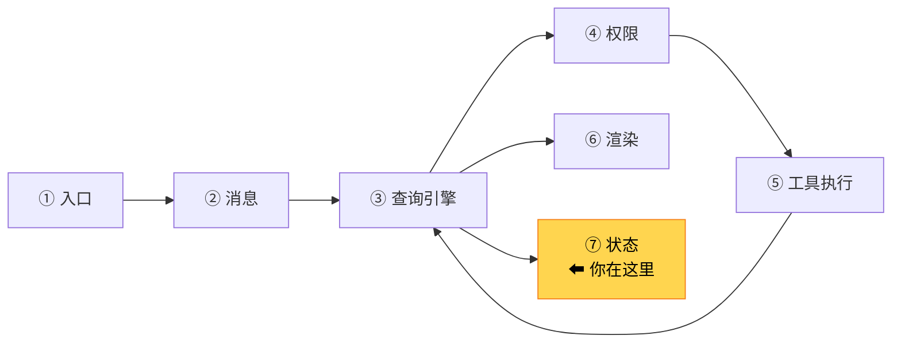
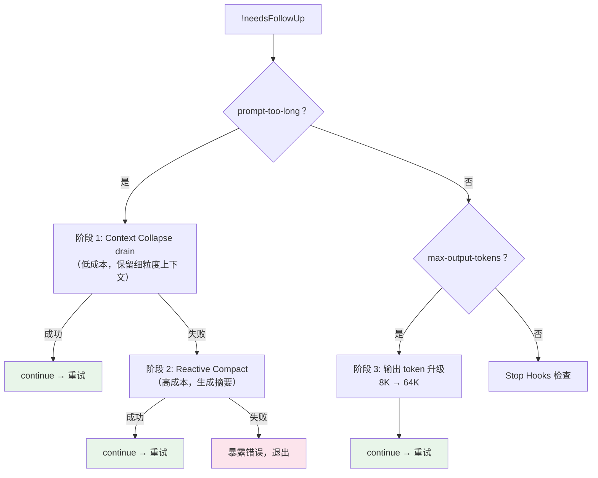

# 第 9 章：第 6 站——循环与状态

> 源码验证日期：2026-05-15，基于 commit `0d81bb6`

---

## 路线图



前两章追踪了 API 调用和工具执行。现在看 `queryLoop` 的循环控制和状态管理——它怎么决定继续还是停止、怎么处理错误恢复。

---

## 源码入口

```
src/query.ts:1062-1358  — 循环退出条件、错误恢复、stop hooks
src/query.ts:268-279    — State 类型定义
src/state/AppStateStore.ts — 全局应用状态
```

---

## 逐行阅读

### 9.1 State：每轮循环的可变状态

```typescript
// → src/query.ts:268（简化版）
let state: State = {
  messages: params.messages,          // 对话历史
  toolUseContext: params.toolUseContext,
  maxOutputTokensOverride: undefined,  // 输出 token 覆盖
  autoCompactTracking: undefined,      // 压缩追踪
  stopHookActive: undefined,           // stop hook 是否激活
  maxOutputTokensRecoveryCount: 0,     // max-output 恢复次数
  hasAttemptedReactiveCompact: false,  // 是否已尝试响应式压缩
  turnCount: 1,                        // 当前轮次
  pendingToolUseSummary: undefined,    // 待处理的工具摘要
  transition: undefined,               // 上一轮的转换原因
}
```

`State` 是不可变更新模式——每轮 `continue` 时用 `state = { ...state, ...updates }` 创建新对象。

### 9.2 循环退出条件：!needsFollowUp

```typescript
// → src/query.ts:1062
if (!needsFollowUp) {
  // 模型没有请求工具调用 → 对话结束
  // ... 错误恢复逻辑 ...
  return { reason: 'completed' }
}
```

当模型回复不包含 `tool_use` blocks 时，`needsFollowUp` 为 `false`，循环结束。

但在结束之前，有大量错误恢复逻辑：

### 9.3 三阶段错误恢复



**阶段 1 — Context Collapse drain**：低成本的上下文恢复，通过释放已暂存的折叠（collapse）来腾出空间。

**阶段 2 — Reactive Compact**：如果 collapse 不够，触发完整的响应式压缩——调用模型生成对话摘要。

**阶段 3 — Max Output Token 升级**：如果模型输出被截断，先尝试从默认 8K 升级到 64K output tokens。如果仍然不够，注入恢复消息让模型继续。

```typescript
// → src/query.ts:1185-1221（简化版）
if (isWithheldMaxOutputTokens(lastMessage)) {
  // 第一次：8K → 64K 升级（不消耗额外轮次）
  if (maxOutputTokensOverride === undefined) {
    state = { ...state, maxOutputTokensOverride: ESCALATED_MAX_TOKENS }
    continue
  }
  // 升级后仍不够：注入恢复消息
  if (maxOutputTokensRecoveryCount < MAX_OUTPUT_TOKENS_RECOVERY_LIMIT) {
    const recoveryMessage = createUserMessage({
      content: 'Output token limit hit. Resume directly...',
      isMeta: true,  // 对用户隐藏
    })
    state = { ...state, maxOutputTokensRecoveryCount: count + 1 }
    continue
  }
  // 恢复次数耗尽 → 暴露错误
  yield lastMessage
}
```

### 9.4 Stop Hooks：后置拦截

即使模型没有请求工具，stop hooks 仍可能拦截：

```typescript
// → src/query.ts:1267-1306（简化版）
const stopHookResult = yield* handleStopHooks(...)

if (stopHookResult.preventContinuation) {
  return { reason: 'stop_hook_prevented' }
}

if (stopHookResult.blockingErrors.length > 0) {
  // Hook 返回了阻塞错误 → 注入错误消息后继续循环
  state = {
    ...state,
    messages: [...messages, ...assistantMessages, ...blockingErrors],
    stopHookActive: true,
    transition: { reason: 'stop_hook_blocking' },
  }
  continue  // 继续循环（不是退出！）
}
```

Stop hooks 可以阻止回复、注入额外上下文、或触发重试。

### 9.5 Token Budget：预算控制

如果启用了 token 预算：

```typescript
// → src/query.ts:1308-1357（简化版）
const decision = checkTokenBudget(budgetTracker, ...)
if (decision.action === 'continue') {
  // 还没达到预算上限 → 注入鼓励消息后继续
  state = { ...state, messages: [...messages, nudgeMessage] }
  continue
}
// 达到预算 → 正常退出
return { reason: 'completed' }
```

### 9.6 工具执行后的状态更新

当 `needsFollowUp` 为 `true`（有工具需要执行）时：

```typescript
// → src/query.ts:1360-1728（简化版）
// 执行所有工具
const toolUpdates = streamingToolExecutor
  ? streamingToolExecutor.getRemainingResults()
  : /* 非流式执行 */

for await (const update of toolUpdates) {
  // 收集工具结果
  if (update.message) toolResults.push(update.message)
  if (update.newContext) toolUseContext = update.newContext
}

// 更新状态，进入下一轮
state = {
  messages: [...messages, ...assistantMessages, ...toolResults],
  toolUseContext,
  turnCount: turnCount + 1,
  // ... 其他字段重置
}
continue  // 回到 while(true) 开头
```

---

## 调试实践

| 位置 | 看什么 |
|------|--------|
| `query.ts:1062` | `!needsFollowUp` 退出检查 |
| `query.ts:1185` | max-output-tokens 恢复 |
| `query.ts:1267` | stop hooks 处理 |
| `query.ts:1360` | 工具执行后的状态更新 |

---

## 试一试

在 `src/query.ts` 的 `while(true)` 循环的 `continue` 之前加：

```typescript
console.log('[DEBUG] State transition:', state.transition?.reason, 'turn:', state.turnCount)
```

观察每次循环继续时的转换原因（`collapse_drain_retry`、`reactive_compact_retry`、`stop_hook_blocking` 等）。

---

## 检查点

- **State 不可变更新**：每轮用 `state = { ...state, ... }` 创建新对象
- **三阶段错误恢复**：Context Collapse drain → Reactive Compact → Max Output Token 升级
- **Stop Hooks**：即使模型不请求工具，仍可拦截回复
- **Token Budget**：预算控制，达到上限时正常退出，未达上限时注入鼓励消息继续
- **循环继续**：工具执行后更新 `messages` 和 `turnCount`，`continue` 回到循环开头

**下一站预告**：第 10 章将追踪渲染输出——Ink 框架如何把流式事件渲染到终端。
