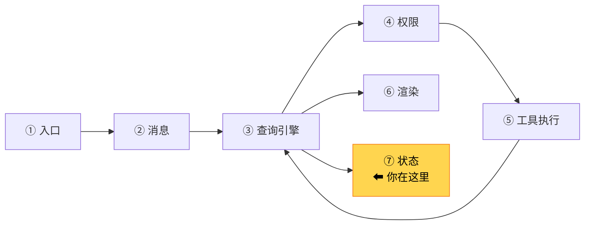
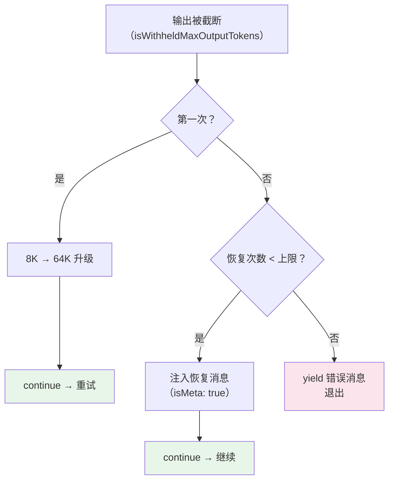

# 第 9 章：第 6 站——循环与状态

> 源码验证日期：2026-05-15，基于 commit `0d81bb6`

---

## 路线图



前两章追踪了 API 调用和工具执行。现在看 `queryLoop` 的循环控制和状态管理——它怎么决定继续还是停止、怎么处理错误恢复。

> **与 ch07 的关系**：ch07 介绍了四层压缩管线（Tool Result Budget → Snip → Microcompact → Autocompact），它在每轮 API 调用**之前**执行，目的是预防上下文溢出。本章描述的是循环**退出时**的错误恢复——当 API 调用已经失败后的补救措施。两者互补：ch07 是"预防"，本章是"治疗"。

---

## 源码入口

本章追踪的调用链：

```
queryLoop 的 while(true) 循环
  → src/query.ts              (State 类型定义 — 循环状态)
  → src/query.ts              (循环退出条件、错误恢复、stop hooks)
  → src/state/AppStateStore.ts (全局应用状态)
```

---

## 逐行阅读

### 9.1 State：每轮循环的可变状态

`queryLoop` 内部维护一个 `State` 对象，每轮循环结束时更新：

```typescript
// → src/query.ts 的 State 类型（简化版）
let state: State = {
  messages: params.messages,          // 对话历史
  toolUseContext: params.toolUseContext,
  maxOutputTokensOverride: undefined,  // 输出 token 覆盖
  autoCompactTracking: undefined,      // 压缩追踪
  stopHookActive: undefined,           // stop hook 是否激活
  maxOutputTokensRecoveryCount: 0,     // max-output 恢复次数
  hasAttemptedReactiveCompact: false,  // 是否已尝试响应式压缩
  turnCount: 1,                        // 当前轮次
  pendingToolUseSummary: undefined,    // 待处理的工具摘要
  transition: undefined,               // 上一轮的转换原因
}
```

`State` 使用**不可变更新**模式——每轮 `continue` 时用 `state = { ...state, ...updates }` 创建新对象。这让每轮的状态都是独立的快照，方便调试和追踪。

`transition` 字段特别有用——它记录了本轮为什么被触发（如 `collapse_drain_retry`、`reactive_compact_retry`、`stop_hook_blocking`），是调试循环行为的关键线索。

### 9.2 循环退出条件：!needsFollowUp

每轮 API 调用后，`queryLoop` 检查模型是否请求了工具调用：

```typescript
// → src/query.ts（简化版）
if (!needsFollowUp) {
  // 模型没有请求工具调用 → 对话可以结束
  // ... 但先检查是否有错误需要恢复 ...
  return { reason: 'completed' }
}
```

当模型回复不包含 `tool_use` blocks 时，`needsFollowUp` 为 `false`，循环可以结束。

但"可以结束"不等于"真的结束"。在退出之前，有大量错误恢复逻辑——这正是本章的核心内容。

### 9.3 阶段一：Context Collapse drain

当 `!needsFollowUp` 但最后一条消息是 `prompt-too-long` 错误时，触发第一阶段恢复。

**原理**：`prompt-too-long` 意味着发送给 API 的消息太长了。在放弃之前，先尝试低成本恢复。

**什么是 Collapse drain**：ch07 的 Microcompact 阶段会将一些旧消息标记为"折叠"（collapsed），但不立即删除——因为删除会改变 prompt 的字节前缀，破坏 Prompt Cache。drain 的意思是"释放这些已暂存的折叠"，真正删除它们来腾出空间。

```typescript
// → src/query.ts（简化版）
if (isPromptTooLongError(lastMessage)) {
  // 尝试释放已暂存的折叠
  const drainResult = await drainCollapsedMessages(messages)
  if (drainResult.freedSpace > 0) {
    // 释放了足够空间 → 用缩减后的消息重试
    state = {
      ...state,
      messages: drainResult.trimmedMessages,
      transition: { reason: 'collapse_drain_retry' },
    }
    continue  // 回到 while(true) 开头，重新调用 API
  }
  // drain 不够 → 进入阶段 2
}
```

**成本**：极低。只是删除已标记的旧消息，不调用 API。

**适用场景**：对话已经很长，之前有消息被折叠但还没真正删除。

### 9.4 阶段二：Reactive Compact

如果 Collapse drain 释放的空间不够（或者没有可 drain 的折叠），触发第二阶段。

**原理**：调用模型对整个对话历史生成摘要，用摘要替换原始消息。

```typescript
// → src/query.ts（简化版）
if (shouldAttemptReactiveCompact) {
  const compactResult = await reactiveCompact(messages, systemPrompt, model)

  if (compactResult.success) {
    state = {
      ...state,
      messages: compactResult.compactedMessages,
      hasAttemptedReactiveCompact: true,  // 标记已尝试，不再重复
      transition: { reason: 'reactive_compact_retry' },
    }
    continue  // 回到 while(true) 开头，用压缩后的消息重试
  }

  // 压缩也失败了 → 暴露错误给用户
  // yield 错误消息后正常退出
}
```

**关键保护**：`hasAttemptedReactiveCompact` 标记确保只尝试一次。如果压缩后的消息仍然太长，不会再循环尝试（避免无限重试）。

**成本**：高。需要额外调用一次 API 生成摘要。但这是最后手段——比直接告诉用户"对话太长了，请开新会话"要好得多。

**适用场景**：对话非常长，ch07 的 Autocompact 没有压缩够（可能因为对话增长速度超过了压缩速度）。

### 9.5 阶段三：Max Output Token 升级

前两个阶段处理的是"输入太长"。如果问题不是输入太长，而是**模型输出被截断**（`max-output-tokens` 限制），则触发第三阶段。

**原理**：Claude API 对每次回复的 token 数有限制。默认是 8K tokens。对于需要长回复的场景（如生成大段代码），8K 可能不够。

```typescript
// → src/query.ts（简化版）
if (isWithheldMaxOutputTokens(lastMessage)) {
  // 第一次遇到：从默认 8K 升级到 64K
  if (maxOutputTokensOverride === undefined) {
    state = {
      ...state,
      maxOutputTokensOverride: ESCALATED_MAX_TOKENS,  // 64K
      transition: { reason: 'max_tokens_escalation' },
    }
    continue  // 重新调用 API，这次允许更长的输出
  }

  // 升级后仍不够：注入恢复消息让模型继续
  if (maxOutputTokensRecoveryCount < MAX_OUTPUT_TOKENS_RECOVERY_LIMIT) {
    const recoveryMessage = createUserMessage({
      content: 'Output token limit hit. Resume directly where you left off...',
      isMeta: true,  // 对用户隐藏
    })
    state = {
      ...state,
      messages: [...messages, recoveryMessage],
      maxOutputTokensRecoveryCount: count + 1,
      transition: { reason: 'max_tokens_resume' },
    }
    continue  // 模型会从上次中断的地方继续输出
  }

  // 恢复次数耗尽 → 暴露错误
  yield lastMessage
}
```

**恢复流程**：



**`isMeta: true` 的作用**：恢复消息对用户不可见（不会在终端显示），但对模型可见。模型会理解为"我上次的输出被截断了，需要继续"。

### 9.6 Stop Hooks：后置拦截

即使模型没有请求工具（`!needsFollowUp`）且没有错误，stop hooks 仍可能拦截：

```typescript
// → src/query.ts（简化版）
const stopHookResult = yield* handleStopHooks(...)

if (stopHookResult.preventContinuation) {
  // Hook 明确阻止继续 → 直接退出
  return { reason: 'stop_hook_prevented' }
}

if (stopHookResult.blockingErrors.length > 0) {
  // Hook 返回了阻塞错误 → 不退出，注入错误消息后继续循环
  state = {
    ...state,
    messages: [...messages, ...assistantMessages, ...blockingErrors],
    stopHookActive: true,
    transition: { reason: 'stop_hook_blocking' },
  }
  continue  // 继续循环（不是退出！）
}
```

Stop hooks 的三种行为：

| 行为 | 效果 | 用途 |
|------|------|------|
| `preventContinuation` | 阻止回复，直接退出 | 安全策略拦截 |
| `blockingErrors` | 注入错误，继续循环 | 强制模型修正行为 |
| 无操作 | 允许正常退出 | 默认行为 |

**关键洞察**：`blockingErrors` 会让循环**继续**而不是退出。这意味着 stop hook 可以把一个"模型认为已经完成"的对话重新激活。

### 9.7 Token Budget：预算控制

如果启用了 token 预算（通过配置或 API 参数）：

```typescript
// → src/query.ts（简化版）
const decision = checkTokenBudget(budgetTracker, ...)
if (decision.action === 'continue') {
  // 还没达到预算上限 → 注入鼓励消息后继续
  state = { ...state, messages: [...messages, nudgeMessage] }
  continue
}
// 达到预算 → 正常退出
return { reason: 'completed' }
```

Token budget 的设计很克制——达到上限时不是硬性截断，而是正常退出循环（模型可以完成当前输出）。`nudgeMessage` 是一条元消息，鼓励模型在剩余预算内完成工作。

### 9.8 工具执行后的状态更新

当 `needsFollowUp` 为 `true`（有工具需要执行）时，循环走另一条路径：

```typescript
// → src/query.ts（简化版）
// 执行所有工具（流式获取结果）
const toolUpdates = streamingToolExecutor
  ? streamingToolExecutor.getRemainingResults()
  : /* 非流式执行 */

for await (const update of toolUpdates) {
  // 收集工具结果
  if (update.message) toolResults.push(update.message)
  if (update.newContext) toolUseContext = update.newContext
}

// 更新状态，进入下一轮
state = {
  messages: [...messages, ...assistantMessages, ...toolResults],
  toolUseContext,
  turnCount: turnCount + 1,
  pendingToolUseSummary: undefined,       // 重置
  maxOutputTokensRecoveryCount: 0,        // 重置恢复计数
  hasAttemptedReactiveCompact: false,      // 重置压缩标记
  stopHookActive: undefined,              // 重置
  transition: undefined,                  // 重置
}
continue  // 回到 while(true) 开头
```

**注意**：每轮开始时，大部分恢复相关字段都被重置。这意味着每轮都有完整的错误恢复机会——上一轮的失败不会影响这一轮。

### 9.9 收益递减检测

一个重要的循环保护机制——如果模型连续多轮只产生很少的输出，自动停止：

```typescript
// → src/query.ts（简化版）
// 检查最近几轮的产出
if (turnCount > 3 && lastOutputTokenCount < DIMINISHING_RETURN_THRESHOLD) {
  consecutiveLowOutputTurns++
  if (consecutiveLowOutputTurns >= 3) {
    return { reason: 'completed' }  // 收益递减，停止循环
  }
}
```

这防止了模型陷入"反复调用工具但产出越来越少"的无限循环。

---

## 调试实践

### 断点位置

| 位置 | 看什么 |
|------|--------|
| `query.ts` 的 `!needsFollowUp` 分支 | 循环退出检查 |
| `query.ts` 的 `isPromptTooLongError` 分支 | 阶段一：Collapse drain |
| `query.ts` 的 `reactiveCompact` 调用 | 阶段二：Reactive Compact |
| `query.ts` 的 `isWithheldMaxOutputTokens` 分支 | 阶段三：Token 升级 |
| `query.ts` 的 `handleStopHooks` 调用 | Stop hooks 处理 |
| `query.ts` 的 `state = { ...state, ... }` | 状态更新——看 `transition.reason` |
| `query.ts` 的 `turnCount++` | 轮次计数——追踪循环次数 |

### 日志方法

```typescript
// 在 queryLoop 的 while(true) 开头
console.log('[DEBUG] Turn:', state.turnCount, 'messages:', state.messages.length,
  'transition:', state.transition?.reason ?? 'none')

// 在每个 continue 之前
console.log('[DEBUG] Continuing:', state.transition?.reason,
  'turnCount:', state.turnCount)

// 在 return 之前
console.log('[DEBUG] Loop exiting:', reason)
```

---

## 试一试

### 修改 1：追踪状态转换

在 `src/query.ts` 的 `while(true)` 循环中，每个 `continue` 之前加：

```typescript
console.log('[DEBUG] State transition:', state.transition?.reason, 'turn:', state.turnCount)
```

然后发送一个需要多轮的任务（如"帮我重构这个文件"），观察输出中的转换原因：

```
[DEBUG] State transition: undefined turn: 1           ← 首轮，无转换
[DEBUG] State transition: undefined turn: 2           ← 工具执行后继续
[DEBUG] State transition: max_tokens_escalation turn: 3  ← 输出被截断，升级 token
```

### 修改 2：触发错误恢复

在 `src/query.ts` 中，找到 `maxOutputTokensOverride` 的赋值位置。临时将默认 token 限制改小：

```typescript
const ORIGINAL_MAX_TOKENS = 200  // 临时改为极小值，强制触发截断
```

然后发送一个需要长回复的请求（如"用详细注释重写这个 100 行文件"），观察三阶段恢复流程：
1. 模型输出被截断 → `isWithheldMaxOutputTokens` 触发
2. 8K → 64K 升级 → 重试
3. 如果仍不够 → 注入恢复消息 → 继续输出

### 修改 3：观察收益递减

在循环末尾加：

```typescript
console.log('[DEBUG] Output tokens this turn:', outputTokenCount)
```

运行后你应该看到类似输出：

```
[DEBUG] Output tokens this turn: 1523
[DEBUG] Output tokens this turn: 847
[DEBUG] Output tokens this turn: 42
[DEBUG] Output tokens this turn: 18
```

如果连续看到低数字（如 < 100），说明触发了收益递减检测。

---

## 检查点

你现在已经理解了：

- **State 不可变更新**：每轮用 `state = { ...state, ... }` 创建新对象，`transition` 字段记录转换原因
- **预防 vs 治疗**：ch07 的四层压缩管线（调用前）vs 本章的三阶段错误恢复（失败后）
- **阶段一：Collapse drain**：低成本，释放已折叠的旧消息，不调 API
- **阶段二：Reactive Compact**：高成本，调用 API 生成对话摘要，只尝试一次
- **阶段三：Token 升级**：8K → 64K 升级 + 恢复消息注入，最多重试 N 次
- **Stop Hooks**：可以阻止退出、注入错误使循环继续、或允许正常退出
- **Token Budget**：预算控制，达上限时正常退出，未达时注入鼓励消息
- **收益递减**：连续 3+ 轮低产出自动停止
- **每轮重置**：工具执行后重置所有恢复字段，每轮有完整的错误恢复机会

**下一站预告**：第 10 章将追踪渲染输出——Ink 框架如何把流式事件渲染到终端。
