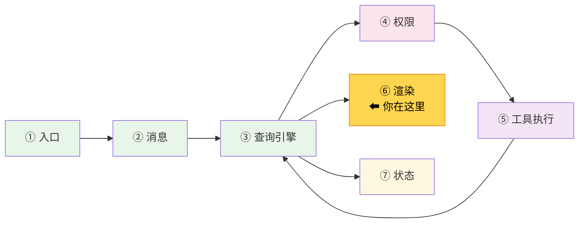
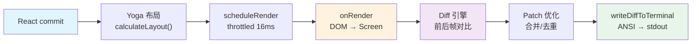

# 第 10 章：第 7 站——渲染输出

> 源码验证日期：2026-05-15，基于 commit `0d81bb6`


---

## 路线图



前九章追踪了用户输入从捕获到工具执行的完整过程。最后一站：**流式事件如何变成终端上的字符**。Claude Code 用的是一套自定义 Ink 框架——React 组件渲染到终端，Yoga 布局引擎计算位置，双层帧缓冲差异更新。

---

## 知识补全：React Reconciler 基础

如果你已经理解 React Reconciler 的工作原理，跳过本节。

React 的核心是一个 **Reconciler（协调器）**——它负责比较新旧虚拟 DOM 树，计算出最小变更集，然后提交给宿主环境。

```typescript
// React DOM：宿主环境是浏览器 DOM
// React Native：宿主环境是原生组件
// Ink（Claude Code fork）：宿主环境是终端屏幕

// Reconciler 的工作流程：
// 1. render阶段：比较新旧 Fiber 树，标记需要更新的节点
// 2. commit阶段：把变更应用到真实宿主（DOM/原生/终端）

// 关键接口：
createInstance(type, props)     // 创建宿主节点
appendChildInstance(parent, child) // 挂载子节点
commitUpdate(instance, props)  // 更新节点属性
removeChildInstance(parent, child) // 移除子节点
```

Claude Code 的 Ink 用 `react-reconciler` 创建了自定义 Reconciler，把 React 组件渲染到终端的虚拟 DOM 树上——每个节点有 Yoga 布局属性、文本内容、ANSI 样式。

---

## 源码入口

本章追踪的调用链：

```
REPL.tsx 的 for await (event of query(...)) 循环
  → src/utils/messages.ts          (handleMessageFromStream — 事件分发)
    → React setState               (streamingText / messages / streamingToolUses)
      → React Reconciler           (重新渲染组件树)
        → src/ink/reconciler.ts    (自定义 host config)
          → src/ink/ink.tsx         (Ink 核心类 — 帧渲染循环)
            → src/ink/renderer.ts   (DOM 树 → 屏幕缓冲)
              → src/ink/log-update.ts (差异引擎)
                → src/ink/terminal.ts  (ANSI 写入 stdout)
```

---

## 逐行阅读

### 10.1 渲染启动：createRoot 和 renderSync

Claude Code 用自定义的 Ink fork（不是 npm 的 `ink` 包），入口在 `src/ink.ts`：

```typescript
// → src/ink.ts:18-31（简化版）
import { createRoot as inkCreateRoot } from './ink/root'
import { createElement } from 'react'
import { ThemeProvider } from './components/design-system/ThemeProvider'

function withTheme(node) {
  return createElement(ThemeProvider, null, node)
}

export const createRoot = (options) => {
  const root = inkCreateRoot(options)
  return {
    render(node) { root.render(withTheme(node)) },
    unmount() { root.unmount() },
  }
}
```

所有根节点被 `<ThemeProvider>` 包裹，确保主题在任何层级都能访问。

```typescript
// → src/ink/root.ts:76-123（简化版）
export const renderSync = (node, options) => {
  const instance = new Ink(options)
  instance.render(node)
  return instance
}

export const createRoot = (options) => {
  const instance = new Ink(options)
  // ...
  return {
    render(node) { instance.render(node) },
    unmount() { /* ... */ },
  }
}
```

实际的 REPL 启动在 `replLauncher.tsx`：

```typescript
// → src/replLauncher.tsx:12-22（简化版）
const { App, REPL } = await import('./screens/REPL')
const { renderAndRun } = await import('./utils/renderAndRun')

renderAndRun(
  <App {...appProps}>
    <REPL {...replProps} />
  </App>
)
```

### 10.2 组件树：从根到消息

完整的组件层级：

```
<ThemeProvider>              // src/ink.ts: withTheme()
  <App>                      // src/components/App.tsx
    <AppStateProvider>       // 应用状态上下文
      <StatsProvider>        // 统计上下文
        <FpsMetricsProvider> // FPS 度量
          <REPL>             // src/screens/REPL.tsx
            <Messages>       // src/components/Messages.tsx
              <VirtualMessageList> // src/components/VirtualMessageList.tsx
                <MessageRow> // src/components/MessageRow.tsx
                  <Message>  // src/components/Message.tsx
                    (按消息类型分发)
```

`<App>` 组件包裹三个上下文提供者，使用 React Compiler 的 memo 缓存。`<VirtualMessageList>` 只渲染视口内的消息——长对话可能有 2800+ 条消息，不可能全部渲染。

### 10.3 流式事件到 React 状态

REPL.tsx 的核心数据流：

```typescript
// → src/screens/REPL.tsx:2793-2803（简化版）
for await (const event of query({messages, systemPrompt, ...})) {
  onQueryEvent(event)
}
```

`handleMessageFromStream` 把 SSE 事件分发到 React 状态：

```typescript
// → src/utils/messages.ts:2930-3095（简化版）
export function handleMessageFromStream(event, {
  onSetStreamMode,
  onStreamingText,
  onStreamingToolUses,
  onMessage,
  // ...
}) {
  switch (event.type) {
    case 'content_block_start':
      if (event.content_block.type === 'text') {
        onSetStreamMode('responding')
      }
      break

    case 'content_block_delta':
      if (event.delta.type === 'text_delta') {
        // 追加文字——逐字流式更新
        onStreamingText(text => (text ?? '') + event.delta.text)
      }
      if (event.delta.type === 'input_json_delta') {
        // 工具输入流式更新
        onStreamingToolUses(/* ... */)
      }
      break

    case 'message_stop':
      // 清除流式状态
      break

    default:
      // 完整消息
      if (event.type === 'assistant') {
        onMessage(event)
      }
  }
}
```

**关键设计**：`onStreamingText` 用函数式更新 `text => (text ?? '') + delta`，每个文字 delta 追加到已有文本末尾。

REPL 的流式状态：

```typescript
// → src/screens/REPL.tsx:849-850（简化版）
const [streamingText, setStreamingText] = useState<string | null>(null)
const [streamingToolUses, setStreamingToolUses] = useState<StreamingToolUse[]>([])
const [streamingThinking, setStreamingThinking] = useState<StreamingThinking | null>(null)
```

有趣的细节——`visibleStreamingText` 按行截断：

```typescript
// → src/screens/REPL.tsx:1473（简化版）
const visibleStreamingText = streamingText
  ? streamingText.substring(0, streamingText.lastIndexOf('\n') + 1) || null
  : null
```

只有到换行符为止的内容才显示。这避免了最后一行的部分渲染闪烁。

### 10.4 Message 分发：按消息类型渲染

```typescript
// → src/components/Message.tsx:58-354（简化版）
function MessageImpl({ message }) {
  switch (message.type) {
    case 'assistant':
      // 遍历 content blocks，按类型分发
      return message.message.content.map(block => {
        switch (block.type) {
          case 'text': return <AssistantTextMessage block={block} />
          case 'tool_use': return <AssistantToolUseMessage block={block} />
          case 'thinking': return <ThinkingBlock block={block} />
        }
      })

    case 'user':
      return <UserMessage message={message} />

    case 'system':
      return message.subtype === 'compact_boundary'
        ? <CompactBoundaryMessage />
        : <SystemTextMessage text={message.text} />

    case 'attachment':
      return <AttachmentMessage message={message} />

    case 'grouped_tool_use':
      return <GroupedToolUseContent message={message} />
  }
}
```

### 10.5 Ink 核心渲染循环

`Ink` 类是渲染引擎的心脏。它管理 React Reconciler、Yoga 布局和帧缓冲：

```typescript
// → src/ink/ink.tsx（简化版核心流程）
class Ink {
  render(node: ReactNode): void {
    this.currentNode = node
    const tree = <App ...>{node}</App>
    reconciler.updateContainerSync(tree, this.container, null, noop)
    reconciler.flushSyncWork()
  }

  // React commit 后触发
  resetAfterCommit() {
    this.rootNode.onComputeLayout()  // Yoga 布局计算
    this.scheduleRender()             // 调度帧渲染
  }
}
```

**帧渲染管线**（throttled 到 ~60fps）：



**节流机制**：

```typescript
// → src/ink/ink.tsx:212-216（简化版）
const FRAME_INTERVAL_MS = 16  // ~60fps

const deferredRender = (): void => queueMicrotask(this.onRender)
this.scheduleRender = throttle(deferRender, FRAME_INTERVAL_MS, {
  leading: true,
  trailing: true,
})
```

多个快速 `setState` 在一个帧间隔（16ms）内到达时，只触发一次渲染——文字 delta 被批量合并。

### 10.6 双层帧缓冲和差异引擎

```typescript
// → src/ink/ink.tsx:586-595（简化版）
onRender() {
  // 1. 渲染 DOM 树到 Screen 缓冲
  const frame = this.renderer({
    frontFrame: this.frontFrame,
    backFrame: this.backFrame,
    isTTY, terminalWidth, terminalRows,
  })

  // 2. 交换前后帧
  this.backFrame = this.frontFrame
  this.frontFrame = frame

  // 3. 差异对比
  const diff = this.log.render(prevFrame, frame)

  // 4. 优化补丁
  const optimized = optimize(diff)

  // 5. 写入终端
  writeDiffToTerminal(this.terminal, optimized)
}
```

**差异引擎**（`src/ink/log-update.ts`）对比新旧 Screen 缓冲，生成 `Patch[]`。

**Screen 缓冲**（`src/ink/screen.ts`）是一个 2D 单元格网格，用三个池化结构节省内存：
- `CharPool`：字符池化（ASCII 快速路径用 `Int32Array`）
- `StylePool`：ANSI 样式池化
- `HyperlinkPool`：OSC 8 超链接池化

### 10.7 Blit 优化：不变子树的快速复制

```typescript
// → src/ink/render-node-to-output.ts（简化版）
function renderNodeToOutput(node, output, options) {
  // 检查子树是否变化
  if (canBlit(node, options.prevScreen, nodeCache)) {
    // 直接从上一帧的屏幕缓冲复制单元格
    output.blit(prevScreen, rect)
    return  // 跳过整棵子树的重新渲染
  }

  // 有变化——正常渲染
  for (const child of node.childNodes) {
    renderNodeToOutput(child, output, options)
  }
}
```

这是关键性能优化——如果一棵子树没有变化（比如已滚出视口的历史消息），直接从上一帧的屏幕缓冲复制单元格，而不是重新遍历渲染。

### 10.8 OffscreenFreeze：滚动优化

```typescript
// → src/components/OffscreenFreeze.tsx
// 当消息滚出视口时，冻结其渲染
// 防止计时器驱动的组件（spinner、时钟）触发不必要的终端更新
```

`VirtualMessageList` 只渲染视口内的消息。滚出视口的消息被 `OffscreenFreeze` 包裹——它缓存最后一次可见时的子元素，不可见时返回相同引用。这防止了 spinner 动画等在不可见时仍然触发帧渲染。

### 10.9 Markdown 渲染

```typescript
// → src/components/Markdown.tsx:78-100（简化版）
function Markdown({ content }) {
  // 混合渲染策略：
  // - 表格：React 组件 + Flexbox 布局
  // - 其他内容：ANSI 字符串 via formatToken
  const tokens = marked.lexer(content)  // 500 条 LRU 缓存
  return tokens.map(token => renderToken(token))
}
```

Markdown 渲染用 `marked.lexer()` 解析，结果被 LRU 缓存（按内容哈希，最多 500 条）。

### 10.10 完整管线回顾

从 API 流式事件到终端像素的完整路径：

```
API SSE 事件到达
  → handleMessageFromStream()
    → setStreamingText(delta)        // React 状态更新
    → setMessages(append)            // 完整消息追加
  → React Reconciler
    → updateContainerSync()          // 同步协调
    → flushSyncWork()                // 刷新
  → resetAfterCommit()
    → Yoga calculateLayout()         // Flexbox 布局
    → scheduleRender()               // throttled 16ms
  → queueMicrotask → onRender()
    → renderer()                     // DOM → Screen 缓冲
    → log.render(prev, next)         // 差异对比 → Patch[]
    → optimize(patches)              // 合并/去重
    → writeDiffToTerminal()          // ANSI 转义序列 → stdout
```

---

## 调试实践

### 断点位置

| 位置 | 看什么 |
|------|--------|
| `ink.tsx` 的 `render()` 方法 | `render()` 入口——看 React 树如何挂载 |
| `ink.tsx` 的 `onRender()` 方法 | `onRender()`——看帧渲染管线 |
| `ink.tsx` 的帧交换逻辑 | 帧交换和差异对比 |
| `reconciler.ts` 的 `resetAfterCommit()` | `resetAfterCommit`——看布局触发 |
| `render-node-to-output.ts` | `renderNodeToOutput`——看 DOM→Screen |
| `REPL.tsx` 的 `for await` 循环 | `for await` 循环——看事件消费 |
| `messages.ts` 的 `handleMessageFromStream()` 函数 | `handleMessageFromStream`——看事件分发 |
| `Message.tsx` 的 `MessageImpl()` 组件 | `MessageImpl`——看消息类型分发 |

### 日志方法

```typescript
// 在 onRender() 中，帧交换之后
console.log('[DEBUG] Frame rendered, diff patches:', optimized.length)

// 在 handleMessageFromStream 中
console.log('[DEBUG] Stream event:', event.type, event.delta?.type ?? '')
```

---

## 试一试

### 修改 1：观察帧渲染频率

在 `src/ink/ink.tsx` 的 `onRender` 方法开头加：

```typescript
console.log('[DEBUG] onRender at:', Date.now(), 'terminal size:', this.terminalColumns + 'x' + this.terminalRows)
```

观察正常对话时的帧渲染频率——你应该看到大约每 16ms 一帧。

### 修改 2：追踪消息渲染

在 `src/components/Message.tsx` 的 `MessageImpl` 开头加：

```typescript
console.log('[DEBUG] Message type:', message.type, 'subtype:', message.subtype ?? 'none')
```

发送一条消息，观察渲染了哪些类型的消息组件。

### 修改 3：观察 VirtualMessageList 行为

在 `src/components/VirtualMessageList.tsx` 中找到虚拟滚动逻辑，加：

```typescript
console.log('[DEBUG] Visible messages:', visibleStart, '-', visibleEnd, 'of', total)
```

长对话时观察只有可见范围的消息被渲染。

---

## 检查点

你现在已经理解了：

- **Ink 框架**：自定义 fork，不是 npm `ink` 包——用 `react-reconciler` 把 React 组件渲染到终端
- **组件树**：`ThemeProvider → App → AppStateProvider → StatsProvider → FpsMetricsProvider → REPL → Messages → VirtualMessageList → MessageRow → Message`
- **流式更新**：`handleMessageFromStream` 把 SSE 事件分发到 `setStreamingText` / `setMessages` 等 React 状态
- **帧渲染管线**：React commit → Yoga 布局 → throttled onRender → Screen 缓冲 → Diff 引擎 → Patch 优化 → ANSI 写入
- **双层帧缓冲**：前后帧交换，差异引擎只对比变化部分
- **性能优化**：Blit（不变子树直接复制）、OffscreenFreeze（视口外冻结）、VirtualMessageList（只渲染可见消息）
- **Markdown 渲染**：`marked.lexer()` + LRU 缓存 + 混合策略（表格用 React，其他用 ANSI）

**下一站预告**：第 11 章将追踪权限与安全——6 种权限模式、分层规则引擎、Bash 安全分析管线。
