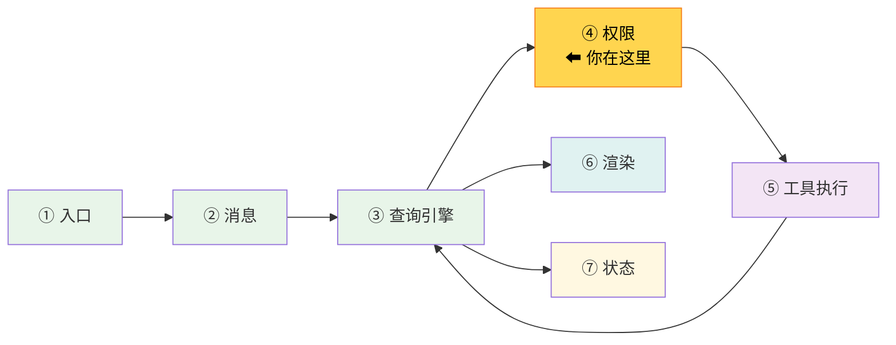
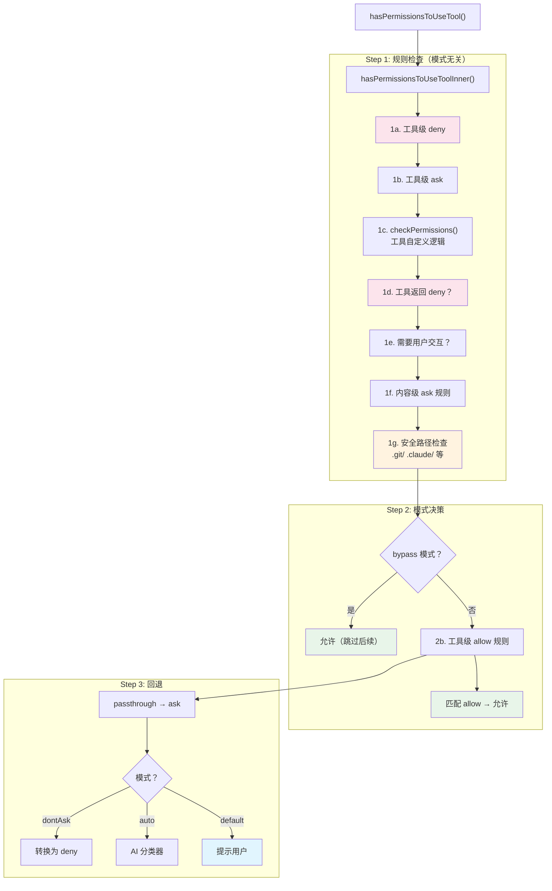
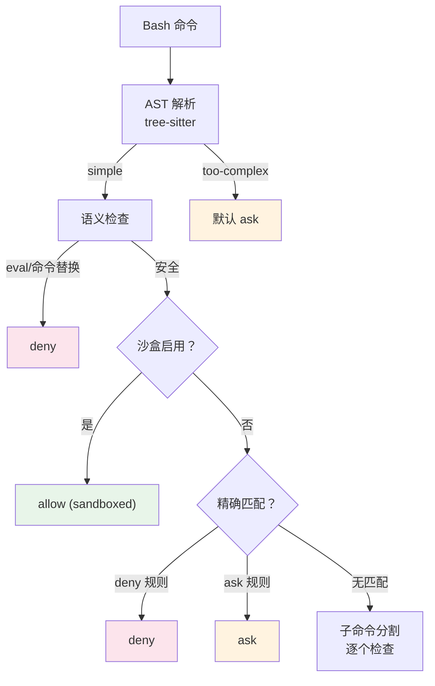

# 第 11 章：第 8 站——权限与安全

> 源码验证日期：2026-05-15，基于 commit `0d81bb6`


---

## 路线图



上一站追踪了渲染管线。现在回到查询引擎的执行流程中，深入一个关键的中间层：**权限系统**。第 8 章看到了 `checkPermissionsAndCallTool` 中的权限检查调用——本章拆开它的内部逻辑。

本章聚焦最常见的 3 种权限模式（default、bypassPermissions、auto）。全部 7 种权限模式的详解在卷二第 16 章。

---

## 源码入口

本章追踪的调用链：

```
toolExecution.ts 的 checkPermissionsAndCallTool()
  → src/utils/permissions/permissions.ts     (hasPermissionsToUseTool — 主入口)
    → src/utils/permissions/permissions.ts   (hasPermissionsToUseToolInner — 分层检查)
      → src/tools/BashTool/bashPermissions.ts (bashToolHasPermission — Bash 专用)
        → src/tools/BashTool/readOnlyValidation.ts (只读命令检测)
      → src/utils/permissions/permissionSetup.ts (模式初始化和切换)
        → src/utils/permissions/classifierDecision.ts (auto 模式分类器)
```

---

## 逐行阅读

### 11.1 权限模式：三种最常见模式

Claude Code 有 6 种内部权限模式。最常见的 3 种：

| 模式 | 行为 | 对用户意味着什么 |
|------|------|----------------|
| `default` | 未被规则覆盖的每个工具调用都需要用户确认 | 最安全，每一步都能审查 |
| `bypassPermissions` | 跳过所有权限检查（除安全关键检查） | `--dangerously-skip-permissions` 标志 |
| `auto` | AI 分类器自动决定允许/拒绝 | 无需手动确认，Opus 模型做判断 |

```typescript
// → src/types/permissions.ts:16-38（简化版）
type PermissionMode =
  | 'default'        // 默认：逐个提示
  | 'plan'           // 计划模式：只读
  | 'acceptEdits'    // 自动接受文件编辑
  | 'bypassPermissions' // 跳过权限检查
  | 'dontAsk'        // 静默拒绝
  | 'auto'           // AI 分类器（Ant 内部）
```

模式初始化优先级：

```typescript
// → src/utils/permissions/permissionSetup.ts:689（简化版）
function initialPermissionModeFromCLI(): PermissionMode {
  // 优先级从高到低：
  // 1. --dangerously-skip-permissions 标志
  // 2. --permission-mode CLI 参数
  // 3. settings.permissions.defaultMode 配置
  // Statsig 功能开关可以禁用 bypassPermissions 模式
}
```

### 11.2 分层权限检查管线

`hasPermissionsToUseTool()` 是权限检查的主入口，内部委托给 `hasPermissionsToUseToolInner()`：



```typescript
// → src/utils/permissions/permissions.ts:1158（简化版）
function hasPermissionsToUseToolInner(tool, input, context) {
  // Step 1: 规则检查（所有模式通用）

  // 1a. 工具级 deny：整个工具被禁用
  const denyRule = getDenyRuleForTool(tool.name, context)
  if (denyRule) return { behavior: 'deny', reason: 'rule' }

  // 1b. 工具级 ask：需要提示
  const askRule = getAskRuleForTool(tool.name, context)
  if (askRule) return { behavior: 'ask', reason: 'rule' }

  // 1c. 工具自定义检查（如 BashTool 的命令分析）
  const toolResult = tool.checkPermissions(input, context)

  // 1d. 工具返回 deny
  if (toolResult.behavior === 'deny') return { behavior: 'deny', ... }

  // 1e. 需要用户交互的工具（如 AskUserQuestion）必须提示
  if (requiresUserInteraction(tool)) return { behavior: 'ask', ... }

  // 1f. 内容级 ask 规则（bypass 不可覆盖）
  // 1g. 安全路径检查（.git/, .claude/, shell 配置文件）

  // Step 2: 模式决策
  if (isBypassMode(context)) return { behavior: 'allow' }
  if (toolAlwaysAllowedRule(tool.name, context)) return { behavior: 'allow' }

  // Step 3: 回退到 ask
  return { behavior: 'ask' }
}
```

**核心原则：deny 始终覆盖 allow**。无论什么模式，Step 1 的 deny 规则都会生效。

### 11.3 Bash 安全分析管线

BashTool 有最复杂的权限系统——因为 shell 命令的攻击面最大。

```typescript
// → src/tools/BashTool/bashPermissions.ts:1663（简化版）
function bashToolHasPermission(command, context) {
  // 1. AST 安全解析（tree-sitter）
  const parseResult = parseCommandAST(command)
  // 结果：'simple' | 'too-complex' | 'parse-unavailable'

  if (parseResult === 'too-complex') {
    // AST 无法静态分析 → 检查精确匹配 deny，否则 ask
    return { behavior: 'ask' }
  }

  // 2. 语义检查：危险构造（eval、命令替换等）
  const semanticResult = checkSemantics(command)

  // 3. 沙盒自动允许（如果启用）
  if (isSandboxed && autoAllowBashIfSandboxed) {
    return { behavior: 'allow', sandboxed: true }
  }

  // 4. 精确匹配 deny/ask
  // 5. Bash 提示分类器（AI 风险评估）
  // 6. 命令操作符检查（|、>、&& 等——每段独立检查）
  // 7. 子命令分割和逐个检查

  return checkSubcommands(command, context)
}
```



### 11.4 只读命令检测

BashTool 用两种机制判断命令是否只读：

```typescript
// → src/tools/BashTool/readOnlyValidation.ts

// 机制 1：命令白名单（约 30 个命令，带 flag 验证）
// COMMAND_ALLOWLIST: git, grep, sed, sort, ps, fd, tree, date 等
// 每个命令定义 safeFlags，用 validateFlags() 逐 flag 检查

// 机制 2：正则表达式匹配（约 60 个命令）
// READONLY_COMMAND_REGEXES: cat, head, tail, wc, ls, find, diff, jq, echo 等
```

安全检查在只读判断之前：
- `containsUnquotedExpansion()`：拒绝未引用的 `$VAR` 和 glob 字符
- 检测命令替换、重定向等危险模式
- Windows UNC 路径阻止、git bare-repo 检测

### 11.5 规则来源和优先级

```typescript
// → src/types/permissions.ts:54-63
type PermissionRuleSource =
  | 'policySettings'     // 企业管理，不可覆盖
  | 'flagSettings'       // 功能标志覆盖
  | 'userSettings'       // ~/.claude/settings.json（全局）
  | 'projectSettings'    // .claude/settings.json（项目级）
  | 'localSettings'      // .claude/settings.local.json（gitignored）
  | 'cliArg'             // --allowedTools / --disallowedTools
  | 'command'            // 程序化规则
  | 'session'            // 当前会话内存中
```

优先级：`policySettings` 最高，企业管理员设置不可被用户覆盖。当 `allowManagedPermissionRulesOnly` 启用时，只有 policy 规则生效。

### 11.6 Auto 模式：AI 分类器

auto 模式用 AI 分类器自动决定允许/拒绝：

```typescript
// → src/utils/permissions/permissions.ts:522（简化版）
if (mode === 'auto' && decision.behavior === 'ask') {
  // 快速路径 1：acceptEdits 兼容
  if (wouldBeAllowedInAcceptEdits(tool, input)) {
    return { behavior: 'allow' }
  }

  // 快速路径 2：安全工具白名单
  if (SAFE_YOLO_ALLOWLISTED_TOOLS.includes(tool.name)) {
    return { behavior: 'allow' }
  }

  // 完整分类器：调用 Opus 模型评估
  const classification = await classifyYoloAction(tool, input, context)
  return classification.decision
}
```

安全工具白名单包括：Read、Grep、Glob、LSP、ToolSearch、ListMcpResources、ReadMcpResource、TodoWrite、TaskCreate/Get/Update/List/Stop/Output、AskUserQuestion、EnterPlanMode、ExitPlanMode 等。

### 11.7 权限建议：用户点击"始终允许"后发生什么

当用户在权限提示中点击"始终允许"：

```typescript
// → src/utils/permissions/PermissionUpdate.ts:349（简化版）
function persistPermissionUpdates(updates) {
  // 根据工具类型生成规则：
  // Bash: Bash(npm install) → 精确匹配
  //        Bash(npm install:*) → 前缀匹配
  // Read: Read(//path/**) → 路径模式
  // 写入对应的 settings 文件
  addPermissionRulesToSettings(updates)
}
```

### 11.8 权限永不跨会话恢复

**关键安全事实**：权限信任在每次会话中重新建立。`resume` 恢复对话时，所有 session 级别的权限规则不会恢复——用户需要重新确认工具调用。这是有意为之的设计：防止权限泄漏。

---

## 调试实践

### 断点位置

| 位置 | 看什么 |
|------|--------|
| `permissions.ts:473` | `hasPermissionsToUseTool`——主入口 |
| `permissions.ts:1158` | `hasPermissionsToUseToolInner`——分层检查 |
| `bashPermissions.ts:1663` | `bashToolHasPermission`——Bash 权限入口 |
| `readOnlyValidation.ts:128` | `COMMAND_ALLOWLIST`——只读命令白名单 |
| `permissionSetup.ts:689` | `initialPermissionModeFromCLI`——模式初始化 |
| `classifierDecision.ts:56` | `SAFE_YOLO_ALLOWLISTED_TOOLS`——auto 模式白名单 |

### 日志方法

```typescript
// 在 hasPermissionsToUseToolInner 的 return 之前
console.log('[DEBUG] Permission:', tool.name, '→', result.behavior, 'reason:', result.reason)

// 在 bashToolHasPermission 的关键节点
console.log('[DEBUG] Bash parse:', parseResult, 'command:', command.substring(0, 50))
```

---

## 试一试

### 修改 1：观察权限决策

在 `src/utils/permissions/permissions.ts` 的 `hasPermissionsToUseTool` 函数中加：

```typescript
console.log('[DEBUG] Permission check:', tool.name, 'mode:', context.mode)
```

观察每个工具调用时走了哪条路径。

### 修改 2：测试 Bash 只读检测

在 `src/tools/BashTool/readOnlyValidation.ts` 中找到只读判断函数，加：

```typescript
console.log('[DEBUG] Bash readOnly:', isReadOnly, 'command:', input.command?.substring(0, 80))
```

发送各种命令（`ls`、`rm`、`git status`、`npm install`）观察判断结果。

### 修改 3：观察规则匹配

在规则匹配函数中加日志，观察 deny/allow 规则如何匹配：

```typescript
console.log('[DEBUG] Rule match:', ruleSource, ruleBehavior, 'for:', toolName, ruleContent)
```

---

## 检查点

你现在已经理解了：

- **三种权限模式**：default（逐个提示）、bypassPermissions（跳过检查）、auto（AI 分类器）
- **分层检查管线**：Step 1 规则检查（模式无关）→ Step 2 模式决策 → Step 3 回退处理
- **核心原则**：deny 始终覆盖 allow，安全路径检查 bypass 不可覆盖
- **Bash 安全分析**：AST 解析 → 语义检查 → 沙盒检测 → 规则匹配 → 子命令分割
- **只读命令检测**：白名单 + 正则两种机制，约 90 个命令
- **规则来源**：8 种来源，policySettings 优先级最高
- **Auto 模式**：三级快速路径（acceptEdits 兼容 → 安全工具白名单 → 完整 AI 分类器）
- **跨会话安全**：权限永不跨会话恢复，每次 resume 重新建立信任

**下一站预告**：第 12 章将复盘整个旅程——完整调用链全景图、各站串联、卷一到卷二的过渡。
