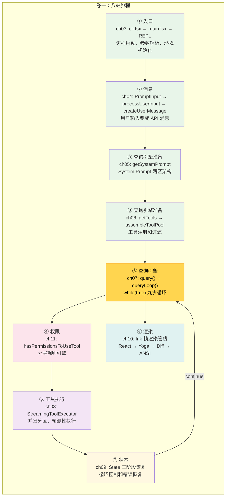

# 第 12 章：旅程复盘——从追踪到拆解

> 源码验证日期：2026-05-15，基于 commit `0d81bb6`

---

## 完整调用链全景图

从用户按下回车到终端显示回复，我们追踪了一条完整的路径。现在是时候把所有站点串联起来。



### 用一行伪代码串联

```typescript
// 完整的 Agentic Loop，一行版本
cli() → main() → REPL() → for await (event of query(userMessage)) → Ink.render(event)

// 展开的版本
main()
  → launchRepl()
    → Ink.render(<App><REPL /></App>)
      → REPL.onSubmit(userInput)
        → processUserInput(input)
          → createUserMessage(processed)
        → for await (event of query({ messages, systemPrompt, tools })) {
            // query() 内部：
            → queryLoop() // while(true)
              → 上下文管理（4 层压缩）
              → deps.callModel(messages, systemPrompt, tools) // API 调用
              → 流式事件处理
              → if (tool_use blocks) {
                  → StreamingToolExecutor.addTool()
                    → checkPermissionsAndCallTool()
                      → hasPermissionsToUseTool() // 权限检查
                      → tool.call()                // 执行工具
                    → toolResult
                  → state = { ...state, messages: [...messages, ...results] }
                  → continue // 回到 while(true)
                }
              → if (!needsFollowUp) {
                  → 三阶段错误恢复
                  → stop hooks 检查
                  → token budget 检查
                  → return { reason: 'completed' }
                }
            // 每个事件通过 yield 转发：
            yield event
              → handleMessageFromStream(event)
                → React setState
                  → Ink 帧渲染管线
                    → Yoga 布局
                    → Screen 缓冲
                    → Diff 引擎
                    → ANSI → stdout
          }
```

### 各站关键文件速查

| 站 | 章节 | 核心文件 | 关键函数/类型 |
|----|------|---------|-------------|
| ① 入口 | ch03 | `entrypoints/cli.tsx`, `main.tsx` | `cli()`, `main()` |
| ② 消息 | ch04 | `processUserInput.ts`, `messages.ts` | `processUserInput()`, `createUserMessage()` |
| ③ 查询引擎 | ch05-07 | `prompts.ts`, `tools.ts`, `query.ts` | `getSystemPrompt()`, `getTools()`, `query()`, `queryLoop()` |
| ④ 权限 | ch11 | `permissions.ts`, `bashPermissions.ts` | `hasPermissionsToUseTool()` |
| ⑤ 工具执行 | ch08 | `StreamingToolExecutor.ts`, `toolExecution.ts` | `addTool()`, `checkPermissionsAndCallTool()` |
| ⑥ 渲染 | ch10 | `ink.tsx`, `Message.tsx`, `messages.ts` | `onRender()`, `handleMessageFromStream()` |
| ⑦ 状态 | ch09 | `query.ts`, `AppStateStore.ts` | `State`, 三阶段恢复 |

---

## 核心设计模式回顾

旅程中我们遇到了几个反复出现的设计模式：

### 1. AsyncGenerator 流式传播

从 `query()` 到 `queryModelWithStreaming()` 到 `runToolUse()`，整条链都是 `async function*`，用 `yield` 和 `yield*` 逐事件传播。这让 UI 可以在收到每个事件时立即渲染。

### 2. 不可变状态更新

`State` 对象每轮用 `state = { ...state, ...updates }` 创建新对象。React 状态同理——`setMessages(prev => [...prev, newMessage])`。不可变更新让差异检测简单可靠。

### 3. 分层优先级

权限系统：deny > ask > allow，policySettings > userSettings > session。
工具注册：内置工具 > MCP 工具。
CLAUDE.md：Local > Project > User > Managed。

### 4. 缓存驱动设计

Prompt Cache 的前缀匹配约束了 system prompt 的架构（静态区在前，动态区在后）。工具列表排序保证缓存稳定。整个核心循环的设计都受缓存经济学影响。

### 5. 防御性默认值

`isReadOnly` 默认 `false`，`isConcurrencySafe` 默认 `false`，权限默认 `ask`——所有默认值都偏向安全端。

---

## 叙事转折

卷一我们像乘客一样坐在 Claude Code 的巴士上，看着窗外的风景一站站经过。你知道了每一站做什么——但还有两个层次的疑问没有回答：

**第一个层次：齿轮内部的设计。** 我们看到了 `StreamingToolExecutor` 的并发分区算法，但不知道为什么选择这种设计而不是其他方案。我们看到了 `checkPermissions` 的分层检查，但不理解所有 7 种权限模式的全貌。我们看到了 Ink 的帧渲染管线，但没有深入自定义 Reconciler 的实现。

**第二个层次：为什么要这样设计。** 为什么用 React 而不是直接写 ANSI？为什么是 `async function*` 而不是回调？为什么权限是分层规则引擎而不是简单布尔检查？为什么 CLAUDE.md 是文件而不是数据库？

卷二回答第一个层次。卷四回答第二个层次。

---

## 卷一 → 卷二映射表

卷二回到卷一经过的每一站，拆开看内部设计模式：

| 卷一站 | 卷一章 | 拆解什么 |
|--------|--------|---------|
| ① 入口 | ch13 模块系统 | `feature()` 编译时消除、多入口架构 |
| ②-③ 工具 | ch14 工具接口 | `Tool` 泛型类型、Strategy 模式、Zod 验证 |
| ⑥ 渲染 | ch15 Ink 与终端 UI | React Reconciler、Yoga 布局、自定义 reconciler |
| ④ 权限 | ch16 权限系统 | 全部 7 种权限模式、安全纵深防御 |
| ⑤ 工具（前后） | ch17 Hook 系统 | 27 个 Hook 事件、4 种执行类型 |
| ② 输入 | ch18 斜杠命令与插件 | 命令模式、插件 10 种组件类型 |
| ③ 查询引擎（MCP） | ch19 MCP 协议 | 适配器模式、Bridge 远程会话 |
| ⑦ 状态 | ch20 状态管理 | 单例模式、不可变更新、Bootstrap 到 AppState |

**阅读建议**：卷二各章独立可跳读。难度不按章节顺序递增——不同模块的技术复杂度不同。按你在卷一中对哪一站最感兴趣来选择阅读顺序。

---

## 推荐重读路线

第一遍通读建立了整体印象，第二遍可以按兴趣选择重点路线：

| 兴趣方向 | 推荐路线 | 为什么 |
|----------|---------|--------|
| 工具系统 | ch06 → ch08 → ch07 | 先理解工具注册，再看执行，最后理解循环中的工具调度 |
| 安全架构 | ch11 → ch08 → ch09 | 权限是核心防线，工具执行是应用点，状态管理是兜底策略 |
| 性能优化 | ch03 → ch07 → ch10 | 启动并行化、流式响应、帧渲染管线——三个最明显的优化点 |
| 想做贡献 | ch03 → ch04 → ch07 → ch08 → ch12 | 按数据流顺序精读核心路径，理解完整生命周期 |
| AI 工程模式 | ch07 → ch09 → ch05 | Agentic Loop、上下文管理、Prompt 工程——通用的 AI Agent 设计模式 |

---

## 卷一自测题

不看书回答以下问题，检验你是否真正理解了各站的核心概念：

### 基础理解（每题对应一站）

1. **入口**：`cli.tsx` 的 `main()` 函数为什么用 `await import(...)` 而不是静态 import？
2. **消息**：画出 `processUserInput → processTextPrompt → createUserMessage` 的调用链，标出每步的输入和输出类型
3. **System Prompt**：为什么静态区在前、动态区在后？如果反过来会怎样？
4. **工具注册**：`buildTool()` 工厂函数为哪些字段提供了默认值？为什么 `isReadOnly` 默认是 `false`？
5. **API 调用**：用伪代码写出 `queryLoop` 的骨架（提示：while(true) 里有 9 步）
6. **工具执行**：StreamingToolExecutor 的并发分区算法如何判断两个工具能否并行执行？
7. **循环状态**：三阶段错误恢复的成本分别是什么？为什么 `hasAttemptedReactiveCompact` 只允许尝试一次？
8. **渲染**：Ink 的双层帧缓冲解决了什么问题？如果没有 Diff 引擎会怎样？
9. **权限**：画出 `hasPermissionsToUseToolInner` 的 Step 1 → Step 2 → Step 3 流程图

### 综合思考（跨站）

10. 如果要给 Claude Code 添加一个新工具，最少需要修改哪几个文件？
11. Prompt Cache 的前缀匹配约束如何影响了 system prompt 的架构设计？
12. `yield*` 在 `query() → queryLoop() → queryModelWithStreaming()` 三层传播中的作用是什么？如果改成普通 `return` 会怎样？

---

**下一步**：卷二第 13 章，从模块系统开始——拆开编译时消除、多入口架构，看看 Claude Code 的构建系统如何工作。
