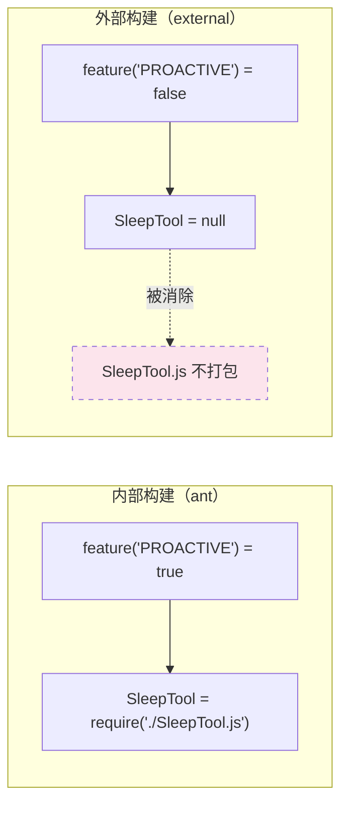

# 第 13 章：模块系统——入口与编译时消除

> 源码验证日期：2026-05-15，基于 commit `0d81bb6`

---

## 知识补全：JavaScript 模块系统

如果你已经理解 ES modules（`import/export`）、CommonJS（`require/module.exports`）和 tree-shaking，跳过本节。

```javascript
// ES modules：静态导入，打包器可以分析哪些没被使用
import { readFileSync } from 'fs'        // 具名导入
export function myFunction() { }          // 具名导出

// CommonJS：动态导入，打包器难以静态分析
const fs = require('fs')                  // 运行时求值
module.exports = { myFunction }

// Tree-shaking（死代码消除）：
// 打包器分析 import/export 依赖图，移除未被引用的代码
// 前提：必须是静态的 ES module 语法，不能用动态 require()
```

Claude Code 用 Bun 打包。Bun 的 `feature()` 机制在打包时求值，把 `false` 分支的代码完全消除——比运行时 `if` 判断更彻底：被消除的代码从二进制层面不存在。

---

## 源码入口

```
src/entrypoints/cli.tsx          — CLI 入口路由
src/entrypoints/init.ts          — 应用初始化
src/entrypoints/mcp.ts           — MCP Server 入口
src/entrypoints/agentSdkTypes.ts — SDK 类型入口
src/main.tsx                     — 完整 CLI 应用（~4600 行）
src/replLauncher.tsx             — REPL 启动
```

---

## 逐行阅读

### 13.1 入口路由：cli.tsx

`cli.tsx` 是 `claude` 命令的入口（package.json 声明 `"bin": { "claude": "cli.js" }`）：

```typescript
// → src/entrypoints/cli.tsx（简化版）
import { feature } from 'bun:bundle'  // 编译时 feature flags

const args = process.argv

// 特殊标志路由
if (args.includes('--mcp-server')) {
  require('./mcp.js')      // MCP Server 模式
  return
}

if (feature('DAEMON') && args.includes('--daemon-worker')) {
  require('./daemon-worker.js')  // 守护进程工作器
  return
}

if (feature('BRIDGE_MODE') && args.includes('remote-control')) {
  require('./bridge.js')   // Bridge 远程控制
  return
}

// 默认：启动完整 CLI
require('../main.js')
```

`feature()` 是 Bun 打包时注入的编译时函数。如果某个 flag 在构建目标中未启用，整个 `if` 块会被消除——不是运行时跳过，而是**从输出中根本不存在**。

### 13.2 feature()：编译时死代码消除

```typescript
// → src/tools.ts:26-28
const SleepTool =
  feature('PROACTIVE') || feature('KAIROS')
    ? require('./tools/SleepTool/SleepTool.js').SleepTool
    : null
```

在外部构建中，`feature('PROACTIVE')` 和 `feature('KAIROS')` 在编译时求值为 `false`。Bun 的 DCE 把整个三元表达式简化为 `null`——`SleepTool.js` 的 `require()` 和其所有依赖都不会被打包。



### 13.3 DCE 复杂度预算

Bun 的 `feature()` 求值器有**每函数复杂度限制**。源码中有明确注释：

```typescript
// → src/tools/BashTool/bashPermissions.ts:81-87
// DCE cliff: Bun's feature() evaluator has a per-function complexity budget.
// bashToolHasPermission is right at the limit. `import { X as Y }` aliases
// inside the import block count toward this budget; when they push it over
// the threshold Bun can no longer prove feature('BASH_CLASSIFIER') is a
// constant and silently evaluates the ternaries to `false`, dropping every
// pendingClassifierCheck spread.
```

**教训**：如果函数内的 `feature()` 用法太复杂，Bun 可能无法在编译时确定结果，静默地把三元表达式求值为 `false`——功能消失了但开发者不一定注意到。

### 13.4 USER_TYPE：内部 vs 外部构建

`process.env.USER_TYPE === 'ant'` 是另一个编译时常量：

```typescript
// → src/tools.ts:17-18
const REPLTool =
  process.env.USER_TYPE === 'ant'
    ? require('./tools/REPLTool/REPLTool.js').REPLTool
    : null

// → src/tools.ts:214
...(process.env.USER_TYPE === 'ant' ? [ConfigTool] : []),
```

Bun 在编译时通过 `--define` 替换 `process.env.USER_TYPE`：
- **ant（内部）构建**：替换为 `'ant'` → 表达式为 `true`
- **external（外部）构建**：替换为 `'external'` → 表达式为 `false`

这个模式在 165 个文件中出现了 357 处——内部和外部构建的功能差异远超表面所见。

### 13.5 "external" === 'ant'：字面量替换

一种变体是用字符串字面量作为编译时常量：

```typescript
// → src/main.tsx:3816
if ("external" === 'ant') {
  program.addOption(new Option('--delegate-permissions', '[ANT-ONLY] ...'))
}
```

Bun 在编译时把 `"external"` 替换为构建目标对应的值。这个模式在 `main.tsx` 中出现了 20 多次，用于控制哪些 CLI 选项对外可见。

### 13.6 excluded-strings.txt：防止信息泄漏

构建系统有一个安全扫描步骤——检查输出 bundle 是否包含不应泄漏的字符串：

```typescript
// → src/utils/model/antModels.ts:33
// Add the codename to scripts/excluded-strings.txt to prevent it from
// leaking to external builds.
```

```typescript
// → src/utils/model/model.ts:4
// scripts/excluded-strings.txt to avoid leaking them.
```

开发者用动态导入把敏感字符串隔离到 feature-gated 文件中，构建扫描确保这些字符串不出现在外部 bundle。

### 13.7 MACRO：版本和元数据注入

```typescript
// → 全局定义，无需 import
MACRO.VERSION              // 包版本号（如 "2.1.88"）
MACRO.VERSION_CHANGELOG    // 更新日志内容
MACRO.ISSUES_EXPLAINER     // 反馈 URL
```

这些在编译时被替换为字符串字面量。

### 13.8 多入口构建目标

| 构建目标 | 入口文件 | 特点 |
|---------|---------|------|
| CLI（外部） | `cli.tsx` | `USER_TYPE='external'`，大部分 feature flags 关闭 |
| CLI（ant） | `cli.tsx` | `USER_TYPE='ant'`，所有 feature flags 开启 |
| MCP Server | `mcp.ts` | 独立 MCP 协议服务器 |
| Agent SDK | `agentSdkTypes.ts` | 类型导出 + 运行时 stub |
| Daemon Worker | `cli.tsx --daemon-worker` | 后台工作进程 |
| Bridge | `cli.tsx remote-control` | 远程控制模式 |

### 13.9 ANT-ONLY 导入排序约定

```typescript
// → src/commands.ts（文件头）
// biome-ignore-all assist/source/organizeImports: ANT-ONLY import markers must not be reordered
```

ant-only 的 `require()` 导入有固定位置——重新排序可能破坏 DCE。Biome 格式化器被配置为忽略这些文件的手动排序。

### 13.10 Feature Flags 清单

源码中使用的主要 feature flags（部分）：

| Flag | 用途 |
|------|------|
| `PROACTIVE` / `KAIROS` | 自主 Agent 模式、后台常驻 |
| `DAEMON` | 守护进程工作器 |
| `BRIDGE_MODE` | 远程控制/Bridge 协议 |
| `BG_SESSIONS` | 后台会话 |
| `COORDINATOR_MODE` | 多 Agent 协调 |
| `VOICE_MODE` | 语音模式 |
| `CONTEXT_COLLAPSE` | 上下文折叠 |
| `WEB_BROWSER_TOOL` | 浏览器工具 |
| `AGENT_TRIGGERS` | Cron/定时任务 |
| `FORK_SUBAGENT` | Fork 子代理 |
| `BUDDY` | 电子宠物系统 |
| `BASH_CLASSIFIER` | Bash AI 风险分类器 |

---

## 调试实践

| 位置 | 看什么 |
|------|--------|
| `entrypoints/cli.tsx` | 入口路由——所有构建模式的分发 |
| `tools.ts:26-28` | feature() 条件 require 模式 |
| `main.tsx:3816` | `"external" === 'ant'` 字面量替换 |
| `bashPermissions.ts:81-87` | DCE 复杂度预算注释 |

---

## 试一试

### 修改 1：观察 feature() 在编译时的效果

在 `src/tools.ts` 的 `getAllBaseTools()` 函数中加：

```typescript
console.log('[DEBUG] SleepTool:', SleepTool ? 'loaded' : 'null')
console.log('[DEBUG] ConfigTool:', process.env.USER_TYPE === 'ant' ? 'ant-only' : 'external')
```

观察当前构建中哪些 feature-gated 工具被加载。

### 修改 2：查看 feature flags 使用情况

```bash
grep -rn "feature('" src/ | head -20
grep -rn "USER_TYPE === 'ant'" src/ | wc -l
```

观察 feature() 和 USER_TYPE 的使用频率。

---

## 检查点

- **多入口架构**：`cli.tsx` 路由到不同入口，支持 CLI、MCP、SDK、Daemon 等模式
- **`feature()` 编译时 DCE**：Bun 打包时求值，未启用的功能从二进制中根本不存在
- **`USER_TYPE === 'ant'`**：构建时 `--define` 替换，区分内部/外部构建（165 文件 357 处）
- **`"external" === 'ant'`**：字符串字面量替换，控制 CLI 选项可见性
- **DCE 复杂度预算**：Bun 有每函数限制，复杂度过高会静默失败
- **`excluded-strings.txt`**：构建后扫描，防止敏感字符串泄漏到外部 bundle
- **`MACRO` 常量**：版本号、更新日志等编译时注入
- **ANT-ONLY 导入排序**：Biome 配置忽略，防止 DCE 破坏

**下一站**：第 14 章拆解 Tool 接口——统一的泛型类型、Strategy 模式、`buildTool` 工厂如何让 20+ 个工具共享同一接口。
