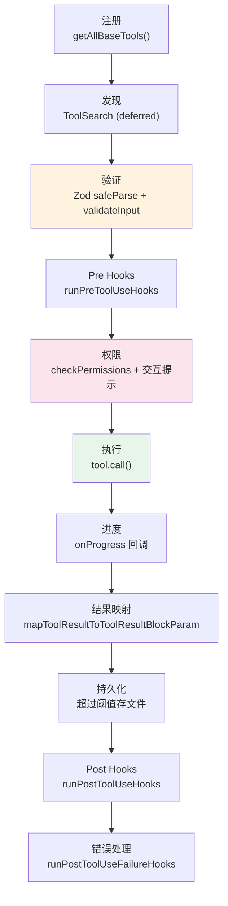

# 第 14 章：工具接口——统一的 Tool 类型

> 源码验证日期：2026-05-15，基于 commit `0d81bb6`

---

## 知识补全：TypeScript 泛型与接口

如果你已经理解 TypeScript 泛型约束和 `satisfies` 操作符，跳过本节。

```typescript
// 泛型约束：限制类型参数的范围
interface Repository<T extends { id: string }> {
  get(id: string): T
  save(item: T): void
}

// satisfies 操作符：检查类型但不 widen
const config = {
  port: 3000,
  host: 'localhost',
} satisfies Record<string, string | number>
// config.port 的类型是 3000（字面量），不是 number

// Omit + Partial：从类型中移除字段再标记为可选
type OptionalName = Omit<User, 'name'> & Partial<Pick<User, 'name'>>
// User 的 name 变成可选，其他字段保持必填
```

Claude Code 用泛型约束确保每个工具的 `call()` 输入类型和 `inputSchema` 的 Zod 类型一致，用 `satisfies` 在定义点检查而不丢失字面量类型信息。

---

## 源码入口

```
src/Tool.ts                   — Tool 泛型类型、ToolDef、buildTool 工厂
src/tools/GlobTool/GlobTool.ts    — 简单工具示例
src/tools/BashTool/BashTool.tsx   — 复杂工具示例
src/tools/MCPTool/MCPTool.ts      — MCP 工具骨架
src/services/mcp/client.ts        — MCP 工具运行时组装
src/services/tools/toolExecution.ts — 工具执行生命周期
```

---

## 逐行阅读

### 14.1 Tool 类型：三个泛型参数

```typescript
// → src/Tool.ts:362-695（简化版，展示设计结构）
export type Tool<
  Input extends AnyObject = AnyObject,      // Zod schema 推导的输入类型
  Output = unknown,                          // call() 的输出类型
  P extends ToolProgressData = ToolProgressData,  // 进度事件类型
> = {
  // === 身份 ===
  readonly name: string
  aliases?: string[]                // 别名（重命名后向后兼容）
  searchHint?: string               // ToolSearch 发现提示

  // === 核心方法 ===
  call(args, context, canUseTool, parentMessage, onProgress?): Promise<ToolResult<Output>>
  description(input, options): Promise<string>
  readonly inputSchema: Input       // Zod schema

  // === 行为标记 ===
  isReadOnly(input): boolean
  isConcurrencySafe(input): boolean
  isDestructive?(input): boolean
  isEnabled(): boolean

  // === 权限 ===
  checkPermissions(input, context): Promise<PermissionResult>

  // === 渲染 ===
  renderToolUseMessage(...)          // React 组件：工具调用 UI
  renderToolResultMessage?(...)      // React 组件：工具结果 UI
  renderToolUseErrorMessage?(...)    // React 组件：错误 UI

  // === 其他 ===
  maxResultSizeChars: number         // 结果持久化阈值
  strict?: boolean                   // 严格模式
  interruptBehavior?(): 'cancel' | 'block'
  // ... 约 50 个字段
}
```

三个泛型参数让 TypeScript 在编译时保证类型安全：

```typescript
// GlobTool 的 call() 输入自动推导为 GlobInputSchema
// BashTool 的 call() 输入自动推导为 BashInputSchema
// 类型不匹配时编译报错
```

### 14.2 ToolResult：工具输出类型

```typescript
// → src/Tool.ts:321-336
export type ToolResult<T> = {
  data: T           // 类型化的输出数据
  newMessages?: (UserMessage | AssistantMessage | ...)[]
                    // 工具可以向对话注入额外消息
  contextModifier?: (context: ToolUseContext) => ToolUseContext
                    // 修改后续工具的上下文（仅非并发安全工具可用）
  mcpMeta?: { _meta?: Record<string, unknown>; structuredContent?: ... }
                    // MCP 协议元数据透传
}
```

`newMessages` 是一个有趣的机制——工具可以不通过模型而在对话中注入消息。`contextModifier` 让工具修改同一轮后续工具的执行上下文。

### 14.3 ToolProgress：进度报告

```typescript
// → src/Tool.ts:307-319
export type ToolProgress<P extends ToolProgressData> = {
  toolUseID: string
  data: P              // 具体的进度类型
}

// 各工具定义自己的进度类型（判别联合）：
// BashProgress: { type: 'bash_progress', ... }
// MCPProgress:  { type: 'mcp_progress', ... }
// AgentToolProgress: { type: 'agent_progress', ... }
```

进度类型用判别联合（discriminated union on `type` 字段），UI 根据类型分发到不同的渲染器。

### 14.4 buildTool：策略工厂

`buildTool` 是创建工具的标准方式。它用 `ToolDef` 类型让 7 个字段变成可选，运行时用默认值填充：

```typescript
// → src/Tool.ts:707-715
type DefaultableToolKeys =
  | 'isEnabled'
  | 'isConcurrencySafe'
  | 'isReadOnly'
  | 'isDestructive'
  | 'checkPermissions'
  | 'toAutoClassifierInput'
  | 'userFacingName'

// → src/Tool.ts:721-726
// ToolDef = Tool 但那 7 个字段变成可选
type ToolDef<Input, Output, P> =
  Omit<Tool<Input, Output, P>, DefaultableToolKeys> &
  Partial<Pick<Tool<Input, Output, P>, DefaultableToolKeys>>
```

运行时工厂：

```typescript
// → src/Tool.ts:757-792
const TOOL_DEFAULTS = {
  isEnabled: () => true,                      // 默认启用
  isConcurrencySafe: (_input?) => false,      // 默认不安全
  isReadOnly: (_input?) => false,             // 默认写操作
  isDestructive: (_input?) => false,          // 默认非破坏性
  checkPermissions: (input, _ctx?) =>
    Promise.resolve({ behavior: 'allow', updatedInput: input }),
  toAutoClassifierInput: (_input?) => '',
  userFacingName: (_input?) => '',
}

export function buildTool<D extends AnyToolDef>(def: D): BuiltTool<D> {
  return {
    ...TOOL_DEFAULTS,              // 先铺默认值
    userFacingName: () => def.name,
    ...def,                        // 用具体实现覆盖
  } as BuiltTool<D>
}
```

**`BuiltTool<D>`** 是一个类型级条件类型——对于每个可选字段，检查 `D` 是否提供了它；如果提供了，用 `D` 的类型；否则用默认类型。这保证类型安全。

### 14.5 简单工具：GlobTool

GlobTool 展示了一个干净的工具实现：

```typescript
// → src/tools/GlobTool/GlobTool.ts:57-198（简化版）
const inputSchema = lazySchema(() => z.strictObject({
  pattern: z.string().describe('Glob pattern...'),
  path: z.string().optional().describe('Directory...'),
}))

type InputSchema = ReturnType<typeof inputSchema>
type Output = { files: string[]; truncated: boolean }

export const GlobTool = buildTool({
  name: 'Glob',
  maxResultSizeChars: Infinity,
  isConcurrencySafe: () => true,     // 只读，可以并行
  isReadOnly: () => true,
  async call(args) {
    const files = await glob(args.pattern, { cwd: args.path })
    return { data: { files, truncated: false } }
  },
  // ... 其他必要字段
} satisfies ToolDef<InputSchema, Output>)
```

注意 `satisfies ToolDef<InputSchema, Output>`——编译时检查所有必填字段是否存在，但不改变类型推导。

### 14.6 复杂工具：BashTool

BashTool 展示了工具接口的完整能力：

```typescript
// → src/tools/BashTool/BashTool.tsx:420-825（简化版）
export const BashTool = buildTool({
  name: 'Bash',
  searchHint: 'execute shell commands',
  maxResultSizeChars: 30_000,

  // 条件 schema：根据构建目标排除内部字段
  inputSchema: lazySchema(() =>
    fullInputSchema().omit({ _simulatedSedEdit: true })
  ),

  // isReadOnly 动态解析命令
  isReadOnly(input) {
    return checkReadOnlyConstraints(input).behavior === 'allow'
  },

  // isConcurrencySafe 复用 isReadOnly
  isConcurrencySafe(input) {
    return this.isReadOnly?.(input) ?? false
  },

  // call() 使用 async generator 产出进度
  async call(args, context, canUseTool, parentMessage, onProgress) {
    const result = await runShellCommand(args, context, {
      onProgress: (progress) => onProgress?.({ toolUseID, data: progress }),
    })
    return { data: result }
  },

  // 5 种不同的结果输出模式
  mapToolResultToToolResultBlockParam(result, ...) {
    if (result.image) return [{ type: 'image', ... }]
    if (persisted) return [{ type: 'text', text: `[Output saved to ${path}]` }]
    // ...
  },
})
```

### 14.7 MCP 工具：原型 + 克隆模式

MCPTool 使用原型模式——一个骨架对象在运行时被每个 MCP 服务器的具体实现覆盖：

```typescript
// → src/tools/MCPTool/MCPTool.ts:27-77（骨架）
// 使用 z.object({}).passthrough() 接受任意输入
// 所有方法都是 stub

// → src/services/mcp/client.ts:1766-1988（运行时组装）
return {
  ...MCPTool,                           // 从骨架开始
  name: fullyQualifiedName,             // 覆盖名称
  mcpInfo: { serverName, toolName },
  isMcp: true,
  isConcurrencySafe() {
    return tool.annotations?.readOnlyHint ?? false  // 从 MCP 协议获取
  },
  call(args, context) {
    // 完整的 MCP 协议调用，带重试和会话恢复
    const result = await client.callTool(toolName, args)
    return { data: result.content, mcpMeta: result._meta }
  },
  // ... 更多覆盖
}
```

为什么用骨架而不是直接创建？因为 MCPTool 需要一个共享的基础结构（`isMcp` 标志、默认的 `renderToolUseMessage` 等），具体服务器只覆盖自己需要的部分。

### 14.8 lazySchema：延迟 schema 构建

```typescript
// → src/utils/lazySchema.ts
export function lazySchema<T>(factory: () => T): () => T {
  let cached: T | undefined
  return () => (cached ??= factory())
}
```

三行的 memoizing 工厂。为什么需要延迟？

1. Schema 依赖 feature flags、环境变量——在模块初始化时不可用
2. 未使用的工具（条件禁用）不付出 schema 构建成本
3. 避免循环依赖

每个工具都用这个模式：
```typescript
const inputSchema = lazySchema(() => z.strictObject({ ... }))
type InputSchema = ReturnType<typeof inputSchema>

export const MyTool = buildTool({
  get inputSchema(): InputSchema { return inputSchema() },
  // ...
})
```

### 14.9 工具执行生命周期

从注册到结果处理的完整生命周期：



每一步都有对应的 `Tool` 方法或外部函数处理。

---

## 调试实践

| 位置 | 看什么 |
|------|--------|
| `Tool.ts:362` | `Tool` 类型——约 50 个字段的完整定义 |
| `Tool.ts:757` | `TOOL_DEFAULTS`——默认值的防御性设计 |
| `Tool.ts:783` | `buildTool`——运行时工厂 |
| `GlobTool.ts:57` | 简单工具的完整实现 |
| `BashTool.tsx:420` | 复杂工具的实现 |
| `MCPTool.ts:27` + `client.ts:1766` | 原型 + 克隆模式 |
| `lazySchema.ts` | 三行延迟工具 |

---

## 试一试

### 修改 1：比较工具复杂度

```typescript
// 在 getAllBaseTools() 的 return 前加
const tools = getAllBaseTools()
for (const tool of tools) {
  const methodCount = Object.getOwnPropertyNames(tool).filter(
    k => typeof tool[k] === 'function'
  ).length
  console.log(`[DEBUG] ${tool.name}: ${methodCount} methods`)
}
```

观察哪些工具最复杂（Bash、Agent 通常最多），哪些最简单。

### 修改 2：验证 lazySchema 的延迟效果

```typescript
// 在 lazySchema.ts 的 factory 前后加
export function lazySchema<T>(factory: () => T): () => T {
  let cached: T | undefined
  return () => {
    if (!cached) console.log('[DEBUG] lazySchema constructed:', factory.toString().substring(0, 60))
    return (cached ??= factory())
  }
}
```

观察哪些 schema 在启动时就被构建（alwaysLoad 工具），哪些延迟到第一次使用。

---

## 检查点

- **Tool 泛型类型**：三个类型参数（Input, Output, Progress），约 50 个字段
- **ToolResult**：`data` + `newMessages`（注入消息）+ `contextModifier`（修改上下文）
- **buildTool 工厂**：7 个字段有默认值（防御性：`isReadOnly` 默认 false），`ToolDef` 让它们变可选
- **`BuiltTool<D>`**：类型级条件类型，保证类型安全
- **lazySchema**：三行 memoizing 工厂，延迟 schema 构建避免循环依赖
- **GlobTool**：简单工具——`isConcurrencySafe: true`，`satisfies ToolDef`
- **BashTool**：复杂工具——条件 schema、动态 `isReadOnly`、5 种结果输出模式
- **MCPTool**：原型 + 克隆——骨架在运行时被每个服务器覆盖
- **执行生命周期**：注册 → 发现 → 验证 → PreHooks → 权限 → 执行 → 进度 → 映射 → PostHooks

**下一站**：第 15 章深入 Ink 与终端 UI——自定义 React Reconciler、Yoga 布局引擎、终端渲染管线。
