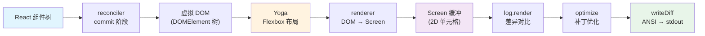

# 第 15 章：Ink 与终端 UI

> 源码验证日期：2026-05-15，基于 commit `0d81bb6`

---

## 知识补全：React Reconciler

如果你已经理解 React Reconciler 的工作原理，跳过本节。

React 的渲染是可插拔的——`react-reconciler` 包让你为任何宿主环境创建自定义渲染器：

```typescript
import ReactReconciler from 'react-reconciler'

const hostConfig = {
  createInstance(type, props) {
    // 在宿主环境中创建节点
    // React DOM: 创建 DOM 元素
    // React Native: 创建原生视图
    // Ink: 创建虚拟终端节点（带 Yoga 布局）
  },
  appendChild(parent, child) { /* 挂载子节点 */ },
  commitUpdate(instance, oldProps, newProps) { /* 更新属性 */ },
  removeChild(parent, child) { /* 移除子节点 */ },
  // ... 约 40 个方法
}

const reconciler = ReactReconciler(hostConfig)
```

Ink 的 Reconciler 把 React 组件树渲染到虚拟终端 DOM——每个节点有 Yoga Flexbox 布局属性和文本内容。React 的声明式编程模型被完整保留，但"屏幕"是终端的 ANSI 字符网格。

---

## 源码入口

```
src/ink.ts                      — 公共 API（createRoot, renderSync）
src/ink/root.ts                 — Root 类
src/ink/ink.tsx                 — Ink 核心类（渲染循环）
src/ink/reconciler.ts           — 自定义 Reconciler host config
src/ink/dom.ts                  — 虚拟 DOM 节点类型
src/ink/renderer.ts             — DOM → Screen 缓冲
src/ink/render-node-to-output.ts — 节点遍历渲染
src/ink/screen.ts               — 2D 单元格网格 + 池化
src/ink/output.ts               — 输出收集器
src/ink/log-update.ts           — 差异引擎
src/ink/optimizer.ts            — 补丁优化器
src/ink/terminal.ts             — ANSI 序列写入
src/ink/frame.ts                — 帧类型定义
src/ink/layout/yoga.ts          — Yoga 布局绑定
src/ink/components/             — Box, Text, ScrollBox 等内置组件
```

---

## 逐行阅读

### 15.1 Reconciler Host Config：7 种节点类型

```typescript
// → src/ink/dom.ts:20-27
type ElementType =
  | 'ink-root'          // 根节点
  | 'ink-box'           // Flexbox 容器
  | 'ink-text'          // 文本节点
  | 'ink-virtual-text'  // 虚拟文本（空文本节点）
  | 'ink-link'          // OSC 8 超链接
  | 'ink-progress'      // 进度条
  | 'ink-raw-ansi'      // 原始 ANSI 序列
```

每种节点类型在 `reconciler.ts` 的 `createInstance` 中创建：

```typescript
// → src/ink/reconciler.ts:331（简化版）
createInstance(type, props) {
  const node = new DOMElement({
    yogaNode: Yoga.Node.create(),
    // ... 应用 style props 到 yogaNode
  })
  return node
}
```

### 15.2 DOMElement：虚拟终端节点

```typescript
// → src/ink/dom.ts:12-91（简化版）
class DOMElement {
  yogaNode: YogaNode           // Yoga 布局节点
  style: StyleProps            // CSS-like 样式属性
  dirty: boolean               // 是否需要重新布局
  scrollTop: number            // 滚动位置
  pendingScrollDelta: number   // 待处理的滚动偏移
  stickyScroll: boolean        // 粘性滚动
  focusManager: FocusManager   // 焦点管理
  childNodes: DOMElement[]     // 子节点
  textContent: string          // 文本内容
}
```

DOMElement 是 Ink 的"虚拟 DOM"节点。React 通过 reconciler 操作这些节点，最终由 renderer 遍历渲染到 Screen 缓冲。

### 15.3 布局引擎：Yoga Flexbox

```typescript
// → src/ink/layout/yoga.ts（简化版）
// 使用 Facebook 的 Yoga 引擎（编译为原生模块）
// 支持 Flexbox 布局：flexDirection, justifyContent, alignItems 等

// 在 resetAfterCommit 中触发布局计算：
rootNode.onComputeLayout = () => {
  this.rootNode.yogaNode.setWidth(this.terminalColumns)
  this.rootNode.yogaNode.calculateLayout(this.terminalColumns)
}
```

Yoga 是 React Native 使用的同一布局引擎——Flexbox 模型，但编译为原生代码以获得最佳性能。每个 `ink-box` 节点对应一个 Yoga 节点。

### 15.4 Screen 缓冲：池化内存管理

```typescript
// → src/ink/screen.ts:15-80（简化版）
class Screen {
  width: number
  height: number
  cells: Cell[]               // 2D 单元格网格

  // 三个池化结构——内存效率的关键
  charPool: CharPool          // 字符池化（ASCII 快速路径用 Int32Array）
  stylePool: StylePool        // ANSI 样式池化（SGR 码组合）
  hyperlinkPool: HyperlinkPool // OSC 8 超链接池化

  // 损伤追踪——只重绘变化区域
  damage: { x, y, width, height }
}
```

**CharPool** 对 ASCII 字符使用 `Int32Array` 快速路径——比字符串存储高效得多。非 ASCII 字符回退到字符串池。

**StylePool** 把 ANSI 样式组合（粗体+红色+下划线等）池化为整数 ID——避免每个单元格都存储完整样式字符串。

### 15.5 渲染管线：DOM → Screen → Diff → Terminal

完整的帧渲染管线（throttled ~60fps）：

```typescript
// → src/ink/ink.tsx（简化版核心流程）
onRender() {
  // 1. 渲染 DOM 树到 Screen 缓冲
  const frame = this.renderer({
    frontFrame: this.frontFrame,
    backFrame: this.backFrame,
    isTTY, terminalWidth, terminalRows,
  })

  // 2. 交换前后帧
  this.backFrame = this.frontFrame
  this.frontFrame = frame

  // 3. 差异对比：逐单元格比较前后帧
  const diff = this.log.render(prevFrame, frame)

  // 4. 补丁优化：合并相邻光标移动、去除空操作
  const optimized = optimize(diff)

  // 5. 序列化为 ANSI 转义序列并写入 stdout
  writeDiffToTerminal(this.terminal, optimized)
}
```



### 15.6 renderNodeToOutput：递归遍历渲染

```typescript
// → src/ink/render-node-to-output.ts（简化版）
function renderNodeToOutput(node, output, options) {
  // 从 Yoga 获取绝对位置
  const layout = node.yogaNode.getComputedLayout()

  // Blit 优化：如果子树没变化，直接从上一帧复制
  if (canBlit(node, options.prevScreen, nodeCache)) {
    output.blit(prevScreen, absoluteRect)
    return  // 跳过整棵子树
  }

  // 处理 ScrollBox 滚动
  if (node.tagName === 'ink-scroll-box') {
    // 应用 scrollTop 偏移
  }

  // 写入文本内容
  if (node.textContent) {
    output.write(x, y, node.textContent, styleId, hyperlinkId)
  }

  // 递归渲染子节点
  for (const child of node.childNodes) {
    renderNodeToOutput(child, output, options)
  }
}
```

**Blit 优化**是最重要的性能特性——不变子树直接从上一帧的 Screen 缓冲复制单元格，跳过整棵子树的遍历。

### 15.7 差异引擎和补丁优化

```typescript
// → src/ink/log-update.ts（简化版）
// 逐单元格比较前后帧的 Screen 缓冲
// 生成 Patch[]：每个 patch 是"从 (x,y) 开始写入这些字符"
render(prevFrame, frame): Diff {
  // 只在 damage 区域内比较（缩小比较范围）
  const patches: Patch[] = []
  for (const { x, y, newCell } of changedCells) {
    patches.push({ x, y, text: newCell.text, style: newCell.style })
  }
  return patches
}

// → src/ink/optimizer.ts（简化版）
// 合并相邻光标移动、去除 hide-show 对、消除空操作
function optimize(patches): Patch[] {
  // 相邻单元格的写入合并为一次序列
  // 移动光标 + 写入 A + 移动光标 + 写入 B
  // → 如果相邻，优化为：移动光标 + 写入 AB
}
```

### 15.8 选择高亮：后处理通道

```typescript
// → src/ink/ink.tsx:534-566（简化版）
// 选择高亮作为后处理步骤应用
// 直接修改 Screen 缓冲的 style ID（反转单元格颜色）
// 差异引擎把选择变化当作普通单元格变化处理
```

选择高亮不需要特殊的 diff 逻辑——它直接修改 Screen 缓冲的样式 ID，差异引擎自然地检测到这些变化。

### 15.9 自定义组件：Box、Text、ScrollBox

```typescript
// → src/ink/components/Box.tsx
// Flexbox 容器组件，映射到 ink-box 节点
// 支持 flexDirection, padding, margin, border 等

// → src/ink/components/Text.tsx
// 文本组件，映射到 ink-text 节点
// 支持 color, bold, italic, underline 等 ANSI 样式

// → src/ink/components/ScrollBox.tsx
// 可滚动容器，处理 scrollTop 和虚拟滚动
```

### 15.10 OffscreenFreeze 和 VirtualMessageList

```typescript
// → src/components/OffscreenFreeze.tsx
// 使用 React Compiler 的 'use no memo' 退出 memo 化
// 不可见时返回缓存的子元素引用
// 防止 spinner/时钟在不可见时仍触发渲染

// → src/components/VirtualMessageList.tsx
// 只渲染视口内的消息
// 长对话（2800+ 消息）不可能全部渲染
// 使用 useVirtualScroll hook
```

这两个优化配合工作：VirtualMessageList 限制渲染范围，OffscreenFreeze 冻结不可见消息的更新。

---

## 调试实践

| 位置 | 看什么 |
|------|--------|
| `reconciler.ts:331` | `createInstance`——虚拟 DOM 节点创建 |
| `reconciler.ts:247` | `resetAfterCommit`——布局和渲染触发 |
| `dom.ts:20` | 节点类型定义 |
| `screen.ts:15` | Screen 缓冲和池化 |
| `render-node-to-output.ts` | 递归渲染和 Blit 优化 |
| `log-update.ts` | 差异引擎 |
| `optimizer.ts` | 补丁优化 |

---

## 试一试

### 修改 1：观察 Blit 命中率

```typescript
// 在 render-node-to-output.ts 的 canBlit 检查处
let blitHits = 0, blitMisses = 0
if (canBlit(...)) {
  blitHits++
  console.log('[DEBUG] Blit hit, total:', blitHits, 'misses:', blitMisses)
} else {
  blitMisses++
}
```

观察滚动时 blit 命中率的变化——已滚过的消息应该全部命中 blit。

### 修改 2：查看 Screen 缓冲内容

```typescript
// 在 onRender 的 diff 之前
console.log('[DEBUG] Screen size:', frame.screen.width, 'x', frame.screen.height)
console.log('[DEBUG] Damage region:', frame.screen.damage)
```

---

## 检查点

- **自定义 Reconciler**：7 种虚拟 DOM 节点类型，`react-reconciler` 宿主配置
- **Yoga 布局**：Flexbox 模型，与 React Native 相同的布局引擎
- **Screen 缓冲**：2D 单元格网格，三个池化结构（Char/Style/Hyperlink）节省内存
- **帧渲染管线**：React commit → Yoga 布局 → DOM→Screen → Diff → 优化 → ANSI 写入
- **Blit 优化**：不变子树直接从上一帧复制，跳过重渲染
- **差异引擎**：只在 damage 区域内比较，生成 Patch[]
- **补丁优化**：合并相邻光标移动、去除空操作
- **OffscreenFreeze**：冻结不可见组件，防止无意义渲染
- **VirtualMessageList**：只渲染视口内消息，支持长对话

**下一站**：第 16 章深入权限系统——全部 7 种权限模式、安全纵深防御完整体系。
