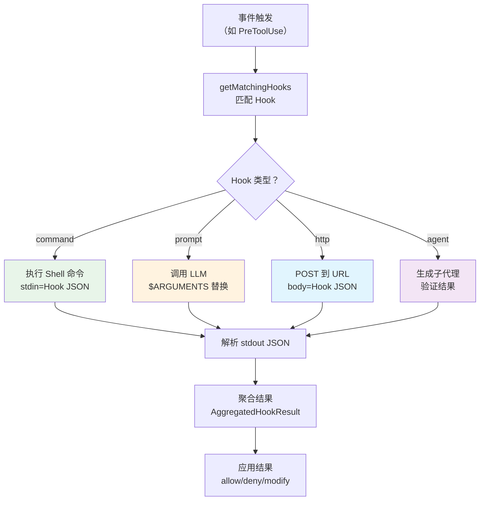

# 第 17 章：Hook 系统——工具调用的拦截

> 源码验证日期：2026-05-15，基于 commit `0d81bb6`

---

## 知识补全：Shell Hook

如果你已经理解 stdin/stdout 管道和进程间通信，跳过本节。

Hook（钩子）是一种观察者模式——在特定事件发生时触发外部逻辑。Claude Code 的 Hook 系统让用户在工具执行前后运行自定义脚本：

```bash
# 用户在 .claude/settings.json 中配置 Hook：
{
  "hooks": {
    "PreToolUse": [
      {
        "matcher": "Write",
        "hooks": [{
          "type": "command",
          "command": "my-linter.sh $CLAUDE_FILE_PATH"
        }]
      }
    ]
  }
}

# 当 Claude 要执行 Write 工具时：
# 1. 先运行 my-linter.sh
# 2. 如果脚本退出码非 0 → 阻止工具执行
# 3. 如果退出码 0 → 工具正常执行
```

Hook 不需要写 TypeScript——任何能从 stdin 读取 JSON、向 stdout 写 JSON 的程序都可以。

---

## 源码入口

```
src/entrypoints/sdk/coreTypes.ts:25-53  — HOOK_EVENTS 常量（25 个事件）
src/schemas/hooks.ts                    — Hook Zod schema（4 种类型）
src/utils/hooks.ts                      — Hook 执行引擎
src/types/hooks.ts                      — Hook 类型定义
```

---

## 逐行阅读

### 17.1 25 个 Hook 事件

```typescript
// → src/entrypoints/sdk/coreTypes.ts:25-53
const HOOK_EVENTS = [
  // 工具执行（5 个）
  'PreToolUse',              // 工具执行前
  'PostToolUse',             // 工具执行后（成功）
  'PostToolUseFailure',      // 工具执行后（失败）
  'PermissionRequest',       // 权限请求时
  'PermissionDenied',        // 权限被拒绝时

  // 会话生命周期（5 个）
  'SessionStart',            // 会话开始
  'SessionEnd',              // 会话结束
  'Stop',                    // 代理停止
  'StopFailure',             // 代理停止（失败）
  'Setup',                   // 初始设置

  // 子代理（2 个）
  'SubagentStart',           // 子代理启动
  'SubagentStop',            // 子代理停止

  // 上下文管理（2 个）
  'PreCompact',              // 上下文压缩前
  'PostCompact',             // 上下文压缩后

  // 用户交互（4 个）
  'UserPromptSubmit',        // 用户提交提示
  'Notification',            // 通知发送
  'Elicitation',             // 信息请求
  'ElicitationResult',       // 信息请求结果

  // 任务系统（2 个）
  'TaskCreated',             // 任务创建
  'TaskCompleted',           // 任务完成

  // 团队（1 个）
  'TeammateIdle',            // 队友空闲

  // 环境变化（4 个）
  'ConfigChange',            // 配置变更
  'WorktreeCreate',          // 工作树创建
  'WorktreeRemove',          // 工作树移除
  'InstructionsLoaded',      // 指令加载完成
  'CwdChanged',              // 工作目录变更
  'FileChanged',             // 文件变更
]
```

### 17.2 四种执行类型

```typescript
// → src/schemas/hooks.ts:31-171（简化版）

// 类型 1：command（Shell 命令）
{
  type: 'command',
  command: 'my-script.sh',       // 要执行的命令
  shell?: 'bash' | 'powershell', // Shell 类型
  timeout?: number,               // 超时（毫秒）
  once?: boolean,                 // 只运行一次
  async?: boolean,                // 异步执行（不阻塞）
  if?: string,                    // 条件过滤
}

// 类型 2：prompt（LLM 评估）
{
  type: 'prompt',
  prompt: 'Evaluate: $ARGUMENTS', // LLM 提示（$ARGUMENTS 被替换为 Hook 输入 JSON）
  model?: string,                 // 使用的模型
  timeout?: number,
}

// 类型 3：http（Webhook）
{
  type: 'http',
  url: 'https://example.com/hook', // POST 目标
  headers?: { 'Authorization': 'Bearer $API_KEY' }, // 支持环境变量插值
  allowedEnvVars?: ['API_KEY'],     // 允许插值的环境变量
  timeout?: number,
}

// 类型 4：agent（子代理验证）
{
  type: 'agent',
  prompt: 'Verify this change is safe', // 子代理提示
  model?: string,
  timeout?: number,
}
```

还有一种内部类型 `callback`（`src/types/hooks.ts:211-226`），用于编程式 Hook（不持久化到设置）。

### 17.3 Hook 配置结构

```typescript
// → src/schemas/hooks.ts:194-222
// Hook 配置按事件名组织，每个事件可以有多个 matcher
{
  "hooks": {
    "PreToolUse": [
      {
        "matcher": "Write",     // 只匹配 Write 工具
        "hooks": [
          { "type": "command", "command": "lint.sh" }
        ]
      },
      {
        "matcher": "Bash(git *)", // 匹配 git 开头的 Bash 命令
        "hooks": [
          { "type": "command", "command": "audit.sh" }
        ]
      }
    ],
    "PostToolUse": [
      {
        "matcher": "Edit",       // 匹配 Edit 工具
        "hooks": [
          { "type": "http", "url": "https://ci.example.com/hook" }
        ]
      }
    ]
  }
}
```

### 17.4 Hook 输入结构

```typescript
// → src/utils/hooks.ts:301-328
function createBaseHookInput(context) {
  return {
    session_id: context.sessionId,
    transcript_path: context.transcriptPath,
    cwd: context.cwd,
    permission_mode: context.permissionMode,
    agent_id: context.agentId,
    agent_type: context.agentType,
  }
  // 工具事件额外添加：
  // tool_name, tool_input, tool_result 等
}
```

### 17.5 PreToolUse Hook：拦截和修改

```typescript
// → src/utils/hooks.ts:550-622（简化版）
// PreToolUse Hook 可以：
// 1. 阻止执行（返回 permissionDecision: 'deny'）
// 2. 允许执行（返回 permissionDecision: 'allow'）
// 3. 修改工具输入（返回 updatedInput）
// 4. 注入额外上下文（返回 additionalContext）

if (result.hookEventName === 'PreToolUse') {
  // Hook 修改了工具输入
  if (result.updatedInput) {
    processedInput = result.updatedInput  // 替换原始输入
  }

  // Hook 做了权限决定
  if (result.permissionDecision === 'deny') {
    return { type: 'preventContinuation', ... }
  }
}
```

### 17.6 PostToolUse Hook：结果修改

```typescript
// → src/utils/hooks.ts:643-650（简化版）
// PostToolUse Hook 可以：
// 1. 替换 MCP 工具的输出
// 2. 注入额外上下文

if (result.updatedMCPToolOutput !== undefined) {
  // 替换 MCP 工具的输出
  toolOutput = result.updatedMCPToolOutput
}
```

### 17.7 Matcher 逻辑

```typescript
// → src/utils/hooks.ts:1603-1679（简化版）
function getMatchingHooks(eventName, matchQuery, hooks) {
  switch (eventName) {
    case 'PreToolUse':
    case 'PostToolUse':
      // 匹配 tool_name（如 "Write"）
      // 支持 Bash(git *) 模式
      return filterByToolName(matchQuery.tool_name, hooks)

    case 'SessionStart':
      // 匹配 source（"cli", "resume", "sdk"）
      return filterBySource(matchQuery, hooks)

    case 'Notification':
      // 匹配 notification_type
      return filterByType(matchQuery, hooks)

    case 'FileChanged':
      // 匹配 basename(file_path)
      return filterByFileName(matchQuery, hooks)

    default:
      // 大多数事件没有 matcher——运行所有 Hook
      return hooks
  }
}
```

### 17.8 Hook 执行流程



---

## 调试实践

| 位置 | 看什么 |
|------|--------|
| `coreTypes.ts:25` | HOOK_EVENTS——25 个事件完整列表 |
| `schemas/hooks.ts:31` | 4 种 Hook 类型的 schema |
| `hooks.ts:301` | `createBaseHookInput`——Hook 输入结构 |
| `hooks.ts:550` | PreToolUse 结果处理 |
| `hooks.ts:1603` | Matcher 逻辑 |
| `hooks.ts:1952` | `executeHooks`——主执行循环 |

---

## 试一试

### 修改 1：添加调试 Hook

在 `.claude/settings.json` 中添加：

```json
{
  "hooks": {
    "PreToolUse": [{
      "matcher": "Bash",
      "hooks": [{
        "type": "command",
        "command": "echo '{\"decision\": \"allow\"}' && echo '[HOOK] Bash called:' $CLAUDE_TOOL_INPUT >&2"
      }]
    }]
  }
}
```

### 修改 2：观察 Hook 匹配

在 `src/utils/hooks.ts` 的 `getMatchingHooks` 中加：

```typescript
console.log('[DEBUG] Hook match:', eventName, 'query:', matchQuery, 'matched:', matched.length)
```

---

## 检查点

- **25 个 Hook 事件**：工具执行（5）、会话生命周期（5）、子代理（2）、上下文管理（2）、用户交互（4）、任务系统（2）、团队（1）、环境变化（4）
- **4 种执行类型**：command（Shell）、prompt（LLM）、http（Webhook）、agent（子代理验证）
- **Matcher 机制**：按工具名、命令模式、事件源过滤
- **PreToolUse Hook**：可以阻止执行、允许执行、修改工具输入、注入上下文
- **PostToolUse Hook**：可以替换 MCP 输出、注入上下文
- **Hook 输入**：session_id、cwd、tool_name、tool_input 等标准字段
- **配置结构**：按事件名组织，每个事件可有多个 matcher + hooks 数组

**下一站**：第 18 章追踪斜杠命令与插件系统——命令注册分发、10 种插件组件类型、插件生命周期管理。
