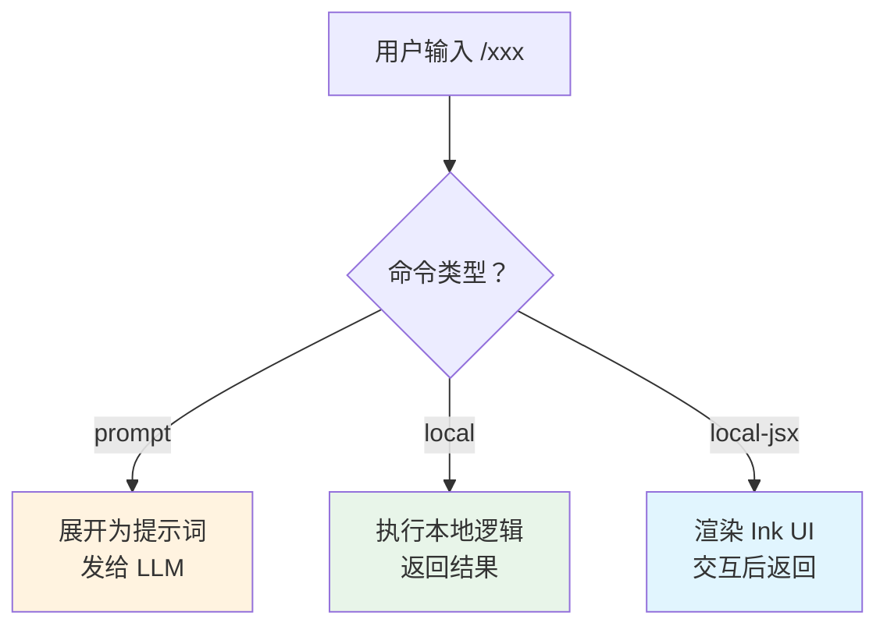

# 第 18 章：斜杠命令与插件系统

> 源码验证日期：2026-05-15，基于 commit `0d81bb6`

---

## 知识补全：命令模式

如果你已经理解 Command 设计模式，跳过本节。

```typescript
// 命令模式：把"做什么"封装为对象
interface Command {
  name: string
  execute(args: string[]): void
}

// 注册表管理所有命令
const registry = new Map<string, Command>()
registry.set('help', { name: 'help', execute: showHelp })
registry.set('compact', { name: 'compact', execute: compactHistory })

// 用户输入时查找并执行
function handleInput(input: string) {
  if (input.startsWith('/')) {
    const [name, ...args] = input.slice(1).split(' ')
    const cmd = registry.get(name)
    cmd?.execute(args)
  }
}
```

Claude Code 用命令模式管理斜杠命令，用插件系统扩展命令来源。

---

## 源码入口

```
src/commands.ts               — 命令注册表（~90 个命令）
src/types/command.ts           — Command 类型定义
src/commands/                  — 命令实现目录（~90 子目录）
src/types/plugin.ts            — 插件类型定义
src/utils/plugins/schemas.ts   — 插件 manifest schema
src/plugins/builtinPlugins.ts  — 内置插件注册
```

---

## 逐行阅读

### 18.1 三种命令类型

```typescript
// → src/types/command.ts（简化版）
type Command =
  | PromptCommand      // 展开为提示词发给模型
  | LocalCommand       // 非交互式本地命令
  | LocalJsxCommand    // 交互式 JSX 命令（Ink UI）
```



### 18.2 PromptCommand：提示词命令

```typescript
// → src/types/command.ts:25-57（简化版）
type PromptCommand = CommandBase & {
  type: 'prompt'
  getPromptForCommand(args, context): Promise<string>
  allowedTools?: string[]         // 允许使用的工具列表
  model?: string                  // 使用的模型
  context?: 'inline' | 'fork'    // inline=当前对话, fork=新对话
  effort?: string                 // 推理强度
  paths?: string[]                // 文件路径
}
```

示例：`/init` 命令生成 CLAUDE.md 提示词：

```typescript
// → src/commands/init/index.ts（简化版）
const initCommand = {
  type: 'prompt',
  name: 'init',
  description: 'Initialize CLAUDE.md...',
  getPromptForCommand(args) {
    return 'Analyze this project and create a CLAUDE.md file...'
  },
} satisfies Command
```

### 18.3 LocalCommand：非交互式命令

```typescript
// → src/types/command.ts:74-78（简化版）
type LocalCommand = CommandBase & {
  type: 'local'
  load(): Promise<{
    call(args, context): Promise<LocalCommandResult>
  }>
}

type LocalCommandResult =
  | { type: 'text', text: string }     // 返回文本
  | { type: 'compact' }                 // 触发压缩
  | { type: 'skip' }                    // 跳过
```

示例：`/compact` 命令：

```typescript
// → src/commands/compact/index.ts（简化版）
const compact = {
  type: 'local',
  name: 'compact',
  description: 'Clear conversation history...',
  supportsNonInteractive: true,
  load: () => import('./compact.js'),
} satisfies Command
```

### 18.4 LocalJsxCommand：交互式 UI 命令

```typescript
// → src/types/command.ts:144-152（简化版）
type LocalJsxCommand = CommandBase & {
  type: 'local-jsx'
  load(): Promise<{
    call(onDone, context, args): Promise<ReactNode>
  }>
}
```

示例：`/hooks` 命令显示 Hook 配置界面：

```typescript
// → src/commands/hooks/index.ts（简化版）
const hooks = {
  type: 'local-jsx',
  name: 'hooks',
  description: 'View hook configurations for tool events',
  immediate: true,               // 不需要模型参与
  load: () => import('./hooks.js'),
} satisfies Command
```

### 18.5 CommandBase：共享字段

```typescript
// → src/types/command.ts:175-203（简化版）
type CommandBase = {
  name: string                    // 命令名（不含 /）
  description: string             // 帮助描述
  aliases?: string[]              // 别名
  isEnabled?(): boolean           // 是否启用
  isHidden?: boolean              // 是否隐藏（不在帮助中显示）
  availability?: 'normal' | 'auth' | 'pro'  // 可用性要求
  argumentHint?: string           // 参数提示
  whenToUse?: string              // 使用场景描述
  loadedFrom?: string             // 加载来源
  supportsNonInteractive?: boolean // 是否支持非交互模式
}
```

### 18.6 命令注册：COMMANDS 数组

```typescript
// → src/commands.ts:258-346（简化版）
const COMMANDS = memoize(() => {
  // 静态导入的约 90 个命令
  return [
    help, compact, clear, config, doctor, init,
    login, logout, mcp, model, permissions,
    review, status, bug, vim, memory,
    // ... 更多命令
    // feature-gated 命令
    ...(feature('DAEMON') ? [daemon] : []),
    ...(feature('BRIDGE_MODE') ? [bridge] : []),
    ...(process.env.USER_TYPE === 'ant' ? [antOnlyCommands] : []),
  ]
})
```

### 18.7 命令合并优先级

```typescript
// → src/commands.ts:449-469（简化版）
function loadAllCommands(context) {
  // 按优先级从高到低合并：
  const all = [
    ...bundledSkills,          // 1. 内置技能
    ...builtinPluginSkills,    // 2. 内置插件技能
    ...skillDirCommands,       // 3. /skills/ 目录
    ...workflowCommands,       // 4. 工作流命令
    ...pluginCommands,         // 5. 插件命令
    ...pluginSkills,           // 6. 插件技能
    ...COMMANDS(),             // 7. 硬编码命令（最低优先级）
  ]

  // 过滤：auth 门控 + feature flags
  return all.filter(cmd =>
    meetsAvailabilityRequirement(cmd) &&
    isCommandEnabled(cmd)
  )
}
```

高优先级来源的同名命令覆盖低优先级——插件可以覆盖内置命令。

### 18.8 插件系统：组件类型

```typescript
// → src/types/plugin.ts:72-78
type PluginComponent =
  | 'commands'       // 斜杠命令
  | 'agents'         // 代理定义
  | 'skills'         // 技能
  | 'hooks'          // Hook 配置
  | 'output-styles'  // 输出样式
```

### 18.9 插件 Manifest

```typescript
// → src/utils/plugins/schemas.ts:884-898（简化版）
type PluginManifest = {
  // 元数据
  name: string
  version: string
  description?: string
  author?: string
  homepage?: string
  repository?: string
  license?: string
  keywords?: string[]
  dependencies?: Record<string, string>

  // 组件
  commands?: string | string[] | Record<string, CommandDef>
  agents?: string | string[]
  skills?: string | string[]
  hooks?: object | string              // Hook 配置
  outputStyles?: string | string[]     // 输出样式
  mcpServers?: McpServerConfig[]       // MCP 服务器
  lspServers?: LspServerConfig[]       // LSP 服务器
  channels?: ChannelConfig[]           // 通知通道（Telegram、Slack 等）
  settings?: Partial<Settings>         // 启用时合并的设置
  userConfig?: UserConfigDef[]         // 用户可配置值
}
```

### 18.10 插件来源

```typescript
// → src/utils/plugins/schemas.ts:1062-1161（简化版）
type PluginSource =
  | string                               // 相对路径
  | { source: 'npm', package, version? }    // npm 包
  | { source: 'pip', package, version? }    // Python 包
  | { source: 'url', url, ref?, sha? }      // URL 下载
  | { source: 'github', repo, ref?, sha? }  // GitHub 仓库
  | { source: 'git-subdir', url, path, ref?, sha? }  // monorepo 子目录
```

### 18.11 插件 ID 和生命周期

```typescript
// 插件 ID 格式："plugin-name@marketplace-name"
// 内置插件："plugin-name@builtin"

// 生命周期：
// 1. 发现 — 扫描 marketplace、配置文件
// 2. 下载 — 从来源获取插件文件
// 3. 验证 — 检查 manifest 完整性
// 4. 安装 — 解压到插件目录
// 5. 启用 — 注册命令、Hook、MCP 服务器
// 6. 运行 — 响应用户请求
// 7. 禁用 — 注销组件
// 8. 卸载 — 删除文件
```

---

## 调试实践

| 位置 | 看什么 |
|------|--------|
| `commands.ts:258` | COMMANDS 数组——所有硬编码命令 |
| `commands.ts:449` | loadAllCommands——命令合并逻辑 |
| `types/command.ts` | 三种命令类型定义 |
| `types/plugin.ts` | 插件类型定义 |
| `plugins/schemas.ts:884` | 插件 manifest schema |
| `plugins/builtinPlugins.ts` | 内置插件注册 |

---

## 试一试

### 修改 1：列出所有命令

在 `src/commands.ts` 的 `loadAllCommands` 返回前加：

```typescript
console.log('[DEBUG] Commands:', result.map(c => `${c.type}/${c.name}`).join(', '))
console.log('[DEBUG] Total:', result.length)
```

### 修改 2：创建自定义命令

创建 `.claude/commands/my-command.md`：

```markdown
---
description: "My custom command"
allowed-tools: Read, Grep
---

Analyze the current project structure and summarize the architecture.
```

然后在 Claude Code 中输入 `/my-command` 测试。

---

## 检查点

- **三种命令类型**：prompt（提示词）、local（非交互）、local-jsx（Ink UI）
- **CommandBase**：共享字段——name、description、aliases、isEnabled、availability
- **命令注册**：`COMMANDS()` 静态数组 + 动态合并
- **合并优先级**：内置技能 > 插件命令 > 硬编码命令（同名覆盖）
- **插件组件**：commands、agents、skills、hooks、output-styles
- **插件 Manifest**：元数据 + 组件路径 + MCP/LSP 服务器 + 设置
- **插件来源**：npm、pip、GitHub、URL、本地路径、git-subdir
- **插件 ID**：`name@marketplace` 格式，内置用 `@builtin`

**下一站**：第 19 章追踪 MCP 协议——适配器模式、Bridge 远程会话、Agent SDK。
