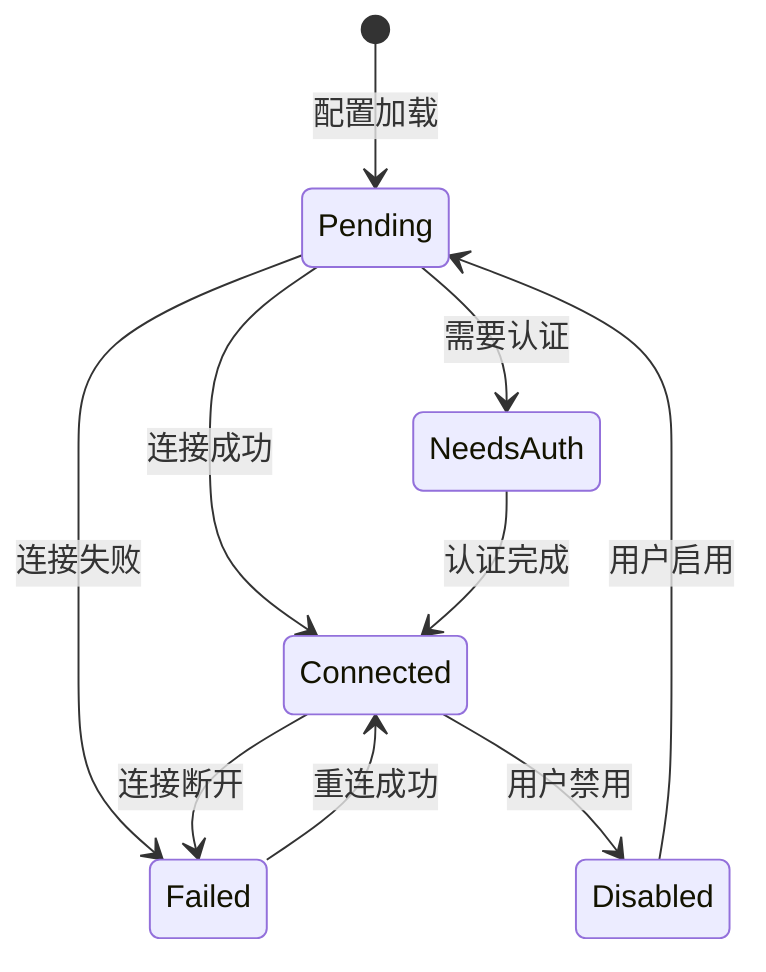
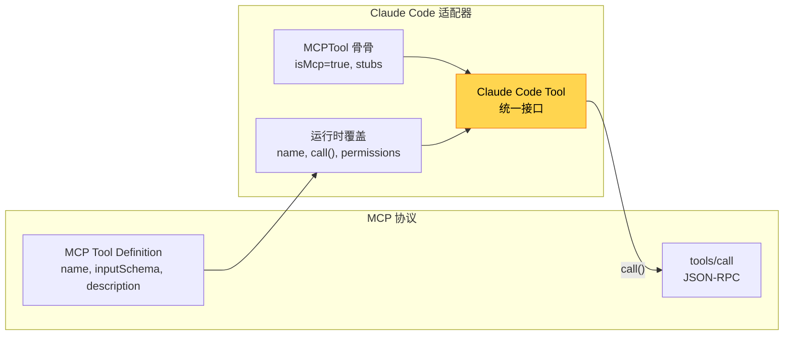

# 第 19 章：MCP 协议与 Bridge/SDK

> 源码验证日期：2026-05-15，基于 commit `0d81bb6`

---

## 知识补全：MCP 协议基础

如果你已经理解 MCP（Model Context Protocol），跳过本节。

MCP 是 Anthropic 提出的开放协议，让 AI 应用与外部工具/数据源通信：

```
Claude Code (MCP Client) ←→ MCP Server ←→ 外部服务

协议基于 JSON-RPC 2.0：
- tools/list      → 获取服务器支持的工具列表
- tools/call      → 调用工具
- resources/list  → 获取可访问的资源
- resources/read  → 读取资源

传输方式：
- stdio：通过标准输入/输出通信（本地进程）
- SSE：Server-Sent Events（HTTP 长连接）
- HTTP：Streamable HTTP
- WebSocket：双向实时通信
```

Claude Code 是 MCP Client，外部服务器是 MCP Server。通过适配器模式，MCP 工具被包装成 Claude Code 的 `Tool` 对象。

---

## 源码入口

```
src/services/mcp/types.ts              — MCP 类型定义（传输、配置、状态机）
src/services/mcp/config.ts             — 配置加载、合并、策略执行
src/services/mcp/client.ts             — 连接管理和工具获取
src/services/mcp/useManageMCPConnections.ts — React Hook 生命周期管理
src/services/mcp/InProcessTransport.ts — 进程内传输
src/services/mcp/SdkControlTransport.ts — SDK 控制传输
src/tools/MCPTool/MCPTool.ts           — MCP 工具骨架
src/bridge/types.ts                    — Bridge 协议类型
src/bridge/bridgeMain.ts               — Bridge 主入口
src/entrypoints/agentSdkTypes.ts       — Agent SDK 公共 API
src/entrypoints/sdk/controlSchemas.ts  — SDK 控制协议
```

---

## 逐行阅读

### 19.1 MCP 传输类型

```typescript
// → src/services/mcp/types.ts:10-26（简化版）
type Transport =
  | 'stdio'        // 标准输入/输出（本地进程）
  | 'sse'          // Server-Sent Events（HTTP 长连接）
  | 'sse-ide'      // SSE IDE 集成
  | 'http'         // Streamable HTTP
  | 'ws'           // WebSocket
  | 'sdk'          // 进程内 SDK

type ConfigScope =
  | 'local'        // .claude/settings.local.json
  | 'user'         // ~/.claude/settings.json
  | 'project'      // .claude/settings.json
  | 'dynamic'      // 运行时动态添加
  | 'enterprise'   // 企业策略
  | 'claudeai'     // claude.ai 代理
  | 'managed'      // 托管配置
  | 'plugin'       // 插件提供
```

### 19.2 连接状态机

```typescript
// → src/services/mcp/types.ts:180-227（简化版）
type MCPServerConnection =
  | ConnectedMCPServer    // 已连接，工具可用
  | FailedMCPServer       // 连接失败
  | NeedsAuthMCPServer    // 需要认证
  | PendingMCPServer      // 等待连接
  | DisabledMCPServer     // 已禁用
```



### 19.3 适配器模式：MCP 工具 → Claude Code Tool

这是本章的核心设计——MCP 协议的工具定义被包装成 Claude Code 的 `Tool` 对象：

```typescript
// → src/services/mcp/client.ts:1743-1988（简化版）
function fetchToolsForClient(client, serverName) {
  // 1. 通过 MCP 协议获取工具列表
  const { tools } = await client.request({ method: 'tools/list' })

  // 2. 每个 MCP 工具转换为 Claude Code Tool
  return tools.map(tool => ({
    ...MCPTool,                       // 从骨架开始
    name: `${serverName}__${tool.name}`,  // 完全限定名
    mcpInfo: { serverName, toolName: tool.name },
    isMcp: true,

    // 从 MCP 协议注解获取行为标记
    isConcurrencySafe: () => tool.annotations?.readOnlyHint ?? false,
    isReadOnly: () => tool.annotations?.readOnlyHint ?? false,
    isDestructive: () => tool.annotations?.destructiveHint ?? false,

    // 使用 JSON Schema（不是 Zod）
    inputJSONSchema: tool.inputSchema,

    // 描述和提示从 MCP 协议获取
    description: () => tool.description,
    prompt: () => tool.description?.substring(0, MAX_PROMPT_LENGTH),

    // call() 通过 MCP 协议执行
    call(args, context) {
      const result = await client.request({
        method: 'tools/call',
        params: { name: tool.name, arguments: args }
      })
      return { data: result.content, mcpMeta: result._meta }
    },
  }))
}
```



### 19.4 配置合并和策略执行

```typescript
// → src/services/mcp/config.ts:1071-1251（简化版）
function getClaudeCodeMcpConfigs() {
  // 按优先级合并配置来源：
  // plugin < user < project < local
  const configs = mergeConfigs(plugin, user, project, local)

  // 去重（按 URL 或命令数组的内容哈希）
  const deduped = dedupPluginMcpServers(configs)

  // 策略执行：allowlist/denylist
  const filtered = filterMcpServersByPolicy(deduped, {
    nameFilter: policy.allowedMcpServerNames,
    commandFilter: policy.deniedMcpCommands,
    urlFilter: policy.deniedMcpUrls,
  })

  return filtered
}
```

### 19.5 连接生命周期管理

```typescript
// → src/services/mcp/useManageMCPConnections.ts:143（简化版）
function useManageMCPConnections() {
  // 批量状态更新（16ms 窗口）
  const MCP_BATCH_FLUSH_MS = 16

  // 两阶段加载：
  // Phase 1: 本地配置（快速）
  // Phase 2: claude.ai 配置（网络请求）

  // 连接回调：
  onConnectionAttempt({
    onConnected: (client) => {
      // 注册变更通知处理器
      client.onNotification('notifications/tools/list_changed', () => {
        // 工具列表变化 → 重新获取
        fetchToolsForClient(client, serverName)
      })
    },
    onFailed: (error) => {
      // 指数退避重连（最多 5 次，1s-30s）
      scheduleReconnect(serverName, error)
    },
  })
}
```

### 19.6 进程内传输

```typescript
// → src/services/mcp/InProcessTransport.ts:57（简化版）
function createLinkedTransportPair(): [clientTransport, serverTransport] {
  // 创建一对连接的传输——消息从一端到达另一端的 onmessage
  // 通过 queueMicrotask 传递，无需进程间通信
  // 用于 SDK 的进程内 MCP 服务器
}
```

### 19.7 Bridge：远程会话控制

Bridge 让外部系统（如 claude.ai）远程控制 Claude Code 会话：

```typescript
// → src/bridge/types.ts:69-115（简化版）
type SpawnMode = 'single-session' | 'worktree' | 'same-dir'

type BridgeConfig = {
  dir: string                    // 工作目录
  branch?: string                // Git 分支
  gitRepoUrl?: string            // 仓库 URL
  maxSessions: number            // 最大并行会话
  spawnMode: SpawnMode           // 会话生成模式
  workerType: string             // 工作器类型
}

type BridgeApiClient = {
  registerBridgeEnvironment(): Promise<void>
  pollForWork(): Promise<WorkData | null>   // 轮询新任务
  acknowledgeWork(workId): Promise<void>
  stopWork(workId): Promise<void>
  sendPermissionResponseEvent(response): Promise<void>
  heartbeatWork(workId): Promise<void>
}
```

Bridge 的工作模式：启动 → 注册环境 → 轮询任务 → 收到任务后生成 Claude Code 会话 → 执行 → 上报结果。

### 19.8 Agent SDK：编程式控制

```typescript
// → src/entrypoints/agentSdkTypes.ts:73-122（简化版）
// SDK 公共 API

// 定义 MCP 工具
function tool<Schema>(config: {
  name: string
  description: string
  inputSchema: Schema
  run: (args) => Promise<string>
}): void

// 创建进程内 MCP 服务器
function createSdkMcpServer(name: string): McpServer

// 一次性查询
async function query(prompt: string, options?: QueryOptions): Promise<QueryResult>

// 会话管理
async function getSessionMessages(sessionId: string): Promise<Message[]>
async function listSessions(): Promise<SessionInfo[]>
```

SDK 控制协议通过 `SdkControlTransport` 在 CLI 和 SDK 之间桥接 JSON-RPC 消息。

---

## 调试实践

| 位置 | 看什么 |
|------|--------|
| `mcp/types.ts:180` | 连接状态机 |
| `mcp/config.ts:1071` | 配置合并 |
| `mcp/client.ts:1743` | 工具适配器 |
| `mcp/useManageMCPConnections.ts:143` | 生命周期管理 |
| `MCPTool.ts:27` | MCP 工具骨架 |
| `bridge/types.ts:69` | Bridge 配置 |
| `agentSdkTypes.ts:73` | SDK 公共 API |

---

## 试一试

### 修改 1：观察 MCP 连接状态

在 `useManageMCPConnections` 的 `onConnectionAttempt` 中加：

```typescript
console.log('[DEBUG] MCP connection:', serverName, '→', connection.type)
```

### 修改 2：查看 MCP 工具转换

在 `client.ts` 的 `fetchToolsForClient` 中加：

```typescript
console.log('[DEBUG] MCP tools:', tools.map(t => `${serverName}__${t.name}`))
```

### 修改 3：配置一个 MCP 服务器

在 `.claude/settings.json` 中添加：

```json
{
  "mcpServers": {
    "my-server": {
      "command": "npx",
      "args": ["-y", "@modelcontextprotocol/server-filesystem", "/tmp"]
    }
  }
}
```

---

## 检查点

- **MCP 传输类型**：stdio、SSE、HTTP、WebSocket、SDK（进程内）
- **连接状态机**：Pending → Connected / Failed / NeedsAuth / Disabled
- **适配器模式**：MCP 工具定义 → `...MCPTool` + 运行时覆盖 → Claude Code Tool
- **配置合并**：plugin < user < project < local，去重 + 策略过滤
- **生命周期管理**：两阶段加载、16ms 批量更新、指数退避重连
- **进程内传输**：`createLinkedTransportPair()` 用于 SDK 的零网络通信
- **Bridge**：远程会话控制——轮询任务、生成会话、上报结果
- **Agent SDK**：`tool()`、`createSdkMcpServer()`、`query()` 等公共 API

**下一站**：第 20 章追踪状态管理——从 Bootstrap 单例到 AppState 响应式存储。
