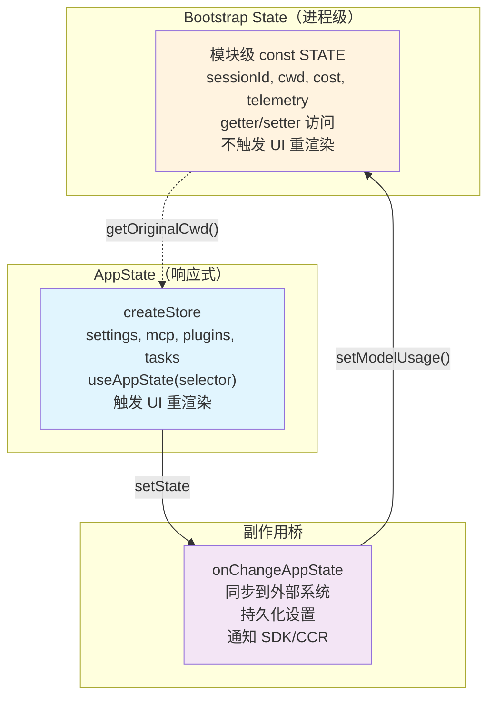

# 第 20 章：状态管理——从 Bootstrap 到 AppState

> 源码验证日期：2026-05-15，基于 commit `0d81bb6`

本章兼作卷二到卷三的过渡。

---

## 知识补全：单例模式

如果你已经理解单例模式和响应式状态管理，跳过本节。

```typescript
// 单例模式：全局唯一实例
// 方式 1：模块作用域常量（TypeScript/ES modules 天然单例）
const STATE = { count: 0 }
export function getCount() { return STATE.count }
export function setCount(n) { STATE.count = n }

// 方式 2：响应式存储（类似 Redux/Zustand）
function createStore<T>(initial: T) {
  let state = initial
  const listeners = new Set<() => void>()
  return {
    getState: () => state,
    setState: (updater: (prev: T) => T) => {
      state = updater(state)
      listeners.forEach(l => l())
    },
    subscribe: (listener) => {
      listeners.add(listener)
      return () => listeners.delete(listener)
    },
  }
}
```

Claude Code 用方式 1 实现 Bootstrap State（进程生命周期），用方式 2 实现 AppState（响应式 UI 更新）。

---

## 源码入口

```
src/bootstrap/state.ts      — Bootstrap State（模块级单例，~1759 行）
src/state/store.ts          — createStore 工厂（35 行）
src/state/AppStateStore.ts  — AppState 类型定义（~569 行）
src/state/AppState.tsx       — React 绑定
src/state/onChangeAppState.ts — 状态变更副作用
src/state/selectors.ts      — 纯计算选择器
```

---

## 逐行阅读

### 20.1 Bootstrap State：进程级单例

```typescript
// → src/bootstrap/state.ts:429-430
const STATE: State = getInitialState()
// 模块作用域的单一可变对象——进程生命周期内唯一
```

源码注释明确警告：`// DO NOT ADD MORE STATE HERE - BE JUDICIOUS WITH GLOBAL STATE`

核心字段：

```typescript
// → src/bootstrap/state.ts:45-257（简化版）
type State = {
  // 工作目录
  originalCwd: string
  projectRoot: string
  cwd: string

  // 会话
  sessionId: SessionId
  parentSessionId: string | null
  isInteractive: boolean

  // 成本追踪
  totalCostUSD: number
  modelUsage: Map<string, ModelUsage>

  // 代理
  agentColorMap: Map<string, AgentColorName>

  // 遥测
  meter: Meter
  sessionCounter: Counter
  locCounter: Counter
  commitCounter: Counter

  // SDK
  registeredHooks: Map<string, Function>
  invokedSkills: Map<string, SkillInvocation>

  // 模式标记
  kairosActive: boolean
  isRemoteMode: boolean

  // Beta header latches
  afkModeHeaderLatched: boolean
  fastModeHeaderLatched: boolean
  cacheEditingHeaderLatched: boolean
}
```

访问通过 getter/setter 对：

```typescript
// → src/bootstrap/state.ts:431-449（简化版）
export function getSessionId(): SessionId { return STATE.sessionId }
export function regenerateSessionId(): void { STATE.sessionId = randomUUID() }
export function getOriginalCwd(): string { return STATE.originalCwd }
export function setOriginalCwd(cwd: string): void { STATE.originalCwd = cwd }
```

**为什么用 getter/setter 而不是直接导出 STATE？** 因为getter/setter是 API——未来可以在 getter/setter 中加日志、验证、通知，而不改变调用方。

### 20.2 AppState：响应式存储

AppState 用一个轻量的响应式存储实现（不是 Redux/Zustand 等外部库）：

```typescript
// → src/state/store.ts:4-34（完整版）
type Store<T> = {
  getState: () => T
  setState: (updater: (prev: T) => T) => void
  subscribe: (listener: () => void) => () => void
}

function createStore<T>(initialState: T, onChange?: (state: T) => void): Store<T> {
  let state = initialState
  const listeners = new Set<() => void>()

  return {
    getState: () => state,
    setState(updater) {
      const nextState = updater(state)
      if (Object.is(state, nextState)) return  // 相同引用 → 跳过
      state = nextState
      onChange?.(state)
      listeners.forEach(l => l())
    },
    subscribe(listener) {
      listeners.add(listener)
      return () => listeners.delete(listener)
    },
  }
}
```

**关键设计**：`setState` 接受 updater 函数 `(prev) => next`。如果返回值和之前是同一引用（`Object.is`），跳过更新——不可变更新的自然优化。

### 20.3 AppState 类型

```typescript
// → src/state/AppStateStore.ts:89-452（简化版）
type AppState = {
  // 设置
  settings: SettingsJson
  verbose: boolean
  mainLoopModel: string

  // 权限
  toolPermissionContext: ToolPermissionContext

  // MCP 子系统
  mcp: {
    clients: Map<string, MCPServerConnection>
    tools: Tool[]
    commands: Command[]
    resources: McpResource[]
    pluginReconnectKey: number
  }

  // 插件
  plugins: {
    enabled: Map<string, LoadedPlugin>
    disabled: Set<string>
    commands: Command[]
    errors: Map<string, PluginError>
    installationStatus: Map<string, InstallationStatus>
    needsRefresh: boolean
  }

  // 任务
  tasks: { [taskId: string]: TaskState }

  // 代理
  agentNameRegistry: Map<string, AgentId>

  // UI 队列
  notifications: Notification[]
  elicitation: ElicitationState | null
  todos: TodoItem[]

  // 团队
  teamContext: TeamContext | null

  // Bridge
  replBridgeEnabled: boolean
  replBridgeConnected: boolean

  // ... 更多
}
```

### 20.4 React 绑定

```typescript
// → src/state/AppState.tsx:27-177（简化版）
const AppStoreContext = React.createContext<AppStateStore | null>(null)

function AppStateProvider({ children, initialState }) {
  const store = useMemo(() =>
    createStore(initialState ?? getDefaultAppState(), onChangeAppState),
  [])

  return (
    <AppStoreContext.Provider value={store}>
      {children}
    </AppStoreContext.Provider>
  )
}

// 优化的 selector hook——只在选中值变化时重渲染
function useAppState<R>(selector: (state: AppState) => R): R {
  const store = useContext(AppStoreContext)
  const [state, setState] = useState(() => selector(store.getState()))

  useEffect(() => {
    return store.subscribe(() => {
      const next = selector(store.getState())
      if (!Object.is(state, next)) setState(next)
    })
  }, [selector])

  return state
}

// 直接访问 setState
function useSetAppState() {
  const store = useContext(AppStoreContext)
  return store.setState
}
```

### 20.5 状态变更副作用

```typescript
// → src/state/onChangeAppState.ts:43-171（简化版）
function onChangeAppState(state: AppState) {
  // 权限模式变更 → 同步到 CCR/SDK
  if (state.toolPermissionContext.mode !== prevMode) {
    notifySessionMetadataChanged()
    notifyPermissionModeChanged()
  }

  // 模型变更 → 持久化到设置 + 更新 bootstrap state
  if (state.mainLoopModel !== prevModel) {
    persistModelToSettings(state.mainLoopModel)
    setModelUsage(state.mainLoopModel)
  }

  // expandedView 变更 → 持久化到全局配置
  // 设置变更 → 清除认证缓存、重新应用环境变量
}
```

`onChangeAppState` 是状态变更的桥梁——AppState 的变化自动触发外部系统同步。

### 20.6 两个状态系统的关系



**为什么两个系统？**

- Bootstrap State 先于 React 存在——进程启动时就需要 cwd、sessionId
- AppState 需要 React 集成——UI 组件用 `useAppState` 订阅变化
- 两者通过 `onChangeAppState` 桥接

### 20.7 选择器：派生状态

```typescript
// → src/state/selectors.ts（简化版）
function getViewedTeammateTask(state: AppState): TaskState | null {
  // 从 teamContext + tasks 中推导当前查看的队友任务
}

function getActiveAgentForInput(state: AppState): AgentId | null {
  // 决定用户输入路由到哪个代理
  // 优先级：leader > viewed teammate > named agent
}
```

选择器是纯函数——不修改状态，只从现有状态派生新值。

---

## 过渡桥：从拆解到建造

卷二到此结束。我们拆开了 Claude Code 的每个齿轮：

- **ch13**：模块系统——`feature()` 编译时消除、多入口构建
- **ch14**：工具接口——统一泛型类型、策略工厂、MCP 适配器
- **ch15**：Ink 终端 UI——自定义 Reconciler、Yoga 布局、差异引擎
- **ch16**：权限系统——7 种模式、分层规则引擎、安全纵深
- **ch17**：Hook 系统——25 个事件、4 种执行类型
- **ch18**：命令与插件——三种命令类型、5 种插件组件
- **ch19**：MCP 与 Bridge——适配器模式、远程会话、SDK
- **ch20**：状态管理——Bootstrap 单例 + AppState 响应式

**叙事转折**：你已经看懂了每个齿轮是怎么设计的。现在是时候自己造齿轮了。卷三的每一章都是一个完整的扩展项目——从开发到 PR 提交。

**卷二 → 卷三映射表**：

| 卷二章节 | 拆解了什么 | 卷三你要造什么 |
|---------|----------|-------------|
| ch14 工具接口 | Tool 泛型类型 | ch22 造一个新 Tool |
| ch18 命令 | 命令注册分发 | ch23 造一个斜杠命令 |
| ch19 MCP | 适配器模式 | ch24 造一个 MCP 客户端 |
| ch15 Ink | 终端渲染 | ch25 造一个输出样式 |
| ch17 Hook | Hook 执行引擎 | ch26 造一个 Hook 脚本 |
| ch14 工具 + ch19 MCP | 子代理架构 | ch27 高级扩展：任务系统与子代理 |
| 全部 | 所有扩展 | ch28 集成实战 |

---

## 调试实践

| 位置 | 看什么 |
|------|--------|
| `bootstrap/state.ts:429` | STATE 单例——进程级状态 |
| `bootstrap/state.ts:431` | getter/setter API |
| `state/store.ts:10` | createStore——35 行响应式存储 |
| `state/AppStateStore.ts:89` | AppState 类型定义 |
| `state/AppState.tsx:50` | Store 创建和 Provider |
| `state/AppState.tsx:142` | useAppState selector hook |
| `state/onChangeAppState.ts:43` | 状态变更副作用 |

---

## 试一试

### 修改 1：观察 Bootstrap State

在 `src/bootstrap/state.ts` 的关键 setter 中加：

```typescript
export function setCwdState(cwd: string) {
  console.log('[DEBUG] CWD changed:', STATE.cwd, '→', cwd)
  STATE.cwd = cwd
}
```

### 修改 2：观察 AppState 变更

在 `createStore` 的 setState 中加：

```typescript
setState(updater) {
  const nextState = updater(state)
  if (Object.is(state, nextState)) return
  console.log('[DEBUG] AppState changed, keys:', Object.keys(nextState).filter(k => state[k] !== nextState[k]))
  // ...
}
```

---

## 检查点

- **Bootstrap State**：模块级 `const STATE` 单例，getter/setter API，进程生命周期
- **AppState Store**：`createStore` 工厂，updater 函数模式，`Object.is` 相等性检查
- **AppState 类型**：settings、mcp、plugins、tasks、teamContext 等子系统
- **React 集成**：`AppStateProvider`、`useAppState(selector)`、`useSetAppState()`
- **onChangeAppState**：状态变更的副作用桥梁——持久化、通知、同步
- **选择器**：纯函数派生状态
- **两个系统的关系**：Bootstrap 先于 React，AppState 响应式，通过 onChange 桥接
