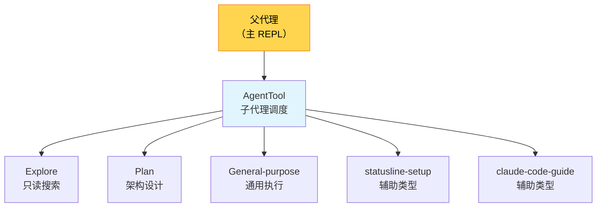

# 第 27 章：高级扩展——任务系统与子代理

> 源码验证日期：2026-05-15，基于 commit `0d81bb6`

本章深入 Claude Code 最强大的扩展机制——子代理和任务编排。

---

## 子代理架构概览

Claude Code 的子代理系统有 5 种内置类型和 3 种隔离模式：



### 5 种内置代理类型

| 类型 | 能力 | 工具访问 |
|------|------|---------|
| **Explore** | 只读搜索，快速定位代码 | Read, Grep, Glob（只读） |
| **Plan** | 架构设计，只读分析 | Read, Grep, Glob + 分析工具 |
| **General-purpose** | 通用执行，全部能力 | 所有工具 |
| **statusline-setup** | 配置状态栏 | 有限工具 |
| **claude-code-guide** | 回答使用问题 | 搜索 + 读取 |

### 3 种隔离模式

| 模式 | 实现 | 适用场景 |
|------|------|---------|
| **worktree** | Git worktree 隔离 | 文件修改任务 |
| **split-panel** | tmux/iTerm2 分屏 | 可视化并行 |
| **in-process** | 同进程内隔离 | 轻量级任务 |

---

## 关键源码：AgentTool

```typescript
// → src/tools/AgentTool/AgentTool.tsx:196（简化版）
export const AgentTool = buildTool({
  name: 'Agent',
  aliases: ['Task', 'Subagent'],
  description: 'Launch a sub-agent to handle complex tasks',

  async call(args, context, canUseTool, parentMessage, onProgress) {
    const { prompt, subagent_type, run_in_background, mode } = args

    // 路由到不同的子代理实现
    if (args.team_name) {
      // Teammate 模式——团队协作
      return spawnTeammate(args, context)
    }

    if (feature('FORK_SUBAGENT') && shouldRunAsync(args)) {
      // Fork 模式——独立进程
      return spawnForkSubagent(args, context)
    }

    // 标准模式——进程内子代理
    return runStandardAgent({
      prompt,
      subagentType: subagent_type,
      tools: getToolsForSubagent(subagent_type),
      context,
      onProgress: (progress) => {
        // 转发进度给父代理
        onProgress?.({ toolUseID, data: progress })
      },
    })
  },
})
```

### SkillTool vs AgentTool 的关键区别

```
SkillTool：
  - 注入当前上下文（能看到对话历史）
  - 不隔离——共享父代理的状态
  - 适合简短、上下文相关的操作

AgentTool：
  - 隔离上下文（新对话）
  - 独立状态——不影响父代理
  - 结果只以摘要形式返回父代理
  - 保护父上下文不被膨胀
```

---

## 任务编排模式

### 模式 1：Parallel Fan-Out

多个独立子任务并行执行：

```typescript
// 用户请求：同时搜索 3 个不同的问题
// Claude 调度 3 个 Explore 子代理并行搜索

Agent({ prompt: "Search for auth bugs", subagent_type: "Explore" })
Agent({ prompt: "Search for memory leaks", subagent_type: "Explore" })
Agent({ prompt: "Search for race conditions", subagent_type: "Explore" })
// 三个并行执行，结果汇总
```

### 模式 2：Sequential Review Chain

A 产出 → B 审查 → 父代理整合：

```typescript
// 用户请求：写代码并审查
// 第一轮：General-purpose 写代码
Agent({ prompt: "Implement feature X", subagent_type: "General-purpose" })
// 第二轮：Plan 审查设计
Agent({ prompt: "Review the implementation", subagent_type: "Plan" })
```

### 模式 3：Adversarial Dual-Analysis

对立视角并行分析，父代理仲裁：

```typescript
// 用户请求：评估方案安全性
Agent({ prompt: "Argue FOR this design", subagent_type: "Explore" })
Agent({ prompt: "Argue AGAINST this design", subagent_type: "Explore" })
// 父代理综合两种观点做决策
```

### 模式 4：Hierarchical Planner-Executor

规划者分解 → 执行者并行 → 综合者整合：

```typescript
// 用户请求：大规模重构
// 阶段 1：Plan 代理分解任务
Agent({ prompt: "Break down refactoring plan", subagent_type: "Plan" })
// 阶段 2：多个 General-purpose 并行执行
Agent({ prompt: "Execute part 1", subagent_type: "General-purpose" })
Agent({ prompt: "Execute part 2", subagent_type: "General-purpose" })
```

---

## Fork Agents + Cache Sharing

并行子代理可以共享 byte-identical prompt 前缀，节省输入 token：

```
父代理 Prompt Cache（共享前缀）
  ├── 子代理 A（独立后缀）
  └── 子代理 B（独立后缀）

前缀匹配 → Prompt Cache 命中 → 节省 ~95% 输入 token
```

Anthropic 官方数据：多 Agent 系统 15x token 倍数 vs 单次对话。Fork + Cache Sharing 显著降低这个倍数。

---

## Coordinator Mode

协调者模式（`feature('COORDINATOR_MODE')`）是多 Agent 协调的高级形态：

```
编排逻辑完全在 prompt 中（"Do not rubber-stamp weak work"）
非硬编码调度——由模型决定如何分配任务
4 种源自路由逻辑的分析型编排模式
```

---

## POSIX flock() 协调

多代理并行写文件时用文件锁协调：

```
Agent A 要写入 file.ts → flock(file.ts, LOCK_EX) → 等待
Agent B 正在写入 file.ts → flock 持有中
Agent B 完成 → flock 释放
Agent A 获得锁 → 写入
```

---

## 实战：创建自定义子代理

通过插件定义自定义代理：

```json
// plugin.json
{
  "name": "my-security-scanner",
  "agents": ["agents/security-scanner.md"]
}
```

```markdown
# agents/security-scanner.md

---
name: security-scanner
description: Scans code for security vulnerabilities
subagent_type: Explore
allowed_tools: Read, Grep, Glob
---

You are a security-focused code scanner. Your task:
1. Read the files specified by the user
2. Check for OWASP Top 10 vulnerabilities
3. Report findings with severity levels (LOW/MEDIUM/HIGH/CRITICAL)
4. Provide specific remediation suggestions

Focus on: SQL injection, XSS, CSRF, command injection,
path traversal, insecure deserialization, and authentication issues.
```

---

## 检查点

- **5 种代理类型**：Explore（只读搜索）、Plan（架构设计）、General-purpose（全能力）、statusline-setup、claude-code-guide
- **3 种隔离模式**：worktree、split-panel、in-process
- **SkillTool vs AgentTool**：Skill 注入上下文，Agent 隔离上下文
- **4 种编排模式**：Fan-Out、Sequential Review、Adversarial、Hierarchical
- **Cache Sharing**：共享 prompt 前缀节省 ~95% 输入 token
- **flock() 协调**：文件锁防止并行写冲突
- **自定义代理**：通过插件 `.md` 文件定义

**下一章**：第 28 章是卷三终章——把 ch22-ch26 造的扩展集成，跑通端到端。
