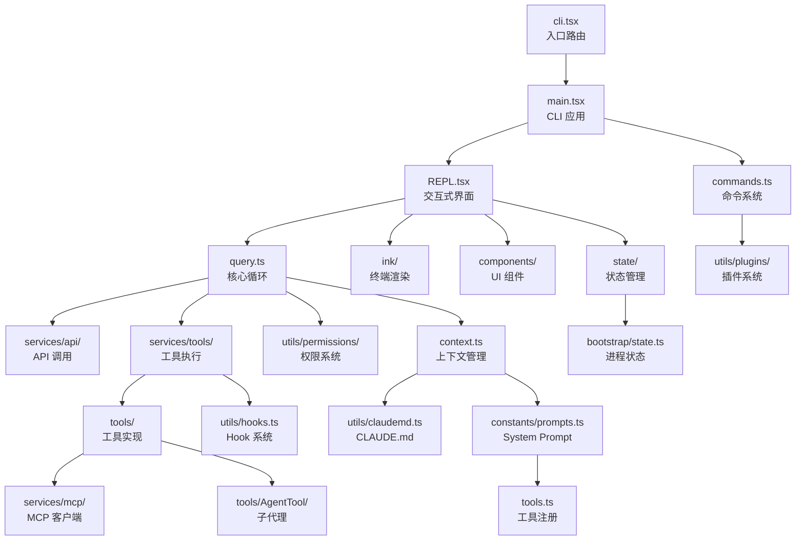

# 第 36 章：架构的全景与边界

> 源码验证日期：2026-05-15，基于 commit `0d81bb6`

---

## 依赖图复盘

Claude Code 的模块依赖图——箭头表示"依赖"：



---

## 边界模糊处

几个模块的职责边界不清晰：

### 1. `query.ts` 的职责过多

~1700 行的核心循环同时负责：
- 上下文管理（4 层压缩）
- API 调用协调
- 工具执行调度
- 错误恢复（3 阶段）
- Stop hooks 处理
- Token budget 控制

这些是否应该拆分为独立模块？实际上，AsyncGenerator 的控制流让拆分变得困难——每个阶段都需要访问完整的状态。

### 2. `main.tsx` 的体量

~4600 行，承担了：
- Commander CLI 定义
- 所有 CLI 选项注册
- 模式切换逻辑
- 初始化流程

这是 CLI 应用的常见问题——入口文件天然聚集配置逻辑。

### 3. `print.ts` 的极端

**代码质量现实**：`print.ts` 有 5,594 行，单函数 3,167 行，12 层嵌套。生产代码不是完美的——这是长期迭代的结果，不是设计缺陷。

### 4. `bootstrap/state.ts` vs `state/AppStateStore.ts`

两个状态系统的边界：
- Bootstrap：进程生命周期（cwd, sessionId, cost）
- AppState：UI 响应式（settings, mcp, plugins）

有些状态应该属于哪个系统不明确——比如 `mainLoopModel` 在 AppState 中但也在 Bootstrap 中使用。

---

## 性能工程精华

### Slot Reservation

```typescript
// → src/query.ts:1185-1221
// 默认 8K output tokens → 不够时升级到 64K
// 99% 的请求不需要 64K → 省 99% 的输出上下文
```

### Bitmap 预过滤器

```typescript
// → src/ink/screen.ts
// StylePool 用 bitmask 编码样式组合
// 比较样式只需要整数比较——不需要字符串比较
// ~50x stringWidth 调用减少
```

### 240ms 启动

```typescript
// → src/entrypoints/init.ts
// 并行 I/O：同时加载配置、TLS、代理、OAuth、遥测
// 关键路径：init() → main() → launchRepl() → Ink.render()
```

---

## 82 个 Feature Flags 揭示的产品路线图

Feature flags 是产品路线图的化石记录：

| 类别 | Flags | 暗示的方向 |
|------|-------|----------|
| **自主模式** | `PROACTIVE`, `KAIROS`, `KAIROS_BRIEF`, `KAIROS_CHANNELS`, `KAIROS_PUSH_NOTIFICATION`, `KAIROS_GITHUB_WEBHOOKS` | 后台常驻 Agent + cron 调度 + GitHub webhook |
| **多代理** | `COORDINATOR_MODE`, `FORK_SUBAGENT`, `TEAMMEM` | Coordinator 多代理协调 + 并行 fork 子代理 |
| **社交** | `BUDDY` | 电子宠物系统 |
| **语音** | `VOICE_MODE` | 语音交互 |
| **浏览器** | `WEB_BROWSER_TOOL` | 浏览器自动化 |
| **安全** | `BASH_CLASSIFIER` | AI 驱动的 Bash 风险分类 |
| **扩展** | `EXPERIMENTAL_SKILL_SEARCH`, `AGENT_TRIGGERS`, `AGENT_TRIGGERS_REMOTE` | 动态工具发现 + 定时任务 |

---

## 全书回顾

36 章的内容覆盖了 Claude Code 的完整架构：

**卷一：追踪旅程**（ch01-12）
- 从用户按下回车到终端显示回复的完整路径
- 八站：入口 → 消息 → 查询引擎 → 权限 → 工具执行 → 渲染 → 状态

**卷二：拆解齿轮**（ch13-20）
- 每个模块的内部设计模式
- 模块系统、工具接口、Ink/终端 UI、权限、Hook、命令/插件、MCP、状态管理

**卷三：造新齿轮**（ch21-28）
- 亲手创建 Tool、Command、MCP Client、Output Style、Hook
- 高级扩展：子代理和任务编排
- 集成实战

**卷四：设计反思**（ch29-36）
- 每个设计决策的"为什么"
- 被否决的替代方案
- 横向对比和开放性问题

---

## 开放性问题

这本书没有回答的问题——留给读者思考：

1. **Agentic Loop 的终极形态**：`while(true)` 循环是否会被更结构化的编排框架取代？
2. **权限系统的边界**：AI 分类器的准确率是否足够高？误判的成本是什么？
3. **多代理的经济学**：15x token 倍数是否可以通过更好的架构降低？
4. **终端 UI 的未来**：GPU 渲染是否会取代 ANSI 输出？
5. **配置即代码的演化**：CLAUDE.md 会不会演化成完整的编程语言？

---

## 设计原则总结

全书贯穿的设计原则，来自 Claude Code 源码分析论文（VILA-Lab, arXiv 2604.14228）：

| 人类价值观 | 设计原则 | 源码体现 |
|-----------|---------|---------|
| **人类决策权** | deny-first | `isReadOnly` 默认 false，权限默认 ask |
| **人类决策权** | graduated trust | default → acceptEdits → auto 渐进式放手 |
| **人类决策权** | append-only state | `state = { ...state, ...updates }` 不可变更新 |
| **人类决策权** | externalized policy | CLAUDE.md 文件即配置 |
| **安全/隐私** | defense in depth | 8+ 层安全防线 |
| **安全/隐私** | reversibility-weighted risk | `maxResultSizeChars` 大文件存临时文件 |
| **安全/隐私** | isolated subagent boundaries | 子代理隔离上下文，只返回摘要 |
| **可靠执行** | context as scarce resource | 4 层压缩管线、Prompt Cache |
| **可靠执行** | graceful recovery | 3 阶段错误恢复 |
| **能力放大** | minimal scaffolding + maximal harness | React 模型 + 自定义渲染引擎 |
| **能力放大** | composable extensibility | Hooks → Skills → Plugins → MCP |
| **上下文适配** | transparent file-based config | CLAUDE.md 四级加载 |

---

**成本经济学暗线**：

| 设计决策 | 经济驱动 |
|---------|---------|
| System prompt 静态/动态分区 | Prompt Cache 命中省 90% 输入成本 |
| 工具列表排序 | 保证缓存稳定性 |
| Slot Reservation | 8K→64K 按需升级省 99% 上下文 |
| 多 Agent 系统 | 15x token 倍数（需要 Cache Sharing 缓解） |
| Haiku vs Opus | 37.5x 成本差距（auto 模式分类器用 Haiku 还是 Opus？） |

每个设计决策背后都有经济账。理解了这些经济约束，就能理解为什么 Claude Code 的架构是这样的——而不是那样的。
