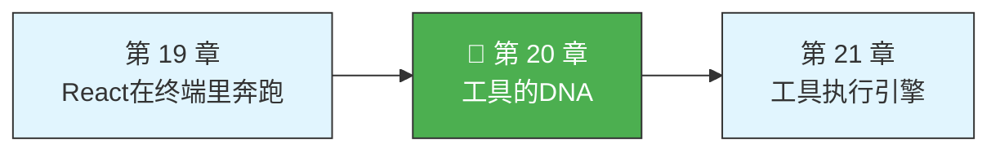

# 第 20 章：工具的 DNA

> 源码验证日期：2026-05-15，基于 commit `0d81bb6`

你已经在卷一见过工具了。AI 说"我要读一个文件"，BashTool 跑去执行命令，ReadTool 把文件内容搬回来。每一个工具都是不同的：有的读文件，有的写文件，有的搜索代码，有的访问网页。

但你有没有想过一个问题：Claude Code 里 30 多个工具，它们千差万别，系统是怎么用统一的方式管理它们的？

答案在这四个字母里：**T-o-o-l**。`Tool` 是一个类型定义，它规定了所有工具必须长什么样、必须能做什么。就像 DNA 决定了所有生物用同一套遗传密码一样，`Tool` 类型决定了所有工具用同一套接口与外界交互。

---

## 路线图



---

## 这是什么

想象一个大型工厂。工厂里有几十种工位：焊接、喷涂、质检、包装。每个工位做的事情完全不同，但它们都遵循同一套标准操作流程：

1. **工作手册**——描述这个工位能做什么
2. **执行任务**——接收原材料（输入），产出成品（输出）
3. **安全检查**——在执行之前确认操作是允许的

Claude Code 的 `Tool` 类型就是这个标准操作流程。

---

## 打开源码

Tool 的核心定义在 `src/Tool.ts` 里。这个文件有将近 800 行，但我们只需要关注几个关键位置：

- `Tool<Input, Output, P>` 类型——这是 DNA 的主体
- `ToolDef<Input, Output, P>` 类型——这是简化的定义格式
- `buildTool` 函数——这是工具的工厂方法

---

## 它怎么工作

### 泛型：三个类型参数

打开 `Tool` 类型的定义，你首先会看到这一行：

```typescript
export type Tool<
  Input extends AnyObject = AnyObject,
  Output = unknown,
  P extends ToolProgressData = ToolProgressData,
> = {
  // ... 几百行定义 ...
}
```

三个尖括号里的东西就是泛型参数：

**Input extends AnyObject**——输入的形状。每个工具接收的参数不同：BashTool 接收一个命令字符串，ReadTool 接收一个文件路径。`Input` 规定了"这个工具的输入长什么样"。

**Output**——输出的形状。工具执行完返回什么。默认值是 `unknown`，意思是"我不管你返回什么"。

**P extends ToolProgressData**——进度数据的形状。有些工具执行时间很长（比如跑一个测试套件），需要实时报告进度。

这三个参数组合在一起，就精确描述了一个工具的"数据指纹"。

### 三个核心方法

`Tool` 类型定义了几十个方法，但真正核心的只有三个。

**第一个：prompt()——工作手册。**

```typescript
prompt(options: {
  getToolPermissionContext: () => Promise<ToolPermissionContext>
  tools: Tools
  agents: AgentDefinition[]
}): Promise<string>
```

`prompt()` 返回一段文字，告诉 AI 这个工具是什么、什么时候该用它、怎么用它。这段文字会被塞进系统提示词里，成为 AI 的"工作手册"。

**第二个：call()——执行任务。**

```typescript
call(
  args: z.infer<Input>,
  context: ToolUseContext,
  canUseTool: CanUseToolFn,
  parentMessage: AssistantMessage,
  onProgress?: ToolCallProgress<P>,
): Promise<ToolResult<Output>>
```

这是工具的心脏。当 AI 决定使用某个工具时，系统会调用这个工具的 `call()` 方法，传入参数，拿到结果。

**第三个：checkPermissions()——安全检查。**

```typescript
checkPermissions(
  input: z.infer<Input>,
  context: ToolUseContext,
): Promise<PermissionResult>
```

在 `call()` 被真正执行之前，系统会先调用 `checkPermissions()`。这个方法决定：这个工具这次被调用，是否需要用户授权？

**三步的执行顺序**是严格固定的：先 `validateInput()`，再 `checkPermissions()`，最后 `call()`。就像机场安检：先查机票，再查登机资格，最后登机。任何一步失败，后续都不会执行。

### inputSchema：Zod 的双重身份

`Tool` 类型中有一个字段叫 `inputSchema`，它的类型是 `Input`。但在实际使用中，这个字段几乎总是被赋值为一个 Zod schema。

Zod 做了两件事：

1. **运行时验证**——当 AI 传过来一段 JSON 参数时，Zod 会检查这段 JSON 是否符合预期
2. **编译时类型推导**——通过 `z.infer<Schema>` 语法，TypeScript 能从 Zod schema 反推出对应的 TypeScript 类型

以 TaskGetTool 为例：

```typescript
const inputSchema = lazySchema(() =>
  z.strictObject({
    taskId: z.string().describe('The ID of the task to retrieve'),
  }),
)
```

`z.strictObject` 不允许出现 schema 里没有定义的额外字段。AI 有时候会"多给"参数，`strictObject` 会把这些多余的参数挡在门外。

`lazySchema` 把 schema 的创建推迟到第一次被访问的时候，避免模块加载的循环依赖问题。

### ToolDef 和 buildTool：简化的定义方式

如果你每次写一个工具都要实现 `Tool` 里的所有方法，那会非常繁琐。于是有了 `ToolDef` 和 `buildTool`。

`ToolDef` 把 `Tool` 类型拆成两部分：必须实现的（name、inputSchema、call、prompt 等）和可选实现的（isEnabled、isReadOnly 等）。

`buildTool` 函数帮你填空：

```typescript
const TOOL_DEFAULTS = {
  isEnabled: () => true,
  isConcurrencySafe: (_input?) => false,   // 默认不安全
  isReadOnly: (_input?) => false,           // 默认是写操作
  isDestructive: (_input?) => false,
  checkPermissions: (input, _ctx?) =>
    Promise.resolve({ behavior: 'allow', updatedInput: input }),
}

export function buildTool<D extends AnyToolDef>(def: D): BuiltTool<D> {
  return {
    ...TOOL_DEFAULTS,         // 先铺默认值
    userFacingName: () => def.name,
    ...def,                   // 用具体实现覆盖
  } as BuiltTool<D>
}
```

注意默认值的设计哲学：

- `isConcurrencySafe` 默认 `false`——**假设不安全**，这是"fail-closed"的思路
- `isReadOnly` 默认 `false`——**假设是写操作**，同样是 fail-closed
- `checkPermissions` 默认放行——通用的权限系统在更上层已经检查过了

### 为什么是接口，不是继承

Claude Code 选择接口（`type`）而不是类继承有三个原因：

1. **TypeScript 的类型是结构化的**——只要对象的形状匹配 `Tool` 类型，它就自动满足
2. **组合比继承更灵活**——将来需要混入额外能力（"可缓存"、"可重试"），组合可以轻松做到
3. **工具的多样性不适合继承树**——有些工具只读，有些可写。有些需要权限检查，有些不需要。接口没有这个问题

### MCPTool：原型 + 克隆模式

MCP 工具使用了一个特殊的设计：一个骨架对象在运行时被每个 MCP 服务器的具体实现覆盖：

```typescript
// MCPTool.ts：骨架
// 所有方法都是 stub，inputSchema 使用 z.object({}).passthrough()

// client.ts：运行时组装
return {
  ...MCPTool,                       // 从骨架开始
  name: fullyQualifiedName,         // 覆盖名称
  mcpInfo: { serverName, toolName },
  isMcp: true,
  isConcurrencySafe() {
    return tool.annotations?.readOnlyHint ?? false  // 从 MCP 协议获取
  },
  call(args, context) {
    // 完整的 MCP 协议调用
  },
}
```

为什么用骨架而不是直接创建？因为 MCPTool 需要一个共享的基础结构（`isMcp` 标志、默认的 `renderToolUseMessage` 等），具体服务器只覆盖自己需要的部分。

---

## 常见错误与检查方法

| 常见错误 | 检查方法 |
|---------|---------|
| 工具参数验证失败 | 检查 `inputSchema` 是否使用了 `z.strictObject`——多余的参数会被拒绝 |
| Schema 循环依赖 | 使用 `lazySchema` 延迟构建 |
| 工具并发安全问题 | 默认 `isConcurrencySafe` 为 false——明确标记只读工具 |
| MCP 工具名称冲突 | MCP 工具自动重命名为 `mcp__server__tool` 格式 |

---

## 试试看

### 练习一：比较工具复杂度

在 `getAllBaseTools()` 的返回前添加计数器，统计每个工具的方法数量：

```typescript
const tools = getAllBaseTools()
for (const tool of tools) {
  const methodCount = Object.getOwnPropertyNames(tool).filter(
    k => typeof tool[k] === 'function'
  ).length
  console.log(`[DEBUG] ${tool.name}: ${methodCount} methods`)
}
```

观察哪些工具最复杂（Bash、Agent 通常最多），哪些最简单。

### 练习二：读一个工具的 prompt

打开任意一个工具目录下的 `prompt.ts` 文件（比如 `src/tools/TaskGetTool/prompt.ts`），读一读那个工具的工作手册。这是理解工具行为的好方法——`prompt()` 里写的，就是 AI 看到的。

### 练习三：观察 GlobTool 的完整实现

打开 `src/tools/GlobTool/GlobTool.ts`，这是一个最简单的工具——`isConcurrencySafe: true`，`isReadOnly: true`，`satisfies ToolDef`。通过它建立对"一个干净的工具实现长什么样"的直觉。

---

## 检查点

1. **三个泛型参数** `Input`、`Output`、`P` 规定了工具的数据指纹
2. **三个核心方法**：`prompt()` 告诉 AI 怎么用、`checkPermissions()` 做安全检查、`call()` 执行任务
3. **inputSchema** 用 Zod 做运行时验证和编译时类型推导——一份定义，两份收益
4. **ToolDef + buildTool** 提供了简化的定义方式——默认值采用 fail-closed 设计
5. **选择接口而不是继承**——结构化类型系统 + 组合模式更适合工具的多样性
6. **MCPTool 用原型 + 克隆模式**——骨架在运行时被每个服务器覆盖

你看到了工具的 DNA——那个统一的接口。下一章，我们看看当 AI 真正调用工具时，引擎是怎么驱动完整生命周期的。

---

[上一章：React在终端里奔跑](./第19章-React在终端里奔跑.md) | [下一章：工具执行引擎](./第21章-工具执行引擎.md)
