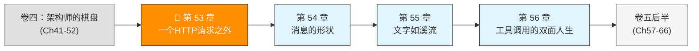
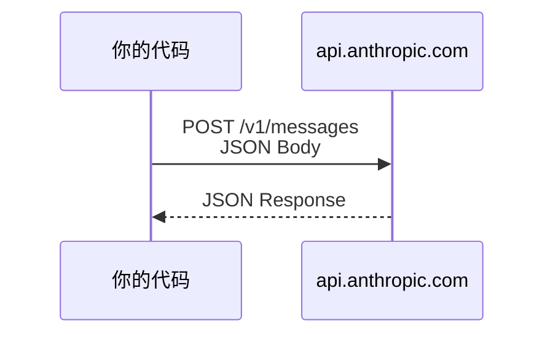

# 第 53 章：一个 HTTP 请求之外

> 卷五协议验证日期：2026-05-17，基于 Anthropic Messages API 最新版（2023-06-01 version header）

你在卷一到卷四里追踪了 Claude Code 的每一层源码。现在，我们换个方向——不从别人的源码出发，而是从零开始，自己实现一套能与 Claude 通信的协议栈。

这一切的起点，是一个 HTTP 请求。

---

## 路线图



---

## 法则一：一切始于 HTTP

Agent 框架再复杂，底层通信只有一件事：把一个 JSON 对象通过 HTTPS 发出去，再把一个 JSON 对象收回来。



没有 WebSocket，没有 gRPC，没有自定义协议。就是 HTTPS + JSON。

---

## 第一步：认证与 Headers

Messages API 需要三个关键 header：

```
POST /v1/messages
x-api-key: sk-ant-api03-xxxxxxxxxxxxx
anthropic-version: 2023-06-01
Content-Type: application/json
```

`anthropic-version` 是 Anthropic 的 API 版本控制机制。你传什么版本，API 就用那个版本的语义处理你的请求。当前稳定版本是 `2023-06-01`。

> **为什么用 header 版本而不是 URL 版本？** 因为 API 的语义变化可能很细微——某个字段的默认值变了、某个错误码的含义调整了。用 header 版本控制，你可以精确锁定 API 的行为，不会被服务端升级意外影响。

---

## 第二步：最小的请求

一个能成功返回的最小 Messages API 请求只有三个必填字段：

```typescript
// → src/my-agent/api-client.ts
const response = await fetch("https://api.anthropic.com/v1/messages", {
  method: "POST",
  headers: {
    "x-api-key": process.env.ANTHROPIC_API_KEY!,
    "anthropic-version": "2023-06-01",
    "content-type": "application/json",
  },
  body: JSON.stringify({
    model: "claude-sonnet-4-6",
    max_tokens: 1024,
    messages: [{ role: "user", content: "你好，Claude。" }],
  }),
});

const data = await response.json();
console.log(data.content[0].text);
```

这就是全部的"协议"——没有 SDK、没有框架、没有依赖。30 行代码。

---

## 第三步：理解响应结构

响应 JSON 的结构非常稳定：

```typescript
// → src/my-agent/types.ts
interface MessageResponse {
  id: string;           // "msg_01XFDUDYJgAACzvnptvVo4EL"
  type: "message";      // 固定值
  role: "assistant";    // 固定值
  model: string;        // 实际使用的模型
  content: ContentBlock[];  // 回复内容（核心）
  stop_reason: "end_turn" | "tool_use" | "max_tokens" | "stop_sequence";
  stop_sequence: string | null;
  usage: {
    input_tokens: number;
    output_tokens: number;
    cache_creation_input_tokens: number;
    cache_read_input_tokens: number;
  };
}
```

核心字段是 `content`——它是一个数组，每个元素有不同的 `type`。最简单的回复只有文本：

```json
{
  "id": "msg_01XxX...",
  "type": "message",
  "role": "assistant",
  "content": [
    { "type": "text", "text": "你好！有什么我可以帮助你的吗？" }
  ],
  "stop_reason": "end_turn",
  "usage": { "input_tokens": 10, "output_tokens": 15 }
}
```

---

## 第四步：封装 API Client

把上面的裸 fetch 封装成一个可复用的 client：

```typescript
// → src/my-agent/api-client.ts
export interface ApiClientConfig {
  apiKey: string;
  baseUrl?: string;  // 默认 https://api.anthropic.com/v1
}

export class ApiClient {
  private baseUrl: string;
  private headers: Record<string, string>;

  constructor(config: ApiClientConfig) {
    this.baseUrl = config.baseUrl ?? "https://api.anthropic.com/v1";
    this.headers = {
      "x-api-key": config.apiKey,
      "anthropic-version": "2023-06-01",
      "content-type": "application/json",
    };
  }

  async createMessage(params: MessageCreateParams): Promise<MessageResponse> {
    const response = await fetch(`${this.baseUrl}/messages`, {
      method: "POST",
      headers: this.headers,
      body: JSON.stringify(params),
    });

    if (!response.ok) {
      const error = await response.json();
      throw new ApiError(response.status, error);
    }

    return response.json();
  }
}
```

---

## 第五步：错误处理

Messages API 用两种方式报告错误：

**HTTP 状态码**：4xx = 你的问题，5xx = 服务端问题。

**错误体格式**：

```json
{
  "type": "error",
  "error": {
    "type": "invalid_request_error",
    "message": "max_tokens: must be greater than thinking budget_tokens"
  }
}
```

常见的错误类型：

| 错误 type | HTTP | 含义 |
|-----------|------|------|
| `invalid_request_error` | 400 | 请求参数不合法 |
| `authentication_error` | 401 | API key 无效 |
| `permission_error` | 403 | 无权使用该模型 |
| `not_found_error` | 404 | 模型不存在 |
| `rate_limit_error` | 429 | 请求太频繁 |
| `api_error` | 500 | 服务端临时故障 |
| `overloaded_error` | 529 | 服务过载，稍后重试 |

**实现**：

```typescript
// → src/my-agent/api-client.ts
export class ApiError extends Error {
  constructor(
    public status: number,
    public body: { error: { type: string; message: string } }
  ) {
    super(`Anthropic API error ${status}: ${body.error.message}`);
  }

  get isRetryable(): boolean {
    return this.status === 429 || this.status === 529 || this.status >= 500;
  }
}
```

---

## 试试看

**任务 1**：用上面的 `ApiClient` 发一条消息，打印 `response.content[0].text`。

**任务 2**：故意把 `max_tokens` 设为 0（不传其他参数），观察错误信息的结构。

**任务 3**：发一条带 system prompt 的消息：
```typescript
await client.createMessage({
  model: "claude-sonnet-4-6",
  max_tokens: 1024,
  system: "你是一个只用文言文回答的助手。",
  messages: [{ role: "user", content: "今天天气如何？" }],
});
```
观察 system prompt 如何影响回答风格。

---

## 常见错误

| 现象 | 原因 | 解法 |
|------|------|------|
| `401 authentication_error` | API key 未设置或错误 | 检查 `ANTHROPIC_API_KEY` 环境变量 |
| `400 invalid_request_error: "messages: required"` | 忘了传 `messages` | 检查 body 结构 |
| `404 not_found_error` | 模型名拼写错误 | 对照[模型列表](https://docs.anthropic.com/en/docs/about-claude/models) |
| 响应为空 | `max_tokens` 设为 0 | `max_tokens: 0` 是缓存预热模式，不返回内容 |
| `529 overloaded_error` | 服务过载 | 等几秒后重试，实现指数退避 |

---

## 检查点

- [ ] 理解了 Messages API 是纯 HTTPS + JSON 协议
- [ ] 能从头实现一个最小 API Client（不依赖 SDK）
- [ ] 理解了 `anthropic-version` header 的版本控制机制
- [ ] 能区分六种错误类型并实现重试判断
- [ ] 知道 `content` 是数组结构（不是纯字符串）

---

[← 上一章：第 52 章 稳定、历史与未来](../卷四-架构师的棋盘/第52章-稳定历史与未来.md) | [下一章：第 54 章 消息的形状 →](./第54章-消息的形状.md)
