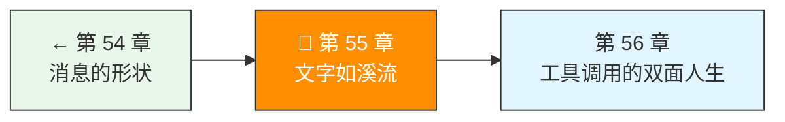
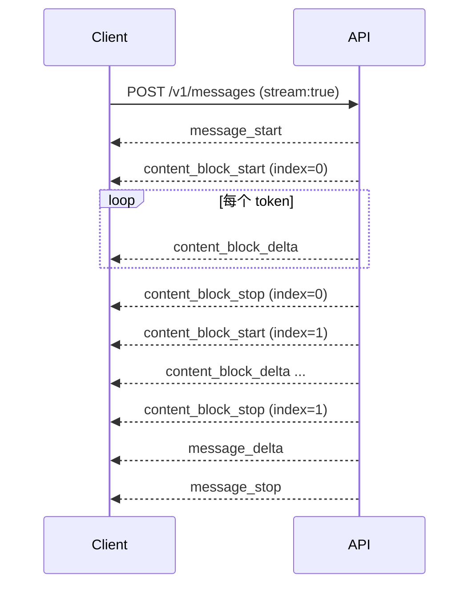

# 第 55 章：文字如溪流

> 卷五协议验证日期：2026-05-17，基于 Anthropic SSE Streaming 规范

非流式响应像发邮件——全部写完再发。流式响应像打电话——一边想一边说。对 Agent 来说，流式不仅仅是体验问题：它让 Agent 能实时响应用户中断，也是工具调用的基础。

---

## 路线图



---

## 法则三：流是默认，不是可选

只需在请求里加 `stream: true`，响应就从 JSON 变成 SSE 事件流：

```bash
curl https://api.anthropic.com/v1/messages \
  -H "x-api-key: $ANTHROPIC_API_KEY" \
  -H "anthropic-version: 2023-06-01" \
  -H "content-type: application/json" \
  -d '{
    "model": "claude-sonnet-4-6",
    "max_tokens": 1024,
    "stream": true,
    "messages": [{"role": "user", "content": "讲个笑话"}]
  }'
```

响应不再是 JSON 对象，而是一个 `text/event-stream`：

```
event: message_start
data: {"type":"message_start","message":{"id":"msg_...","type":"message","role":"assistant","model":"claude-sonnet-4-6","usage":{"input_tokens":10}}}

event: content_block_start
data: {"type":"content_block_start","index":0,"content_block":{"type":"text","text":""}}

event: content_block_delta
data: {"type":"content_block_delta","index":0,"delta":{"type":"text_delta","text":"为什么"}}

event: content_block_delta
data: {"type":"content_block_delta","index":0,"delta":{"type":"text_delta","text":"程序员"}}

event: content_block_delta
data: {"type":"content_block_delta","index":0,"delta":{"type":"text_delta","text":"分不清"}}
...
```

---

## SSE 事件类型完整规范

流式传输共有 7 种事件，按生命周期排列：



| 事件 | 含义 | 关键数据 | 次数 |
|------|------|---------|------|
| `message_start` | 消息开始 | `message.id, message.model` | 1 |
| `content_block_start` | 内容块开始 | `index, content_block.type` | 每块 1 |
| `content_block_delta` | 增量数据 | `index, delta.type, delta.text/thinking/partial_json` | 每块 N |
| `content_block_stop` | 内容块结束 | `index` | 每块 1 |
| `message_delta` | 消息元数据更新 | `delta.stop_reason, usage.output_tokens` | 1 |
| `message_stop` | 消息结束 | — | 1 |
| `ping` | 保活 | — | 任意 |

---

## Delta 子类型

`content_block_delta` 的 `delta.type` 有三种：

| delta.type | 对应 content block | 含义 |
|-----------|-------------------|------|
| `text_delta` | `text` | 文本增量 |
| `thinking_delta` | `thinking` | 思考文本增量 |
| `input_json_delta` | `tool_use` | 工具参数 JSON 增量 |
| `signature_delta` | `thinking` | 思考签名增量 |

---

## 实现 SSE 解析器

SSE 格式很简单：`event:` + `data:` + 空行分隔。

```typescript
// → src/my-agent/sse-parser.ts
export interface SSEEvent {
  event: string;
  data: string;
}

export function parseSSE(chunk: string): SSEEvent[] {
  const events: SSEEvent[] = [];
  const lines = chunk.split("\\n");

  let currentEvent = "";
  let currentData = "";

  for (const line of lines) {
    if (line.startsWith("event: ")) {
      currentEvent = line.slice(7);
    } else if (line.startsWith("data: ")) {
      currentData = line.slice(6);
    } else if (line === "" && currentData) {
      events.push({ event: currentEvent || "message", data: currentData });
      currentEvent = "";
      currentData = "";
    }
  }

  return events;
}
```

---

## 实现 StreamParser（AsyncGenerator）

SSE 解析器上面一层是需求驱动的流解析器。核心思想：把 HTTP Response body 的 `ReadableStream` 包装成异步可迭代器。

```typescript
// → src/my-agent/stream-parser.ts
export type StreamEvent =
  | { type: "message_start"; message: MessageStartData }
  | { type: "content_block_start"; index: number; block: ContentBlockStart }
  | { type: "content_block_delta"; index: number; delta: Delta }
  | { type: "content_block_stop"; index: number }
  | { type: "message_delta"; delta: MessageDeltaData }
  | { type: "message_stop" }
  | { type: "error"; error: Error };

export async function* parseStream(
  response: Response
): AsyncGenerator<StreamEvent> {
  if (!response.ok) {
    throw new ApiError(response.status, await response.json());
  }

  const reader = response.body!.getReader();
  const decoder = new TextDecoder();
  let buffer = "";

  try {
    while (true) {
      const { done, value } = await reader.read();
      if (done) break;

      buffer += decoder.decode(value, { stream: true });
      const events = parseSSEBuffer(buffer);

      for (const sse of events) {
        const json = JSON.parse(sse.data);
        switch (sse.event) {
          case "message_start":
            yield { type: "message_start", message: json.message };
            break;
          case "content_block_start":
            yield {
              type: "content_block_start",
              index: json.index,
              block: json.content_block,
            };
            break;
          case "content_block_delta":
            yield {
              type: "content_block_delta",
              index: json.index,
              delta: json.delta,
            };
            break;
          case "content_block_stop":
            yield { type: "content_block_stop", index: json.index };
            break;
          case "message_delta":
            yield { type: "message_delta", delta: json.delta };
            break;
          case "message_stop":
            yield { type: "message_stop" };
            break;
        }
      }

      // 更新 buffer（去掉已消费的部分）
      buffer = getRemainingBuffer(buffer);
    }
  } finally {
    reader.releaseLock();
  }
}
```

---

## 实战：实时渲染文本

```typescript
// → src/my-agent/stream-example.ts
async function streamText(client: ApiClient, prompt: string) {
  const response = await client.createMessageStream({
    model: "claude-sonnet-4-6",
    max_tokens: 1024,
    messages: [{ role: "user", content: prompt }],
  });

  let textBuffer = "";
  for await (const event of parseStream(response)) {
    if (
      event.type === "content_block_delta" &&
      event.delta.type === "text_delta"
    ) {
      process.stdout.write(event.delta.text);  // 即时输出
      textBuffer += event.delta.text;
    }
  }
  return textBuffer;
}
```

---

## 工具调用的流式处理

当模型决定调用工具时，流里会有特殊的 delta 类型：

```
event: content_block_start
data: {"type":"content_block_start","index":1,"content_block":{"type":"tool_use","id":"toolu_01...","name":"get_weather"}}

event: content_block_delta
data: {"type":"content_block_delta","index":1,"delta":{"type":"input_json_delta","partial_json":"{\\"city\\":"}}

event: content_block_delta
data: {"type":"content_block_delta","index":1,"delta":{"type":"input_json_delta","partial_json":"\\"北京\\"}"}}
```

**工具参数的累积**：

```typescript
// → src/my-agent/tool-call-parser.ts
export function accumulateToolCall(
  deltas: { type: "input_json_delta"; partial_json: string }[]
): object {
  const json = deltas.map(d => d.partial_json).join("");
  return JSON.parse(json);
}
```

`input_json_delta` 不会一次性返回完整 JSON——它是一块一块地来，你需要积累所有的 `partial_json` 再解析。

---

## 试试看

**任务 1**：实现一个计时器——统计从发出请求到收到第一个 `text_delta` 的延迟（TTFT: Time To First Token）。

**任务 2**：在流中故意断开网络（Ctrl+C），实现断线重连。注意：流不支持从中间恢复，需要重新发送完整请求。

**任务 3**：实现进度提示——当超过 3 秒没有新 delta 时，显示"思考中…"。

---

## 常见错误

| 现象 | 原因 | 解法 |
|------|------|------|
| `parseSSE` 丢事件 | 数据跨 chunk 边界 | 用 buffer 累积，按换行切割后保留尾部 |
| JSON parse 失败 | `input_json_delta` 拼接的 JSON 不完整 | 只在 `content_block_stop` 后解析 |
| 内存泄漏 | 流未释放 | `finally` 中 `reader.releaseLock()` |
| 连接中断后数据不全 | SSE 不支持断点续传 | 重发完整请求 |

---

## 检查点

- [ ] 理解了 SSE 协议的 7 种事件类型
- [ ] 实现了 SSE 解析器和 StreamParser（AsyncGenerator）
- [ ] 理解了三种 delta 子类型（text/thinking/input_json）
- [ ] 能实时渲染流式文本
- [ ] 能累积 `input_json_delta` 解析工具调用参数

---

[← 上一章：第 54 章 消息的形状](./第54章-消息的形状.md) | [下一章：第 56 章 工具调用的双面人生 →](./第56章-工具调用的双面人生.md)
