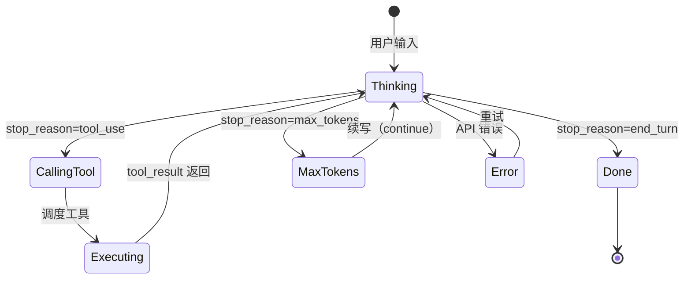

# 第 63 章：循环的引擎

> 卷五协议验证日期：2026-05-17，基于 Agentic Loop 模式和本书卷一/卷四设计分析

这是卷五的基石章——把所有协议组装成一个能自主工作的 Agent 引擎。

---

## 路线图


---

## 法则七：Agent 就是循环加工具

Agent 的形式化定义：

```
Agent = LLM + Tools + Loop + ContextManager
```

循环是引擎——它把单次 API 调用变成持续的自主行动。

---

## Agent Loop 的状态机



---

## 核心实现

```typescript
// → src/my-agent/agent-loop.ts
import type {
  MessageParam,
  MessageResponse,
  ToolDefinition,
  ToolUseBlock,
  ToolResultBlock,
} from "./types";

export interface AgentConfig {
  model: string;
  maxTokens: number;
  maxIterations: number;   // 防止无限循环
  maxContextTokens: number; // 上下文窗口上限
  tools: ToolDefinition[];
  systemPrompt?: string;
  thinking?: ThinkingConfig;
  outputConfig?: OutputConfig;
}

export interface TurnEvent {
  type: "thinking" | "tool_call" | "tool_result" | "response" | "error" | "compaction";
  turnNumber: number;
  data: unknown;
}

export class AgentLoop {
  private messages: MessageParam[] = [];
  private turnCount = 0;
  private totalTokens = { input: 0, output: 0 };

  constructor(
    private client: ApiClient,
    private toolExecutor: ToolExecutor,
    private config: AgentConfig
  ) {}

  async *run(userMessage: string): AsyncGenerator<TurnEvent> {
    this.messages.push({ role: "user", content: userMessage });

    while (this.turnCount < this.config.maxIterations) {
      this.turnCount++;

      // 1. 上下文管理：检查是否超限
      const contextSize = this.estimateContextSize();
      if (contextSize > this.config.maxContextTokens * 0.8) {
        yield { type: "compaction", turnNumber: this.turnCount, data: { contextSize } };
        await this.compact();
      }

      // 2. 调用模型
      let response: MessageResponse;
      try {
        response = await this.client.createMessage({
          model: this.config.model,
          max_tokens: this.config.maxTokens,
          system: this.config.systemPrompt,
          messages: this.messages,
          tools: this.config.tools,
          thinking: this.config.thinking,
          output_config: this.config.outputConfig,
        });
      } catch (err) {
        yield {
          type: "error",
          turnNumber: this.turnCount,
          data: { error: err as Error, retryable: this.isRetryable(err) },
        };
        // 可重试的错误等待后继续
        if (this.isRetryable(err)) {
          await this.delay(2000);
          continue;
        }
        throw err;
      }

      // 3. 更新用量
      this.totalTokens.input += response.usage.input_tokens;
      this.totalTokens.output += response.usage.output_tokens;

      // 4. 添加 assistant 回复到历史
      this.messages.push({ role: "assistant", content: response.content });

      // 5. 根据 stop_reason 决定下一步
      switch (response.stop_reason) {
        case "end_turn":
          yield {
            type: "response",
            turnNumber: this.turnCount,
            data: { response, totalTokens: { ...this.totalTokens } },
          };
          return;

        case "tool_use": {
          const toolCalls = this.extractToolCalls(response);
          yield {
            type: "tool_call",
            turnNumber: this.turnCount,
            data: { toolCalls },
          };

          // 执行工具
          const results = await this.executeTools(toolCalls);
          yield {
            type: "tool_result",
            turnNumber: this.turnCount,
            data: { results },
          };

          // 添加结果到历史
          this.messages.push({ role: "user", content: results });
          continue;  // 继续循环
        }

        case "max_tokens":
          // 续写：给一个 continuation 提示
          yield {
            type: "response",
            turnNumber: this.turnCount,
            data: { response, note: "max_tokens reached, continuing" },
          };
          this.messages.push({
            role: "user",
            content: "请继续。你之前的回答被截断了。",
          });
          continue;

        case "stop_sequence":
          yield {
            type: "response",
            turnNumber: this.turnCount,
            data: { response, stopReason: "stop_sequence" },
          };
          return;
      }
    }

    throw new Error(`超过最大迭代次数: ${this.config.maxIterations}`);
  }

  // === 工具执行 ===

  private extractToolCalls(response: MessageResponse): ToolUseBlock[] {
    return response.content.filter(
      (b): b is ToolUseBlock => b.type === "tool_use"
    );
  }

  private async executeTools(toolCalls: ToolUseBlock[]): Promise<ToolResultBlock[]> {
    // 并行执行独立的工具调用
    return Promise.all(
      toolCalls.map(tc => this.toolExecutor.execute(tc))
    );
  }

  // === 上下文管理 ===

  private estimateContextSize(): number {
    return JSON.stringify(this.messages).length / 4;  // 粗略估计
  }

  private async compact(): Promise<void> {
    // 压缩策略：用模型摘要对话历史
    const summary = await this.client.createMessage({
      model: this.config.smallModel ?? this.config.model,
      max_tokens: 1024,
      messages: [
        ...this.messages.slice(0, -3),
        { role: "user", content: "请用中文简洁摘要以上对话的关键信息。" },
      ],
    });

    const summaryText = summary.content
      .filter(b => b.type === "text")
      .map(b => b.text)
      .join("");

    // 替换旧消息为摘要
    const recentMessages = this.messages.slice(-3);
    this.messages = [
      { role: "user", content: `[之前的对话摘要：${summaryText}]` },
      ...recentMessages,
    ];
  }

  // === 工具函数 ===

  private isRetryable(err: unknown): boolean {
    if (err instanceof ApiError) return err.isRetryable;
    return false;
  }

  private delay(ms: number): Promise<void> {
    return new Promise(resolve => setTimeout(resolve, ms));
  }
}
```

---

## 使用 Agent Loop

```typescript
// → src/my-agent/usage-example.ts
const config = ConfigLoader.loadAll(process.cwd());
const provider = createProvider(config);
const executor = new ToolExecutor();
executor.register("read_file", readFileHandler);
executor.register("run_command", runCommandHandler);

const agent = new AgentLoop(provider, executor, {
  model: config.model,
  maxTokens: config.maxTokens ?? 4096,
  maxIterations: 25,
  maxContextTokens: 180_000,
  tools: [
    {
      name: "read_file",
      description: "读取文件内容",
      input_schema: {
        type: "object",
        properties: { path: { type: "string" } },
        required: ["path"],
      },
    },
    {
      name: "run_command",
      description: "执行 shell 命令",
      input_schema: {
        type: "object",
        properties: { command: { type: "string" } },
        required: ["command"],
      },
    },
  ],
  systemPrompt: "你是一个软件工程师助手。",
  thinking: { type: "adaptive" },
});

for await (const event of agent.run("帮我看看当前项目的文件结构")) {
  console.log(`[Turn ${event.turnNumber}] ${event.type}`, event.data);
}
```

---

## 上下文管理的三种策略

| 策略 | 做法 | 优点 | 缺点 |
|------|------|------|------|
| **压缩** | 用模型摘要历史 | 保留语义 | 摘要可能丢失细节 |
| **截断** | 丢弃最早的消息 | 简单 | 可能丢失关键上下文 |
| **分层** | 近期完整 + 远期摘要 | 平衡 | 实现复杂 |

我们的实现用分层策略：保留最后 3 条，其余压缩为摘要。

---

## 试试看

**任务 1**：让 Agent 执行一个需要多轮工具调用的任务（如"在项目中搜索所有 TODO 注释并汇总"）。观察完整循环。

**任务 2**：触发 `max_iterations` 限制（设为 2），观察 Agent 如何处理被截断的任务。

**任务 3**：实现"人类确认"——在每次工具调用前暂停，等待用户输入 `y/n`。

---

## 常见错误

| 现象 | 原因 | 解法 |
|------|------|------|
| 无限循环 | `max_iterations` 太大 | 设置合理上限（默认 25） |
| 上下文溢出 | 未触发 compaction | 降低 `maxContextTokens` 阈值 |
| 工具结果丢失 | `messages` 中漏了 tool_result | 确保推入消息历史 |
| 重复调用同一工具 | 返回值不清晰 | 在 tool_result 中加更多信息 |

---

## 检查点

- [ ] 理解了 Agent Loop 的五状态机模型
- [ ] 实现了完整的 AgentLoop（含上下文管理）
- [ ] 能处理四种 stop_reason 的不同分支
- [ ] 实现了上下文压缩（compaction）策略
- [ ] 能追踪 token 消耗和循环次数

---

[← 上一章：第 62 章 配置的多重宇宙](./第62章-配置的多重宇宙.md) | [下一章：第 64 章 工具的路由与调度 →](./第64章-工具的路由与调度.md)
