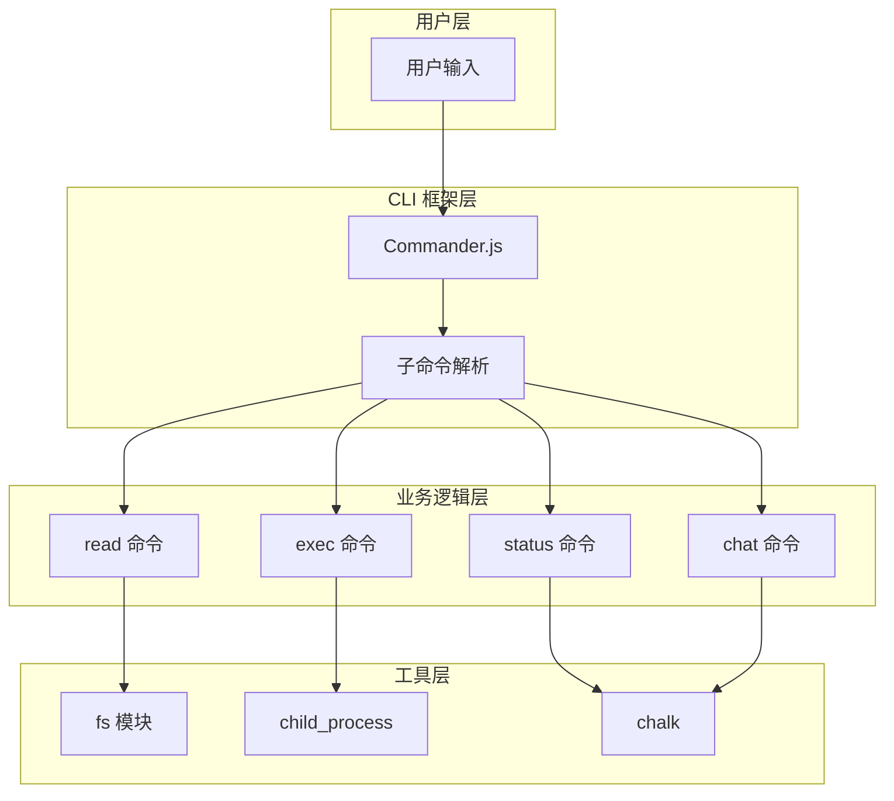
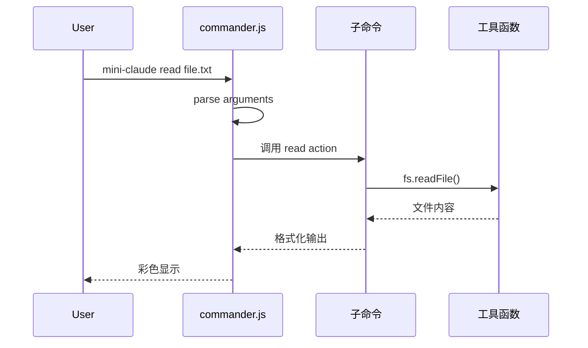
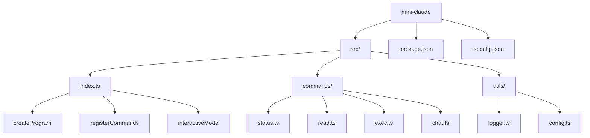
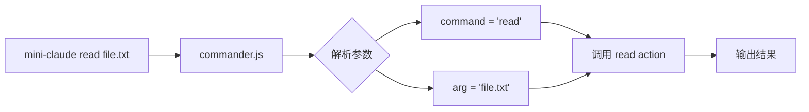

# 01 - 构建你的第一个 CLI 工具

> **本章目标**：学完本章后，你将能够使用 commander.js 构建一个功能完整的 CLI 工具，支持参数解析、子命令、彩色输出和交互式输入。

---

## 1. 学习目标

- [ ] 掌握 Bun/Node.js 项目的初始化流程
- [ ] 理解 TypeScript 项目的 tsconfig.json 配置
- [ ] 熟练使用 commander.js 创建子命令
- [ ] 实现文件读取、命令执行等基础功能
- [ ] 理解 CLI 工具的架构设计

---

## 2. 背景问题

### 2.1 为什么需要 CLI 工具？

CLI（命令行界面）工具的优势：
- **自动化友好**：易于脚本化和集成
- **资源高效**：无 GUI 开销
- **远程友好**：通过 SSH 使用
- **可组合**：管道和重定向

### 2.2 为什么选择这些技术栈？

| 技术 | 选择原因 | Claude Code 使用 |
|------|----------|-----------------|
| Bun | 更快的启动速度和包管理 | Bun (相同) |
| TypeScript | 类型安全 | TypeScript (相同) |
| commander.js | 成熟的 CLI 框架 | 自定义 (类似) |
| chalk | 简单的彩色输出 | ink (自定义) |

---

## 3. 源码入口

### 3.1 我们将构建的 Mini-Claude 项目结构

```
mini-claude/
├── src/
│   ├── index.ts           # 主入口 ← 核心文件
│   ├── commands/
│   │   ├── status.ts     # 状态命令
│   │   ├── read.ts       # 读取命令
│   │   ├── exec.ts       # 执行命令
│   │   └── chat.ts       # 聊天命令
│   └── utils/
│       ├── logger.ts      # 日志工具
│       └── config.ts      # 配置管理
├── package.json
└── tsconfig.json
```

### 3.2 关键函数索引

| 函数 | 文件 | 说明 |
|------|------|------|
| `main()` | src/index.ts | CLI 入口点 |
| `interactiveMode()` | src/index.ts | 交互式输入循环 |
| `createProgram()` | src/index.ts | 创建 commander 实例 |
| `registerCommands()` | src/index.ts | 注册所有子命令 |

---

## 4. 架构定位

### 4.1 CLI 工具架构



### 4.2 命令执行流程



---

## 5. 核心源码分析

### 5.1 主入口文件

**文件**：`src/index.ts`

```typescript
#!/usr/bin/env node

import { Command } from 'commander';
import chalk from 'chalk';
import * as fs from 'fs/promises';
import * as path from 'path';
import { exec } from 'child_process';
import { promisify } from 'util';

const execAsync = promisify(exec);

function createProgram(): Command {
  const program = new Command();

  program
    .name('mini-claude')
    .description('一个简化版的 Claude Code CLI 工具')
    .version('1.0.0');

  return program;
}
```

### 5.2 命令注册模式

```typescript
// 注册子命令的推荐模式
function registerCommands(program: Command): void {
  // 状态命令
  program
    .command('status')
    .description('查看当前状态')
    .action(() => {
      console.log(chalk.blue('📊 Mini-Claude 状态'));
    });

  // 读取文件命令
  program
    .command('read <file>')
    .description('读取文件内容')
    .argument('<file>', '要读取的文件路径')
    .action(async (file) => {
      const content = await fs.readFile(file, 'utf-8');
      console.log(content);
    });
}
```

### 5.3 交互模式实现

```typescript
async function interactiveMode(): Promise<void> {
  const inquirer = await import('inquirer');

  console.log(chalk.blue('╔══════════════════════════════════════╗'));
  console.log(chalk.blue('║     Welcome to Mini-Claude CLI!       ║'));
  console.log(chalk.blue('╚══════════════════════════════════════╝'));

  while (true) {
    const { message } = await inquirer.default.prompt([{
      type: 'input',
      name: 'message',
      message: chalk.green('你: '),
    }]);

    if (message.toLowerCase() === 'exit') {
      console.log(chalk.yellow('\n👋 再见！'));
      break;
    }

    // 处理消息...
  }
}
```

---

## 6. 可视化结构

### 6.1 项目结构图



### 6.2 参数解析流程



---

## 7. 工程经验

### 7.1 设计决策

**1. 为什么使用 commander.js 而非原生解析？**

| 方案 | 优点 | 缺点 |
|------|------|------|
| 原生 argv 解析 | 无依赖 | 需手动处理边界 |
| commander.js | 功能完整、文档好 | 多一个依赖 |
| yargs | 功能丰富 | 较重 |

**2. 为什么使用 chalk 而非 ANSI 转义码？**

```typescript
// ❌ 直接用 ANSI 转义码
console.log('\x1b[34mHello\x1b[0m');

// ✅ 使用 chalk
console.log(chalk.blue('Hello'));
```

chalk 的优点：
- 可组合：`chalk.blue.bold()`
- 可嵌套
- 自动检测颜色支持

### 7.2 常见问题

| 问题 | 原因 | 解决方案 |
|------|------|----------|
| `command not found` | bin 未正确配置 | 检查 package.json bin 字段 |
| `SyntaxError` | TypeScript 未编译 | 运行 `npm run build` |
| 中文乱码 | 编码问题 | 确保文件 UTF-8 编码 |

### 7.3 架构权衡

**单文件 vs 模块化**：

```typescript
// ❌ 单文件（简单但难维护）
// 所有代码都在 index.ts

// ✅ 模块化（推荐）
// src/
//   ├── index.ts      # 入口
//   ├── commands/     # 命令
//   └── utils/        # 工具
```

初期可以用单文件快速原型，后续重构为模块化。

---

## 8. Contributor 指南

### 8.1 添加新命令

**步骤**：

1. 在 `src/commands/` 创建新命令文件
2. 导出命令处理函数
3. 在 `index.ts` 注册命令

**示例**（添加 `config` 命令）：

```typescript
// src/commands/config.ts
import chalk from 'chalk';

export function registerConfigCommand(program: Command): void {
  program
    .command('config [key] [value]')
    .description('查看/修改配置')
    .action((key, value) => {
      if (!key) {
        console.log('显示所有配置');
      } else if (!value) {
        console.log(`获取配置: ${key}`);
      } else {
        console.log(`设置配置: ${key} = ${value}`);
      }
    });
}
```

### 8.2 调试方法

```bash
# 1. 添加 console.log 调试
echo "DEBUG: entering function" >> /dev/stderr

# 2. 使用 ts-node 直接运行
npx ts-node src/index.ts status

# 3. VS Code 断点调试
# .vscode/launch.json
{
  "type": "node",
  "request": "launch",
  "program": "${workspaceFolder}/src/index.ts",
  "runtimeExecutable": "npx",
  "runtimeArgs": ["ts-node"]
}
```

### 8.3 测试策略

```typescript
// test/commands.test.ts
import { describe, it, expect } from 'bun:test';

describe('status command', () => {
  it('should display version', () => {
    // 捕获 stdout 验证输出
    const output = captureStdout(() => {
      // 执行 status 命令
    });
    expect(output).toContain('1.0.0');
  });
});
```

---

## 练习

### 练习 1：实现 `mini-claude config` 命令

**目标**：添加配置查看/修改功能

**答案要点**：

```typescript
// src/commands/config.ts
import * as fs from 'fs/promises';
import * as path from 'path';

const CONFIG_PATH = path.join(process.env.HOME || '', '.mini-claude.json');

interface Config {
  [key: string]: string;
}

async function loadConfig(): Promise<Config> {
  try {
    const content = await fs.readFile(CONFIG_PATH, 'utf-8');
    return JSON.parse(content);
  } catch {
    return {};
  }
}

async function saveConfig(config: Config): Promise<void> {
  await fs.writeFile(CONFIG_PATH, JSON.stringify(config, null, 2));
}

export function registerConfigCommand(program: Command): void {
  program
    .command('config [key] [value]')
    .description('查看/修改配置')
    .action(async (key?: string, value?: string) => {
      const config = await loadConfig();

      if (!key) {
        console.log('当前配置:', config);
        return;
      }

      if (!value) {
        console.log(`${key} = ${config[key] || '(未设置)'}`);
        return;
      }

      config[key] = value;
      await saveConfig(config);
      console.log(chalk.green(`已设置 ${key} = ${value}`));
    });
}
```

### 练习 2：添加 `--verbose` 选项

**目标**：让 status 命令支持详细输出

**答案**：

```typescript
program
  .command('status')
  .description('查看当前状态')
  .option('-v, --verbose', '详细输出')
  .action((options) => {
    console.log(chalk.blue('📊 Mini-Claude 状态'));
    console.log(`版本: ${chalk.green('1.0.0')}`);
    if (options.verbose) {
      console.log(`工作目录: ${process.cwd()}`);
      console.log(`Node 版本: ${process.version}`);
      console.log(`平台: ${process.platform}`);
    }
  });
```

### 练习 3：实现日志系统

**目标**：创建统一的日志工具

**答案要点**：

```typescript
// src/utils/logger.ts
import chalk from 'chalk';

export const logger = {
  info: (msg: string) => console.log(chalk.blue('ℹ ') + msg),
  warn: (msg: string) => console.log(chalk.yellow('⚠ ') + msg),
  error: (msg: string) => console.log(chalk.red('✗ ') + msg),
  success: (msg: string) => console.log(chalk.green('✓ ') + msg),
  debug: (msg: string) => {
    if (process.env.DEBUG) {
      console.log(chalk.gray('[DEBUG] ') + msg);
    }
  },
};
```

---

## 总结

| 技能 | 学会了吗？ |
|------|----------|
| 项目初始化 | ✓ |
| TypeScript 配置 | ✓ |
| Commander.js 子命令 | ✓ |
| Chalk 彩色输出 | ✓ |
| Inquirer 交互输入 | ✓ |
| 模块化架构 | ✓ |

`★ Insight ─────────────────────────────────────`
CLI 工具的本质是**接收命令 → 执行操作 → 返回结果**。Commander.js 负责解析你输入的 `mini-claude read ./file.txt`，chalk 负责让输出更美观，inquirer.js 负责在交互模式下读取你的下一行输入。把这三块拼在一起，你就有了构建任何 CLI 工具的基础骨架。
`─────────────────────────────────────────────────`

---

## 下一篇

👉 [02 - 实现工具调用系统](./02-实现工具调用系统.md) —— 给 Mini-Claude 添加真正的工具
