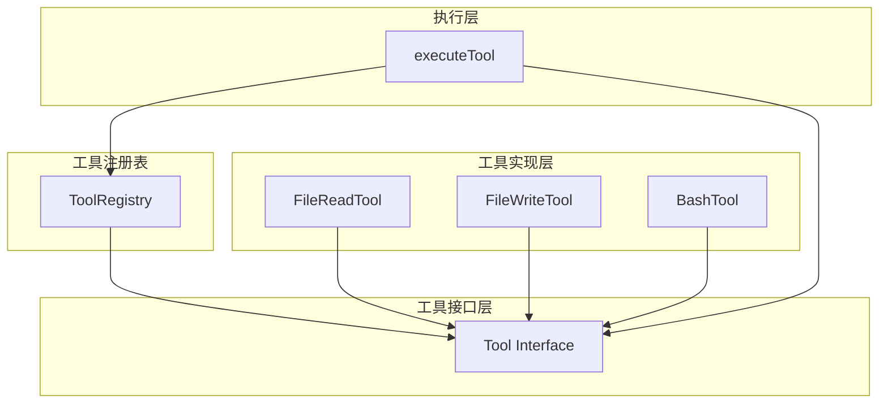
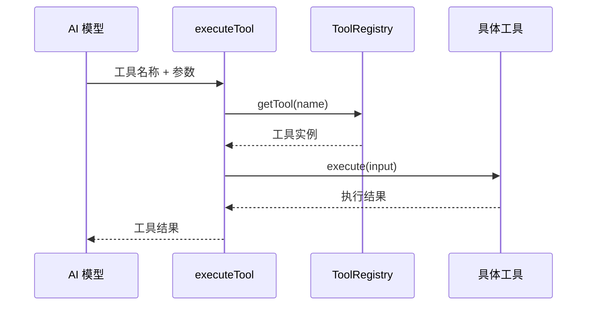
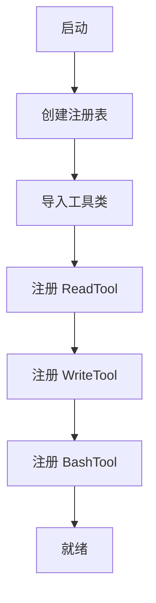
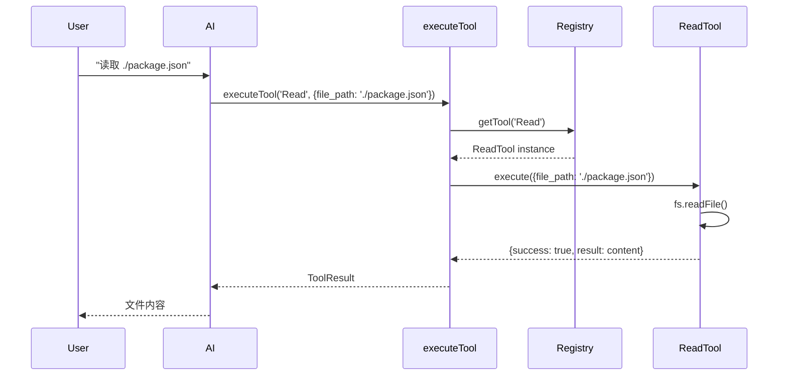

# 02 - 实现工具调用系统

> **本章目标**：学完本章后，你将理解工具调用的核心概念，能够为 Mini-Claude 实现一个基础的工具接口和注册表系统。

---

## 1. 学习目标

- [ ] 理解 Tool 接口的设计原理
- [ ] 掌握工具注册表（Tool Registry）模式
- [ ] 实现 FileReadTool 和 FileWriteTool
- [ ] 理解工具调用的生命周期
- [ ] 学会设计可扩展的工具系统

---

## 2. 背景问题

### 2.1 为什么需要工具系统？

没有工具系统，AI 只能生成文本。有了工具系统，AI 可以：
- 读取文件系统
- 执行 Shell 命令
- 访问网络
- 修改系统状态

### 2.2 Claude Code 的工具 vs Mini-Claude

| 方面 | Claude Code | Mini-Claude (本章) |
|------|-------------|---------------------|
| 工具数量 | 20+ | 3 个基础工具 |
| 接口复杂度 | 泛型 + 进度追踪 | 简化版 |
| 权限控制 | 多层权限系统 | 无 |
| 并发处理 | 异步流式 | 同步 |
| 类型安全 | 完整 Schema | any |

---

## 3. 源码入口

### 3.1 Mini-Claude 工具系统结构

```
mini-claude/src/
├── tools/
│   ├── Tool.ts           # 工具接口定义
│   ├── ToolRegistry.ts   # 工具注册表
│   ├── FileReadTool.ts   # 读取工具
│   ├── FileWriteTool.ts  # 写入工具
│   └── BashTool.ts       # Bash 工具
├── index.ts             # 主入口
└── types.ts             # 类型定义
```

### 3.2 关键函数索引

| 函数 | 文件 | 说明 |
|------|------|------|
| `Tool` (interface) | src/tools/Tool.ts | 工具接口 |
| `ToolRegistry` (class) | src/tools/ToolRegistry.ts | 注册表实现 |
| `registerTool()` | src/tools/ToolRegistry.ts | 注册工具 |
| `getTool()` | src/tools/ToolRegistry.ts | 获取工具 |
| `executeTool()` | src/tools/execute.ts | 执行工具 |

---

## 4. 架构定位

### 4.1 工具系统架构



### 4.2 工具调用流程



---

## 5. 核心源码分析

### 5.1 Tool 接口定义

**文件**：`src/tools/Tool.ts`

```typescript
// 工具接口 - 简化版
export interface Tool<Input = unknown, Output = unknown> {
  name: string;
  description: string;

  // 输入 Schema（简化版使用 TypeScript 类型）
  input_schema: {
    type: 'object';
    properties: Record<string, { type: string; description?: string }>;
    required?: string[];
  };

  // 执行函数
  execute(input: Input): Promise<ToolResult<Output>>;
}

// 工具结果
export interface ToolResult<T = unknown> {
  success: boolean;
  result?: T;
  error?: string;
}
```

### 5.2 工具注册表

**文件**：`src/tools/ToolRegistry.ts`

```typescript
export class ToolRegistry {
  private tools = new Map<string, Tool>();

  register(tool: Tool): void {
    if (this.tools.has(tool.name)) {
      throw new Error(`Tool ${tool.name} is already registered`);
    }
    this.tools.set(tool.name, tool);
  }

  get(name: string): Tool | undefined {
    return this.tools.get(name);
  }

  getAll(): Tool[] {
    return Array.from(this.tools.values());
  }

  has(name: string): boolean {
    return this.tools.has(name);
  }
}

// 全局单例
export const globalRegistry = new ToolRegistry();
```

### 5.3 工具执行器

**文件**：`src/tools/execute.ts`

```typescript
import { globalRegistry } from './ToolRegistry';
import type { Tool, ToolResult } from './Tool';

export async function executeTool(
  toolName: string,
  input: unknown
): Promise<ToolResult> {
  const tool = globalRegistry.get(toolName);

  if (!tool) {
    return {
      success: false,
      error: `Unknown tool: ${toolName}`,
    };
  }

  try {
    const result = await tool.execute(input);
    return result;
  } catch (error) {
    return {
      success: false,
      error: `Tool execution failed: ${(error as Error).message}`,
    };
  }
}
```

### 5.4 具体工具实现

**文件**：`src/tools/FileReadTool.ts`

```typescript
import * as fs from 'fs/promises';
import type { Tool, ToolResult } from './Tool';

export class FileReadTool implements Tool<string, string> {
  name = 'Read';
  description = '读取文件内容';

  input_schema = {
    type: 'object' as const,
    properties: {
      file_path: {
        type: 'string',
        description: '要读取的文件路径',
      },
    },
    required: ['file_path'],
  };

  async execute(input: { file_path: string }): Promise<ToolResult<string>> {
    try {
      const content = await fs.readFile(input.file_path, 'utf-8');
      return { success: true, result: content };
    } catch (error) {
      return {
        success: false,
        error: `Failed to read file: ${(error as Error).message}`,
      };
    }
  }
}
```

---

## 6. 可视化结构

### 6.1 工具注册流程



### 6.2 工具调用时序图



---

## 7. 工程经验

### 7.1 工具接口设计决策

**为什么 input_schema 用对象而非 JSON Schema？**

```typescript
// ❌ 完整 JSON Schema（过于复杂）
input_schema: {
  type: 'object',
  properties: {...},
  required: [...],
  additionalProperties: false,
  // ... 50+ 行
}

// ✅ 简化版（够用就行）
input_schema: {
  type: 'object',
  properties: {
    file_path: { type: 'string', description: '...' },
  },
  required: ['file_path'],
}
```

Claude Code 使用完整 JSON Schema 是因为需要：
- 严格的类型验证
- AI 模型的工具调用生成
- IDE 自动补全支持

### 7.2 注册表模式的优势

```typescript
// ❌ 直接依赖（紧耦合）
if (command === 'read') {
  const tool = new FileReadTool();
  return await tool.execute(input);
}

// ✅ 注册表模式（松耦合）
const tool = registry.get(command);
if (!tool) return { error: 'Unknown tool' };
return await tool.execute(input);
```

**优势**：
- 工具可以在运行时注册
- 便于测试（可替换）
- 支持插件系统

### 7.3 常见问题

| 问题 | 原因 | 解决方案 |
|------|------|----------|
| 工具未找到 | 未注册或拼写错误 | 检查 registry.get() 调用 |
| 执行失败 | 工具内部异常 | try/catch 包装 |
| 类型不匹配 | input_schema 和实际参数不符 | 验证输入 |

---

## 8. Contributor 指南

### 8.1 添加新工具模板

```typescript
// src/tools/MyTool.ts
import type { Tool, ToolResult } from './Tool';

export class MyTool implements Tool<MyInput, MyOutput> {
  name = 'MyTool';
  description = '我的工具';

  input_schema = {
    type: 'object' as const,
    properties: {
      param1: { type: 'string', description: '参数1' },
    },
    required: ['param1'],
  };

  async execute(input: MyInput): Promise<ToolResult<MyOutput>> {
    try {
      // 实现逻辑
      return { success: true, result: {} };
    } catch (error) {
      return { success: false, error: (error as Error).message };
    }
  }
}
```

### 8.2 注册工具

```typescript
// src/tools/index.ts
import { globalRegistry } from './ToolRegistry';
import { FileReadTool } from './FileReadTool';
import { FileWriteTool } from './FileWriteTool';
import { BashTool } from './BashTool';

export function registerAllTools(): void {
  globalRegistry.register(new FileReadTool());
  globalRegistry.register(new FileWriteTool());
  globalRegistry.register(new BashTool());
}
```

### 8.3 调试工具

```typescript
// 添加日志
async function executeTool(name: string, input: unknown): Promise<ToolResult> {
  console.log(`[Tool] Executing ${name} with input:`, input);

  const result = await tool.execute(input);

  console.log(`[Tool] ${name} result:`, result);
  return result;
}
```

---

## 练习

### 练习 1：实现 ListDirTool

**目标**：列出目录内容

**答案要点**：

```typescript
export class ListDirTool implements Tool<{ path?: string }, string[]> {
  name = 'ListDir';
  description = '列出目录内容';

  input_schema = {
    type: 'object' as const,
    properties: {
      path: {
        type: 'string',
        description: '目录路径（默认当前目录）',
        default: '.',
      },
    },
  };

  async execute(input: { path?: string }): Promise<ToolResult<string[]>> {
    try {
      const targetPath = input.path || '.';
      const entries = await fs.readdir(targetPath, { withFileTypes: true });

      const result = entries.map(entry => {
        const prefix = entry.isDirectory() ? '📁 ' : '📄 ';
        return `${prefix}${entry.name}`;
      });

      return { success: true, result };
    } catch (error) {
      return { success: false, error: (error as Error).message };
    }
  }
}
```

### 练习 2：实现 GrepTool

**目标**：在文件中搜索文本

**答案要点**：

```typescript
export class GrepTool implements Tool<{ pattern: string; file_path: string }, string[]> {
  name = 'Grep';
  description = '在文件中搜索文本';

  input_schema = {
    type: 'object' as const,
    properties: {
      pattern: { type: 'string', description: '搜索模式' },
      file_path: { type: 'string', description: '文件路径' },
    },
    required: ['pattern', 'file_path'],
  };

  async execute(input: { pattern: string; file_path: string }): Promise<ToolResult<string[]>> {
    try {
      const content = await fs.readFile(input.file_path, 'utf-8');
      const lines = content.split('\n');
      const matches = lines
        .map((line, i) => ({ line, num: i + 1 }))
        .filter(({ line }) => line.includes(input.pattern))
        .map(({ line, num }) => `${num}: ${line}`);

      return { success: true, result: matches };
    } catch (error) {
      return { success: false, error: (error as Error).message };
    }
  }
}
```

### 练习 3：工具注册表测试

**目标**：验证注册表功能

**答案要点**：

```typescript
describe('ToolRegistry', () => {
  it('should register and retrieve tools', () => {
    const registry = new ToolRegistry();
    const tool = new FileReadTool();

    registry.register(tool);

    expect(registry.get('Read')).toBe(tool);
    expect(registry.has('Read')).toBe(true);
  });

  it('should throw on duplicate registration', () => {
    const registry = new ToolRegistry();
    registry.register(new FileReadTool());

    expect(() => {
      registry.register(new FileReadTool());
    }).toThrow('already registered');
  });
});
```

---

## 总结

| 概念 | 理解 |
|------|------|
| Tool 接口 | ✓ |
| 工具注册表模式 | ✓ |
| 工具执行流程 | ✓ |
| 输入验证 | ✓ |
| 错误处理 | ✓ |

`★ Insight ─────────────────────────────────────`
工具系统的核心是**接口抽象 + 注册表模式**。Tool 接口定义了"什么是一个工具"，ToolRegistry 负责"管理工具的生命周期"。这种设计使得添加新工具无需修改调用方代码——只需实现 Tool 接口并注册即可。
`─────────────────────────────────────────────────`

---

## 下一篇

👉 [03 - 接入 AI API](./03-接入AI-API.md) —— 让 Mini-Claude 连接到 Claude API
