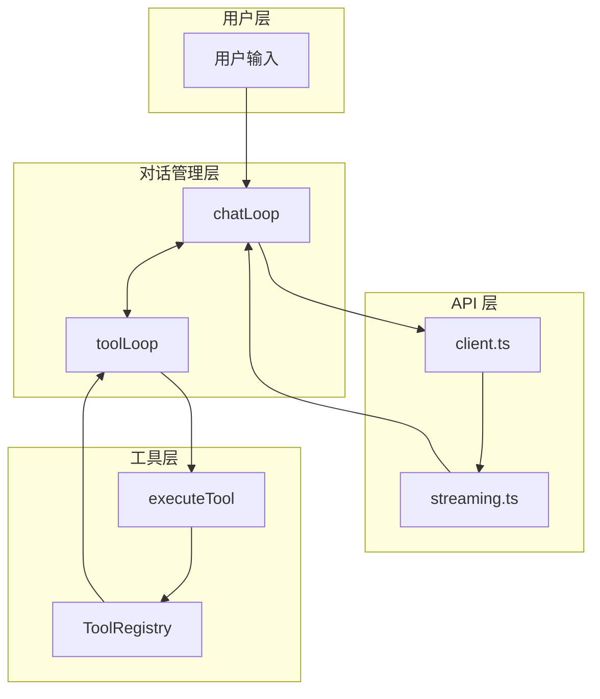
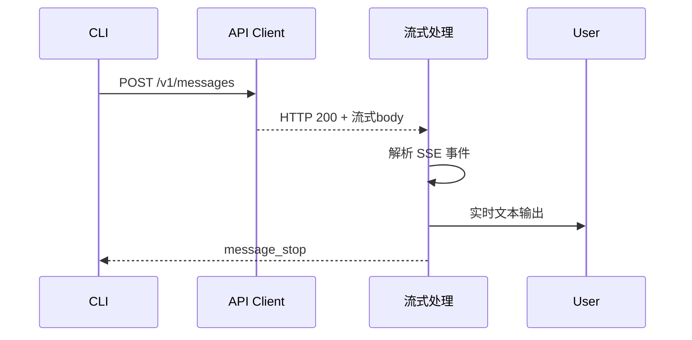
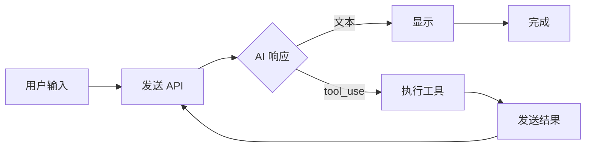

# 03 - 接入 AI API

> **本章目标**：学完本章后，你将能够为 Mini-Claude 实现与 Anthropic API 的集成，理解流式响应处理、工具调用循环和 System Prompt 构建。

---

## 1. 学习目标

- [ ] 理解 Anthropic Messages API 的基本用法
- [ ] 掌握 fetch API 发送请求和处理流式响应
- [ ] 实现工具调用循环（Tool Use Loop）
- [ ] 构建有效的 System Prompt
- [ ] 理解流式输出的处理机制

---

## 2. 背景问题

### 2.1 为什么需要 AI API 集成？

没有 AI，Mini-Claude 只能：
- 读取文件
- 执行命令
- 响应固定回复

接入 API 后，Mini-Claude 能够：
- 理解自然语言指令
- 智能分析代码
- 生成内容
- 做决策

### 2.2 Claude API vs OpenAI API

| 方面 | Claude API | OpenAI API |
|------|------------|------------|
| 模型名称 | claude-3-5-sonnet | gpt-4-turbo |
| 工具调用 | 原生支持 | Function Calling |
| 上下文窗口 | 200K tokens | 128K tokens |
| 定价 | 按输入/输出 | 按 token |

---

## 3. 源码入口

### 3.1 API 集成结构

```
mini-claude/src/
├── api/
│   ├── client.ts           # API 客户端
│   ├── types.ts           # 类型定义
│   └── streaming.ts       # 流式响应处理
├── tools/
│   └── ...                # 工具系统
├── chat/
│   ├── chatLoop.ts       # 对话循环
│   └── toolLoop.ts        # 工具调用循环
├── index.ts               # 主入口
└── types.ts               # 类型定义
```

### 3.2 关键函数索引

| 函数 | 文件 | 说明 |
|------|------|------|
| `createMessage()` | src/api/client.ts | 发送 API 请求 |
| `streamResponse()` | src/api/streaming.ts | 处理流式响应 |
| `chatLoop()` | src/chat/chatLoop.ts | 主对话循环 |
| `toolLoop()` | src/chat/toolLoop.ts | 工具调用循环 |
| `buildSystemPrompt()` | src/chat/systemPrompt.ts | 构建 System Prompt |

---

## 4. 架构定位

### 4.1 API 集成架构



### 4.2 工具调用循环

```mermaid
sequenceDiagram
    participant User
    participant Loop as chatLoop
    participant API as API Client
    participant Tool as toolLoop
    participant Registry

    User->>Loop: 用户消息
    Loop->>API: createMessage()
    API-->>Loop: AI 响应
    alt 文本响应
        Loop-->>User: 显示文本
    else 工具调用
        Loop->>Tool: 工具调用请求
        Tool->>Registry: getTool()
        Registry-->>Tool: 工具实例
        Tool->>Tool: execute()
        Tool-->>Loop: 工具结果
        Loop->>API: 发送工具结果
        API-->>Loop: 下一响应
    end
```

---

## 5. 核心源码分析

### 5.1 API 客户端

**文件**：`src/api/client.ts`

```typescript
const ANTHROPIC_API_URL = 'https://api.anthropic.com/v1/messages';

interface Message {
  role: 'user' | 'assistant';
  content: string;
}

interface CreateMessageParams {
  model: string;
  messages: Message[];
  systemPrompt?: string;
  tools?: Tool[];
  maxTokens?: number;
}

export async function createMessage(
  params: CreateMessageParams
): Promise<Response> {
  const response = await fetch(ANTHROPIC_API_URL, {
    method: 'POST',
    headers: {
      'Content-Type': 'application/json',
      'x-api-key': process.env.ANTHROPIC_API_KEY!,
      'anthropic-version': '2023-06-01',
      'anthropic-dangerous-direct-browser-access': 'true',
    },
    body: JSON.stringify({
      model: params.model,
      messages: params.messages,
      system: params.systemPrompt,
      tools: params.tools?.map(toolToAPISchema),
      max_tokens: params.maxTokens || 1024,
      stream: true,
    }),
  });

  return response;
}
```

### 5.2 流式响应处理

**文件**：`src/api/streaming.ts`

```typescript
export async function* streamResponse(
  response: Response
): AsyncGenerator<StreamEvent> {
  const reader = response.body?.getReader();
  if (!reader) throw new Error('No response body');

  const decoder = new TextDecoder();
  let buffer = '';

  while (true) {
    const { done, value } = await reader.read();
    if (done) break;

    buffer += decoder.decode(value, { stream: true });
    const lines = buffer.split('\n');
    buffer = lines.pop() || '';

    for (const line of lines) {
      if (line.startsWith('data: ')) {
        const data = line.slice(6);
        if (data === '[DONE]') return;
        yield JSON.parse(data);
      }
    }
  }
}

type StreamEvent =
  | { type: 'content_block_delta'; delta: { type: 'text_delta'; text: string } }
  | { type: 'content_block_delta'; delta: { type: 'input_json_delta'; partial_json: string } }
  | { type: 'message_stop' };
```

### 5.3 工具调用循环

**文件**：`src/chat/toolLoop.ts`

```typescript
export async function toolLoop(
  initialResponse: Response,
  tools: Tool[],
  sendMessage: (msg: Message) => Promise<Response>
): Promise<string> {
  const conversation: Message[] = [];
  let currentResponse = initialResponse;

  while (true) {
    for await (const event of streamResponse(currentResponse)) {
      if (event.type === 'content_block_delta') {
        if (event.delta.type === 'text_delta') {
          process.stdout.write(event.delta.text);
          conversation.push({ role: 'assistant', content: event.delta.text });
        }
      }

      if (event.type === 'message_stop') {
        return conversation.map(m => m.content).join('');
      }
    }
  }
}
```

### 5.4 System Prompt 构建

**文件**：`src/chat/systemPrompt.ts`

```typescript
export function buildSystemPrompt(): string {
  const availableTools = globalRegistry.getAll()
    .map(tool => `- ${tool.name}: ${tool.description}`)
    .join('\n');

  return `你是一个有帮助的 AI 助手。

可用工具：
${availableTools}

当需要执行操作时，使用工具返回结果。
`;
}
```

---

## 6. 可视化结构

### 6.1 API 请求流程



### 6.2 工具调用循环状态机



---

## 7. 工程经验

### 7.1 流式 vs 非流式

| 方面 | 流式 | 非流式 |
|------|------|--------|
| 用户体验 | 实时看到输出 | 等待完整响应 |
| 实现复杂度 | 高 | 低 |
| 错误处理 | 难 | 易 |
| 网络要求 | 持续连接 | 单次请求 |

### 7.2 常见问题

| 问题 | 原因 | 解决方案 |
|------|------|----------|
| API Key 错误 | 环境变量未设置 | 检查 ANTHROPIC_API_KEY |
| 流式中断 | 网络不稳定 | 添加重试逻辑 |
| 工具结果格式错误 | 格式与 API 不符 | 严格遵循 tool_result 格式 |

### 7.3 工具 Schema 转换

```typescript
// Mini-Claude Schema → Anthropic API Schema
function toolToAPISchema(tool: Tool): object {
  return {
    name: tool.name,
    description: tool.description,
    input_schema: {
      type: 'object',
      properties: tool.input_schema.properties,
      required: tool.input_schema.required,
    },
  };
}
```

---

## 8. Contributor 指南

### 8.1 调试 API 调用

```typescript
// 添加请求日志
async function createMessage(params: CreateMessageParams): Promise<Response> {
  console.log('[API] Request:', {
    model: params.model,
    messageCount: params.messages.length,
    toolCount: params.tools?.length,
  });

  const response = await fetch(ANTHROPIC_API_URL, options);

  console.log('[API] Response status:', response.status);
  return response;
}
```

### 8.2 测试 API 集成

```typescript
// test/api.test.ts
import { describe, it, expect, beforeAll } from 'bun:test';

describe('API Client', () => {
  beforeAll(() => {
    // 设置测试 API Key
    process.env.ANTHROPIC_API_KEY = 'test-key';
  });

  it('should handle API errors', async () => {
    const response = await createMessage({
      model: 'claude-3-5-sonnet-20241022',
      messages: [{ role: 'user', content: 'test' }],
    });

    // 验证错误处理
    expect(response.ok || response.status).toBeDefined();
  });
});
```

---

## 练习

### 练习 1：实现流式文本显示

**目标**：实时显示 AI 的流式输出

**答案要点**：

```typescript
async function displayStream(response: Response): Promise<void> {
  const reader = response.body?.getReader();
  const decoder = new TextDecoder();

  if (!reader) return;

  while (true) {
    const { done, value } = await reader.read();
    if (done) break;

    const chunk = decoder.decode(value, { stream: true });
    const lines = chunk.split('\n');

    for (const line of lines) {
      if (line.startsWith('data: ')) {
        const data = JSON.parse(line.slice(6));
        if (data.type === 'content_block_delta') {
          if (data.delta.type === 'text_delta') {
            process.stdout.write(data.delta.text);
          }
        }
      }
    }
  }
  console.log(); // 换行
}
```

### 练习 2：实现工具结果发送

**目标**：将工具执行结果发送回 API

**答案要点**：

```typescript
async function sendToolResult(
  conversation: Message[],
  toolCallId: string,
  toolName: string,
  result: string
): Promise<void> {
  // 添加工具调用
  conversation.push({
    role: 'assistant',
    content: `使用工具: ${toolName}`,
  });

  // 添加工具结果
  conversation.push({
    role: 'user',
    content: JSON.stringify({
      type: 'tool_result',
      tool_use_id: toolCallId,
      content: result,
    }),
  });

  // 发送后续请求
  const nextResponse = await createMessage({
    model: 'claude-3-5-sonnet-20241022',
    messages: conversation,
  });

  // 处理后续响应...
}
```

### 练习 3：实现重试逻辑

**目标**：添加简单的重试机制

**答案要点**：

```typescript
async function createMessageWithRetry(
  params: CreateMessageParams,
  maxRetries = 3
): Promise<Response> {
  let lastError: Error | null = null;

  for (let attempt = 0; attempt < maxRetries; attempt++) {
    try {
      const response = await createMessage(params);
      if (response.ok) return response;
      lastError = new Error(`HTTP ${response.status}`);
    } catch (error) {
      lastError = error as Error;
    }

    // 指数退避
    if (attempt < maxRetries - 1) {
      await new Promise(r => setTimeout(r, 1000 * Math.pow(2, attempt)));
    }
  }

  throw lastError || new Error('Max retries exceeded');
}
```

---

## 总结

| 概念 | 理解 |
|------|------|
| Messages API | ✓ |
| 流式响应处理 | ✓ |
| 工具调用循环 | ✓ |
| System Prompt | ✓ |
| 错误处理 | ✓ |

`★ Insight ─────────────────────────────────────`
AI API 集成的核心是**处理流式响应和维护对话上下文**。流式响应让用户实时看到输出，对话上下文让 AI 理解对话历史。工具调用循环是关键机制——AI 决定调用工具，工具返回结果，结果发送给 AI，继续对话。
`─────────────────────────────────────────────────`

---

## 下一篇

👉 [04 - 添加交互界面](./04-添加交互界面.md) —— 为 Mini-Claude 添加彩色终端界面
