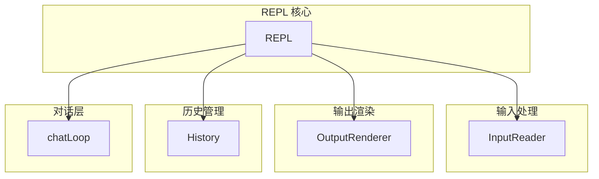
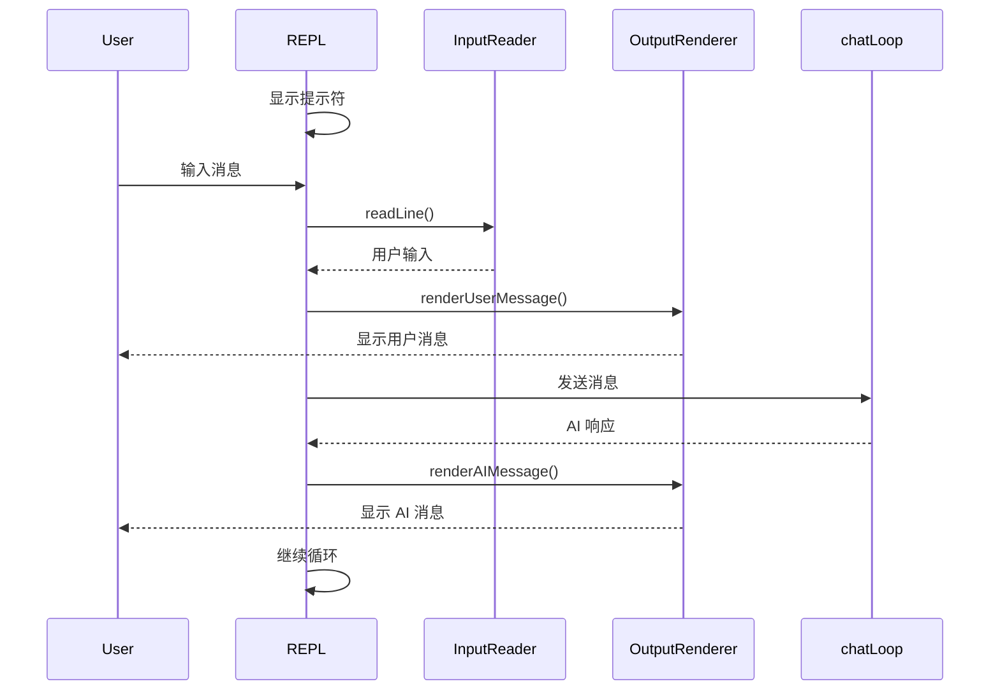
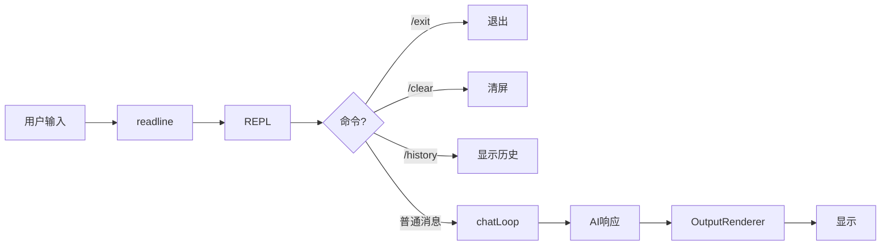

# 04 - 添加交互界面

> **本章目标**：学完本章后，你将能够为 Mini-Claude 实现一个彩色的交互式 REPL 界面，包括彩色输出、消息渲染和用户输入处理。

---

## 1. 学习目标

- [ ] 理解 REPL（Read-Eval-Print Loop）模式
- [ ] 掌握 readline 用于命令行输入
- [ ] 实现彩色消息渲染
- [ ] 构建消息历史管理
- [ ] 理解 Claude Code 的 Ink UI 框架

---

## 2. 背景问题

### 2.1 为什么需要 REPL？

CLI 工具的两种模式：

| 模式 | 使用场景 | 特点 |
|------|----------|------|
| 单次命令 | `mini-claude read file.txt` | 快速、执行即退出 |
| REPL 交互 | `mini-claude` 无参数启动 | 持续对话、累积上下文 |

### 2.2 Claude Code 的 UI vs Mini-Claude

| 方面 | Claude Code (Ink) | Mini-Claude (readline) |
|------|-------------------|------------------------|
| 渲染引擎 | Ink (React) | ANSI 转义码 |
| 组件系统 | React 组件 | 手动 DOM 操作 |
| 状态管理 | React state | 普通变量 |
| 实时更新 | 高效 diff | 整行重绘 |
| 复杂 UI | 支持 | 有限 |

---

## 3. 源码入口

### 3.1 REPL 结构

```
mini-claude/src/
├── repl/
│   ├── REPL.ts           # REPL 主类
│   ├── InputReader.ts    # 输入读取
│   ├── OutputRenderer.ts # 输出渲染
│   └── History.ts        # 历史记录
├── chat/
│   └── chatLoop.ts       # 对话循环
├── api/
│   └── client.ts         # API 客户端
└── tools/
    └── ToolRegistry.ts   # 工具注册表
```

### 3.2 关键函数索引

| 函数 | 文件 | 说明 |
|------|------|------|
| `startREPL()` | src/repl/REPL.ts | 启动 REPL |
| `readLine()` | src/repl/InputReader.ts | 读取用户输入 |
| `renderMessage()` | src/repl/OutputRenderer.ts | 渲染消息 |
| `addToHistory()` | src/repl/History.ts | 添加历史记录 |

---

## 4. 架构定位

### 4.1 REPL 架构



### 4.2 REPL 循环流程



---

## 5. 核心源码分析

### 5.1 REPL 主类

**文件**：`src/repl/REPL.ts`

```typescript
import * as readline from 'readline';
import chalk from 'chalk';
import { InputReader } from './InputReader';
import { OutputRenderer } from './OutputRenderer';
import { History } from './History';
import { chatLoop } from '../chat/chatLoop';

export class REPL {
  private rl: readline.Interface;
  private inputReader: InputReader;
  private outputRenderer: OutputRenderer;
  private history: History;

  constructor() {
    this.rl = readline.createInterface({
      input: process.stdin,
      output: process.stdout,
      prompt: chalk.green('mini-claude> '),
    });

    this.inputReader = new InputReader();
    this.outputRenderer = new OutputRenderer();
    this.history = new History();
  }

  async start(): Promise<void> {
    this.rl.prompt();

    this.rl.on('line', async (input: string) => {
      const trimmed = input.trim();

      if (!trimmed) {
        this.rl.prompt();
        return;
      }

      // 处理特殊命令
      if (trimmed === '/exit' || trimmed === '/quit') {
        console.log(chalk.yellow('再见！'));
        this.rl.close();
        return;
      }

      if (trimmed === '/clear') {
        console.clear();
        this.rl.prompt();
        return;
      }

      // 处理历史命令
      if (trimmed === '/history') {
        this.history.print();
        this.rl.prompt();
        return;
      }

      // 添加到历史
      this.history.add(trimmed);

      // 显示用户消息
      this.outputRenderer.renderUserMessage(trimmed);

      // 对话循环
      await chatLoop(trimmed, (text) => {
        this.outputRenderer.renderAIMessage(text);
      });

      this.rl.prompt();
    });

    this.rl.on('close', () => {
      process.exit(0);
    });
  }
}
```

### 5.2 输入读取器

**文件**：`src/repl/InputReader.ts`

```typescript
export class InputReader {
  private history: string[] = [];
  private historyIndex: number = -1;

  readLine(): string {
    // 简单的历史导航可以在此实现
    return '';
  }

  addToHistory(input: string): void {
    if (input.trim()) {
      this.history.push(input);
    }
    this.historyIndex = this.history.length;
  }

  getPreviousHistory(): string | null {
    if (this.historyIndex > 0) {
      this.historyIndex--;
      return this.history[this.historyIndex];
    }
    return null;
  }

  getNextHistory(): string | null {
    if (this.historyIndex < this.history.length - 1) {
      this.historyIndex++;
      return this.history[this.historyIndex];
    }
    this.historyIndex = this.history.length;
    return '';
  }
}
```

### 5.3 输出渲染器

**文件**：`src/repl/OutputRenderer.ts`

```typescript
import chalk from 'chalk';

export class OutputRenderer {
  renderUserMessage(message: string): void {
    console.log(chalk.bgBlue.white(' 用户 ') + ' ' + message);
    console.log();
  }

  renderAIMessage(message: string): void {
    console.log(chalk.bgGreen.white(' Claude ') + ' ' + message);
    console.log();
  }

  renderSystemMessage(message: string): void {
    console.log(chalk.bgGray.white(' 系统 ') + ' ' + chalk.gray(message));
    console.log();
  }

  renderToolCall(toolName: string, input: unknown): void {
    console.log(chalk.bgYellow.black(' 工具 ') + ' ' + chalk.yellow(toolName));
    console.log(chalk.gray('  输入: '), JSON.stringify(input));
    console.log();
  }

  renderToolResult(result: unknown): void {
    console.log(chalk.bgCyan.black(' 结果 ') + ' ' + String(result));
    console.log();
  }

  renderError(error: string): void {
    console.log(chalk.bgRed.white(' 错误 ') + ' ' + chalk.red(error));
    console.log();
  }
}
```

### 5.4 历史记录管理

**文件**：`src/repl/History.ts`

```typescript
import chalk from 'chalk';

export class History {
  private messages: { role: string; content: string; timestamp: number }[] = [];

  add(content: string, role: string = 'user'): void {
    this.messages.push({
      role,
      content,
      timestamp: Date.now(),
    });
  }

  getAll(): typeof this.messages {
    return this.messages;
  }

  print(): void {
    console.log(chalk.underline('对话历史:'));
    for (const msg of this.messages) {
      const time = new Date(msg.timestamp).toLocaleTimeString();
      const roleLabel = msg.role === 'user' ? '用户' : 'Claude';
      console.log(`${chalk.gray(time)} ${chalk.blue(roleLabel)}: ${msg.content}`);
    }
  }

  clear(): void {
    this.messages = [];
  }
}
```

---

## 6. 可视化结构

### 6.1 REPL 界面布局

```
┌─────────────────────────────────────────────────┐
│  Welcome to Mini-Claude CLI!                     │
│  Type /exit to quit, /clear to clear screen     │
├─────────────────────────────────────────────────┤
│  用户: 你好                                     │
│                                                 │
│  Claude: 你好！有什么可以帮助你的吗？            │
│                                                 │
│  [用户继续输入...]                              │
├─────────────────────────────────────────────────┤
│  mini-claude> ▊                                 │
└─────────────────────────────────────────────────┘
```

### 6.2 消息处理流程



---

## 7. 工程经验

### 7.1 readline vs Ink

| 方面 | readline | Ink |
|------|----------|-----|
| 学习曲线 | 低 | 高 (React) |
| 灵活性 | 中 | 高 |
| 性能 | 一般 | 高 |
| 包大小 | 小 | 大 |
| 适合场景 | 简单 CLI | 复杂 UI |

### 7.2 常见问题

| 问题 | 原因 | 解决方案 |
|------|------|----------|
| Ctrl+C 中断 | 用户取消输入 | 捕获 SIGINT 信号 |
| 中文显示乱码 | 编码问题 | 确保终端 UTF-8 |
| 颜色不显示 | 终端不支持 | 使用 `chalk.supportsColor` 检测 |

### 7.3 信号处理

```typescript
// 处理 Ctrl+C
process.on('SIGINT', () => {
  console.log(chalk.yellow('\n强制退出'));
  process.exit(1);
});

// 或者更优雅的方式
this.rl.on('SIGINT', () => {
  if (this.currentInput.length > 0) {
    this.currentInput = '';
    console.log(chalk.gray(' (已清除当前输入，按 Ctrl+C 退出)'));
    this.rl.prompt();
  } else {
    console.log(chalk.yellow('\n再见！'));
    process.exit(0);
  }
});
```

---

## 8. Contributor 指南

### 8.1 添加新命令

```typescript
// 在 REPL.ts 添加新命令处理
this.rl.on('line', async (input: string) => {
  const trimmed = input.trim();

  // 新命令
  if (trimmed.startsWith('/help')) {
    this.showHelp();
    this.rl.prompt();
    return;
  }

  // ... 其他命令
});

private showHelp(): void {
  console.log(`
可用命令:
  /exit, /quit   退出程序
  /clear         清屏
  /history       显示对话历史
  /help          显示帮助
  `);
}
```

### 8.2 调试 REPL

```typescript
// 启用调试模式
if (process.env.DEBUG_REPL) {
  const originalWrite = process.stdout.write.bind(process.stdout);
  process.stdout.write = (chunk: string, ...args: any[]) => {
    console.log('[STDOUT]', chunk);
    return originalWrite(chunk, ...args);
  };
}
```

### 8.3 测试 REPL

```typescript
// test/repl.test.ts
import { describe, it, expect, beforeEach } from 'bun:test';
import { REPL } from '../src/repl/REPL';

describe('REPL', () => {
  it('should render user message', () => {
    const renderer = new OutputRenderer();
    // 捕获输出验证
    const output = captureStdout(() => {
      renderer.renderUserMessage('test');
    });
    expect(output).toContain('用户');
    expect(output).toContain('test');
  });
});
```

---

## 练习

### 练习 1：添加 `/help` 命令

**目标**：显示帮助信息

**答案要点**：

```typescript
// 在 REPL.ts 添加
if (trimmed === '/help') {
  console.log(`
╔════════════════════════════════════════════════╗
║            Mini-Claude 帮助                    ║
╠════════════════════════════════════════════════╣
║  /help     显示帮助                           ║
║  /exit     退出程序                           ║
║  /clear    清屏                               ║
║  /history  显示对话历史                        ║
╚════════════════════════════════════════════════╝
  `);
  this.rl.prompt();
  return;
}
```

### 练习 2：实现消息时间戳

**目标**：在每条消息前显示时间

**答案要点**：

```typescript
// 在 OutputRenderer.ts 修改
renderUserMessage(message: string): void {
  const time = new Date().toLocaleTimeString();
  console.log(
    `${chalk.gray(time)} ${chalk.bgBlue.white(' 用户 ')} ${message}`
  );
  console.log();
}

renderAIMessage(message: string): void {
  const time = new Date().toLocaleTimeString();
  console.log(
    `${chalk.gray(time)} ${chalk.bgGreen.white(' Claude ')} ${message}`
  );
  console.log();
}
```

### 练习 3：添加输入自动补全

**目标**：按 Tab 补全命令

**答案要点**：

```typescript
// 在 REPL.ts 添加
const COMMANDS = ['/exit', '/quit', '/clear', '/history', '/help'];

this.rl.on('line', (input: string) => {
  if (input.startsWith('/')) {
    const partial = input.trim();
    const matches = COMMANDS.filter(cmd =>
      cmd.startsWith(partial)
    );

    if (matches.length === 1) {
      // 清除当前行并显示补全
      this.rl.write(null, { name: 'backspace' });
      this.rl.write(matches[0]);
    }
  }
});
```

---

## 总结

| 技能 | 学会了吗？ |
|------|----------|
| REPL 模式 | ✓ |
| readline 输入 | ✓ |
| 彩色输出 | ✓ |
| 消息历史 | ✓ |
| 特殊命令 | ✓ |

`★ Insight ─────────────────────────────────────`
REPL 的本质是**持续运行的输入-执行-输出循环**。使用 readline 可以快速实现基础交互，使用 Ink/React 可以构建更复杂的 UI。关键是理解状态管理——用户消息、AI 响应、工具调用结果都需要在 REPL 层协调。
`─────────────────────────────────────────────────`

---

## 恭喜完成入门篇！

现在你已经拥有了一个功能完备的 Mini-Claude：

```
✓ CLI 框架 (commander.js)
✓ 工具系统 (Tool 接口 + 注册表)
✓ AI API 集成 (Anthropic Messages API)
✓ REPL 交互界面
```

**接下来**：
👉 [05 - 全局架构总览](../part-2-architecture/05-全局架构总览.md)
—— 理解 Claude Code 的完整架构
