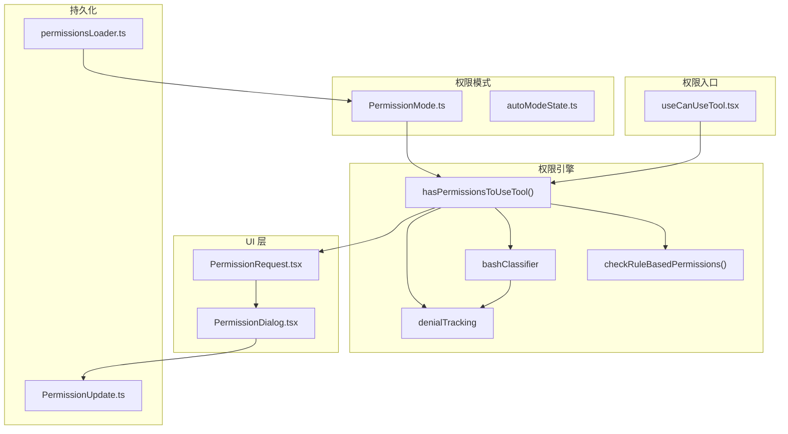
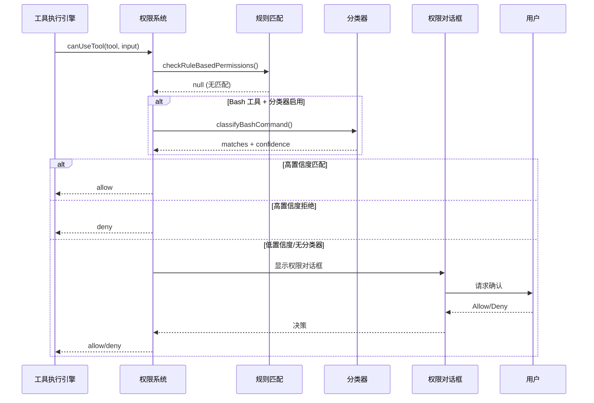

# 10 - 权限系统

> **本章目标**：理解 Claude Code 的多层权限架构，包括权限模式 (Permission Mode)、规则系统 (Rule System)、分类器 (Classifier)、权限 UI 组件、以及拒绝追踪 (Denial Tracking) 机制。掌握从模型发出工具调用到最终权限决策的完整链路。

---

## 1. 学习目标

- [ ] 理解权限模式的种类及各自的适用场景
- [ ] 掌握规则系统的匹配优先级和 deny/allow 规则
- [ ] 能够追踪 hasPermissionsToUseTool() 的完整决策流程
- [ ] 理解分类器的工作原理和"投机性检查"机制
- [ ] 了解拒绝追踪机制防止分类器误判的作用

---

## 2. 背景问题

### 2.1 为什么需要权限系统？

Claude Code 是一个强大的工具，能够：
- 执行任意 Shell 命令
- 读写文件系统
- 修改系统配置

如果没有权限控制，AI 可能执行危险操作（如 `rm -rf /`）。权限系统确保：
1. 用户知道正在执行什么操作
2. 用户可以拒绝危险操作
3. 常见操作可以被自动放行

### 2.2 为什么需要多层权限架构？

单一权限检查不够，因为：
- **规则系统**：用户配置的是"长期政策"（如允许所有 Read 操作）
- **分类器**：AI 模型判断的是"当前命令是否匹配政策"
- **Hook 系统**：外部扩展可以介入决策过程
- **UI 交互**：用户最终决定是否允许

### 2.3 拒绝追踪解决了什么问题？

如果分类器连续拒绝 3 次或总共拒绝 20 次，怀疑分类器出了问题：
- 可能是规则描述不准确
- 可能是命令确实被错误分类

此时自动回退到提示模式，让用户确认。

---

## 3. 源码入口

| 项目 | 内容 |
|------|------|
| 权限检查入口 | `src/hooks/useCanUseTool.tsx` — `useCanUseTool()` |
| 权限引擎核心 | `src/utils/permissions/permissions.ts` — `hasPermissionsToUseTool()` |
| 规则匹配 | `src/utils/permissions/permissions.ts` — `checkRuleBasedPermissions()` |
| 分类器 | `src/utils/permissions/bashClassifier.ts` — `classifyBashCommand()` |
| 拒绝追踪 | `src/utils/permissions/denialTracking.ts` — `shouldFallbackToPrompting()` |
| 调用链 | tool.call() → canUseTool() → hasPermissionsToUseTool() → checkRuleBasedPermissions() |

---

## 4. 架构定位

### 4.1 模块职责

权限系统是**决策引擎**，负责：
1. 根据规则和分类器决定工具是否可执行
2. 管理权限模式（default/plan/auto/bypass）
3. 提供 UI 组件让用户做最终决策
4. 追踪拒绝历史，防止分类器误判

### 4.2 决策流程

```text
hasPermissionsToUseTool()
    ↓
checkRuleBasedPermissions() — 遍历所有规则
    ↓ (无匹配)
Bash 分类器 — AI 判断命令安全性
    ↓ (无分类器)
Auto 模式分类器 — (如果启用)
    ↓ (都不匹配)
默认返回 ask — 需要用户交互
```

### 4.3 模块关系



---

## 5. 核心源码分析

### 5.1 useCanUseTool Hook (useCanUseTool.tsx:28-150)

```typescript
// src/hooks/useCanUseTool.tsx:32
const useCanUseTool = (setToolUseConfirmQueue, setToolPermissionContext) => {
  return async (
    tool: Tool,
    input: Input,
    toolUseContext: ToolUseContext,
    assistantMessage: AssistantMessage,
    toolUseID: string,
    forceDecision?: PermissionDecision<Input>,
  ): Promise<PermissionDecision<Input>> => {
    const ctx = createPermissionContext(...)
    const decisionPromise = forceDecision !== undefined
      ? Promise.resolve(forceDecision)
      : hasPermissionsToUseTool(tool, input, toolUseContext, assistantMessage, toolUseID)

    return decisionPromise.then(async result => {
      if (result.behavior === 'allow') {
        // 直接放行
        resolve(ctx.buildAllow(input, { decisionReason: result.decisionReason }))
        return
      }

      if (result.behavior === 'deny') {
        // 直接拒绝
        resolve(result)
        return
      }

      // ask — 需要交互
      if (appState.toolPermissionContext.awaitAutomatedChecksBeforeDialog) {
        // 协调器模式：自动处理
        const coordinatorDecision = await handleCoordinatorPermission(...)
        if (coordinatorDecision) { resolve(coordinatorDecision); return }
      }

      // 投机性分类器检查（2秒超时）
      if (feature('BASH_CLASSIFIER') && result.pendingClassifierCheck) {
        const raceResult = await Promise.race([
          speculativePromise,
          new Promise(res => setTimeout(res, 2000, { type: 'timeout' })),
        ])
        if (raceResult.type === 'result' && raceResult.result.matches && raceResult.result.confidence === 'high') {
          // 高置信度匹配 → 自动放行
          resolve(ctx.buildAllow(...))
          return
        }
      }

      // 显示交互式对话框
      handleInteractivePermission(...)
    })
  }
}
```

### 5.2 权限引擎 hasPermissionsToUseTool (permissions.ts)

权限检查的核心逻辑：

```typescript
// 伪代码展示结构
async function hasPermissionsToUseTool(
  tool: Tool,
  input: {...},
  context: ToolUseContext,
  ...
): Promise<PermissionResult> {
  // 1. 规则匹配
  const ruleResult = checkRuleBasedPermissions(tool, input, context)
  if (ruleResult) return ruleResult

  // 2. Bash 分类器（如果启用）
  if (feature('BASH_CLASSIFIER') && tool.name === BASH_TOOL_NAME) {
    const classifierResult = await classifyBashCommand(...)
    if (classifierResult.confidence === 'high') {
      return classifierResult.matches
        ? { behavior: 'allow', decisionReason: { type: 'classifier', ... } }
        : { behavior: 'deny', decisionReason: { type: 'classifier', ... } }
    }
  }

  // 3. Auto 模式分类器
  if (feature('TRANSCRIPT_CLASSIFIER')) {
    const autoResult = classifyYoloAction(...)
    if (autoResult) return autoResult
  }

  // 4. 拒绝追踪检查
  if (shouldFallbackToPrompting(context.localDenialTracking)) {
    return { behavior: 'ask' }
  }

  // 5. 默认 ask
  return { behavior: 'ask' }
}
```

### 5.3 规则匹配 checkRuleBasedPermissions (permissions.ts)

```typescript
// 伪代码展示优先级
function checkRuleBasedPermissions(
  tool: Tool,
  input: {...},
  context: ToolPermissionContext,
): PermissionResult | null {
  const sources = [
    'cliArg',        // 命令行参数（最高）
    'flagSettings',  // 标志设置
    'policySettings',// 管理员策略
    'projectSettings',// 项目设置
    'userSettings',  // 用户设置
    'localSettings', // 本地设置
    'session',       // 会话临时规则（最低）
  ]

  for (const source of sources) {
    // deny 规则优先
    const denyRules = context.alwaysDenyRules[source]
    if (matchToolRule(tool, input, denyRules)) {
      return { behavior: 'deny', decisionReason: { type: 'rule', source } }
    }

    // allow 规则
    const allowRules = context.alwaysAllowRules[source]
    if (matchToolRule(tool, input, allowRules)) {
      return { behavior: 'allow', decisionReason: { type: 'rule', source } }
    }
  }

  return null // 无匹配
}
```

### 5.4 权限模式配置 (PermissionMode.ts)

```typescript
// src/utils/permissions/PermissionMode.ts
const PERMISSION_MODE_CONFIG = {
  default:     { title: 'Default',           color: 'text' },
  plan:        { title: 'Plan Mode',          color: 'planMode', symbol: PAUSE_ICON },
  acceptEdits: { title: 'Accept edits',       color: 'autoAccept' },
  auto:        { title: 'Auto mode',          color: 'warning' },  // 仅内部使用
  bypassPermissions: { title: 'Bypass Permissions', color: 'error' },
  dontAsk:     { title: "Don't Ask",          color: 'error' },
}
```

| 模式 | 说明 | 风险 |
|------|------|------|
| `default` | 每次工具调用都需要用户确认 | 低 |
| `plan` | 只允许只读操作 | 低 |
| `acceptEdits` | 自动允许文件编辑 | 中 |
| `auto` | AI 分类器自动判断 | 中 |
| `bypassPermissions` | 跳过所有权限检查 | 高 |
| `dontAsk` | 类似 auto，使用分类器 | 中 |

### 5.5 拒绝追踪 denialTracking (denialTracking.ts)

```typescript
// src/utils/permissions/denialTracking.ts
export const DENIAL_LIMITS = {
  maxConsecutive: 3,   // 连续拒绝 3 次
  maxTotal: 20,       // 总共拒绝 20 次
}

export function shouldFallbackToPrompting(
  state: DenialTrackingState,
): boolean {
  return (
    state.consecutiveDenials >= DENIAL_LIMITS.maxConsecutive ||
    state.totalDenials >= DENIAL_LIMITS.maxTotal
  )
}
```

---

## 6. 可视化结构

### 6.1 权限检查完整流程



### 6.2 规则匹配优先级

```text
高优先级
  │
  ├─ cliArg (命令行参数)
  ├─ flagSettings (标志设置)
  ├─ policySettings (管理员策略)
  ├─ projectSettings (.claude/settings.json)
  ├─ userSettings (~/.claude/settings.json)
  ├─ localSettings (settings.local.json)
  │
  └─ session (会话临时规则)
低优先级

规则匹配顺序：
1. deny 规则（任何优先级匹配即拒绝）
2. allow 规则（按优先级依次检查）
3. 无匹配 → ask
```

### 6.3 权限 UI 组件结构

```text
src/components/permissions/
├── PermissionRequest.tsx        — 权限请求主组件
├── PermissionPrompt.tsx         — 权限提示
├── PermissionDialog.tsx         — 对话框
├── PermissionExplanation.tsx    — 解释文本
├── BashPermissionRequest/       — Bash 命令权限
├── FileEditPermissionRequest/   — 文件编辑权限
├── FileWritePermissionRequest/  — 文件写入权限
├── SandboxPermissionRequest.tsx — 沙箱权限
├── SedEditPermissionRequest/    — sed 编辑权限
└── WebFetchPermissionRequest/    — Web 请求权限
```

---

## 7. 工程经验

### 7.1 为什么 deny 规则优先于 allow 规则？

**场景**：
- allow 规则：`Bash(npm *)` — 允许所有 npm 命令
- deny 规则：`Bash(npm run rm *)` — 拒绝危险的 npm rm

如果 allow 优先，`npm run rm -rf /` 会被允许；如果 deny 优先，会被拒绝。

**设计决策**：安全第一，deny 优先。

### 7.2 分类器为什么不直接允许/拒绝？

分类器返回的是 `confidence: 'high'/'medium'/'low'`：
- high + matches → 自动放行
- high + !matches → 自动拒绝
- medium/low → 需要用户确认

**原因**：AI 分类器不是 100% 准确，低置信度时让用户判断更安全。

### 7.3 常见坑与避坑指南

| 坑点 | 触发条件 | 解决方案 |
|------|----------|----------|
| 规则不生效 | 规则格式错误 | 检查 `permissionRuleValueFromString()` |
| 分类器超时 | 2秒内未返回 | 使用 `Promise.race()` 超时处理 |
| 拒绝计数不累积 | 子进程的拒绝未被追踪 | 检查 `localDenialTracking` |
| 权限对话框不显示 | `shouldAvoidPermissionPrompts` 为 true | 检查权限上下文配置 |

### 7.4 替代方案分析

| 方案 | 优点 | 缺点 |
|------|------|------|
| 纯规则匹配 | 简单、可预测 | 无法处理复杂模式 |
| 纯分类器 | 能处理复杂模式 | 需要 AI 能力、有延迟 |
| 当前混合方案 | 平衡安全性和用户体验 | 复杂度高 |

---

## 8. Contributor 指南

### 8.1 适合新手的文件

| 文件 | 难度 | 原因 |
|------|------|------|
| `PermissionDialog.tsx` | L1 | UI 组件修改 |
| `PermissionExplanation.tsx` | L1 | 改进提示文本 |
| `denialTracking.ts` | L2 | 理解拒绝追踪逻辑 |
| `PermissionMode.ts` | L2 | 添加新权限模式 |

### 8.2 危险逻辑（修改需谨慎）

| 文件 | 风险等级 | 原因 |
|------|----------|------|
| `hasPermissionsToUseTool()` | 🔴 高 | 权限决策核心 |
| `checkRuleBasedPermissions()` | 🔴 高 | 规则匹配逻辑 |
| `resolveHookPermissionDecision()` | 🔴 高 | Hook 与规则交互 |
| `classifyBashCommand()` | 🟡 中 | 分类器可能有偏见 |

### 8.3 调试方法

1. **启用调试日志**：
   ```typescript
   // 在 hasPermissionsToUseTool() 添加
   console.log('[Permissions] Checking:', tool.name, input)
   console.log('[Permissions] Context mode:', context.mode)
   ```

2. **追踪规则匹配**：
   ```typescript
   // 在 checkRuleBasedPermissions() 添加
   console.log('[Rules] Checking source:', source, 'rules:', rules.length)
   ```

3. **验证拒绝计数**：
   ```typescript
   // 在 recordDenial() 添加
   console.log('[Denial] Count:', state.consecutiveDenials, state.totalDenials)
   ```

### 8.4 相关 Issue/PR

- 权限系统重构：拆分 `hasPermissionsToUseTool()` 提高可维护性
- 分类器集成：改进 Bash 分类器的准确性
- Hook 增强：支持更多 Hook 类型

---

## 练习

### 练习 1：追踪权限决策

目标：追踪从 `canUseTool()` 到最终决策的完整路径。

步骤：
1. 从 `useCanUseTool.tsx` 开始
2. 追踪到 `hasPermissionsToUseTool()`
3. 分析 `checkRuleBasedPermissions()` 的匹配逻辑
4. 理解分类器如何影响决策

### 练习 2：分析拒绝追踪

场景：分类器连续拒绝 5 次

问题：
1. 拒绝计数在哪里维护？
2. 第几次拒绝后会触发回退？
3. 回退后会发生什么？

### 练习 3：权限模式切换

场景：从 `default` 模式切换到 `plan` 模式

问题：
1. 模式切换在哪里发生？
2. `plan` 模式的限制是什么？
3. 退出 `plan` 模式后如何恢复？

---

## 练习答案速查

| 练习 | 核心答案 |
|------|---------|
| 练习 1 | `useCanUseTool()` → `hasPermissionsToUseTool()` → `checkRuleBasedPermissions()` → 分类器判断 |
| 练习 2 | 拒绝计数在 `denialTracking.ts` 维护；第 3 次拒绝后触发回退；回退后显示确认对话框 |
| 练习 3 | 模式切换在 `ExitPlanModeV2Tool` 执行；`plan` 模式禁用写操作和 Agent；退出后恢复原模式 |

---

## 本章 vs Java Spring Security

| 方面 | Claude Code | Java Spring |
|------|-------------|-------------|
| 权限模式 | PermissionMode enum | `@PreAuthorize`, `hasRole()` |
| 规则匹配 | checkRuleBasedPermissions() | `AccessDecisionVoter` |
| 分类器 | AI 模型判断 | 无等价 |
| 拒绝追踪 | denialTracking | 无等价 |
| UI 确认 | PermissionDialog | 无等价（SecurityInterceptor 无 UI） |

---

## 下一篇

👉 [11 - 上下文管理与压缩](./11-上下文管理与压缩.md)
