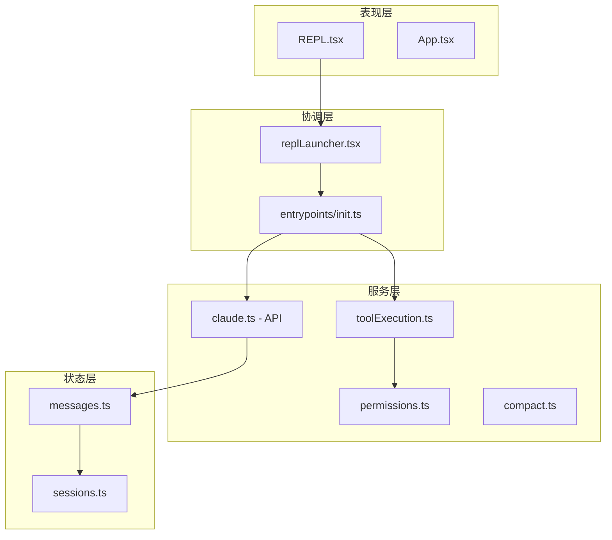
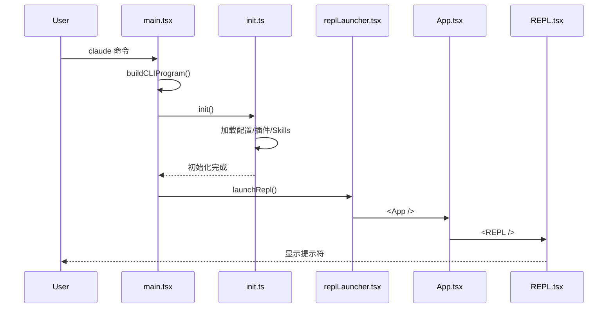
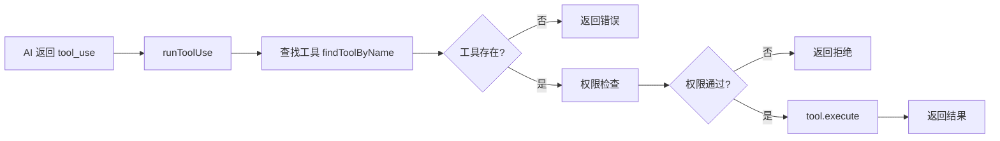
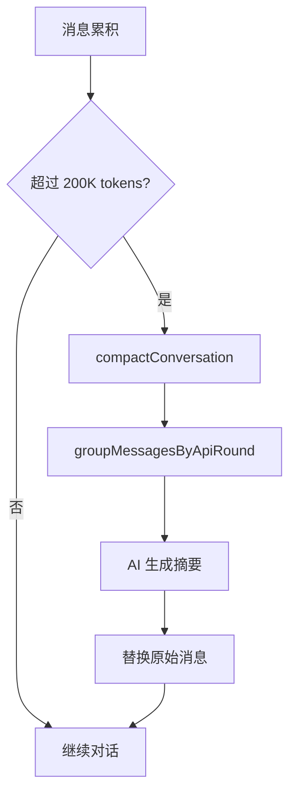

# 17 - 如何阅读大型项目源码

> **本章目标**：学会高效阅读和理解大型开源项目源码，掌握源码阅读的技巧和方法论，能够独立追踪 Claude Code 的核心调用链。

---

## 1. 学习目标

- [ ] 掌握"带着问题阅读"而非逐行阅读的方法论
- [ ] 能够追踪 Claude Code 的核心调用链（启动、工具执行、API 调用）
- [ ] 使用考古模式理解历史设计决策
- [ ] 识别常见的架构模式和代码模式
- [ ] 学会定位关键源码文件并进行深度阅读

---

## 2. 背景问题

### 2.1 为什么阅读大型源码这么难？

Claude Code 是一个拥有超过 300+ 源文件的复杂项目，直接阅读会面临：

1. **入口不清晰**：不知道从哪里开始
2. **调用层次深**：一层套一层，追踪困难
3. **跨模块调用**：一个功能涉及多个模块
4. **历史包袱**：代码经过多次迭代，存在不一致

### 2.2 阅读源码的正确姿势

```
❌ 错误方法：从 main() 逐行阅读
main() → import → function A → function B → function C → ...
→ 迷失在代码海洋中

✅ 正确方法：带着问题阅读
问题："消息如何发送到 API？"
→ 搜索相关关键词 → 追踪调用链 → 理解关键代码
```

---

## 3. 源码入口

### 3.1 Claude Code 核心文件索引

| 功能 | 文件路径 | 核心函数 | 行号 |
|------|----------|----------|------|
| **启动入口** | `src/main.tsx` | `main()` | #585 |
| **CLI 构建** | `src/main.tsx` | `buildCLIProgram()` | #450 |
| **初始化** | `src/entrypoints/init.ts` | `init()` (memoized) | #57 |
| **REPL 启动** | `src/repl/replLauncher.tsx` | `launchRepl()` | #50 |
| **工具执行** | `src/services/tools/toolExecution.ts` | `runToolUse()` | #337 |
| **API 调用** | `src/services/api/claude.ts` | `createMessageStream()` | #100 |
| **消息状态** | `src/state/messages.ts` | `createUserMessage()` | #30 |
| **权限检查** | `src/utils/permissions/permissions.ts` | `checkRuleBasedPermissions()` | #1071 |

### 3.2 目录结构速查

```
src/
├── main.tsx                    # 入口点
├── entrypoints/
│   └── init.ts                 # 初始化逻辑
├── repl/
│   ├── replLauncher.tsx        # REPL 启动器
│   └── App.tsx                 # 主应用组件
├── screens/
│   └── REPL.tsx                # REPL 主界面
├── services/
│   ├── api/
│   │   ├── claude.ts          # API 通信
│   │   └── withRetry.ts        # 重试逻辑
│   ├── tools/
│   │   └── toolExecution.ts    # 工具执行引擎
│   ├── permissions/
│   │   ├── permissions.ts      # 权限检查主逻辑
│   │   └── denialTracking.ts    # 拒绝追踪
│   ├── compact/
│   │   └── compact.ts          # 上下文压缩
│   └── mcp/
│       ├── connection.ts       # MCP 连接
│       └── client.ts           # MCP 客户端
├── skills/
│   ├── loadSkillsDir.ts        # Skill 加载
│   └── bundledSkills.ts       # 内建 Skills
└── state/
    ├── messages.ts             # 消息状态
    └── sessions.ts             # 会话管理
```

---

## 4. 架构定位

### 4.1 模块职责分层



### 4.2 核心调用链

```
用户输入命令
    ↓
main.tsx:main() [585]
    ↓
buildCLIProgram() [450]
    ↓
init() [init.ts:57] (缓存)
    ↓
launchRepl() [replLauncher.tsx:50]
    ↓
App.tsx → REPL.tsx
    ↓
用户输入消息
    ↓
createUserMessage() [messages.ts:30]
    ↓
createMessageStream() [claude.ts:100]
    ↓
API 流式响应
    ↓
runToolUse() [toolExecution.ts:337]
    ↓
checkPermissionsAndCallTool() [599]
    ↓
Tool.execute()
```

---

## 5. 核心源码分析

### 5.1 启动流程（精简版）

**文件**：`src/main.tsx:450-585`

```typescript
// CLI 入口
async function main() {
  const program = buildCLIProgram();

  program.parse(args);

  // 初始化（带缓存）
  await init();

  // 启动 REPL
  await launchRepl();
}

// CLI 构建
function buildCLIProgram(): Command {
  return program
    .name('claude')
    .description('Claude Code CLI')
    .version(version)
    .action(main);
}
```

### 5.2 工具执行流程

**文件**：`src/services/tools/toolExecution.ts:337-400`

```typescript
// 工具执行入口
async function runToolUse(
  params: RunToolUseParams
): Promise<ExecuteToolResult> {
  const { toolCall, toolContext } = params;

  // 1. 查找工具
  const tool = findToolByName(allTools, toolCall.name);
  if (!tool) {
    return { success: false, error: `Unknown tool: ${toolCall.name}` };
  }

  // 2. 权限检查
  const permission = checkPermissionsAndCallTool(tool, toolContext);
  if (!permission.allowed) {
    return { success: false, error: `Permission denied: ${permission.reason}` };
  }

  // 3. 执行工具
  return await tool.execute(toolCall.input, toolContext);
}
```

### 5.3 追踪调用链的方法

```bash
# 方法 1：使用 grep 搜索
grep -r "runToolUse" src/ --include="*.ts"

# 方法 2：使用 IDE 的 Find References
# VS Code: Shift+F12

# 方法 3：使用 TypeScript 编译器输出调用图
npx tsc --generateTrace target/dir
```

---

## 6. 可视化结构

### 6.1 启动时序图



### 6.2 工具执行流程图



### 6.3 上下文压缩流程



---

## 7. 工程经验

### 7.1 架构腐化识别

| 问题类型 | 具体表现 | 源码位置 |
|----------|----------|----------|
| **过度耦合** | `init.ts` 声称是初始化入口，但实际初始化逻辑分散在 `loadAllPlugins()`、`getSkillDirCommands()`、`initBundledSkills()` 等多个懒加载调用中 | `src/entrypoints/init.ts:57` |
| **模块泄漏** | `getAllBaseTools()` 返回工具数组，调用方可以直接遍历修改，绕过注册表的过滤逻辑 | `src/tools.ts` |
| **循环依赖** | `init.ts` → `loadAllPlugins()` → 可能回调 → `init.ts` 初始化完成检查 | `src/entrypoints/init.ts` + `src/utils/plugins/` |
| **状态共享** | 消息状态通过 `messages: Message[]` mutable 数组管理，`addMessages`/`updateMessage` 直接修改数组 | `src/state/messages.ts` |
| **不合理抽象** | `createUserMessage()` 同时处理创建、frontmatter 解析、base64 解码，违反单一职责 | `src/state/messages.ts:30-80` |
| **技术债** | 模块间依赖通过直接引用而非接口，追踪依赖链困难，修改一个模块影响不可预测 | 整个 `src/` 目录 |
| **命名错误** | `init.ts` 中 `init()` 函数实际是"懒加载所有依赖项"而非传统意义的初始化 | `src/entrypoints/init.ts:57` |

### 7.2 技术债详情

**1. `init.ts` 初始化逻辑不集中**

| 项目 | 详情 |
|------|------|
| **问题** | `init()` 函数实际上是懒加载触发器，调用 `loadAllPlugins()`、`getSkillDirCommands()` 等多个懒加载函数，而非真正的初始化 |
| **源码** | `src/entrypoints/init.ts:57` |
| **历史原因** | 初期 `init()` 只是简单初始化，后续懒加载需求增加导致职责扩散 |
| **工程代价** | 难以确定初始化顺序，当初始化失败时难以定位是哪个模块出问题 |
| **未修原因** | 懒加载提高了启动速度，但让初始化逻辑变得不透明 |
| **渐进方案** | 添加 `InitializationPhase` 枚举，将初始化分解为 `preInit()`、`coreInit()`、`postInit()` 阶段 |

**2. 工具注册表全局状态**

| 项目 | 详情 |
|------|------|
| **问题** | `getAllBaseTools()` 返回可变数组而非只读视图，调用方可以直接修改工具列表，没有访问控制 |
| **源码** | `src/tools.ts` |
| **历史原因** | 初期简单实现，全局工具表便于快速查找 |
| **工程代价** | 并发访问可能导致状态不一致，难以测试 |
| **未修原因** | 重构为受控访问需要修改所有使用 `getAllBaseTools()` 的地方 |
| **渐进方案** | 返回 `ReadonlyArray` 或封装为工具注册表类，提供受控访问接口 |

**3. 消息状态 mutable 数组**

| 项目 | 详情 |
|------|------|
| **问题** | `messages: Message[]` 是 mutable 数组，`addMessages()` 直接 `push`，并发调用可能导致状态不一致 |
| **源码** | `src/state/messages.ts` |
| **历史原因** | 初期假设单线程执行，未考虑并发写入 |
| **工程代价** | Agent 并发写入消息时可能丢失更新 |
| **未修原因** | 改为 immutable 更新需要较大重构，影响性能（每次更新都拷贝） |
| **渐进方案** | 使用 `immer` 或类似库实现 structural sharing，保持 immutable 语义但避免全量拷贝 |

**4. `createUserMessage` 职责过载**

| 项目 | 详情 |
|------|------|
| **问题** | `createUserMessage()` 同时处理消息创建、frontmatter 解析、base64 附件解码，多个职责混在一个函数中 |
| **源码** | `src/state/messages.ts:30-80` |
| **历史原因** | 这些功能在不同时间添加，都与"创建用户消息"相关就放在一起 |
| **工程代价** | 当需要创建不含附件的消息时仍需经过完整解析流程 |
| **未修原因** | 拆分需要处理边界情况，如部分解析成功如何回滚 |
| **渐进方案** | 提取 `parseMessageAttachments()` 和 `parseMessageFrontmatter()` 独立函数 |

**5. 模块依赖追踪困难**

| 项目 | 详情 |
|------|------|
| **问题** | 模块间依赖通过直接 `import` 而非接口抽象，依赖关系没有统一管理，修改影响不可预测 |
| **源码** | 整个 `src/` 目录 |
| **历史原因** | TypeScript 的 `import` 足够灵活，初期没有建立抽象层次的动机 |
| **工程代价** | 新增功能时难以确定修改范围，重构风险高 |
| **未修原因** | 引入接口层增加复杂度，而当前项目规模尚可接受直接依赖 |
| **渐进方案** | 使用 `tsyringe` 或类似 DI 容器，建立服务注册中心，统一管理依赖关系 |

### 7.3 为什么 Claude Code 这样组织代码？

**1. 入口集中便于初始化**

所有初始化逻辑集中在 `init.ts`，确保：
- 配置加载顺序一致
- 插件加载顺序一致
- Skills 加载顺序一致

**2. 服务层分离关注点**

```
API 调用 (claude.ts) ← 不关心 → 工具执行 (toolExecution.ts)
        ↓                                  ↓
     消息状态 (messages.ts) ← 共享 → 权限检查 (permissions.ts)
```

**3. 状态层集中管理**

所有消息通过 `messages.ts` 集中管理，便于：
- 压缩
- 序列化
- 调试

### 7.4 常见架构模式

| 模式 | 示例 | 说明 |
|------|------|------|
| 注册表模式 | `findToolByName()` | 全局工具查找 |
| 工厂模式 | `createUserMessage()` | 工厂方法创建实例 |
| 策略模式 | `CompactionStrategy` | 不同压缩策略 |
| 责任链模式 | `checkPermissionsAndCallTool()` | 权限检查链 |
| 备忘录模式 | `SessionMemory` | 记忆持久化 |

### 7.5 常见坑与避坑指南

| 坑点 | 触发条件 | 解决方案 |
|------|---------|---------|
| 初始化循环依赖 | 在 init() 中引用未初始化的服务 | 使用懒加载 |
| 工具执行阻塞 | 工具内部同步耗时操作 | 使用 async/await |
| 消息状态不一致 | 并发修改消息数组 | 使用 immutable 更新 |
| 权限检查绕过 | 直接调用 tool.execute() | 始终通过 runToolUse() |

---

## 8. Contributor 指南

### 8.1 适合新手的源码文件

| 文件 | 难度 | 说明 |
|------|------|------|
| `src/tools.ts` | L2 | 工具注册，逻辑简单 |
| `src/state/messages.ts` | L2 | 消息状态管理 |
| `src/services/api/errors.ts` | L1 | 错误类型定义 |
| `src/tools/BashTool.ts` | L2 | 工具实现参考 |

### 8.2 危险逻辑（修改需谨慎）

| 区域 | 风险等级 | 说明 |
|------|---------|------|
| `init.ts` 初始化顺序 | 🔴 高 | 影响所有后续功能 |
| `toolExecution.ts` 权限检查 | 🔴 高 | 安全关键路径 |
| `messages.ts` 状态更新 | 🟡 中 | 可能导致 UI 不一致 |
| `compact.ts` 压缩逻辑 | 🟡 中 | 影响上下文完整性 |

### 8.3 调试方法

**1. 追踪启动流程**：
```bash
# 启用 verbose 日志
claude --verbose

# 查看初始化日志
grep "init" ~/.claude/logs/*.log
```

**2. 追踪工具执行**：
```typescript
// 在 runToolUse() 添加日志
console.log('[ToolExecution] Running:', toolCall.name, toolCall.input);
```

**3. 追踪 API 调用**：
```typescript
// 在 createMessageStream() 添加日志
console.log('[API] Request:', { model: params.model, messageCount: params.messages.length });
```

### 8.4 相关源码阅读路径

| 目标 | 阅读路径 |
|------|----------|
| 理解启动 | `main.tsx` → `init.ts` → `replLauncher.tsx` → `App.tsx` |
| 理解工具 | `toolExecution.ts` → `tools.ts` → `Tool.ts` → 具体工具 |
| 理解 API | `claude.ts` → `withRetry.ts` → `normalizeMessagesForAPI()` |
| 理解权限 | `permissions.ts` → `denialTracking.ts` → `checkPermissionsAndCallTool()` |

---

## 练习

### 练习 1：追踪工具执行链路

**问题**：追踪从用户输入 `/read src/main.tsx` 到显示文件内容的完整链路。

**答案**：

```
1. REPL.tsx 接收输入 "/read src/main.tsx"
2. parseCommand() 解析命令和参数
3. SkillTool 或直接工具调用
4. runToolUse(toolCall: { name: 'Read', input: { file_path: 'src/main.tsx' } })
5. findToolByName(allTools, 'Read') 查找 ReadTool
6. checkPermissionsAndCallTool(ReadTool)
7. ReadTool.execute({ file_path: 'src/main.tsx' })
8. 返回文件内容
```

### 练习 2：使用考古模式理解设计决策

**问题**：查看 `toolExecution.ts` 的 git 历史，理解为什么超时机制是这样设计的。

**答案**：

```bash
# 查看提交历史
git log --oneline -10 src/services/tools/toolExecution.ts

# 查看特定提交
git show abc123 --stat

# 查看某行的历史
git blame src/services/tools/toolExecution.ts | grep timeout
```

### 练习 3：识别架构模式

**问题**：在 Claude Code 中找出 3 种架构模式的实例。

**答案**：

| 模式 | 实例 | 文件位置 |
|------|------|----------|
| 注册表模式 | `findToolByName()` | `src/Tool.ts` |
| 策略模式 | `CompactionStrategy` | `src/services/compact/strategies.ts` |
| 工厂模式 | `createUserMessage()` | `src/state/messages.ts` |

---

## 总结

| 技巧 | 用途 |
|------|------|
| 先看 README | 理解项目定位 |
| 搜索关键词 | 快速定位代码 |
| 追踪调用链 | 理解数据流 |
| 看 git 历史 | 理解设计决策 |
| 识别模式 | 简化理解 |
| 带着问题 | 避免迷失 |

`★ Insight ─────────────────────────────────────`
阅读源码最重要的是**带着问题**，而不是试图理解每一行代码。大多数代码是"路径"——连接关键逻辑的桥梁——而不是"目的地"。找到关键函数，理解输入输出，然后追踪调用链，这比逐行阅读高效 10 倍。
`─────────────────────────────────────────────────`

---

## 下一篇

👉 [18 - 调试技巧与工具](./18-调试技巧与工具.md) —— 学习如何调试 Claude Code
