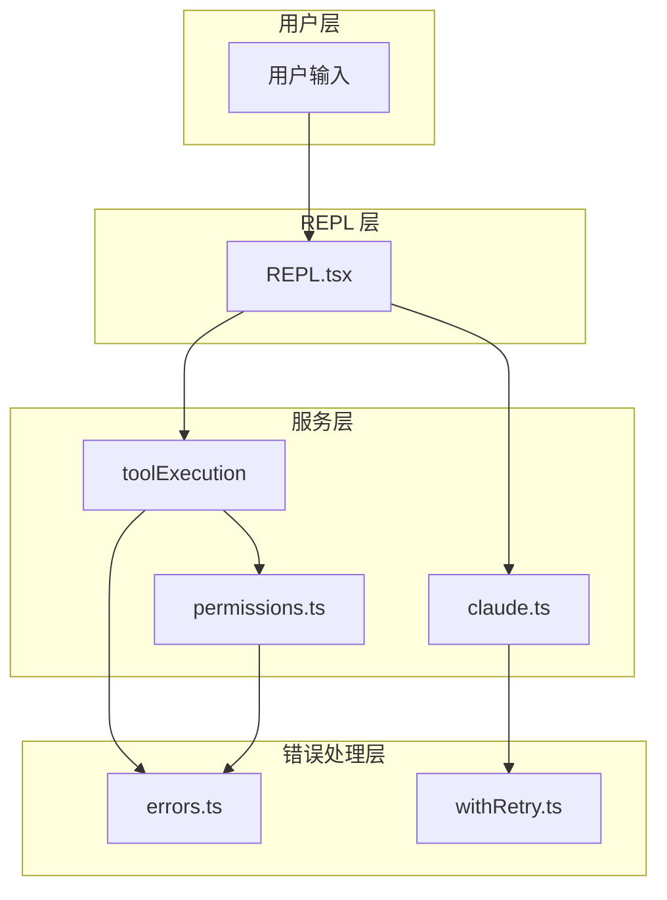
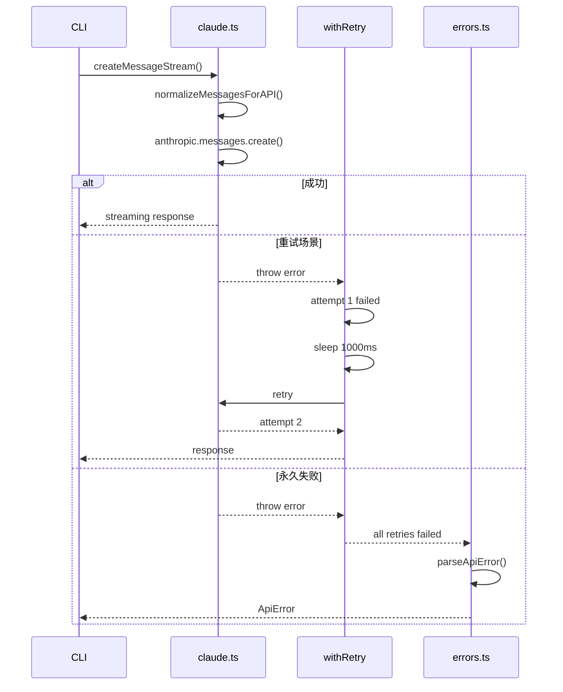
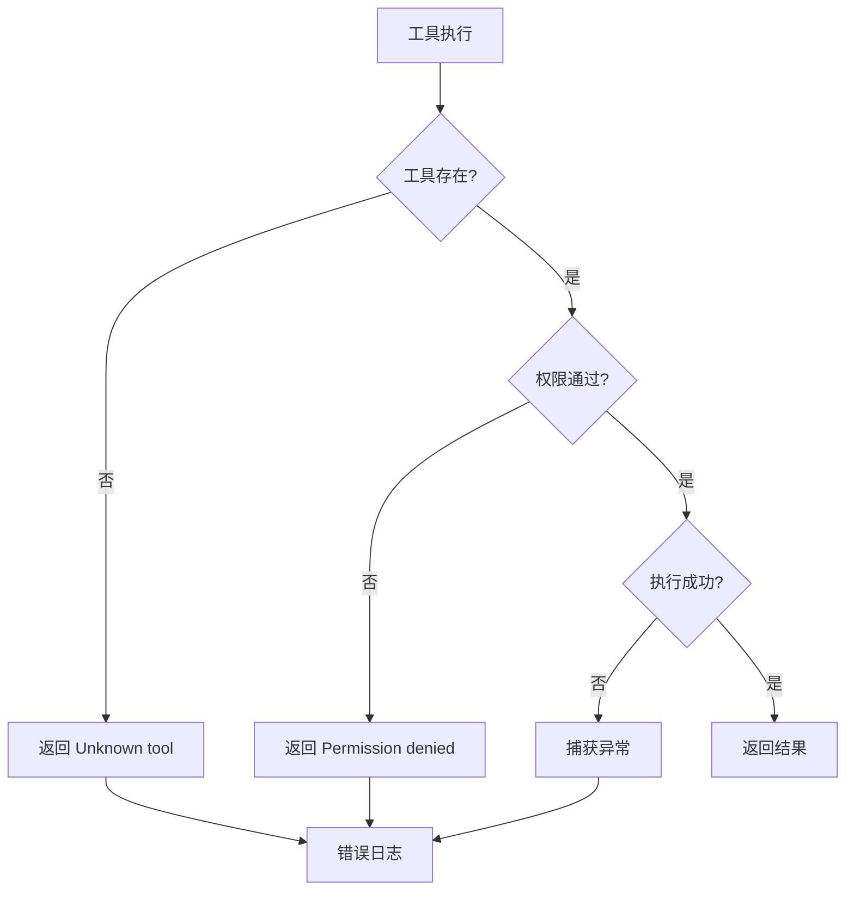

# 18 - 调试技巧与工具

> **本章目标**：掌握 Claude Code 的调试技巧，能够诊断工具执行失败、API 调用错误、权限问题等常见故障。

---

## 1. 学习目标

- [ ] 掌握 console.log 和日志级别调试
- [ ] 配置 VS Code 断点调试
- [ ] 诊断 API 调用失败
- [ ] 诊断工具执行失败
- [ ] 使用性能分析工具
- [ ] 掌握网络抓包和 cURL 转换

---

## 2. 背景问题

### 2.1 为什么调试大型项目很难？

Claude Code 的调试挑战：

1. **异步流式响应**：API 响应是流式的，传统断点不适用
2. **跨进程通信**：主进程和工具执行可能有状态同步问题
3. **上下文累积**：消息历史影响行为，难以复现
4. **权限系统干扰**：权限检查可能静默拒绝操作

### 2.2 调试策略

```
控制变量法：一次只改变一个因素
    ↓
二分查找：从代码中间开始，逐步缩小范围
    ↓
日志追踪：记录关键点的状态
    ↓
隔离复现：最小化复现步骤
```

---

## 3. 源码入口

### 3.1 调试相关文件

| 功能 | 文件路径 | 核心函数 | 行号 |
|------|----------|----------|------|
| **API 错误** | `src/services/api/errors.ts` | `parseApiError()` | #30 |
| **重试日志** | `src/services/api/withRetry.ts` | `withRetry()` | #30 |
| **工具错误** | `src/services/tools/toolExecution.ts` | `runToolUse()` | #337 |
| **权限拒绝** | `src/utils/permissions/permissions.ts` | `checkRuleBasedPermissions()` | #1071 |
| **消息日志** | `src/state/messages.ts` | `createUserMessage()` | #30 |

### 3.2 日志级别定义

```typescript
// src/utils/logger.ts
enum LogLevel {
  DEBUG = 0,
  INFO = 1,
  WARN = 2,
  ERROR = 3,
}

// 日志配置
const LOG_LEVEL = process.env.LOG_LEVEL ?? 'info';
```

---

## 4. 架构定位

### 4.1 错误处理层次



### 4.2 常见错误流程

```
工具执行失败
    ↓
runToolUse() 返回 { success: false, error: '...' }
    ↓
REPL 渲染错误消息
    ↓
用户看到错误提示

API 调用失败
    ↓
withRetry() 重试 N 次
    ↓
所有重试失败后抛出异常
    ↓
错误被捕获并格式化
```

---

## 5. 核心源码分析

### 5.1 API 错误解析

**文件**：`src/services/api/errors.ts:30-60`

```typescript
export function parseApiError(response: Response): ApiError {
  switch (response.status) {
    case 400:
      return { type: 'validation', message: 'Invalid request' };
    case 401:
      return { type: 'authentication', message: 'Invalid API key' };
    case 403:
      return { type: 'forbidden', message: 'Access denied' };
    case 429:
      return { type: 'rate_limit', message: 'Rate limit exceeded' };
    case 500:
    case 502:
    case 503:
      return { type: 'server_error', message: 'Server error' };
    default:
      return { type: 'unknown', message: `HTTP ${response.status}` };
  }
}
```

### 5.2 重试策略

**文件**：`src/services/api/withRetry.ts:30-60`

```typescript
export async function withRetry<T>(
  fn: () => Promise<T>,
  options: RetryOptions = {}
): Promise<T> {
  const { maxRetries = 3, initialDelayMs = 1000 } = options;

  for (let attempt = 0; attempt <= maxRetries; attempt++) {
    try {
      return await fn();
    } catch (error) {
      if (attempt === maxRetries || !shouldRetry(error)) {
        throw error;
      }
      const delay = initialDelayMs * Math.pow(2, attempt);
      await sleep(delay);
    }
  }
  throw new Error('Should not reach here');
}

function shouldRetry(error: unknown): boolean {
  if (error instanceof ApiError) {
    return ['rate_limit', 'server_error'].includes(error.type);
  }
  return false;
}
```

### 5.3 工具执行错误处理

**文件**：`src/services/tools/toolExecution.ts:337-400`

```typescript
async function runToolUse(
  params: RunToolUseParams
): Promise<ExecuteToolResult> {
  const { toolCall, toolContext } = params;

  // 错误处理模式
  try {
    const tool = findToolByName(allTools, toolCall.name);
    if (!tool) {
      return { success: false, error: `Unknown tool: ${toolCall.name}` };
    }

    const permission = checkPermissionsAndCallTool(tool, toolContext);
    if (!permission.allowed) {
      return {
        success: false,
        error: `Permission denied: ${permission.reason}`
      };
    }

    return await tool.execute(toolCall.input, toolContext);
  } catch (error) {
    // 未捕获的异常
    return {
      success: false,
      error: `Tool execution failed: ${error.message}`
    };
  }
}
```

---

## 6. 可视化结构

### 6.1 API 调用调试流程



### 6.2 工具执行调试流程



---

## 7. 工程经验

### 7.1 架构腐化识别

| 问题类型 | 具体表现 | 源码位置 |
|----------|----------|----------|
| **错误处理分散** | API 错误、工具错误、权限错误处理分散在各自模块，没有统一的错误类型层次 | `src/services/api/errors.ts` + `src/services/tools/toolExecution.ts` + `src/services/permissions/` |
| **日志系统不统一** | `console.log` 和 `logger.ts` 并存，日志格式（时间戳、级别）不一致 | 全局 |
| **调试接口不统一** | 不同模块暴露不同的调试接口（如 `withRetry` 的日志 vs `permissions.ts` 的调试输出） | 多个服务模块 |
| **技术债** | 错误信息有时候过于简洁（如 `"Tool execution failed: ..."`），缺少导致错误的上下文信息 | `src/services/tools/toolExecution.ts:214-219` |
| **状态共享** | `denialTracking` 作为全局状态，调试时需要手动查看其内部状态，没有暴露调试接口 | `src/utils/permissions/denialTracking.ts` |
| **隐式依赖** | 调试时假设某些服务已初始化（如 `init.ts` 懒加载的服务），但没有检查机制 | `src/entrypoints/init.ts` |
| **隐式依赖** | `withRetry` 依赖 `shouldRetry` 判断是否重试，但两函数分离且 `shouldRetry` 逻辑复杂 | `src/services/api/withRetry.ts:696-787` |

### 7.2 技术债详情

**1. 错误类型层次不统一**

| 项目 | 详情 |
|------|------|
| **问题** | `ApiError`、`ToolError`、`PermissionError` 是三种不同的错误类型，但没有统一继承关系，调用方需要分别处理 |
| **源码** | `src/services/api/errors.ts` + `src/services/tools/toolExecution.ts` |
| **历史原因** | 三种错误在不同时期添加，各自独立实现 |
| **工程代价** | 统一错误处理困难，某些边界情况（如 API 错误导致工具执行失败）的错误链难以追踪 |
| **未修原因** | 重构需要修改所有错误处理路径，影响面广 |
| **渐进方案** | 定义 `ClaudeCodeError` 基类，所有具体错误继承它，提供统一的 `fromError()` 工厂方法 |

**2. 日志系统不一致**

| 项目 | 详情 |
|------|------|
| **问题** | 部分代码使用 `console.log/error/warn`，部分使用 `logger.ts`，日志格式（时间戳、级别、来源）不统一 |
| **源码** | 全局 |
| **历史原因** | 初期使用 `console`，后期引入 `logger.ts` 但未迁移旧代码 |
| **工程代价** | 统一收集和分析日志困难，某些日志可能被遗漏 |
| **未修原因** | 迁移所有 `console` 调用到 `logger` 需要大量工作，短期收益不明显 |
| **渐进方案** | 使用 `eslint-plugin-no-console` 强制新代码使用 `logger`，逐步迁移旧代码 |

**3. 错误信息缺少上下文**

| 项目 | 详情 |
|------|------|
| **问题** | `"Tool execution failed: ${error.message}"` 丢失了原始错误的上下文（如工具名、输入参数、调用链） |
| **源码** | `src/services/tools/toolExecution.ts:214-219` |
| **历史原因** | 初期快速实现，错误信息以简洁为主 |
| **工程代价** | 用户看到错误难以调试，需要手动复现 |
| **未修原因** | 添加上下文需要修改所有 catch 块，工作量大 |
| **渐进方案** | 创建 `ToolExecutionError` 类，包含工具名、输入、调用链等上下文信息 |

**4. denialTracking 调试接口缺失**

| 项目 | 详情 |
|------|------|
| **问题** | `denialTracking` 的内部状态（consecutiveDenials、totalDenials）对调试不透明，用户无法查看当前拒绝状态 |
| **源码** | `src/utils/permissions/denialTracking.ts` |
| **历史原因** | 初期作为内部实现细节，未考虑对外暴露 |
| **工程代价** | 调试权限问题时需要猜测 denialTracking 的状态 |
| **未修原因** | 暴露内部状态可能泄露安全相关信息 |
| **渐进方案** | 添加 `getDenialStats()` 只读接口，返回聚合统计而非原始数据 |

**5. `withRetry` 生成器接口复杂**

| 项目 | 详情 |
|------|------|
| **问题** | `withRetry` 是 `AsyncGenerator` 而非普通 Promise，调用方需要 `for await...of` 消费，增加使用复杂度 |
| **源码** | `src/services/api/withRetry.ts:170` |
| **历史原因** | 需要在重试过程中 yield 错误消息给用户，所以使用生成器 |
| **工程代价** | 简单的重试调用需要 `for await (const _ of withRetry(...))` 模式，不直观 |
| **未修原因** | 这是实现需求的必要权衡，改变需要重新设计 API |
| **渐进方案** | 提供 `withRetrySimple()` 包装，返回普通 Promise，内部使用 `withRetry` 但忽略中间消息 |

### 7.3 常见错误速查

| 错误 | 原因 | 解决方案 |
|------|------|----------|
| `Permission denied` | 工具未在白名单 | 检查 permissions.json |
| `Unknown tool: xxx` | 工具未注册 | 检查 tools.ts |
| `Rate limit exceeded` | API 调用过于频繁 | 等待后重试 |
| `Invalid API key` | API Key 错误 | 检查环境变量 |
| `max_tokens exceeded` | 上下文超出限制 | 使用 /compact |

### 7.4 性能问题诊断

```typescript
// 诊断工具执行时间
const start = performance.now();
const result = await tool.execute(input);
const duration = performance.now() - start;

if (duration > 5000) {
  console.warn(`[PERF] ${tool.name} took ${duration}ms`);
}

// 诊断内存使用
const messages = getMessages();
const tokens = estimateTokens(messages);
console.log(`[MEMORY] ${tokens} tokens in ${messages.length} messages`);
```

### 7.5 常见坑与避坑指南

| 坑点 | 触发条件 | 解决方案 |
|------|---------|---------|
| 断点无法命中 | 异步代码执行在不同 tick | 使用 async 断点 |
| 状态被优化掉 | 闭包捕获旧状态 | 检查变量引用 |
| 日志顺序错乱 | 并发写入 stdout | 使用带锁的日志 |
| 内存泄漏 | 消息累积不清理 | 定期 compact |

---

## 8. Contributor 指南

### 8.1 调试工具配置

**VS Code launch.json**：

```json
{
  "version": "0.2.0",
  "configurations": [
    {
      "type": "node",
      "request": "launch",
      "name": "Debug Claude Code",
      "program": "${workspaceFolder}/src/main.tsx",
      "runtimeExecutable": "bun",
      "runtimeArgs": ["run", "src/main.tsx"],
      "args": ["--verbose"],
      "console": "integratedTerminal"
    }
  ]
}
```

### 8.2 添加调试日志

```typescript
// 在关键路径添加日志
console.log('[DEBUG] Entering runToolUse:', toolCall.name);

// 条件日志
if (process.env.DEBUG) {
  console.log('[DEBUG] Tool input:', JSON.stringify(toolCall.input, null, 2));
}

// 性能日志
const start = performance.now();
const result = await originalFn();
console.log(`[PERF] ${fnName} took ${performance.now() - start}ms`);
return result;
```

### 8.3 常见调试任务

| 任务 | 方法 | 文件 |
|------|------|------|
| 追踪 API 请求 | 添加日志到 claude.ts | `src/services/api/claude.ts` |
| 追踪工具执行 | 添加日志到 toolExecution.ts | `src/services/tools/toolExecution.ts` |
| 追踪权限检查 | 添加日志到 permissions.ts | `src/utils/permissions/permissions.ts` |
| 追踪消息状态 | 添加日志到 messages.ts | `src/state/messages.ts` |

### 8.4 测试调试

```typescript
// 单元测试
import { describe, it, expect } from 'bun:test';

describe('toolExecution', () => {
  it('should return error for unknown tool', async () => {
    const result = await runToolUse({
      toolCall: { name: 'UnknownTool', input: {} },
      toolContext: createMockContext(),
    });
    expect(result.success).toBe(false);
    expect(result.error).toContain('Unknown tool');
  });
});
```

---

## 练习

### 练习 1：诊断权限错误

**问题**：用户报告 `Permission denied for tool: Bash`

**步骤**：
1. 搜索 `Permission denied` 找到错误来源
2. 追踪 `checkPermissionsAndCallTool()` 调用链
3. 检查 `permissions.ts` 的 `checkRuleBasedPermissions()` 逻辑
4. 查看用户的 `permissions.json` 配置

**答案要点**：
- 错误来自 `toolExecution.ts` 的权限检查
- 检查 `checkRuleBasedPermissions()` 的返回结果
- 可能是规则配置问题或 denialTracking 限制

### 练习 2：实现日志过滤器

**目标**：只显示指定级别的日志

**答案要点**：

```typescript
enum LogLevel { DEBUG = 0, INFO = 1, WARN = 2, ERROR = 3 }

const MIN_LEVEL = LogLevel[process.env.LOG_LEVEL || 'INFO'];

function log(level: LogLevel, msg: string) {
  if (level >= MIN_LEVEL) {
    console.log(`[${LogLevel[level]}] ${msg}`);
  }
}
```

### 练习 3：测量工具执行时间

**目标**：统计每个工具的平均执行时间

**答案要点**：

```typescript
const toolTimes = new Map<string, { count: number; total: number }>();

function measureTool(name: string, fn: () => Promise<unknown>) {
  const start = performance.now();
  return fn().finally(() => {
    const elapsed = performance.now() - start;
    const stats = toolTimes.get(name) || { count: 0, total: 0 };
    stats.count++;
    stats.total += elapsed;
    toolTimes.set(name, stats);
  });
}
```

---

## 总结

| 技巧 | 用途 |
|------|------|
| console.log | 快速打印值 |
| 断点调试 | 暂停执行，查看状态 |
| 日志级别 | 控制信息量 |
| 计时测量 | 定位性能问题 |
| cURL 测试 | 验证 API 调用 |

`★ Insight ─────────────────────────────────────`
调试的核心是**控制变量**——一次只改变一个因素，然后观察结果。当问题复杂时，二分查找是个好策略：分别在代码的两半添加日志，看看问题出在哪一半。这样可以把搜索范围缩小一半，效率比线性搜索高得多。
`─────────────────────────────────────────────────`

---

## 下一篇

👉 [19 - 向 Claude Code 贡献代码](./19-向ClaudeCode贡献代码.md) —— 学习如何为开源项目做贡献
