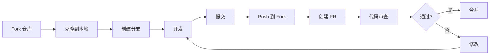
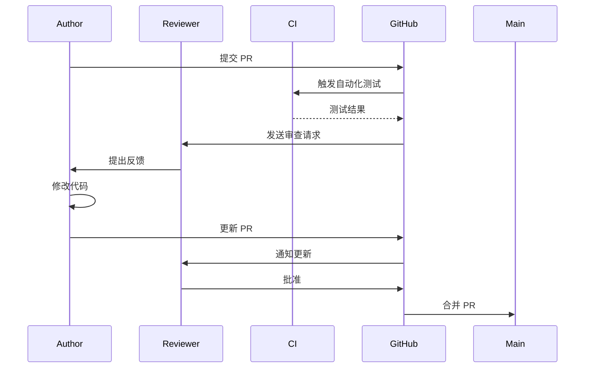

# 19 - 向 Claude Code 贡献代码

> **本章目标**：学会向 Claude Code 开源项目贡献代码，掌握 GitHub 工作流、代码规范和提交规范。

---

## 1. 学习目标

- [ ] 掌握 Fork 和 Pull Request 工作流
- [ ] 理解 Claude Code 的代码规范和提交信息规范
- [ ] 能够创建高质量的 Pull Request
- [ ] 理解代码审查流程和反馈类型
- [ ] 知道如何选择合适的贡献类型

---

## 2. 背景问题

### 2.1 为什么贡献开源？

1. **提升技能**：通过阅读和编写专业代码
2. **建立声誉**：为简历增添亮点
3. **帮助社区**：让工具对所有人更好
4. **深入理解**：通过贡献理解架构

### 2.2 Claude Code 贡献类型

| 类型 | 难度 | 需要测试 | 需要文档 |
|------|------|----------|----------|
| 文档修改 | ⭐ | ❌ | - |
| Bug 修复 | ⭐⭐ | ✅ | 可选 |
| 新功能 | ⭐⭐⭐ | ✅ | ✅ |
| 重构 | ⭐⭐⭐ | ✅ | ❌ |
| 性能优化 | ⭐⭐⭐ | ✅ | 可选 |

---

## 3. 源码入口

### 3.1 相关文件

| 功能 | 文件路径 | 说明 |
|------|----------|------|
| **代码规范** | `src/` | TypeScript 项目 |
| **测试配置** | `bun.lockb` | 测试框架配置 |
| **提交规范** | `.github/` | PR 模板 |
| **类型定义** | `src/types/` | 核心类型 |

### 3.2 Claude Code 项目结构

```
claude-code/
├── src/                    # 源码
│   ├── main.tsx           # 入口
│   ├── tools/             # 工具实现
│   ├── services/          # 服务层
│   └── state/            # 状态管理
├── tests/                 # 测试
├── scripts/              # 构建脚本
└── package.json          # 项目配置
```

---

## 4. 架构定位

### 4.1 贡献流程



### 4.2 代码审查流程



---

## 5. 核心流程分析

### 5.1 Fork 工作流

```bash
# 1. 在 GitHub 上 Fork claude-code 仓库
# https://github.com/anthropics/claude-code

# 2. 克隆你的 Fork
git clone https://github.com/YOUR_USERNAME/claude-code.git
cd claude-code

# 3. 添加上游仓库
git remote add upstream https://github.com/anthropics/claude-code.git

# 4. 验证
git remote -v
# origin    https://github.com/YOUR_USERNAME/claude-code.git (fetch)
# origin    https://github.com/YOUR_USERNAME/claude-code.git (push)
# upstream  https://github.com/anthropics/claude-code.git (fetch)
# upstream  https://github.com/anthropics/claude-code.git (push)
```

### 5.2 保持同步

```bash
# 切换到 main
git checkout main

# 拉取上游更新
git fetch upstream
git merge upstream/main

# 推送更新到你的 Fork
git push origin main
```

### 5.3 分支命名规范

```bash
# 功能分支
git checkout -b feature/add-new-tool

# Bug 修复分支
git checkout -b fix/tool-permission-bug

# 文档分支
git checkout -b docs/update-api-docs

# 重构分支
git checkout -b refactor/simplify-registry
```

---

## 6. 代码规范

### 6.1 TypeScript 规范

```typescript
// ✅ 好的命名
const toolExecutionTime: number;
const maxRetryAttempts: number;
const apiResponseHandler: (response: Response) => void;

// ❌ 避免的命名
const t: number;  // 过于简短
const tempData: unknown;  // temp 无意义
const handler1: Function;  // 序号无意义
```

### 6.2 函数设计

```typescript
// ✅ 单一职责
async function executeTool(
  toolName: string,
  input: unknown
): Promise<ToolResult> {
  // 只做一件事
}

// ❌ 过多职责
async function executeTool(
  toolName: string,
  input: unknown,
  options?: {
    retry?: boolean;
    timeout?: number;
    cache?: boolean;
    validate?: boolean;
    log?: boolean;
  }
): Promise<ToolResult> {
  // 做了太多事
}
```

### 6.3 错误处理

```typescript
// ✅ 明确的错误类型
class ToolExecutionError extends Error {
  constructor(
    public toolName: string,
    message: string,
    public cause?: unknown
  ) {
    super(`Tool '${toolName}' failed: ${message}`);
    this.name = 'ToolExecutionError';
  }
}

// ✅ Result 类型
type Result<T, E = Error> =
  | { ok: true; value: T }
  | { ok: false; error: E };
```

---

## 7. 提交信息规范

### 7.1 格式

```
<type>: <简短描述>

[可选的详细描述]

[可选的 Footer]
```

### 7.2 Type 类型

| Type | 用途 | 示例 |
|------|------|------|
| `feat` | 新功能 | `feat: 添加 TodoWriteTool` |
| `fix` | Bug 修复 | `fix: 修复权限检查 bug` |
| `docs` | 文档 | `docs: 更新 README` |
| `style` | 代码格式 | `style: 格式化代码` |
| `refactor` | 重构 | `refactor: 简化工具注册` |
| `test` | 测试 | `test: 添加工具测试` |
| `chore` | 构建 | `chore: 更新依赖` |

### 7.3 示例

```
feat: 添加 Git MCP 服务器支持

实现了对 Git MCP 服务器的完整支持，包括：
- ListBranchesTool
- CreateBranchTool
- CommitTool

Closes #123
```

---

## 8. Pull Request 指南

### 8.1 PR 描述模板

```markdown
## Summary
<!-- 简短描述修改内容 -->

## Test plan
<!-- 如何测试这个修改 -->

## Checklist
- [ ] 代码符合项目规范
- [ ] 添加了测试（如有需要）
- [ ] 更新了文档（如有需要）
- [ ] 所有测试通过

## Screenshots (如有 UI 修改)
<!-- UI 截图 -->
```

### 8.2 创建 PR

```bash
# Push 到你的 Fork
git push origin feature/add-new-tool

# 使用 GitHub CLI 创建 PR
gh pr create --title "feat: 添加新工具" --body "
## Summary
添加了一个新工具...

## Test plan
- [ ] 测试了工具执行
- [ ] 测试了错误处理
"
```

### 8.3 响应审查反馈

```bash
# 拉取远程分支到最新
git fetch origin

# 查看远程分支
git log origin/feature-branch --oneline -5

# 强制更新远程分支（仅用于修复自己的 PR）
git push origin feature-branch --force
```

---

## 9. 代码审查

### 9.1 审查要点

**代码审查时关注**：
1. **功能正确性** - 代码是否做了它应该做的？
2. **边界情况** - 错误处理是否完善？
3. **性能** - 有没有性能问题？
4. **可读性** - 代码是否清晰易懂？
5. **测试** - 是否有足够的测试？

### 9.2 反馈类型

| 标记 | 含义 | 阻塞？ |
|------|------|--------|
| `[nitpick]` | 小建议，非阻塞 | ❌ |
| `[suggestion]` | 建议改进 | ❌ |
| `[question]` | 需要澄清 | ❌ |
| `[issue]` | 阻塞性问题，需要修复 | ✅ |
| `[praise]` | 好的做法！ | - |

### 9.3 审查示例

```markdown
## Review

[issue] `runToolUse` 没有处理工具抛出异常的情况

当前代码：
```typescript
return await tool.execute(toolCall.input, toolContext);
```

建议修改为：
```typescript
try {
  return await tool.execute(toolCall.input, toolContext);
} catch (error) {
  return { success: false, error: `Tool execution failed: ${error.message}` };
}
```

[nitpick] 可以考虑使用 `Result` 类型替代 boolean 返回值。

[ praise] 错误消息很清晰！✅
```

---

## 10. Contributor 指南

### 10.1 架构腐化识别

| 问题类型 | 具体表现 | 位置 |
|----------|----------|------|
| **CI/CD 问题** | 测试覆盖率不足，部分关键路径没有自动化测试 | `tests/` |
| **代码审查瓶颈** | PR 审查队列积压，reviewer 资源不足 | GitHub PR 队列 |
| **技术债累积** | 大量 `TODO` 和 `FIXME` 注释未处理 | 源码中 |
| **文档不一致** | README 与实际代码行为存在差异 | `README.md` vs `src/` |
| **依赖管理** | 依赖版本过旧，未及时更新 | `package.json` |
| **测试不稳定** | 存在 flaky tests，偶尔失败但代码无问题 | `tests/` |
| **流程不透明** | 新 contributor 不知道从哪开始 | 项目文档 |

### 10.2 技术债详情

**1. 测试覆盖率不足**

| 项目 | 详情 |
|------|------|
| **问题** | 部分核心模块（如权限系统、上下文压缩）缺乏单元测试，PR 只依赖手动测试 |
| **位置** | `tests/` 目录 |
| **历史原因** | 初期快速迭代，测试被视为后期工作 |
| **工程代价** | 重构风险高，难以快速验证修改的正确性 |
| **未修原因** | 添加测试需要较长时间，且难以说服团队优先做测试而非功能 |
| **渐进方案** | 使用覆盖率工具（如 `bun test --coverage`）找出薄弱环节，逐步添加 |

**2. PR 审查队列积压**

| 项目 | 详情 |
|------|------|
| **问题** | 等待审查的 PR 数量多，reviewer 资源有限，导致 PR 等待时间长 |
| **位置** | GitHub PR 队列 |
| **历史原因** | 项目活跃度高，贡献者增长快于 reviewer 增长 |
| **工程代价** | contributor 热情被消耗，PR 可能过时需要 rebase |
| **未修原因** | reviewer 需要对代码库有深入理解，不能快速增加 |
| **渐进方案** | 培养更多 reviewer，引入自动化检查减少人工审查负担 |

**3. 依赖版本过旧**

| 项目 | 详情 |
|------|------|
| **问题** | `package.json` 中的依赖版本不是最新的，存在已知安全漏洞 |
| **位置** | `package.json` |
| **历史原因** | 更新依赖可能引入 breaking changes，需要测试验证 |
| **工程代价** | 可能暴露安全风险 |
| **未修原因** | 更新依赖需要全面测试，担心影响稳定性 |
| **渐进方案** | 使用 Dependabot 自动创建 PR 更新依赖，设置自动合并条件 |

**4. 文档与代码不一致**

| 项目 | 详情 |
|------|------|
| **问题** | README 或文档描述的功能与实际代码行为存在差异 |
| **位置** | `README.md` 或 `docs/` |
| **历史原因** | 代码修改后忘记更新文档 |
| **工程代价** | 用户按照文档操作可能遇到意外行为 |
| **未修原因** | 没有机制强制文档与代码同步 |
| **渐进方案** | 在 PR 审查时检查文档变更，添加 `docs-required` label |

**5. Flaky Tests**

| 项目 | 详情 |
|------|------|
| **问题** | 部分测试偶尔失败但代码无问题，可能与时序、并发或外部依赖有关 |
| **位置** | `tests/` 中特定测试 |
| **历史原因** | 测试设计时未考虑异步和并发场景 |
| **工程代价** | CI 结果不可信，PR 验证结果可能被忽略 |
| **未修原因** | 调试 flaky test 需要大量时间，难以复现 |
| **渐进方案** | 使用 `bun test --rerun-each=3` 识别 flaky tests，修复或标记为 `skip` |

### 10.3 适合新手的 Issue

| Issue 类型 | 难度 | 说明 |
|-----------|------|------|
| 文档错误 | ⭐ | README 拼写错误 |
| 测试缺失 | ⭐⭐ | 添加现有功能的测试 |
| 简单 Bug | ⭐⭐ | 边界情况处理 |
| 工具增强 | ⭐⭐⭐ | 添加新工具功能 |

### 10.4 寻找贡献点的策略

```bash
# 1. 查找 "good first issue" 标签
gh issue list --label "good first issue"

# 2. 查找 "help wanted" 标签
gh issue list --label "help wanted"

# 3. 查看最近关闭的 PR
gh pr list --state closed --limit 20
```

### 10.5 调试贡献

```bash
# 克隆仓库
git clone https://github.com/anthropics/claude-code.git
cd claude-code

# 安装依赖
bun install

# 运行测试
bun test

# 开发模式
bun run dev
```

---

## 练习

### 练习 1：修复一个文档错误（完整流程）

**任务**：在 GitHub 上找到 README 的一个错误并修复

**答案**：

```
┌──────────────────────────────────────────────────────────────────────┐
│ PR 提交流程详解                                                     │
├──────────────────────────────────────────────────────────────────────┤
│                                                                      │
│  Step 1: Fork 仓库                                                  │
│  ┌──────────────────────────────────────────────────────────────┐   │
│  │ 1. 访问 https://github.com/anthropics/claude-code            │   │
│  │ 2. 点击右上角 "Fork" 按钮                                     │   │
│  │ 3. 选择你的 GitHub 账号作为目标                               │   │
│  │ 4. 等待 Fork 完成                                           │   │
│  └──────────────────────────────────────────────────────────────┘   │
│                         ↓                                          │
│  Step 2: 克隆你的 Fork                                            │
│  ┌──────────────────────────────────────────────────────────────┐   │
│  │ git clone https://github.com/YOUR_USER/claude-code.git      │   │
│  │ cd claaude-code                                             │   │
│  └──────────────────────────────────────────────────────────────┘   │
│                         ↓                                          │
│  Step 3: 创建修复分支                                              │
│  ┌──────────────────────────────────────────────────────────────┐   │
│  │ git checkout -b docs/fix-readme-typo                        │   │
│  │                                                               │   │
│  │ 命名规范:                                                     │   │
│  │ → docs/fix-xxx (文档修复)                                   │   │
│  │ → feat/xxx (新功能)                                         │   │
│  │ → fix/xxx (bug 修复)                                        │   │
│  └──────────────────────────────────────────────────────────────┘   │
│                         ↓                                          │
│  Step 4: 修复错误并提交                                           │
│  ┌──────────────────────────────────────────────────────────────┐   │
│  │ # 编辑文件修复错误                                           │   │
│  │ git add README.md                                           │   │
│  │ git commit -m "docs: fix typo in README.md"                 │   │
│  │                                                               │   │
│  │ 提交消息规范:                                                │   │
│  │ → docs: 文档相关                                            │   │
│  │ → feat: 新功能                                              │   │
│  │ → fix: bug 修复                                             │   │
│  │ → refactor: 重构                                            │   │
│  └──────────────────────────────────────────────────────────────┘   │
│                         ↓                                          │
│  Step 5: 推送并创建 PR                                            │
│  ┌──────────────────────────────────────────────────────────────┐   │
│  │ git push -u origin docs/fix-readme-typo                     │   │
│  │                                                               │   │
│  │ # 在 GitHub 上创建 PR:                                       │   │
│  │ # 1. 访问你的 Fork 仓库                                     │   │
│  │ # 2. 点击 "Compare & pull request"                          │   │
│  │ # 3. 填写 PR 描述                                           │   │
│  │ # 4. 点击 "Create pull request"                            │   │
│  └──────────────────────────────────────────────────────────────┘   │
└──────────────────────────────────────────────────────────────────────┘
```

### 练习 2：为现有工具添加测试（完整测试套件）

**任务**：为 `ReadTool` 添加完整测试套件

**答案要点**：

```typescript
// ============================================================
// 测试文件: tests/tools/ReadTool.test.ts
// ============================================================

import { describe, it, expect, beforeEach, afterEach, vi } from 'bun:test';
import { ReadTool } from '../../src/tools/FileReadTool/tool';
import * as fs from 'fs/promises';

// Mock fs module
vi.mock('fs/promises');

describe('ReadTool', () => {
  let tool: ReadTool;
  let mockContext: ToolContext;

  // ============================================================
  // 测试前置设置
  // ============================================================
  beforeEach(() => {
    tool = new ReadTool();
    mockContext = {
      cwd: '/project',
      canRead: vi.fn().mockReturnValue(true),
      canWrite: vi.fn().mockReturnValue(true),
    };
  });

  // ============================================================
  // 成功场景测试
  // ============================================================
  describe('successful reads', () => {
    it('should read file successfully', async () => {
      vi.mocked(fs.readFile).mockResolvedValue('Hello, World!');
      const result = await tool.execute({ file_path: 'test.txt' }, mockContext);
      expect(result.success).toBe(true);
      expect(result.result).toBe('Hello, World!');
    });

    it('should handle file with offset and limit', async () => {
      vi.mocked(fs.readFile).mockResolvedValue('Hello, World!');
      const result = await tool.execute(
        { file_path: 'test.txt', offset: 0, limit: 5 },
        mockContext
      );
      expect(result.success).toBe(true);
    });
  });

  // ============================================================
  // 权限测试
  // ============================================================
  describe('permission checks', () => {
    it('should deny read when canRead returns false', async () => {
      mockContext.canRead = vi.fn().mockReturnValue(false);
      const result = await tool.execute({ file_path: 'restricted.txt' }, mockContext);
      expect(result.success).toBe(false);
      expect(result.error).toContain('Permission denied');
    });
  });

  // ============================================================
  // 错误处理测试
  // ============================================================
  describe('error handling', () => {
    it('should handle file not found', async () => {
      vi.mocked(fs.readFile).mockRejectedValue(new Error('ENOENT: no such file'));
      const result = await tool.execute({ file_path: 'nonexistent.txt' }, mockContext);
      expect(result.success).toBe(false);
      expect(result.error).toContain('ENOENT');
    });
  });

  // ============================================================
  // 边界条件测试
  // ============================================================
  describe('edge cases', () => {
    it('should handle empty file', async () => {
      vi.mocked(fs.readFile).mockResolvedValue('');
      const result = await tool.execute({ file_path: 'empty.txt' }, mockContext);
      expect(result.success).toBe(true);
      expect(result.result).toBe('');
    });
  });
});
```

### 练习 3：代码审查练习

**任务**：审查以下 PR 代码并给出审查意见

**PR 代码**：

```typescript
// PR: 添加新工具 DoubleReadTool
class DoubleReadTool {
  name = 'double_read';

  async execute(args: { file_path: string }) {
    const content1 = await fs.readFile(args.file_path, 'utf-8');
    const content2 = await fs.readFile(args.file_path, 'utf-8');

    if (content1 === content2) {
      return { success: true, result: '文件内容一致' };
    } else {
      return { success: true, result: '文件内容不一致' };
    }
  }
}
```

**答案**：

```
┌──────────────────────────────────────────────────────────────────────┐
│ 代码审查意见                                                         │
├──────────────────────────────────────────────────────────────────────┤
│                                                                      │
│  🔴 问题 1: 缺少 input_schema                                     │
│  ────────────────────────────────────────────────────────────────   │
│  工具没有定义 input_schema，AI 无法知道如何调用                      │
│                                                                      │
│  建议:                                                               │
│  ┌──────────────────────────────────────────────────────────────┐   │
│  │ input_schema = {                                            │   │
│  │   type: 'object',                                          │   │
│  │   properties: {                                            │   │
│  │     file_path: { type: 'string', description: '文件路径' } │   │
│  │   },                                                        │   │
│  │   required: ['file_path']                                  │   │
│  │ };                                                          │   │
│  └──────────────────────────────────────────────────────────────┘   │
│                                                                      │
│  🔴 问题 2: 权限检查缺失                                            │
│  ────────────────────────────────────────────────────────────────   │
│  直接读取文件，没有检查 canRead() 权限                               │
│                                                                      │
│  建议:                                                               │
│  ┌──────────────────────────────────────────────────────────────┐   │
│  │ async execute(args, context) {                              │   │
│  │   if (!context.canRead(args.file_path)) {                   │   │
│  │     return { success: false, error: 'Permission denied' };   │   │
│  │   }                                                         │   │
│  │   // ... 读取逻辑                                           │   │
│  │ }                                                           │   │
│  └──────────────────────────────────────────────────────────────┘   │
│                                                                      │
│  🟡 问题 3: 错误处理缺失                                            │
│  ────────────────────────────────────────────────────────────────   │
│  没有 try/catch，文件不存在时会崩溃                                 │
│                                                                      │
│  🟡 问题 4: 工具命名风格不统一                                     │
│  ────────────────────────────────────────────────────────────────   │
│  Claude Code 通常使用 PascalCase (如 ReadTool)                      │
│  建议: DoubleRead 或 FileCompare                                    │
│                                                                      │
│  ✅ 优点: 逻辑清晰                                                 │
│  ✅ 优点: 返回结构良好                                             │
└──────────────────────────────────────────────────────────────────────┘
```

### 练习 4：响应代码审查反馈

**任务**：如何响应代码审查反馈

**场景**：你的 PR 被要求修复类型安全问题

**答案**：

```
┌──────────────────────────────────────────────────────────────────────┐
│ 响应代码审查反馈流程                                                 │
├──────────────────────────────────────────────────────────────────────┤
│                                                                      │
│  1. 仔细阅读反馈                                                    │
│     → 确保理解每个问题                                              │
│     → 有疑问及时提出                                                │
│                                                                      │
│  2. 在本地修复                                                      │
│     ┌──────────────────────────────────────────────────────────┐   │
│     │ git checkout -b fix/type-safety                          │   │
│     │ # 修改代码                                                 │   │
│     │ git add .                                               │   │
│     │ git commit -m "fix: resolve type safety issues"         │   │
│     │ git push origin fix/type-safety                          │   │
│     └──────────────────────────────────────────────────────────┘   │
│                                                                      │
│  3. 回复审查者                                                      │
│     ┌──────────────────────────────────────────────────────────┐   │
│     │ Thanks for the review! I've addressed all the feedback:  │   │
│     │                                                          │   │
│     │ - Added input_schema with proper type definitions         │   │
│     │ - Added permission check in execute()                    │   │
│     │ - Added try/catch for error handling                     │   │
│     │                                                          │   │
│     │ PTAL!                                                     │   │
│     └──────────────────────────────────────────────────────────┘   │
└──────────────────────────────────────────────────────────────────────┘
```

---

## 总结

| 步骤 | 命令 |
|------|------|
| Fork | GitHub 页面操作 |
| 克隆 | `git clone` |
| 创建分支 | `git checkout -b` |
| 提交 | `git commit` |
| 推送 | `git push` |
| 创建 PR | `gh pr create` |

`★ Insight ─────────────────────────────────────`
开源贡献不只是写代码，还包括**代码审查**。当你提交 PR 时，保持开放心态接受反馈；当别人提交 PR 时，积极提供建设性的意见。好的开源社区是双向的——每个人都在帮助每个人变得更好。
`─────────────────────────────────────────────────`

---

## 下一篇

👉 [20 - 构建你的第一个插件](./20-构建你的第一个插件.md) —— 实战：构建一个真实的插件
