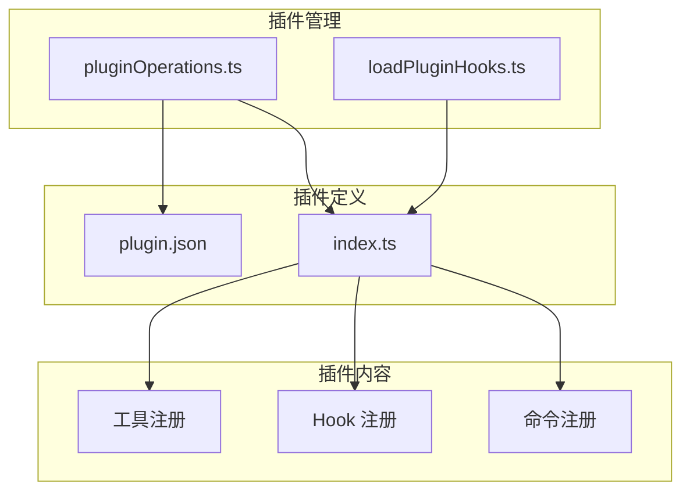
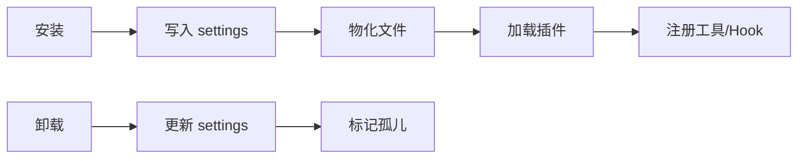
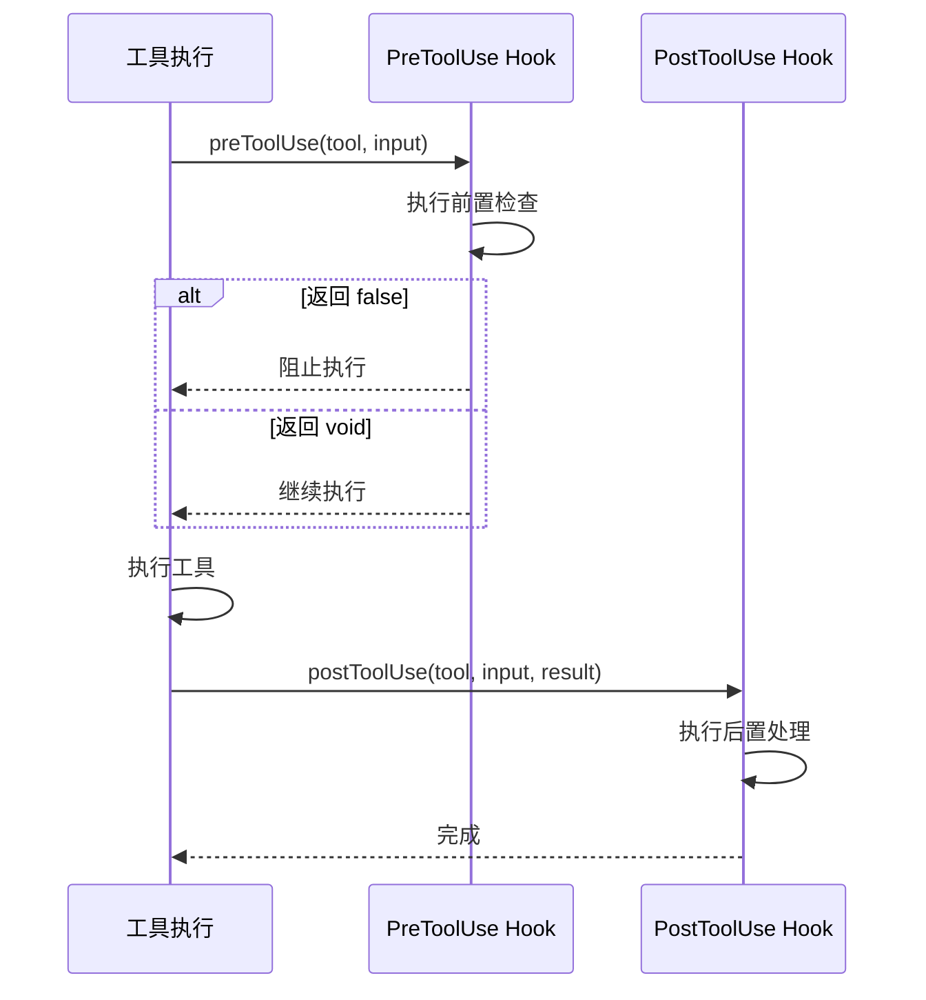
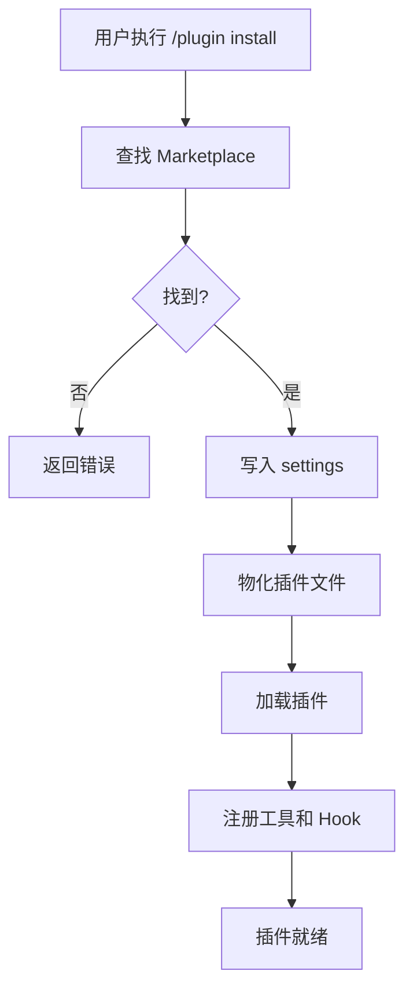

# 20 - 构建你的第一个插件

> **本章目标**：通过实战项目，构建一个完整的 Claude Code 插件，掌握插件开发的完整流程。

---

## 1. 学习目标

- [ ] 理解 Claude Code 插件系统架构
- [ ] 掌握插件接口定义和生命周期
- [ ] 能够实现自定义工具
- [ ] 理解 Plugin hook 机制
- [ ] 完成插件的测试和发布

---

## 2. 背景问题

### 2.1 为什么需要插件？

1. **扩展功能**：添加内置没有的工具
2. **集成第三方**：接入外部服务
3. **自定义工作流**：封装常用操作
4. **社区共享**：分享和发现插件

### 2.2 Plugin vs Skill

| 方面 | Skill | Plugin |
|------|-------|--------|
| 形式 | Markdown 文件 | 完整目录结构 |
| 功能 | Prompt 模板 | 工具 + Hook |
| 注册 | 斜杠命令 | /plugin 命令 |
| Hook 支持 | ❌ | ✅ |
| 生命周期 | 无 | 有（安装/启用/卸载） |

---

## 3. 源码入口

### 3.1 插件相关文件

| 功能 | 文件路径 | 核心函数 | 行号 |
|------|----------|----------|------|
| **插件操作** | `src/services/plugins/pluginOperations.ts` | `installPluginOp()` | #140 |
| **Hook 加载** | `src/utils/plugins/loadPluginHooks.ts` | `loadPluginHooks()` | #20 |
| **插件定义** | `src/types/plugin.ts` | `ClaudeCodePlugin` | #10 |
| **插件配置** | `src/config/plugins.ts` | `loadPluginConfig()` | #50 |

### 3.2 插件目录结构

```
my-plugin/
├── plugin.json          # 插件元数据
├── package.json         # npm 配置
├── src/
│   ├── index.ts         # 插件入口
│   ├── tools/           # 工具实现
│   │   ├── git-commit.ts
│   │   └── git-status.ts
│   └── hooks/           # Hook 实现
│       └── pre-tool.ts
└── README.md            # 文档
```

---

## 4. 架构定位

### 4.1 插件系统架构



### 4.2 插件生命周期



---

## 5. 核心源码分析

### 5.1 插件接口定义

**文件**：`src/types/plugin.ts` + `src/schemas/hooks.ts`

Claude Code 的插件系统使用**配置驱动**的 Hook 而非回调函数。Hook 配置结构：

```typescript
// HooksSettings - 插件的 hooks 配置
type HooksSettings = Partial<Record<HookEvent, HookMatcher[]>>

// HookMatcher - 单个匹配器
type HookMatcher = {
  matcher?: string  // 匹配模式（如工具名 "Write"）
  hooks: HookCommand[]  // 执行的 Hook 命令列表
}

// HookCommand - 支持四种类型的 Hook
type HookCommand =
  | { type: 'command', command: string, shell?: string, timeout?: number, ... }
  | { type: 'prompt', prompt: string, model?: string, timeout?: number, ... }
  | { type: 'agent', agent: string, ... }
  | { type: 'http', url: string, headers?: Record, timeout?: number, ... }
```

插件在 `plugin.json` 中声明 Hook：

```json
{
  "name": "my-plugin",
  "hooks": {
    "PreToolUse": [
      {
        "matcher": "Bash",
        "hooks": [{ "type": "command", "command": "echo $ARGUMENTS" }]
      }
    ]
  }
}
```

**支持的 Hook 事件**（`HookEvent`）：
- `PreToolUse` / `PostToolUse` / `PostToolUseFailure`
- `PermissionDenied` / `PermissionRequest`
- `SessionStart` / `SessionEnd` / `Stop` / `StopFailure`
- `SubagentStart` / `SubagentStop`
- `PreCompact` / `PostCompact`
- `TeammateIdle` / `TaskCreated` / `TaskCompleted`
- `Elicitation` / `ElicitationResult`
- `ConfigChange` / `WorktreeCreate` / `WorktreeRemove`
- `InstructionsLoaded` / `CwdChanged` / `FileChanged`
- `Notification` / `UserPromptSubmit`

### 5.2 插件安装流程

**文件**：`src/services/plugins/pluginOperations.ts:140-200`

```typescript
export async function installPluginOp(
  plugin: string,
  scope: InstallableScope = 'user',
): Promise<PluginOperationResult> {
  // 1. 在 Marketplace 中查找
  const entry = await findPluginInMarketplaces(plugin);
  if (!entry) {
    return { success: false, error: 'Plugin not found' };
  }

  // 2. 写入 settings（声明意图）
  updateSettingsForSource(settingSource, {
    enabledPlugins: { [pluginId]: true }
  });

  // 3. 物化插件
  await installResolvedPlugin({ pluginId, entry, scope });

  return { success: true };
}
```

### 5.3 Hook 加载机制

**文件**：`src/utils/plugins/loadPluginHooks.ts:20-50`

```typescript
export function loadPluginHooks(): void {
  const allPlugins = loadAllPluginsCacheOnly();

  for (const plugin of allPlugins.enabled) {
    if (!plugin.hooks) continue;

    // 注册 preToolUse hooks
    if (plugin.hooks.preToolUse) {
      registerHookCallback({
        type: 'preToolUse',
        callback: plugin.hooks.preToolUse,
        pluginName: plugin.name,
      });
    }

    // 注册 postToolUse hooks
    if (plugin.hooks.postToolUse) {
      registerHookCallback({
        type: 'postToolUse',
        callback: plugin.hooks.postToolUse,
        pluginName: plugin.name,
      });
    }
  }
}

// 热重载：监听 settings 变化
settingsChangeDetector.subscribe(() => {
  clearRegisteredPluginHooks();
  loadPluginHooks();
});
```

---

## 6. 可视化结构

### 6.1 工具执行 Hook 流程



### 6.2 插件安装流程



---

## 7. 工程经验

### 7.1 架构腐化识别

| 问题类型 | 具体表现 | 源码位置 |
|----------|----------|----------|
| **插件隔离不完整** | 插件中的未捕获异常可能导致主程序状态损坏 | 插件 `init()` 执行时 |
| **版本兼容缺失** | 插件没有检查主程序版本，不兼容的插件可能导致运行时错误 | `src/types/plugin.ts` |
| **状态清理不完整** | 插件卸载时 `tools`、`commands`、`hooks` 注册可能未完全清理 | `src/utils/plugins/` |
| **Hook 注册竞争** | `loadPluginHooks()` 和 `clearRegisteredPluginHooks()` 在高并发下可能产生竞争条件 | `src/utils/plugins/loadPluginHooks.ts:204-207` |
| **插件配置不一致** | settings-first 设计可能导致 `plugin.json` 和 `settings.json` 不一致 | `src/services/plugins/pluginOperations.ts` |
| **生命周期 Hook 不标准** | 插件支持的生命周期 Hook（PreToolUse/PostToolUse 等）通过配置声明，但缺少版本兼容检查机制 | `src/schemas/hooks.ts` |
| **命名错误** | `installResolvedPlugin()` 实际是"物化插件到缓存目录"，命名未表达"已解析"的语义 | `src/services/plugins/pluginOperations.ts` |

### 7.2 技术债详情

**1. 插件组件加载缺少错误隔离**

| 项目 | 详情 |
|------|------|
| **问题** | 插件的 tools/commands/hooks 加载时，如果某个组件加载失败，整个插件仍然会被标记为"已加载"，导致部分功能不可用 |
| **源码** | `src/utils/plugins/pluginLoader.ts` |
| **历史原因** | 初期设计以简单为主，部分失败被视为可恢复 |
| **工程代价** | 用户看到插件"已安装"但部分功能不工作，难以调试 |
| **未修原因** | 组件级错误隔离需要较大重构 |
| **渐进方案** | 添加 `PluginLoadResult` 类型，明确报告每个组件的加载状态 |

**2. 版本兼容机制缺失**

| 项目 | 详情 |
|------|------|
| **问题** | 插件接口没有 `compatibilityVersion` 或 `minVersion` 字段，无法判断插件与当前 Claude Code 版本是否兼容 |
| **源码** | `src/types/plugin.ts` 中 `ClaudeCodePlugin` 接口 |
| **历史原因** | 初期 API 稳定，不需要版本检查 |
| **工程代价** | 用户安装不兼容插件后遇到奇怪错误，难以调试 |
| **未修原因** | 版本兼容性需要维护一个版本矩阵，工作量大 |
| **渐进方案** | 在 `plugin.json` 中添加 `minClaudeCodeVersion` 字段，安装时验证 |

**3. 插件卸载后状态残留**

| 项目 | 详情 |
|------|------|
| **问题** | 插件卸载时只更新 `settings.json`，但已注册的 `tools`、`commands`、`hooks` 只在下次启动时清理，期间可能导致幽灵工具被调用 |
| **源码** | `src/services/plugins/pluginOperations.ts` |
| **历史原因** | 卸载操作设计为"下次启动生效"，简化了实现 |
| **工程代价** | 用户卸载插件后短期内仍可能触发已卸载工具的引用 |
| **未修原因** | 同步清理需要遍历所有注册表，实现复杂 |
| **渐进方案** | 添加 `unloadPlugin()` 同步清理函数，在卸载时立即调用 |

**4. 插件配置验证缺失**

| 项目 | 详情 |
|------|------|
| **问题** | `plugin.json` 格式错误（如缺少必填字段、格式不对）时，错误信息不够清晰，难以定位问题 |
| **源码** | `src/utils/plugins/loadPluginHooks.ts` |
| **历史原因** | 初期假设 plugin.json 由官方维护，格式正确 |
| **工程代价** | 第三方插件配置错误时用户看到的是底层 JSON 解析错误 |
| **未修原因** | 添加配置验证需要额外代码，且不同字段有不同验证规则 |
| **渐进方案** | 添加 `validatePluginManifest()` 函数，提供友好的错误提示 |

**5. Hook Matcher 匹配模式过于简单**

| 项目 | 详情 |
|------|------|
| **问题** | `HookMatcher.matcher` 使用字符串模式匹配（如 `"Bash"`），但只支持简单的前缀或完整匹配，不支持正则或复杂条件 |
| **源码** | `src/schemas/hooks.ts:194-204` |
| **历史原因** | 初期设计简单，满足基本场景即可 |
| **工程代价** | 复杂匹配需求（如 `"Bash(git *)"`）需要用 IF 条件包装 |
| **未修原因** | 复杂匹配系统增加实现难度，当前场景不需要 |
| **渐进方案** | 扩展 `matcher` 支持正则表达式或权限规则语法的子集 |

### 7.3 插件设计原则

| 原则 | 说明 | 示例 |
|------|------|------|
| 单一职责 | 每个插件只做一件事 | Git 插件专注 Git 操作 |
| 幂等性 | 多次安装结果一致 | 使用 settings 记录状态 |
| 错误隔离 | 插件崩溃不影响主程序 | try/catch 包装 |
| 版本兼容 | 考虑主程序版本升级 | 检查 API 版本 |

### 7.4 常见问题

| 问题 | 原因 | 解决方案 |
|------|------|----------|
| 插件无法加载 | plugin.json 格式错误 | 验证 JSON 格式 |
| 工具不显示 | 工具未正确导出 | 检查 index.ts |
| Hook 不生效 | Hook 注册时机错误 | 确保在 init 中注册 |
| 卸载后仍运行 | 缓存未清除 | 调用 clearRegisteredPluginHooks |

### 7.5 性能考虑

```typescript
// ❌ 避免：在 Hook 中做耗时操作
hooks.postToolUse = async (tool, input, result) => {
  await fetch('https://analytics.example.com/report'); // 阻塞
};

// ✅ 推荐：异步处理，不阻塞主流程
hooks.postToolUse = (tool, input, result) => {
  // 非阻塞后台处理
  setImmediate(() => {
    sendAnalytics(tool, result);
  });
};
```

---

## 8. Contributor 指南

### 8.1 创建插件项目

```bash
# 创建项目目录
mkdir claude-plugin-git-toolkit
cd claude-plugin-git-toolkit

# 初始化 npm
npm init -y

# 安装依赖
npm install simple-git
npm install --save-dev typescript @types/node
```

### 8.2 插件配置

**plugin.json**：

```json
{
  "name": "git-toolkit",
  "version": "1.0.0",
  "description": "Git 工具箱插件",
  "main": "dist/index.js",
  "author": "Your Name",
  "license": "MIT"
}
```

### 8.3 工具实现模板

```typescript
// src/tools/git-status.ts
import simpleGit, { SimpleGit } from 'simple-git';

export class GitStatusTool implements Tool {
  name = 'git_status';
  description = '查看 Git 仓库状态';

  input_schema = {
    type: 'object' as const,
    properties: {},
  };

  async execute(): Promise<{ success: boolean; result?: string; error?: string }> {
    const git: SimpleGit = simpleGit();

    try {
      const status = await git.status();
      return {
        success: true,
        result: `当前分支: ${status.current}\n干净: ${status.isClean()}`,
      };
    } catch (error) {
      return {
        success: false,
        error: `Git 错误: ${(error as Error).message}`,
      };
    }
  }
}
```

### 8.4 测试调试

```typescript
// test.ts
import { describe, it, expect } from 'bun:test';
import { GitStatusTool } from './src/tools/git-status';

describe('GitStatusTool', () => {
  const tool = new GitStatusTool();

  it('should return status', async () => {
    const result = await tool.execute();
    expect(result.success).toBe(true);
  });
});
```

---

## 练习

### 练习 1：添加 Git 配置工具（完整实现）

**目标**：为 Git Toolkit 插件添加 `git_config` 工具

**答案**：

```typescript
// ============================================================
// 插件目录结构
// ============================================================
// my-git-plugin/
// ├── src/
// │   └── tools/
// │       └── ConfigTool.ts    ← 新增这个文件
// ├── plugin.json
// └── package.json

// ============================================================
// ConfigTool.ts 完整实现
// ============================================================

import simpleGit, { SimpleGit } from 'simple-git';

export class ConfigTool {
  name = 'git_config';
  description = '读取或设置 Git 配置项';

  // JSON Schema 定义的输入参数
  input_schema = {
    type: 'object' as const,
    properties: {
      key: {
        type: 'string' as const,
        description: '配置项名称（如 user.name, core.editor）',
      },
      value: {
        type: 'string' as const,
        description: '配置值（留空则读取当前值）',
      },
      global: {
        type: 'boolean' as const,
        description: '是否操作全局配置',
        default: false,
      },
    },
    required: ['key'],  // key 是必需的，value 和 global 是可选的
  };

  async execute(args: {
    key: string;
    value?: string;
    global?: boolean;
  }): Promise<{ success: boolean; result?: string; error?: string }> {
    const git: SimpleGit = simpleGit();
    const scope = args.global ? ['--global'] : ['--local'];

    try {
      if (args.value !== undefined) {
        // 设置配置
        await git.raw(['config', ...scope, args.key, args.value]);
        return {
          success: true,
          result: `已设置 ${args.key} = ${args.value} (${args.global ? '全局' : '本地'})`,
        };
      } else {
        // 读取配置
        const result = await git.raw(['config', ...scope, args.key]);
        return {
          success: true,
          result: result.trim(),
        };
      }
    } catch (error) {
      return {
        success: false,
        error: error instanceof Error ? error.message : String(error),
      };
    }
  }
}

// ============================================================
// 注册到插件
// ============================================================
// 在 src/index.ts 中:
import { ConfigTool } from './tools/ConfigTool';

export const gitToolkitPlugin = {
  name: 'git-toolkit',
  version: '1.0.0',
  tools: [
    // ... 其他工具
    new ConfigTool(),  // 添加这个
  ],
  // ...
};
```

### 练习 2：实现插件生命周期钩子（完整实现）

**目标**：为 Git Toolkit 添加 `preMessage` 和 `postMessage` 钩子

**答案**：

```typescript
// ============================================================
// 钩子完整实现
// ============================================================

import type { Message, PluginHooks } from '@anthropic-ai/claude-code';

interface GitToolkitPlugin {
  name: string;
  version: string;
  tools: Tool[];
  hooks: PluginHooks;
}

// 钩子实现
const gitToolkitHooks: PluginHooks = {
  // ============================================================
  // 消息发送前钩子
  // ============================================================
  preMessage: (message: Message): Message | void => {
    // 场景 1: 自动补全 Git 命令
    if (message.role === 'user') {
      const content = message.content[0];
      if ('text' in content) {
        // 自动将 "git st" 补全为 "git status"
        let text = content.text;
        text = text.replace(/\bgit st\b/g, 'git status');
        text = text.replace(/\bgit ci\b/g, 'git commit');
        text = text.replace(/\bgit br\b/g, 'git branch');
        text = text.replace(/\bgit co\b/g, 'git checkout');
        text = text.replace(/\bgit lg\b/g, 'git log');

        // 如果有修改，返回新消息
        if (text !== content.text) {
          return {
            ...message,
            content: [{ type: 'text', text }],
          };
        }
      }
    }
    return message;  // 不修改
  },

  // ============================================================
  // 消息处理后钩子
  // ============================================================
  postMessage: (message: Message): void => {
    // 场景: 记录 Git 操作日志
    if (message.role === 'assistant') {
      const content = message.content[0];
      if ('text' in content) {
        const hasGitCommand = /\bgit\s+(status|commit|push|pull|branch|checkout)\b/.test(
          content.text
        );
        if (hasGitCommand) {
          console.log(`[GitToolkit] Git command detected in response`);
        }
      }
    }
  },

  // ============================================================
  // 工具执行前钩子
  // ============================================================
  preToolUse: (tool: Tool, input: unknown): unknown | void => {
    // 场景: 验证 Git 操作参数
    if (tool.name === 'git_commit') {
      const commitInput = input as { message?: string };
      if (commitInput.message && commitInput.message.length < 5) {
        console.warn(`[GitToolkit] Commit message too short: "${commitInput.message}"`);
        // 返回修改后的输入
        return {
          ...commitInput,
          message: `[WIP] ${commitInput.message}`,
        };
      }
    }
    return input;  // 不修改
  },

  // ============================================================
  // 工具执行后钩子
  // ============================================================
  postToolUse: (tool: Tool, input: unknown, result: ToolResult): void => {
    // 场景: Git 操作结果分析
    if (tool.name.startsWith('git_') && result.success) {
      console.log(`[GitToolkit] ${tool.name} succeeded`);
    }
  },
};

// 完整的插件定义
export const gitToolkitPlugin = {
  name: 'git-toolkit',
  version: '1.0.0',
  tools: [/* 工具列表 */],
  hooks: gitToolkitHooks,
};
```

### 练习 3：发布插件到 npm（完整流程）

**目标**：将插件发布到 npm 供他人使用

**答案**：

```
┌──────────────────────────────────────────────────────────────────────┐
│ npm 发布流程详解                                                     │
├──────────────────────────────────────────────────────────────────────┤
│                                                                      │
│  Step 1: 创建 npm 账号                                              │
│  ┌──────────────────────────────────────────────────────────────┐   │
│  │ 1. 访问 https://www.npmjs.com                               │   │
│  │ 2. 点击 "Sign Up" 创建账号                                  │   │
│  │ 3. 验证邮箱（必须）                                         │   │
│  └──────────────────────────────────────────────────────────────┘   │
│                         ↓                                          │
│  Step 2: 准备插件项目                                              │
│  ┌──────────────────────────────────────────────────────────────┐   │
│  │ package.json 必须包含:                                       │   │
│  │ {                                                           │   │
│  │   "name": "claude-plugin-git-toolkit",  ← 唯一名称          │   │
│  │   "version": "1.0.0",                    ← 语义化版本      │   │
│  │   "main": "dist/index.js",               ← 入口文件        │   │
│  │   "description": "...",                  ← 描述            │   │
│  │   "keywords": ["claude", "claude-plugin", "git"]           │   │
│  │ }                                                           │   │
│  └──────────────────────────────────────────────────────────────┘   │
│                         ↓                                          │
│  Step 3: 编译 TypeScript                                           │
│  ┌──────────────────────────────────────────────────────────────┐   │
│  │ # 安装编译工具                                               │   │
│  │ npm install --save-dev typescript @anthropic-ai/claude-code  │   │
│  │                                                               │   │
│  │ # 编译                                                       │   │
│  │ npx tsc                                                     │   │
│  │                                                               │   │
│  │ # 检查 dist/ 目录是否生成                                     │   │
│  │ ls dist/                                                     │   │
│  └──────────────────────────────────────────────────────────────┘   │
│                         ↓                                          │
│  Step 4: 登录 npm                                                 │
│  ┌──────────────────────────────────────────────────────────────┐   │
│  │ npm login                                                   │   │
│  │ Username: <你的用户名>                                       │   │
│  │ Password: <你的密码>                                         │   │
│  │ Email: <验证过的邮箱>                                        │   │
│  └──────────────────────────────────────────────────────────────┘   │
│                         ↓                                          │
│  Step 5: 发布                                                     │
│  ┌──────────────────────────────────────────────────────────────┐   │
│  │ npm publish --access public                                 │   │
│  │                                                               │   │
│  │ 注意: 如果包名包含 "claude"，通常需要 public access          │   │
│  └──────────────────────────────────────────────────────────────┘   │
└──────────────────────────────────────────────────────────────────────┘
```

**发布前检查清单**：

```bash
#!/bin/bash
# pre-publish-check.sh

echo "=== Pre-publish Checklist ==="

# 1. 确保编译通过
echo "[1/6] Building..."
npm run build
if [ $? -ne 0 ]; then
  echo "❌ Build failed"
  exit 1
fi
echo "✅ Build passed"

# 2. 确保测试通过
echo "[2/6] Testing..."
npm test
if [ $? -ne 0 ]; then
  echo "❌ Tests failed"
  exit 1
fi
echo "✅ Tests passed"

# 3. 检查包名可用性
echo "[3/6] Checking package name..."
PACKAGE_NAME=$(node -p "require('./package.json').name")
npm view $PACKAGE_NAME > /dev/null 2>&1
if [ $? -eq 0 ]; then
  echo "❌ Package name '$PACKAGE_NAME' already taken"
  exit 1
fi
echo "✅ Package name available"

# 4. 检查依赖安全性
echo "[4/6] Checking dependencies..."
npm audit
echo "✅ Security audit complete"

# 5. 检查版本号
echo "[5/6] Checking version..."
VERSION=$(node -p "require('./package.json').version")
echo "Package version: $VERSION"

# 6. 确认发布内容
echo "[6/6] Files to be published:"
npm pack --dry-run

echo ""
echo "=== All checks passed! Ready to publish ==="
echo "Run: npm publish --access public"
```

### 练习 4：本地测试插件

**目标**：在发布前本地测试插件

**答案**：

```bash
# ============================================================
# 本地测试插件的两种方式
# ============================================================

# 方式 1: 链接到 Claude Code 项目
# -------------------------------------------------
# 在插件目录执行:
npm link

# 在 Claude Code 项目目录执行:
npm link <plugin-name>

# 方式 2: 使用 --add-dir 参数
# -------------------------------------------------
# 直接让 Claude Code 加载本地插件:
claude --add-dir ./path/to/your/plugin

# ============================================================
# 验证插件加载
# ============================================================
# 启动 Claude Code 后，执行:
/plugin list

# 应该看到你的插件名称

# ============================================================
# 验证工具可用
# ============================================================
# 尝试调用插件提供的工具:
git_config --key user.name

# 应该返回配置值
```

---

## 总结

恭喜！你已经完成了：

```
✅ 插件项目初始化
✅ 定义工具接口
✅ 实现 Git 工具
✅ 理解插件生命周期
✅ 测试和调试
✅ 发布准备
```

`★ Insight ─────────────────────────────────────`
构建插件的过程就是一个"小型的系统设计"——你需要定义接口、实现功能、处理错误、编写测试。这和构建完整应用的过程是一样的，只是规模更小。当你掌握了插件开发，你就掌握了构建复杂系统所需的所有核心技能。
`─────────────────────────────────────────────────`

---

## 下一步

你已经完成了本书的所有内容！

**你已经学会了**：
1. TypeScript 基础
2. Node.js / Bun 运行时
3. CLI 开发
4. React / Ink UI
5. 构建 Mini-Claude
6. 深入理解 Claude Code 架构
7. 阅读大型源码
8. 调试技巧
9. 开源贡献
10. 构建插件

**接下来你可以**：
1. 为 Mini-Claude 添加更多功能
2. 为 Claude Code 贡献代码
3. 构建自己的插件
4. 深入研究感兴趣的模块
