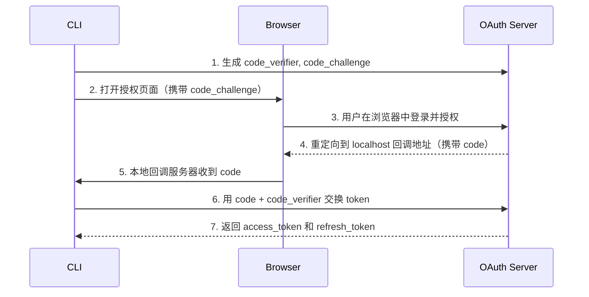
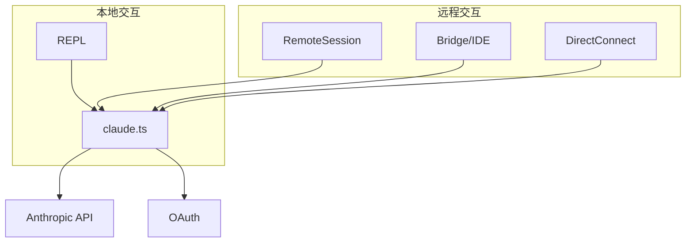

# 第12章：API通信的暗面

前面的章节里，我们一直在看 Claude Code 的"正面"——消息怎么流转、工具怎么执行、对话怎么压缩。所有这些美好的流程都有一个前提：API 调用成功了。

但真实世界不是这样的。

你坐在公司 VPN 后面，防火墙拦截了 SSL 证书；你用的是 API Key 认证，但 key 过期了；你提了一个特别长的请求，超过了模型能处理的极限；又或者，Anthropic 的服务器刚好在高峰期，返回了 529 Overloaded。

每一条 API 调用都可能失败。而且失败的方式比你想象的多得多。

Claude Code 的 `src/services/api/` 目录就是应对这些失败的"暗面"。这里有错误分类系统、重试循环、指数退避算法、流式传输错误恢复……它们像引擎室里的减震器和保险丝，平时你看不到它们在工作，但它们决定了整个系统在压力下会不会崩溃。

这一章，我们走进通信层的暗面。

---

## 这是什么

想象你给朋友发一条微信。大多数时候，消息秒达。但偶尔：

- 信号不好，消息发出去了但对方没收到——你等一会儿再发一次
- 对方手机关机了——你不再重试，改天再说
- 你发了一段 1GB 的视频——微信说文件太大，发送失败
- 你的账号在另一台设备上登录了——微信提示"账号异常"

API 调用面对的问题一模一样，只是更复杂：

- **网络错误**：连接超时、DNS 解析失败、SSL 证书有问题
- **服务器错误**：500 Internal Server Error、529 Overloaded（服务器过载）
- **客户端错误**：400 Bad Request（请求格式有问题）、401 Unauthorized（认证失败）
- **容量限制**：429 Rate Limit（请求太频繁）、prompt too long（输入太长）

对每种错误，Claude Code 的策略都不一样。有些要重试（服务器过载，等一会儿就好），有些不能重试（API Key 无效，重试一百遍也没用），有些需要特殊处理（token 超限时调整参数再重试）。

这套策略不是随意决定的，而是经过精心设计的**错误分类 + 重试决策**系统。

---

## 打开源码

API 通信层的核心代码在 `src/services/api/` 目录下。跟本章相关的文件有这几个：

```
src/services/api/
  withRetry.ts      -- 重试循环的核心，指数退避策略
  errors.ts         -- 错误分类 + 错误消息生成
  errorUtils.ts     -- 错误工具函数（连接错误、SSL错误）
  client.ts         -- API 客户端创建（Anthropic SDK 配置）
  claude.ts         -- 主查询函数（流式 + 非流式）
  logging.ts        -- API 日志和遥测
```

我们从重试循环开始，因为它是整个通信层的骨架。

---

## 它怎么工作

### 重试循环：一个不会放弃的 for 循环

打开 `withRetry.ts`（约第170行），你会看到整个重试系统的核心——`withRetry` 函数。它是一个 **AsyncGenerator**，这意味着它不仅能重试，还能在等待期间向调用者"汇报"重试状态（比如在终端显示"正在重试..."）。

```typescript
// src/services/api/withRetry.ts 约第170行
export async function* withRetry<T>(
  getClient: () => Promise<Anthropic>,
  operation: (
    client: Anthropic,
    attempt: number,
    context: RetryContext,
  ) => Promise<T>,
  options: RetryOptions,
): AsyncGenerator<SystemAPIErrorMessage, T> {
```

它的结构可以用伪代码概括：

```
for (从第1次到最大重试次数+1) {
  try {
    发起 API 请求
    成功 → 直接返回结果
  } catch (error) {
    这个错误能重试吗？
      不能 → 抛出 CannotRetryError，放弃
      能 → 计算等待时间，yield 重试状态，sleep，继续循环
  }
}
```

默认最大重试次数是多少？看约第52行：

```typescript
// src/services/api/withRetry.ts 约第52行
const DEFAULT_MAX_RETRIES = 10
```

10 次。这意味着 Claude Code 最多会尝试 11 次（1 次初始请求 + 10 次重试），才会最终放弃。

但不是所有错误都值得重试 10 次。接下来看错误分类。

### 错误分类：一张精密的决策表

`shouldRetry` 函数（`withRetry.ts` 约第696行）是重试决策的核心。它接收一个 `APIError`，返回 `true` 或 `false`：

```typescript
// src/services/api/withRetry.ts 约第696行
function shouldRetry(error: APIError): boolean {
  // 永远不重试 mock 错误（测试用的）
  if (isMockRateLimitError(error)) return false

  // 连接错误 → 重试（可能是临时网络问题）
  if (error instanceof APIConnectionError) return true

  // 408 Request Timeout → 重试
  if (error.status === 408) return true

  // 409 Conflict → 重试
  if (error.status === 409) return true

  // 429 Rate Limit → 订阅用户不重试，其他用户重试
  if (error.status === 429) {
    return !isClaudeAISubscriber() || isEnterpriseSubscriber()
  }

  // 401 Unauthorized → 清除缓存后重试（可能是 token 过期）
  if (error.status === 401) {
    clearApiKeyHelperCache()
    return true
  }

  // 5xx 服务器错误 → 重试
  if (error.status >= 500) return true

  // 其他情况不重试
  return false
}
```

这段代码值得仔细看。它体现了几条重要的设计原则：

1. **连接错误总是重试**——网络问题通常是临时的，等一会儿就好了
2. **429 Rate Limit 对订阅用户不重试**——因为他们有固定的使用配额，重试只会让情况更糟
3. **401 会清除缓存再重试**——认证失败可能是因为缓存的 token 过期了，刷新 token 后重试是有意义的
4. **5xx 总是重试**——服务器错误不是客户端的锅，应该重试

而在 `errors.ts` 里（约第965行），还有一个更精细的分类函数 `classifyAPIError`，它不是用来决定"重不重试"的，而是用于遥测分析——告诉后端到底是哪种错误发生了：

```typescript
// src/services/api/errors.ts 约第965行
export function classifyAPIError(error: unknown): string {
  if (error instanceof Error && error.message === 'Request was aborted.')
    return 'aborted'
  if (error instanceof APIConnectionTimeoutError) return 'api_timeout'
  if (error instanceof APIError && error.status === 429) return 'rate_limit'
  if (error instanceof APIError && error.status === 529) return 'server_overload'
  if (error instanceof Error && error.message.toLowerCase().includes('prompt is too long'))
    return 'prompt_too_long'
  // ... 还有几十种分类
  return 'unknown'
}
```

分类结果会作为 `tengu_api_error` 事件的 `errorType` 字段发送到遥测系统，帮助团队了解哪种错误最常发生。

### 指数退避：不是傻等，而是越等越久

决定了要重试之后，等多久？这就是**指数退避（exponential backoff）**算法的工作。

看 `getRetryDelay` 函数（`withRetry.ts` 约第530行）：

```typescript
// src/services/api/withRetry.ts 约第530行
export function getRetryDelay(
  attempt: number,
  retryAfterHeader?: string | null,
  maxDelayMs = 32000,
): number {
  // 如果服务器告诉了我们等多久，就听服务器的
  if (retryAfterHeader) {
    const seconds = parseInt(retryAfterHeader, 10)
    if (!isNaN(seconds)) return seconds * 1000
  }

  // 指数退避：500ms * 2^(attempt-1) + 随机抖动
  const baseDelay = Math.min(
    BASE_DELAY_MS * Math.pow(2, attempt - 1),
    maxDelayMs,
  )
  const jitter = Math.random() * 0.25 * baseDelay
  return baseDelay + jitter
}
```

其中 `BASE_DELAY_MS = 500`（约第55行）。

如果服务器通过 `retry-after` 响应头告诉了客户端应该等多久，那直接用服务器的值。否则，用指数退避：

- 第 1 次重试：500ms + 抖动
- 第 2 次重试：1000ms + 抖动
- 第 3 次重试：2000ms + 抖动
- 第 4 次重试：4000ms + 抖动
- ...
- 上限：32000ms（32 秒）

那个 `jitter`（抖动）是什么？想象一个场景：1000 个客户端同时请求 API，同时收到 429 Rate Limit，同时等 2 秒后重试——它们会同时再次冲击服务器。加上随机抖动（0 到 25% 的基础延迟），这些客户端的重试时间就错开了，避免了"重试风暴"。

### 529 Overloaded：特殊的过载处理

529 状态码是 Anthropic API 特有的"服务器过载"信号。它比普通的 500 更"温柔"——服务器不是坏了，只是太忙了。

Claude Code 对 529 有专门的处理逻辑（`withRetry.ts` 约第327-365行）。关键点在于：不是所有 529 都要重试。

```typescript
// src/services/api/withRetry.ts 约第62-82行
const FOREGROUND_529_RETRY_SOURCES = new Set<QuerySource>([
  'repl_main_thread',     // 主对话线程
  'sdk',                  // SDK 调用
  'compact',              // 压缩
  'verification_agent',   // 验证代理
  // ... 等等
])
```

只有来自这些"前台"查询来源的 529 才会重试。后台任务（比如生成对话标题、建议补全）遇到 529 会直接放弃——因为用户根本看不到这些任务失败，重试只会增加服务器负担。

连续 529 还有上限。如果连续 3 次（`MAX_529_RETRIES = 3`，约第54行）都是 529，并且配置了 fallback 模型，系统会触发模型降级——从 Opus 降级到 Sonnet：

```typescript
// src/services/api/withRetry.ts 约第335-352行
if (consecutive529Errors >= MAX_529_RETRIES) {
  if (options.fallbackModel) {
    throw new FallbackTriggeredError(options.model, options.fallbackModel)
  }
}
```

### 持久重试：为无人值守场景设计

有一个特殊的重试模式叫 **persistent retry**（持久重试），通过环境变量 `CLAUDE_CODE_UNATTENDED_RETRY` 开启。它用于无人值守的自动化场景——没有人在终端前等着看结果，所以可以等更久。

在持久模式下，重试行为有几个关键差异（`withRetry.ts` 约第96-104行）：

```typescript
const PERSISTENT_MAX_BACKOFF_MS = 5 * 60 * 1000    // 最多等 5 分钟
const PERSISTENT_RESET_CAP_MS = 6 * 60 * 60 * 1000  // 最多等 6 小时
const HEARTBEAT_INTERVAL_MS = 30_000                  // 每 30 秒心跳一次
```

持久模式还有个巧妙的设计：长等待被切分成 30 秒的小块，每个小块都会通过 `yield` 向上层发送一条"系统消息"。这保证了两件事：

1. 宿主环境（比如 CI 系统）能看到终端有输出，不会判定会话空闲而杀掉进程
2. 用户如果回来查看终端，能看到"正在等待 API 恢复..."之类的提示

### SSL 错误：企业用户的噩梦

如果你在公司网络里用 Claude Code，大概率遇到过 SSL 错误。很多企业使用 TLS 拦截代理（比如 Zscaler），它们会用自己的 CA 证书替换网站的证书，导致 Node.js 的 SSL 验证失败。

`errorUtils.ts` 专门处理了这个问题（约第1-30行）。它定义了一组 SSL 错误代码：

```typescript
// src/services/api/errorUtils.ts 约第5-29行
const SSL_ERROR_CODES = new Set([
  'UNABLE_TO_VERIFY_LEAF_SIGNATURE',
  'CERT_HAS_EXPIRED',
  'SELF_SIGNED_CERT_IN_CHAIN',
  'ERR_TLS_CERT_ALTNAME_INVALID',
  // ... 更多 SSL 错误代码
])
```

然后 `extractConnectionErrorDetails` 函数（约第42行）会沿着错误的 `cause` 链一路往下找，最多找 5 层，找到最底层的错误代码。这是因为 Anthropic SDK 会把底层网络错误包了好几层。

找到 SSL 错误后，`getSSLErrorHint`（约第94行）会给出具体的修复建议：

```
SSL certificate error (SELF_SIGNED_CERT_IN_CHAIN).
If you are behind a corporate proxy or TLS-intercepting firewall,
set NODE_EXTRA_CA_CERTS to your CA bundle path, or ask IT to
allowlist *.anthropic.com. Run /doctor for details.
```

这种"诊断 + 建议修复方案"的模式，比简单抛出一个 `ECONNREFUSED` 要有用得多。

### 错误消息生成：给用户看的不是堆栈跟踪

`getAssistantMessageFromError` 函数（`errors.ts` 约第425行）是错误处理的最后一道关卡——它把原始的 API 错误转换成用户能理解的消息。

这个函数有近 500 行，是一个巨大的 if-else 链。它检查的错误类型有几十种，每种都有专门的用户提示。举几个例子：

- **PDF 相关**：密码保护的 PDF、无效的 PDF、PDF 页数超限
- **图片相关**：图片太大、图片尺寸超限
- **认证相关**：API Key 无效、OAuth token 被撤销、组织被禁用
- **模型相关**：模型名称无效、Opus 不适用于当前订阅
- **容量相关**：Rate Limit、信用余额不足

注意，这些消息会区分交互模式和非交互模式。比如图片太大的错误，交互模式会提示"Double press esc to go back"，非交互模式则说"Try resizing the image"。这是因为非交互模式下用户无法按 Esc——他们可能是在 CI 里运行 Claude Code。

还有一个有趣的细节：有些 API 错误消息包含 HTML（比如 CloudFlare 的拦截页面）。`sanitizeMessageHTML` 函数（`errorUtils.ts` 约第107行）会检测这种情况，从 HTML 中提取 `<title>` 标签的内容，避免把一堆 HTML 代码直接展示给用户。

---

## 四张入场券：认证方式的取舍

在深入错误处理之前，我们还没聊过一个问题：你的请求到底是怎么证明"我是合法用户"的？

Claude Code 支持四种认证方式，每种对应不同的使用场景：

| 方式 | 配置 | 适用场景 |
|------|------|---------|
| API Key | `ANTHROPIC_API_KEY` 环境变量 | 直连 Anthropic API，开发者最常用 |
| OAuth | 浏览器交互式授权 | Claude.ai 订阅用户（Max/Pro） |
| AWS Bedrock | `CLAUDE_CODE_USE_BEDROCK=1` | AWS 企业用户，模型部署在 Bedrock 上 |
| Google Vertex | `CLAUDE_CODE_USE_VERTEX=1` | GCP 企业用户，模型部署在 Vertex AI 上 |

认证方式的优先级是确定的：如果你同时设置了 `ANTHROPIC_API_KEY` 和 Bedrock/Vertex 的环境变量，SDK 会根据配置决定走哪条路。但 OAuth 和 API Key 是互斥的——OAuth 流程会生成并缓存一个临时 API Key，如果已存在有效的 OAuth token，就直接用它。

对于企业用户来说，Bedrock 和 Vertex 模式意味着请求根本不到 Anthropic 的服务器——流量留在你自己的云账号里。这对合规性要求高的场景（金融、医疗）至关重要。

### OAuth PKCE：不用密码也能证明你是你

如果你是 Claude.ai 的订阅用户，Claude Code 不会让你把密码输进终端。它用的是 **OAuth PKCE**（Proof Key for Code Exchange）流程——一种专为命令行工具设计的授权方式。

PKCE 的精妙之处在于：你的终端**永远不接触密码**。整个流程通过一个临时的"暗号"（code_verifier / code_challenge）在 CLI、浏览器和 OAuth 服务器之间建立信任。



七个步骤，环环相扣：

1. **CLI 生成暗号对**：`code_verifier` 是一个随机字符串，`code_challenge` 是它的 SHA-256 哈希。CLI 把 `code_verifier` 藏好不发送，只把 `code_challenge` 带上。
2. **打开浏览器**：CLI 在本地启动一个临时 HTTP 服务器（端口 3100-3200），然后打开浏览器跳转到 Anthropic 的授权页面。
3. **用户授权**：你在浏览器里登录 Anthropic 账号，确认授权。这一步和你授权第三方应用访问 Google 账号一样。
4. **OAuth 重定向**：授权成功后，OAuth 服务器把你重定向回 `localhost:xxxx/callback?code=xxx`。
5. **CLI 收到 code**：本地回调服务器捕获这个请求，提取 `code` 参数。
6. **用暗号换 token**：CLI 把 `code` 和一直藏着的 `code_verifier` 一起发给 OAuth 服务器。服务器验证 `code_verifier` 的哈希是否等于之前的 `code_challenge`——如果匹配，说明请求确实来自同一个 CLI，不是被中间人截获的。
7. **拿到 token**：服务器返回 `access_token`（短期有效）和 `refresh_token`（长期有效，用于续期）。CLI 把它们安全存储到系统 Keychain（macOS）或加密存储（Linux/Windows）。

为什么这么复杂？因为 CLI 工具没有"回调 URL"——你不可能给终端注册一个 `https://my-cli-app.com/callback`。PKCE 解决了这个问题：不需要预注册回调 URL，也不需要 client secret，只需一个一次性的暗号对就能防止授权码被截获。

---

## 远程会话：不在本地也能用

到目前为止，我们假设 Claude Code 就运行在你的本地终端里。但实际场景要复杂得多——你可能在 SSH 到远程服务器上运行，在 IDE 里通过插件调用，或者通过一个 URL 直接连接到远程的 Claude Code 实例。

Claude Code 支持三种远程连接模式：

| 模式 | 连接方式 | 典型场景 |
|------|---------|---------|
| **RemoteSession** | SSH / WebSocket | 在远程服务器上运行 Claude Code，本地终端作为前端 |
| **Bridge** | IDE 插件通信 | VS Code / JetBrains 插件调用 Claude Code，双向消息传递 |
| **Direct Connect** | URL 直连 | 通过 `claude connect <url>` 直接连接到远程实例 |

### 架构拓扑



三种模式最终都汇聚到同一个 API 通信层——就是我们在这一章里分析的那些代码。不管是本地 REPL 发出的请求，还是 Bridge 转发的请求，都会走 `createMessageStream()` → `withRetry()` → 指数退避这一套流程。

这意味着错误处理逻辑也是统一的：远程会话遇到 529 过载，同样会触发模型降级；Bridge 模式遇到 SSL 错误，同样会给出企业代理的修复建议。远程模式不需要单独实现一套重试逻辑——它复用了本地的全部通信基础设施。

关键区别在于**连接层本身的可靠性**。RemoteSession 和 Bridge 模式在网络断开时需要额外的重连机制，这是在传输层（SSH/WebSocket）处理的，不属于 API 重试的范畴。Direct Connect 模式最简单——它只是把远程实例的输出流转发到本地终端，相当于一个远程查看器。

---

## 对比Java

如果你写过 Java，可能用过 **Resilience4j** 或 **Spring Retry** 来做类似的事情。让我们对比一下。

### 重试策略

**Spring Retry** 用注解声明重试：

```java
@Retryable(
  value = { HttpServerErrorException.class, ResourceAccessException.class },
  maxAttempts = 3,
  backoff = @Backoff(delay = 500, multiplier = 2)
)
public String callApi(String request) {
  // API 调用
}
```

**Resilience4j** 用函数式 API：

```java
Retry retry = Retry.ofDefaults("api")
  .toBuilder()
  .maxAttempts(3)
  .waitDuration(Duration.ofMillis(500))
  .retryOnException(e -> e instanceof HttpServerErrorException)
  .build();

Supplier<String> supplier = Retry.decorateSupplier(retry, () -> api.call());
String result = Try.ofSupplier(supplier).get();
```

Claude Code 的 `withRetry` 和它们的本质相同——都是"循环 + 判断 + 等待"三件套。但有几个关键差异：

| 方面 | Java（Resilience4j/Spring Retry） | Claude Code（withRetry） |
|------|-----------------------------------|--------------------------|
| 声明方式 | 注解或函数式包装 | AsyncGenerator 函数 |
| 错误分类 | 基于异常类型 | 基于 HTTP 状态码 + 消息内容匹配 |
| 退避策略 | 配置式（XML/YAML） | 代码式（可编程调整） |
| 重试期间的状态反馈 | 无（调用者只能干等） | yield 中间状态（可显示进度） |
| 动态上下文调整 | 不支持 | 支持（RetryContext 可在重试间修改参数） |

最大的差异是最后两条。Claude Code 的重试循环能在等待期间"告诉"调用者发生了什么（通过 `yield`），还能在重试之间动态调整参数（比如因为 token 超限而减少 `max_tokens`）。这是传统的 Java 重试框架做不到的——它们的重试对调用者是透明的。

### 错误分类

Java 通常用异常类型来分类错误：

```java
try {
  api.call();
} catch (AuthenticationException e) {
  // 认证错误
} catch (RateLimitException e) {
  // 限流
} catch (ServerErrorException e) {
  // 服务器错误
}
```

Claude Code 则是在一个函数里用 `instanceof` + 状态码 + 消息内容做模式匹配。这种方式看起来不如 Java 的异常体系优雅，但它有一个优势：**统一处理**。所有错误类型、所有重试决策、所有用户消息，都在一个地方，不会散落在多个 catch 块里。

这其实是工程上的取舍：Java 的异常体系更适合大型团队分工，而 Claude Code 的集中式处理更适合快速迭代——加一种新错误类型，只需要在 `shouldRetry` 和 `classifyAPIError` 里加几行。

---

## 你能改什么

理解了这套错误处理系统后，你可以做这些定制：

### 1. 调整重试次数

通过环境变量 `CLAUDE_CODE_MAX_RETRIES` 控制最大重试次数：

```bash
# 减少重试次数，快速失败
export CLAUDE_CODE_MAX_RETRIES=3

# 增加重试次数，更顽强
export CLAUDE_CODE_MAX_RETRIES=20
```

代码在 `withRetry.ts` 约第789行：

```typescript
export function getDefaultMaxRetries(): number {
  if (process.env.CLAUDE_CODE_MAX_RETRIES) {
    return parseInt(process.env.CLAUDE_CODE_MAX_RETRIES, 10)
  }
  return DEFAULT_MAX_RETRIES  // 默认 10
}
```

### 2. 添加新的错误类型

如果你想处理一种新的错误（比如某个第三方 API 网关返回的特殊格式），需要改三个地方：

1. **`shouldRetry`**（`withRetry.ts` 约第696行）——决定这种错误要不要重试
2. **`classifyAPIError`**（`errors.ts` 约第965行）——给遥测系统一个分类标签
3. **`getAssistantMessageFromError`**（`errors.ts` 约第425行）——给用户一个友好的提示消息

三个地方各加一个 `if` 分支就行。比如添加对 CloudFlare 1020 错误的处理：

```typescript
// 在 shouldRetry 里
if (error.status === 403 && error.message?.includes('Access denied'))
  return false  // CloudFlare 拦截，重试没用

// 在 classifyAPIError 里
if (error.status === 403 && error.message?.includes('Access denied'))
  return 'cloudflare_blocked'

// 在 getAssistantMessageFromError 里
if (error.status === 403 && error.message?.includes('Access denied'))
  return createAssistantAPIErrorMessage({
    content: 'API 请求被防火墙拦截，请检查网络代理设置',
    error: 'connection_blocked',
  })
```

### 3. 自定义退避策略

`getRetryDelay` 函数是导出的（`export`），这意味着其他模块可以覆盖它。如果你想实现不同的退避策略——比如线性退避而不是指数退避——修改这个函数即可。

### 4. 利用持久重试模式

如果你在 CI/CD 环境中运行 Claude Code，可以开启持久重试：

```bash
export CLAUDE_CODE_UNATTENDED_RETRY=true
```

这会让 Claude Code 在遇到 429/529 时无限重试（最多等 6 小时），而不是 10 次后放弃。

### 5. 修改超时时间

API 调用的超时时间通过 `API_TIMEOUT_MS` 环境变量控制（`client.ts` 约第144行）：

```typescript
timeout: parseInt(process.env.API_TIMEOUT_MS || String(600 * 1000), 10),
```

默认 600 秒（10 分钟）。如果你的网络特别慢，可以增加这个值：

```bash
export API_TIMEOUT_MS=1200000  # 20 分钟
```

---

## 回顾

这一章，我们走进了 API 通信的暗面，看到了 Claude Code 如何在错误和不确定中保持稳健：

1. **重试循环**是一个 AsyncGenerator，最多尝试 11 次，能在等待期间向终端报告状态。
2. **错误分类**不是简单的异常捕获，而是基于 HTTP 状态码 + 消息内容的精细匹配，分类结果用于遥测分析和重试决策。
3. **指数退避**从 500ms 开始每次翻倍，上限 32 秒，加上随机抖动避免"重试风暴"。持久模式上限可达 5 分钟。
4. **529 Overloaded** 有专门的处理：前台任务才重试，连续 3 次触发模型降级，后台任务直接放弃。
5. **SSL 错误**有专门的诊断链——沿着 cause 链找到底层错误代码，给出具体的修复建议。
6. **错误消息**区分交互/非交互模式，过滤 HTML 内容，确保用户看到的不是一堆堆栈跟踪。
7. **四种认证方式**（API Key / OAuth / Bedrock / Vertex）覆盖了从个人开发者到企业合规的全部场景，OAuth PKCE 流程通过暗号对在 CLI 和浏览器之间建立信任。
8. **三种远程模式**（RemoteSession / Bridge / Direct Connect）复用了同一套 API 通信基础设施，错误处理逻辑天然统一。

对比 Java 的 Resilience4j，Claude Code 的方案更"手工"但更灵活——所有决策逻辑集中在一个函数里，方便快速迭代。

到现在为止，你已经看过了消息的旅程、引擎室的内部结构、以及通信层的暗面。从入口到出口，从正常路径到异常路径，你已经理解了 Claude Code 源码的核心骨架。

---

[上一章：跨越会话的记忆](./第11章-跨越会话的记忆.md)

**卷二完。**
