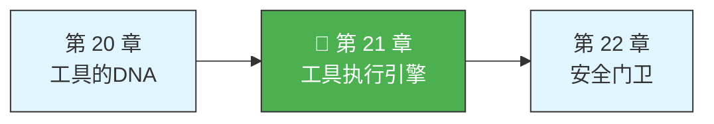
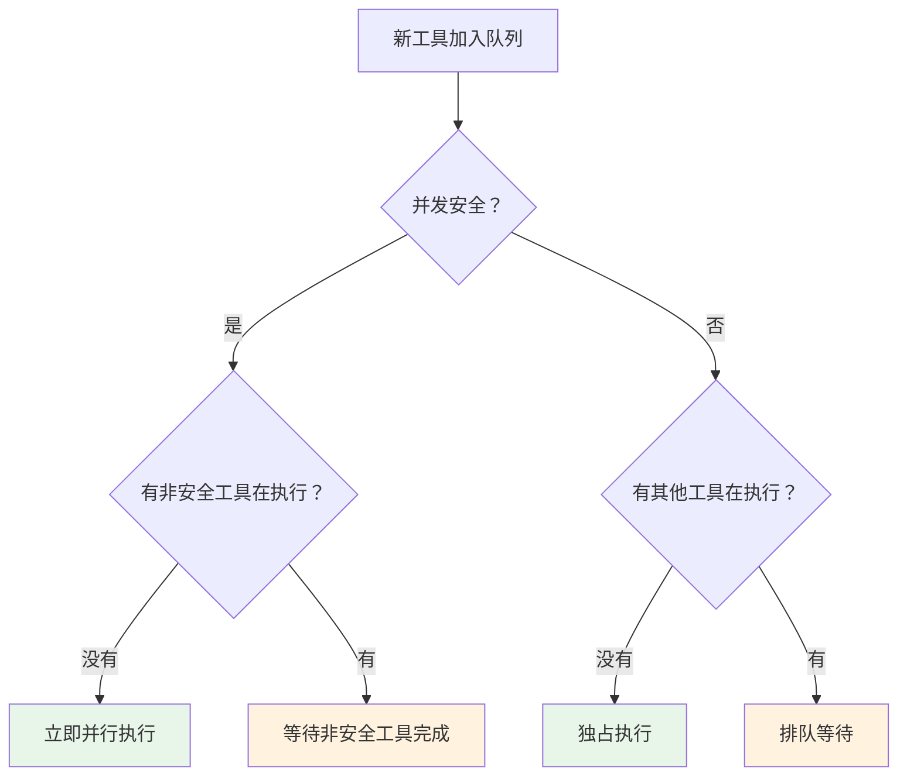

# 第 21 章：工具执行引擎

> 源码验证日期：2026-05-15，基于 commit `0d81bb6`

上一章我们看了工具的 DNA——那个统一的 `Tool` 类型。但你有没有想过，当 AI 说"我要读一个文件"的时候，从这句话到文件内容真正出现在你面前，中间到底发生了什么？

你可能以为过程很简单：AI 发请求，工具执行，返回结果。但实际上，这中间有一条精心设计的流水线。就像快递一样，你以为只是"下单->收货"，但背后有订单验证、仓库拣货、安检扫描、物流配送、签收确认。每一步都有它的理由。

这条流水线就是**工具执行引擎**。它的核心是一个叫 `runToolUse` 的函数。

---

## 路线图



---

## 这是什么

想象你是一个工厂的生产调度员。每天你收到几十张工单，每张工单写着"做某件事"。你的工作不是亲自去做每一件事，而是确保每张工单按正确流程走完：

1. **核对工单**——工单填得对不对？材料齐不齐？
2. **查安全许可**——这个操作有危险吗？需要特别授权吗？
3. **通知前置工位**——告诉上下游，"我要开始做这件事了"
4. **执行**——让对应的工位开工
5. **通知后置工位**——做完了，让后续流程接手
6. **交还结果**——把成品交给下一环节

`runToolUse` 就是这个调度员。

---

## 打开源码

工具执行引擎的核心代码在 `src/services/tools/toolExecution.ts` 文件中，大约 1745 行。此外，并发控制在 `src/services/tools/StreamingToolExecutor.ts` 中。

---

## 它怎么工作

### 并发控制：安全工具并行，危险工具串行

模型可能同时返回多个工具调用。Claude Code 用 `StreamingToolExecutor` 管理并发，核心算法是 `canExecuteTool`：

```typescript
private canExecuteTool(isConcurrencySafe: boolean): boolean {
  const executingTools = this.tools.filter(t => t.status === 'executing')
  return (
    executingTools.length === 0 ||
    (isConcurrencySafe && executingTools.every(t => t.isConcurrencySafe))
  )
}
```

规则很简单：如果所有正在执行的工具都是并发安全的，新的安全工具可以并行开始。否则排队等。**关键设计**：模型仍在流式输出时，工具就已经开始执行了——这叫**预测性工具执行**。



### 完整执行链：六步流水线

找到了工具之后，`runToolUse` 把实际执行委托给了 `checkPermissionsAndCallTool` 函数。执行引擎的完整生命周期是：

```
验证输入 -> 运行前置钩子 -> 检查权限 -> 执行工具 -> 运行后置钩子 -> 返回结果
```

**第一步：验证输入**——用 Zod 做 schema 验证，再用工具自定义逻辑做深度验证。

**第二步：运行 PreToolUse Hooks**——外部脚本可以修改参数、批准或拒绝执行：

```typescript
for await (const result of runPreToolUseHooks(
  toolUseContext, tool, processedInput, toolUseID,
)) {
  switch (result.type) {
    case 'hookPermissionResult': // 钩子做出了权限决定
    case 'hookUpdatedInput':     // 钩子修改了输入参数
    case 'preventContinuation':  // 钩子要求停止执行
  }
}
```

**第三步：检查权限**——合并钩子决定和规则系统的决定。关键安全设计：**钩子不能绕过安全规则**。即使钩子说"批准"，如果 `settings.json` 里有 deny 规则，deny 仍然生效。

**第四步：执行工具**——调用 `tool.call()`。

**第五步：运行 PostToolUse Hooks**——后置钩子可以修改结果、记录日志、做清理。

**第六步：返回结果**——打包所有消息返回给 AI。

### 兄弟错误级联

Bash 命令失败会取消所有并行兄弟——因为 Bash 命令经常有依赖关系（`mkdir` 失败 -> `cp` 无意义）。其他工具（Read、Grep）失败不会影响并行任务。

---

## 常见错误与检查方法

| 常见错误 | 检查方法 |
|---------|---------|
| 工具执行被意外拒绝 | 检查 PreToolUse Hook 是否返回了 deny |
| 并行工具互相干扰 | 确认工具的 `isConcurrencySafe` 标记是否正确 |
| 钩子超时导致卡死 | 检查 `TOOL_HOOK_EXECUTION_TIMEOUT_MS` 设置 |
| 修改输入参数无效 | Hook 修改的是 `processedInput`，不是原始 `input` |

---

## 试试看

### 练习一：观察并发执行

在 `StreamingToolExecutor.ts` 的 `canExecuteTool` 方法中加调试日志，给 Claude 一个需要读多个文件的任务，观察哪些工具并行执行。

### 练习二：测量工具执行时间

在 `toolExecution.ts` 的 `tool.call()` 调用前后加计时，观察不同工具的执行时间差异。

### 练习三：追踪一次完整的 FileReadTool 执行

让 AI 读取一个文件，然后在 `runToolUse` 的关键节点打 `console.log`，观察日志输出的顺序。

---

## 检查点

1. **StreamingToolExecutor** 实现预测性工具执行——模型还在流式输出时，只读工具已经开始执行
2. **并发分区算法**：`isConcurrencySafe` 判断——安全工具并行、非安全工具串行
3. **六步执行链**：验证输入 -> PreToolUse Hooks -> 权限检查 -> `tool.call()` -> PostToolUse Hooks -> 返回结果
4. **安全设计**：钩子的"批准"不能绕过规则系统的"拒绝"
5. **兄弟错误级联**：Bash 失败取消并行兄弟，其他工具失败不影响

你看到了工具执行的流水线。但有一个关键问题我们还没深入：权限系统到底是怎么工作的？下一章，我们走进安全门卫的岗亭。

---

[上一章：工具的DNA](./第20章-工具的DNA.md) | [下一章：安全门卫](./第22章-安全门卫.md)
