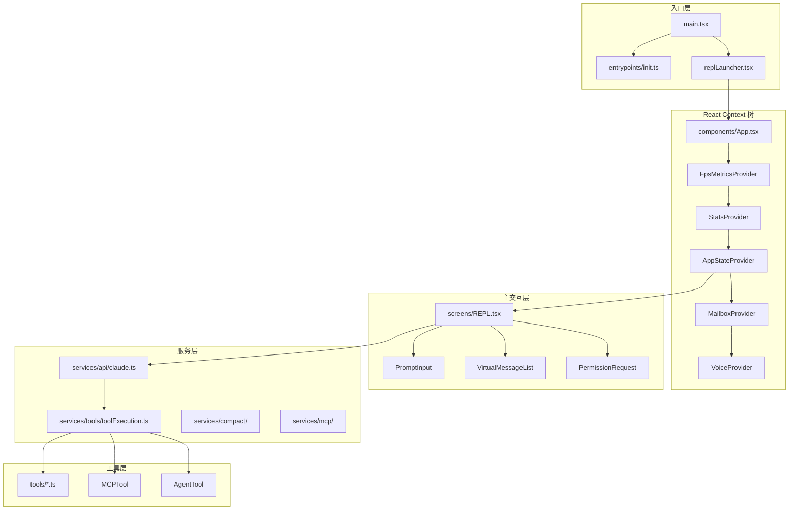
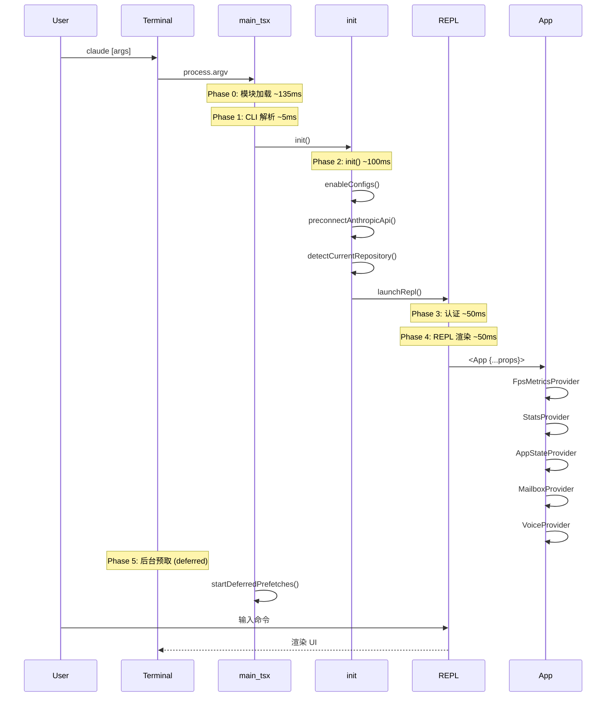
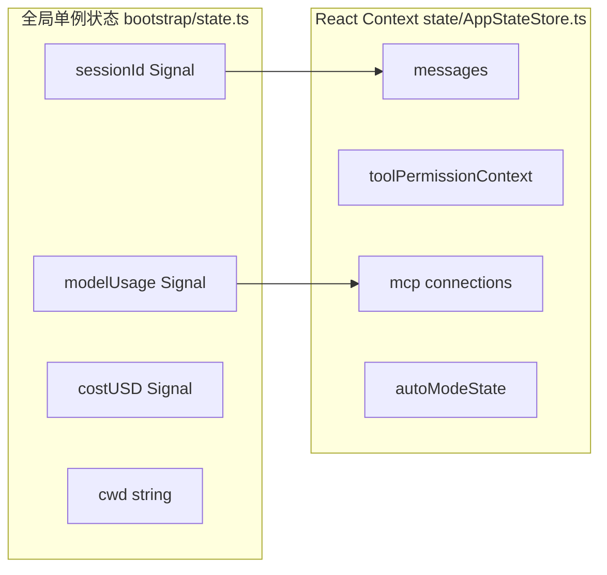

# 第00章：全局架构总览

> **本章目标**：学完本章后，你将理解 Claude Code CLI 的整体架构、模块职责划分、核心数据流，以及1884个源文件如何组织成一个完整系统。

---

## 1. 学习目标

- [ ] 理解 Claude Code 的技术栈（TypeScript + React/Ink + Commander.js + Bun）
- [ ] 能够描述各层模块的职责边界
- [ ] 追踪一次完整对话的生命周期（用户输入 → API → 工具执行 → 输出）
- [ ] 识别全局状态的两层架构（bootstrap/state.ts + React Context）
- [ ] 理解 Feature Flags 条件编译机制

---

## 2. 背景问题

### 2.1 为什么这个模块存在？

Claude Code 是一个**终端 AI 助手 CLI**，需要解决以下问题：

1. **跨平台终端 UI**：在终端中渲染复杂界面（消息列表、对话框、权限提示）
2. **工具调用能力**：让 AI 模型能够读写文件、执行命令、搜索代码
3. **上下文管理**：处理无限长的对话历史（通过压缩）
4. **多 Agent 协作**：支持子 Agent 调度和团队协作
5. **外部扩展**：通过 MCP 协议集成外部服务

### 2.2 核心矛盾

- 终端是纯文本环境，但需要复杂的交互界面
- AI 模型需要工具执行能力，但必须保证安全
- 上下文窗口有限，但对话可能很长

### 2.3 设计决策

| 决策 | 选择 | 原因 |
|------|------|------|
| UI 框架 | Ink（React for CLI） | React 生态成熟，组件化好 |
| 布局引擎 | Yoga（原生） | 高性能 Flexbox 布局 |
| 状态管理 | createSignal + Context | 响应式 + 组件树传递 |
| 条件编译 | bun:bundle feature() | 死代码消除，减小包体积 |

---

## 3. 源码入口

| 项目 | 内容 |
|------|------|
| 入口文件 | `src/main.tsx` |
| 核心函数 | `main()` at line 585 |
| CLI 构建 | `buildCLIProgram()` → Commander.js |
| 初始化 | `src/entrypoints/init.ts` → `init()` memoized |
| REPL 启动 | `src/replLauncher.tsx` → `launchRepl()` |
| 全局状态 | `src/bootstrap/state.ts` → `STATE` object |
| 工具注册 | `src/tools.ts` → `getAllBaseTools()` |
| 工具接口 | `src/Tool.ts` → `Tool` interface |

---

## 4. 架构定位

### 4.1 模块职责

```text
┌─────────────────────────────────────────────────────────────┐
│                      用户终端 (Terminal)                      │
└─────────────────────────────┬───────────────────────────────┘
                              │ stdin/stdout
┌─────────────────────────────┴───────────────────────────────┐
│                     main.tsx (CLI 入口)                      │
│  - Commander.js 参数解析                                     │
│  - 启动模式选择（交互/非交互/远程）                           │
└─────────────────────────────┬───────────────────────────────┘
                              │
          ┌───────────────────┼───────────────────┐
          ▼                   ▼                   ▼
   ┌────────────┐      ┌────────────┐      ┌────────────┐
   │  交互REPL  │      │  单次查询   │      │  远程会话  │
   │ REPL.tsx   │      │ query.ts   │      │  remote/  │
   └─────┬──────┘      └─────┬──────┘      └─────┬──────┘
         │                   │                   │
         └───────────────────┼───────────────────┘
                             ▼
┌─────────────────────────────────────────────────────────────┐
│                   App.tsx (React Context 树)                 │
│  FpsMetricsProvider → StatsProvider → AppStateProvider       │
│  └── MailboxProvider (Agent 间通信)                          │
│      └── VoiceProvider (语音模式)                            │
└─────────────────────────────┬───────────────────────────────┘
                             │
                             ▼
┌─────────────────────────────────────────────────────────────┐
│                     REPL.tsx (主交互循环)                     │
│  PromptInput → 消息列表 → 权限对话框 → API 调用 → 工具执行    │
└─────────────────────────────┬───────────────────────────────┘
                             │ tool_use
                             ▼
┌─────────────────────────────────────────────────────────────┐
│                 Anthropic API (services/api/)                 │
│  system prompt 构建 → 流式调用 → tool_use/tool_result 循环   │
└─────────────────────────────┬───────────────────────────────┘
                             │
                             ▼
┌─────────────────────────────────────────────────────────────┐
│                  工具执行引擎 (services/tools/)                │
│  权限检查 → 工具调度 → 结果返回                              │
└─────────────────────────────┬───────────────────────────────┘
                             │
          ┌──────────────────┼──────────────────┐
          ▼                  ▼                  ▼
   ┌────────────┐     ┌────────────┐     ┌────────────┐
   │ 内置工具   │     │ MCP 工具   │     │ Agent 工具 │
   │ tools/     │     │ services/  │     │ tools/     │
   │            │     │ mcp/      │     │ AgentTool/ │
   └────────────┘     └────────────┘     └────────────┘
```

### 4.2 模块关系

| 层级 | 模块 | 上游依赖 | 下游依赖 |
|------|------|---------|---------|
| 入口 | main.tsx | Commander.js | init.ts, replLauncher.tsx |
| 初始化 | init.ts | config.js | API 预连接, Git 检测 |
| 状态 | bootstrap/state.ts | - | 全局单例 |
| UI | App.tsx | bootstrap/state | REPL.tsx, 组件库 |
| 业务 | REPL.tsx | App State | messages.ts, tools.ts |
| API | services/api/ | REPL.tsx | toolExecution.ts |
| 工具 | services/tools/ | api/ | tools/*.ts |

### 4.3 数据流向

```text
用户输入 → PromptInput → createUserMessage()
  → messages.ts → API 调用
    → createMessageStream() → Anthropic API
    → 接收流式响应
      → text 块 → 直接渲染
      → tool_use 块 → toolExecution.ts
        → checkPermissions()
        → Tool.call()
        → tool_result
    → 循环直到模型停止
```

---

## 5. 核心源码分析

### 5.1 main() 函数调用链

```typescript
// src/main.tsx:585
export async function main() {
  // 1. 安全：防止 Windows PATH 劫持
  process.env.NoDefaultCurrentDirectoryInExePath = '1';

  // 2. 初始化警告处理
  initializeWarningHandler();

  // 3. SIGINT 处理
  process.on('SIGINT', () => {
    if (process.argv.includes('-p')) return;  // print 模式忽略
    process.exit(0);
  });

  // 4. 早期参数处理（--settings, --setting-sources）
  eagerLoadSettings();
  initializeEntrypoint(isNonInteractive);

  // 5. cc:// URL 处理（Direct Connect）
  if (feature('DIRECT_CONNECT')) {
    // 解析 URL，重写 argv
  }

  // 6. 构建并执行 CLI
  const program = buildCLIProgram();
  await program.parseAsync(process.argv);
}
```

### 5.2 init() 初始化（memoized 单次执行）

```typescript
// src/entrypoints/init.ts:57
export const init = memoize(async (): Promise<void> => {
  // 1. 配置系统
  enableConfigs();
  applySafeConfigEnvironmentVariables();
  applyExtraCACertsFromConfig();

  // 2. 优雅退出
  setupGracefulShutdown();

  // 3. API 预连接（关键优化）
  preconnectAnthropicApi();

  // 4. Git 仓库检测
  detectCurrentRepository();

  // 5. 远程设置加载
  initializeRemoteManagedSettingsLoadingPromise();
  initializePolicyLimitsLoadingPromise();
});
```

**设计原因**：
- `memoize` 包装确保初始化只执行一次
- API 预连接重叠 TLS 握手与后续计算

### 5.3 Feature Flag 条件编译

```typescript
// src/tools.ts:16-52
// 使用 bun:bundle feature() 实现条件编译
const REPLTool =
  process.env.USER_TYPE === 'ant'
    ? require('./tools/REPLTool/REPLTool.js').REPLTool
    : null;

const SleepTool =
  feature('PROACTIVE') || feature('KAIROS')
    ? require('./tools/SleepTool/SleepTool.js').SleepTool
    : null;

// 懒加载打破循环依赖
const getTeamCreateTool = () =>
  require('./tools/TeamCreateTool/TeamCreateTool.js').TeamCreateTool;
```

---

## 6. 可视化结构

### 6.1 模块结构图



### 6.2 启动时序图



### 6.3 状态管理架构



---

## 7. 工程经验

### 7.1 为什么这么设计？

**Q: 为什么用 Ink 而不是原生 ncurses？**
A: Ink 基于 React，组件化好，生态成熟。Claude Code 大量复用 React 组件思维，迁移成本低。

**Q: 为什么全局状态用 Signal 而不是 React Context？**
A: Signal 是模块级响应式状态，不依赖组件树。React Context 有 re-render 传播问题。

**Q: 为什么用 bun:bundle feature()？**
A: Bun 的条件编译在构建时静态分析，未使用的模块完全不打包，减小包体积。

### 7.2 替代方案

| 方案 | 优点 | 缺点 |
|------|------|------|
| Ink | React 生态、组件化 | 包体积较大 |
| 原生 ncurses | 性能好、包小 | 开发效率低 |
| blessed | 跨平台好 | API 设计老旧 |
| React Context | 官方方案 | re-render 传播问题 |
| Redux | 功能强大 | 过度设计 |
| createSignal | 轻量响应式 | 需要手动订阅 |

### 7.3 常见坑与避坑指南

| 坑点 | 触发条件 | 解决方案 |
|------|---------|---------|
| 循环依赖 | tools.ts ↔ TeamCreateTool | 用 `getTeamCreateTool()` 懒加载 |
| 重复初始化 | init() 被调用多次 | memoize 装饰器 |
| 状态不一致 | 多处修改全局状态 | 通过 bootstrap/state.ts 访问 |
| SIGINT 冲突 | print 模式 + Ctrl+C | main.tsx 检查 -p 参数 |

---

## 8. Contributor 指南

### 8.1 适合新手的文件

| 文件 | 任务类型 | 难度 |
|------|---------|------|
| `src/tools.ts` | 添加新工具注册 | L2 |
| `src/components/Spinner.js` | 改进加载动画 | L1 |
| `src/commands.ts` | 添加新斜杠命令 | L2 |

### 8.2 危险逻辑（修改需谨慎）

| 区域 | 风险 | 原因 |
|------|------|------|
| `main.tsx:591` | 🔴 高 | Windows PATH 劫持安全检查 |
| `src/bootstrap/state.ts` | 🔴 高 | 全局单例，任何修改影响所有模块 |
| `init()` | 🔴 高 | Memoized，重复调用只执行一次 |
| Feature flags | 🟡 中 | 条件编译影响多个模块 |

### 8.3 调试方法

```bash
# 1. 启动性能分析
./claude --debug

# 2. 查看 profileCheckpoint 埋点
# 搜索 logForDiagnosticsNoPII 调用

# 3. 追踪状态变化
# 在 bootstrap/state.ts 的关键 setter 加日志

# 4. Ink 渲染调试
# 设置 INK_DEBUG 环境变量
INK_DEBUG=1 ./claude
```

### 8.4 相关 Issue/PR

- 模块导入顺序问题：`src/tools.ts` 懒加载模式
- Feature flag 命名规范：统一 `FEATURE_NAME` 格式

---

## 练习

### 练习 1：追踪启动流程

**问题**：用户在终端执行 `claude -p "hello"`，追踪完整调用链。

**答案**：
```text
main() → buildCLIProgram() → program.parseAsync()
→ query.ts (非交互模式) → createMessageStream()
→ API 调用 → 输出结果
```

### 练习 2：理解状态管理

**问题**：在 REPL.tsx 中如何访问 `sessionId`？

**答案**：
```typescript
// 从 bootstrap/state.ts 导入
import { getSessionId } from '../bootstrap/state.js';
const sessionId = getSessionId();
```

### 练习 3：添加新工具

**问题**：如何在不修改现有代码的情况下添加一个 Conditional Tool？

**答案**：
```typescript
// 在 tools.ts 中添加
const MyTool = feature('MY_FEATURE')
  ? require('./tools/MyTool/MyTool.js').MyTool
  : null;
```

---

## 练习答案速查

| 练习 | 核心答案 |
|------|---------|
| 1 | main() → query.ts → API → 输出 |
| 2 | `getSessionId()` from bootstrap/state.ts |
| 3 | 在 tools.ts 用 `feature('FLAG')` 条件加载 |

---

## 本章 vs Java Spring

| 方面 | Claude Code | Java Spring |
|------|-------------|-------------|
| 入口 | main.tsx (Commander.js) | main() + @SpringBootApplication |
| 状态 | createSignal() 全局单例 | @Bean singleton |
| 工具注册 | tools.ts (getAllBaseTools) | HandlerAdapter registry |
| 上下文 | API 消息列表 | HttpServletRequest |
| 拦截器 | PreToolUse/PostToolUse Hooks | HandlerInterceptor |
| 配置 | settings.json | application.yml |
| 模块化 | Feature flags (bun:bundle) | @Conditional |

---

## 下一篇

👉 [第01章-入口与启动流程.md](./第01章-入口与启动流程.md) — 深入分析从 CLI 入口到 REPL 渲染的完整链路
