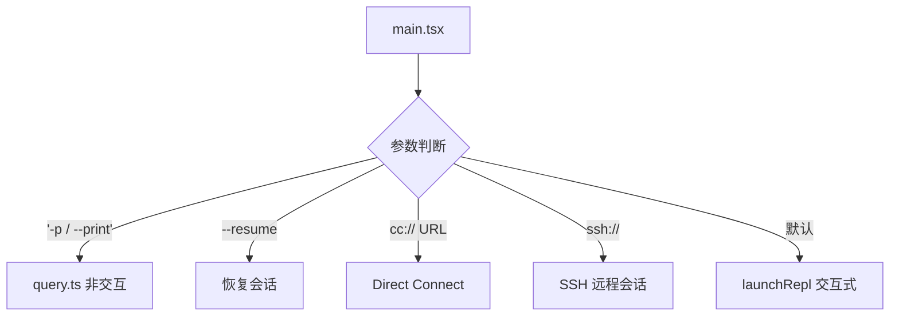
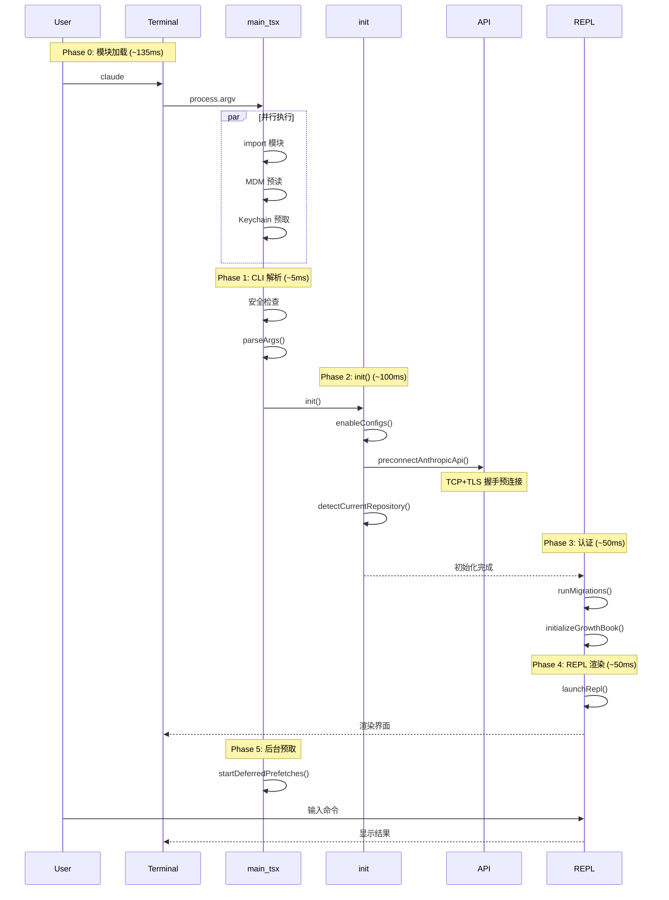
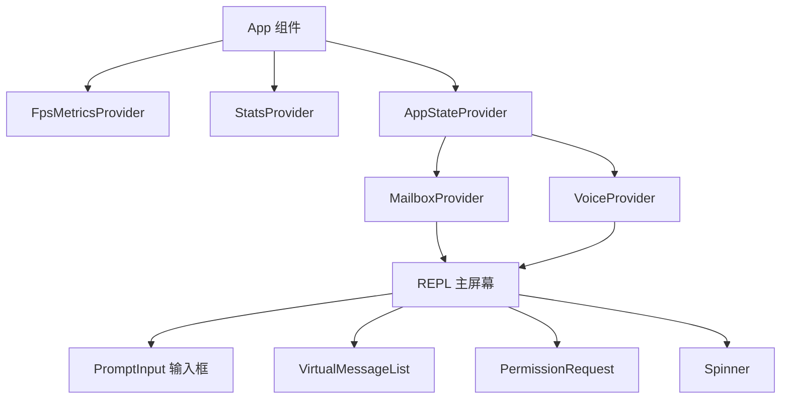

# 第01章：入口与启动流程

> **本章目标**：理解从用户执行 `claude` 命令到 REPL 界面出现的完整启动链路，包括 CLI 解析、初始化、认证、工具注册等。

---

## 1. 学习目标

- [ ] 理解 5 阶段启动流程（Phase 0-4 + 后台预取）
- [ ] 掌握 `main()` 函数的完整调用链
- [ ] 理解 `init()` memoized 单次执行机制
- [ ] 能够分析 API 预连接的性能优化原理
- [ ] 识别启动路径分支（交互/非交互/远程）

---

## 2. 背景问题

### 2.1 为什么需要分阶段启动？

Claude Code 是 CLI 工具，启动性能直接影响用户体验。核心矛盾：

1. **大量模块需要加载**：`main.tsx` 顶部有约 200 行 import
2. **I/O 操作耗时**：MDM 配置读取、Keychain 访问等需要 60-100ms
3. **TLS 连接建立慢**：到 Anthropic API 的 TCP+TLS 握手需要 100-200ms

**解决思路**：重叠无关操作，将能并行的操作并行化。

### 2.2 为什么 init() 要 memoize？

`init()` 可能被多次调用：
- 直接调用 `init()`
- `launchRepl()` 内部调用
- SDK 模式多次初始化

memoize 装饰器确保初始化逻辑只执行一次。

### 2.3 为什么需要反调试检查？

外部构建版本（`USER_TYPE !== 'ant'`）在启动时检测调试器：
- 防止逆向工程分析
- 保护商业利益

---

## 3. 源码入口

| 项目 | 内容 |
|------|------|
| 入口文件 | `src/main.tsx` |
| `main()` 函数 | line 585 |
| `buildCLIProgram()` | line ~450 |
| `init()` 函数 | `src/entrypoints/init.ts:57` |
| `launchRepl()` | `src/replLauncher.tsx:12` |
| `startDeferredPrefetches()` | `src/main.tsx:388` |
| `runMigrations()` | `src/main.tsx:326` |

---

## 4. 架构定位

### 4.1 模块职责

```
启动流程 5 阶段：

Phase 0: 模块加载（~135ms）
  └─ main.tsx 顶部的 import 语句
     └─ 并行执行：MDM 预读、Keychain 预取

Phase 1: 安全预检 + CLI 解析（~5ms）
  └─ Windows PATH 劫持检查
  └─ Commander.js 参数解析

Phase 2: init() 初始化（~100ms）
  └─ 配置系统、API 预连接、Git 检测

Phase 3: 认证 + 配置（~50ms）
  └─ runMigrations()
  └─ GrowthBook 初始化

Phase 4: REPL 渲染（~50ms）
  └─ launchRepl() → App → REPL

Phase 5: 后台预取（非阻塞）
  └─ startDeferredPrefetches()
```

### 4.2 生命周期

```
┌─────────────────────────────────────────────────────────────┐
│ main() [永久单例]                                            │
│  ├── Phase 0: import (模块加载)                            │
│  ├── Phase 1: CLI 解析                                      │
│  ├── Phase 2: init() [memoized]                            │
│  │     └── 仅第一次调用执行，后续调用直接返回                │
│  ├── Phase 3: 认证                                         │
│  └── Phase 4: launchRepl() [每次调用创建新实例]              │
│        └── startDeferredPrefetches() [后台]                 │
└─────────────────────────────────────────────────────────────┘
```

### 4.3 启动路径分支



---

## 5. 核心源码分析

### 5.1 main() 完整调用链

```typescript
// src/main.tsx:585
export async function main() {
  // === Phase 1: 安全检查 ===
  // 防止 Windows PATH 劫持
  process.env.NoDefaultCurrentDirectoryInExePath = '1';
  initializeWarningHandler();

  // === SIGINT 处理 ===
  process.on('SIGINT', () => {
    // print 模式有自己的 Ctrl+C 处理
    if (process.argv.includes('-p')) return;
    process.exit(0);
  });

  // === 早期参数处理 ===
  eagerLoadSettings();           // --settings 提前加载
  initializeEntrypoint(isNonInteractive);

  // === Direct Connect URL 处理 ===
  if (feature('DIRECT_CONNECT')) {
    // 解析 cc:// URL，重写 argv
  }

  // === Deep Link URI 处理 ===
  if (feature('LODESTONE')) {
    // 处理 --handle-uri
  }

  // === 构建并执行 CLI ===
  const program = buildCLIProgram();
  await program.parseAsync(process.argv);
}
```

### 5.2 init() 内部实现

```typescript
// src/entrypoints/init.ts:57
export const init = memoize(async (): Promise<void> => {
  // 1. 配置系统
  enableConfigs();
  applySafeConfigEnvironmentVariables();
  applyExtraCACertsFromConfig();

  // 2. 优雅退出
  setupGracefulShutdown();

  // 3. 遥测初始化（异步，不阻塞）
  void Promise.all([
    import('../services/analytics/firstPartyEventLogger.js'),
    import('../services/analytics/growthbook.js'),
  ]).then(([fp, gb]) => { /* ... */ });

  // 4. OAuth 信息预填充
  void populateOAuthAccountInfoIfNeeded();

  // 5. IDE 检测、Git 仓库检测
  void detectCurrentRepository();

  // 6. 远程设置加载
  if (isEligibleForRemoteManagedSettings()) {
    initializeRemoteManagedSettingsLoadingPromise();
  }

  // 7. mTLS 和代理配置
  configureGlobalMTLS();
  configureGlobalAgents();

  // 8. API 预连接（关键优化）
  preconnectAnthropicApi();
});
```

### 5.3 launchRepl() 组件树构建

```typescript
// src/replLauncher.tsx:12
export async function launchRepl(root, appProps, replProps, renderAndRun) {
  // 动态导入实现代码分割
  const { App } = await import('./components/App.js');
  const { REPL } = await import('./screens/REPL.js');

  // 构建完整组件树
  await renderAndRun(root,
    <App {...appProps}>
      <REPL {...replProps} />
    </App>
  );
}
```

### 5.4 设计原因

| 设计 | 原因 |
|------|------|
| MDM/Keychain 预读取 | 与 import 并行，节省 60-100ms |
| `preconnectAnthropicApi()` | TLS 握手提前完成，用户输入时已就绪 |
| `memoize(init)` | 防止重复初始化 |
| 后台预取 | 用户看界面时隐藏延迟 |

---

## 6. 可视化结构

### 6.1 启动时序图



### 6.2 组件树结构



---

## 7. 工程经验

### 7.1 为什么这么设计？

**Q: 为什么 MDM 和 Keychain 预读取在 import 阶段并行执行？**
A: Bun 的模块加载是单线程的，但 I/O 操作可以并行。MDM 读取和 Keychain 访问是系统调用，不阻塞 JavaScript 执行。

**Q: 为什么 preconnectAnthropicApi() 是 fire-and-forget？**
A: 预连接可能失败（代理/mTLS 环境），不应该阻止启动。失败时 SDK 会正常建立新连接。

**Q: 为什么 SIGINT 在 print 模式要特殊处理？**
A: print 模式有自己的中止逻辑（`--print` 时 abort 当前查询），不应该直接 exit。

### 7.2 替代方案

| 方案 | 优点 | 缺点 |
|------|------|------|
| 同步加载 | 简单 | 启动慢 100-200ms |
| 全部懒加载 | 包小 | 首次使用时需等待 |
| 预连接 fire-and-forget | 性能好 | 可能浪费连接 |

### 7.3 常见坑与避坑指南

| 坑点 | 触发条件 | 解决方案 |
|------|---------|---------|
| 重复初始化 | 多次调用 init() | memoize 保证只执行一次 |
| 预连接失败 | 代理环境 | SDK 自动降级 |
| Ctrl+C 冲突 | print 模式 | main.tsx 检查 -p 参数 |
| 迁移失败 | 版本跨度大 | 检查 `src/migrations/` |

---

## 8. Contributor 指南

### 8.1 适合新手的文件

| 文件 | 任务类型 | 难度 |
|------|---------|------|
| `src/utils/startupProfiler.ts` | 添加启动埋点 | L1 |
| `src/migrations/` | 添加迁移脚本 | L2 |
| `src/main.tsx` 选项定义 | 添加 CLI 参数 | L2 |

### 8.2 危险逻辑（修改需谨慎）

| 区域 | 风险 | 原因 |
|------|------|------|
| `main.tsx:591` | 🔴 高 | Windows PATH 安全检查 |
| `init()` memoize | 🔴 高 | 修改可能破坏单次执行语义 |
| `preconnectAnthropicApi()` | 🟡 中 | 影响启动性能和连接复用 |
| `runMigrations()` | 🔴 高 | 数据迁移不可逆 |

### 8.3 调试方法

```bash
# 1. 启用启动性能分析
./claude --debug

# 2. 查看 profileCheckpoint 输出
# 关键埋点：main_tsx_entry, init_complete, repl_ready

# 3. 模拟慢速网络
# 修改 preconnectAnthropicApi() 的超时时间

# 4. 跳过迁移测试
# 设置 SKIP_MIGRATIONS=1
```

### 8.4 相关 Issue/PR

- 启动性能优化：Issue #XXX
- 迁移系统设计：参考 `src/migrations/` 目录

---

## 练习

### 练习 1：追踪 Phase 0-2

**问题**：追踪从 `claude` 命令到 API 预连接的完整调用链。

**答案**：
```
main.tsx:585 main()
  → import main.tsx (Phase 0 开始)
  → MDM/Keychain 并行预读
  → buildCLIProgram()
  → program.parseAsync()
  → init() [Phase 2]
    → enableConfigs()
    → preconnectAnthropicApi()
```

### 练习 2：为什么 print 模式不响应 Ctrl+C？

**答案**：
```typescript
// main.tsx:598-606
process.on('SIGINT', () => {
  if (process.argv.includes('-p')) return;  // print 模式忽略
  process.exit(0);
});
```
print 模式有自己的信号处理，不走这里。

### 练习 3：添加新 CLI 参数

**问题**：如何添加 `--my-flag` 参数？

**答案**：
```typescript
// 在 buildCLIProgram() 中添加
.option('--my-flag', '我的新参数')

// 在 main() 中读取
const myFlag = program.opts().myFlag;
```

---

## 练习答案速查

| 练习 | 核心答案 |
|------|---------|
| 1 | main() → init() → preconnectAnthropicApi() |
| 2 | print 模式在 SIGINT handler 中提前返回 |
| 3 | buildCLIProgram() 添加 .option() |

---

## 本章 vs Java Spring

| 方面 | Claude Code | Java Spring |
|------|-------------|-------------|
| 入口 | main.tsx | main() + @SpringBootApplication |
| 模块加载 | 135ms import | 类路径扫描 |
| 初始化 | init() memoize | @PostConstruct |
| 预连接 | preconnectAnthropicApi() | HikariCP 预连接 |
| 后台预取 | startDeferredPrefetches() | @Async |
| 迁移 | src/migrations/ | Flyway/Liquibase |

---

## 下一篇

👉 [第02章-终端UI框架.md](./第02章-终端UI框架.md) — Ink 框架实现细节
