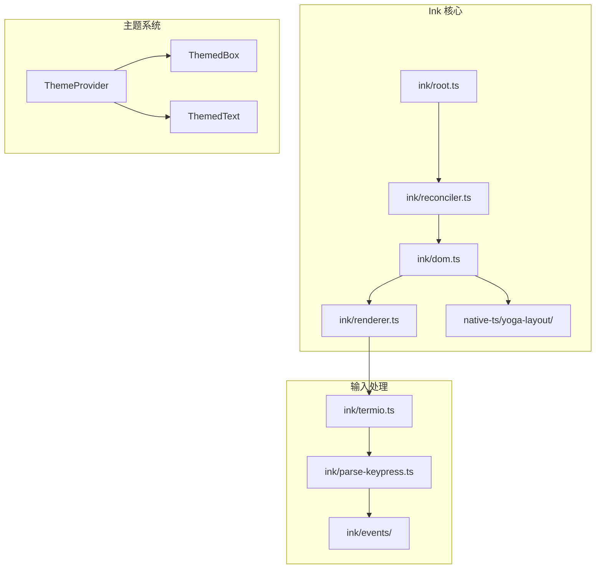
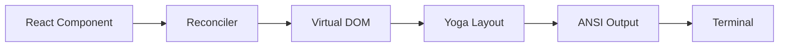
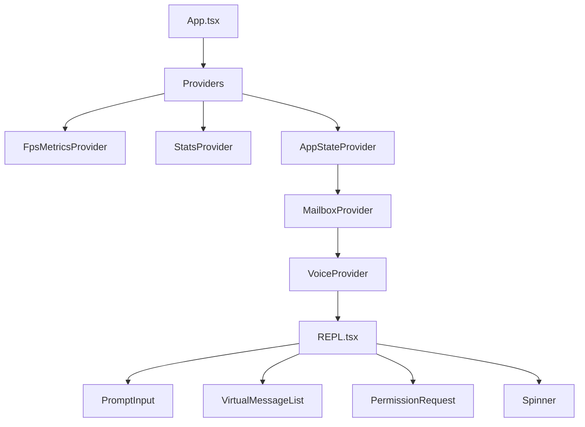
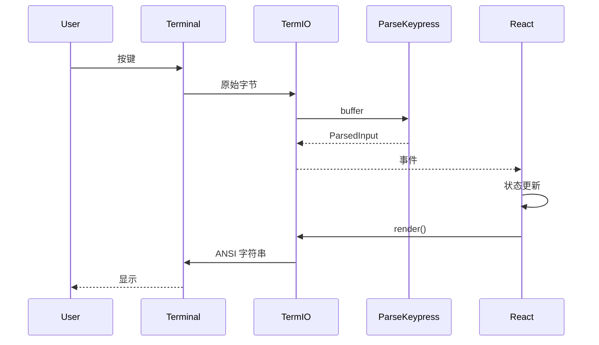

# 第02章：终端 UI 框架 (Ink)

> **本章目标**：理解 Claude Code 如何使用 Ink（React for CLI）在终端中渲染界面，包括 Yoga 布局、自定义 reconciler、事件系统和组件架构。

---

## 1. 学习目标

- [ ] 理解 Ink 的渲染管线（React → Reconciler → Yoga → ANSI）
- [ ] 掌握 Claude Code 的主题系统（ThemeProvider）
- [ ] 理解键盘事件解析（parse-keypress.ts 状态机）
- [ ] 识别 React Compiler 产物（`_c(N)`、`$[0]`）
- [ ] 能够调试 Ink 渲染问题

---

## 2. 背景问题

### 2.1 为什么需要 Ink？

终端是纯文本环境，需要解决：

1. **布局问题**：如何在纯文本中实现复杂布局（Flexbox）
2. **渲染问题**：如何将组件树转为 ANSI 字符串
3. **交互问题**：如何处理键盘、鼠标事件
4. **样式问题**：如何实现主题和颜色系统

### 2.2 为什么自定义 Reconciler？

React 的 Reconciler 是为浏览器 DOM 设计的。终端环境需要：

- 自定义节点类型（Box、Text、Root）
- 自定义布局引擎（Yoga）
- 自定义渲染输出（ANSI 字符串）

### 2.3 为什么用原生 Yoga？

Ink 默认使用 JavaScript 实现的布局引擎。Claude Code 改用原生 Yoga（C++），因为：

- 性能更好（Yoga 是 React Native 同款）
- 布局计算更准确

---

## 3. 源码入口

| 项目 | 内容 |
|------|------|
| Ink 入口 | `src/ink.tsx` → `src/ink/root.ts` |
| Reconciler | `src/ink/reconciler.ts` |
| 虚拟 DOM | `src/ink/dom.ts` |
| 渲染器 | `src/ink/renderer.ts` |
| 终端 I/O | `src/ink/termio/` |
| 键盘解析 | `src/ink/parse-keypress.ts` |
| 主题系统 | `src/components/design-system/` |

---

## 4. 架构定位

### 4.1 模块职责

```
渲染管线（从组件到终端）：

React 组件 (<Box>, <Text>)
  │
  ▼
React Reconciler (reconciler.ts)
  │ createInstance / appendChild / commitUpdate
  ▼
虚拟 DOM 树 (dom.ts)
  │ DOMElement / TextNode
  ▼
Yoga 布局引擎 (native-ts/yoga-layout/)
  │ calculateLayout() → 位置和尺寸
  ▼
渲染器 (renderer.ts → render-node-to-output.ts)
  │ 遍历布局树 → ANSI 字符串
  ▼
终端输出 (termio.ts)
  │ 写入 stdout
```

### 4.2 核心组件关系



### 4.3 生命周期

```
 InkRoot 创建
   │
   ▼
 enableRawMode()  ← 终端设为原始模式
   │
   ▼
 createRoot()     ← 创建 Reconciler 和容器
   │
   ▼
 render(node)     ← 首次渲染
   │
   ├── 创建虚拟 DOM 树
   ├── Yoga 计算布局
   └── 渲染到终端
   │
   ▼
 事件循环
   │
   ├── 键盘/鼠标事件 → parse-keypress.ts
   └── 状态变化 → 重新渲染
   │
   ▼
 unmount()        ← 退出时
   │
   ▼
 disableRawMode() ← 恢复终端
```

---

## 5. 核心源码分析

### 5.1 createRoot() 实现

```typescript
// src/ink/root.ts:67-71
export type Root = {
  render: (node: ReactNode) => void
  unmount: () => void
  waitUntilExit: () => Promise<void>
}

// 关键：render 自动包裹 ThemeProvider
const root = await inkCreateRoot(options)
return {
  ...root,
  render: node => root.render(withTheme(node)),
}
```

**设计原因**：所有 Claude Code 的 UI 组件都自动使用主题，不需要手动包裹 ThemeProvider。

### 5.2 Reconciler 配置

```typescript
// src/ink/reconciler.ts - 核心接口映射
const reconcilerConfig = {
  createInstance(type, props) {
    return createNode(type, props)  // 创建 DOMElement
  },

  createTextInstance(text) {
    return createTextNode(text)     // 创建 TextNode
  },

  appendChild(parent, child) {
    appendChildNode(parent, child)
  },

  insertBefore(parent, child, before) {
    insertBeforeNode(parent, child, before)
  },

  removeChild(parent, child) {
    removeChildNode(parent, child)
  },

  commitUpdate(node, oldProps, newProps) {
    if (node.nodeName === '#text') {
      updateTextContent(node, newProps)
    } else {
      updateNodeAttributes(node, oldProps, newProps)
    }
  },
}
```

### 5.3 虚拟 DOM 节点

```typescript
// src/ink/dom.ts - DOMElement 结构
interface DOMElement {
  nodeName: ElementNames      // 'box' | 'text' | 'root'
  attributes: DOMNodeAttribute
  style: Styles               // Yoga 样式
  yogaNode: Yoga.YogaNode     // 布局节点
  childNodes: (DOMElement | TextNode)[]
}

interface TextNode {
  nodeName: '#text'
  textContent: string
  yogaNode: Yoga.YogaNode
  style: TextStyles
}
```

### 5.4 键盘解析状态机

```typescript
// src/ink/parse-keypress.ts
// 核心函数签名
parseMultipleKeypresses(
  prevState: ParserState,
  rawInput: Buffer
): [ParsedInput[], ParserState]

// 三种输出类型
type ParsedInput =
  | { type: 'key'; key: ParsedKey }
  | { type: 'mouse'; mouse: ParsedMouse }
  | { type: 'response'; response: ParsedResponse }
```

**三大键盘协议**：
1. XTerm 传统序列：`ESC [ A` → `up`
2. Kitty 键盘协议：`ESC[13;2u` = Shift+Enter
3. modifyOtherKeys：`ESC[27;2;13~`

### 5.5 设计原因

| 设计 | 原因 |
|------|------|
| ThemeProvider 自动包裹 | 统一主题，避免遗漏 |
| 原生 Yoga | 性能更好，布局更准确 |
| 状态机解析键盘 | 支持多种终端协议 |
| fire-and-forget 渲染 | 不阻塞事件循环 |

---

## 6. 可视化结构

### 6.1 渲染管线图



### 6.2 组件树结构



### 6.3 终端 I/O 流程



---

## 7. 工程经验

### 7.1 为什么这么设计？

**Q: 为什么用 ANSI 转义序列而不是 ncurses？**
A: ANSI 序列更简单，兼容性更好（现代终端都支持）。ncurses 学习曲线陡峭。

**Q: 为什么需要状态机解析键盘？**
A: 终端发送的是字节流，需要状态机处理 ESC 序列和多字节字符。

**Q: 为什么渲染器要遍历 Yoga 布局结果？**
A: Yoga 只计算位置和尺寸，不处理文本内容和样式。

### 7.2 替代方案

| 方案 | 优点 | 缺点 |
|------|------|------|
| ANSI 转义序列 | 简单、兼容性好 | 功能有限 |
| ncurses | 功能强大 | 学习曲线陡峭 |
| blessed | 跨平台、API 现代 | 包体积大 |
| 原生 Yoga | 性能好 | 需要 native 模块 |
| JS Yoga | 无 native 依赖 | 性能稍差 |

### 7.3 常见坑与避坑指南

| 坑点 | 触发条件 | 解决方案 |
|------|---------|---------|
| 布局错乱 | CJK 字符宽度 | 使用 `stringWidth.ts` 计算 |
| 渲染闪烁 | 多次 render | 批量更新 |
| 焦点丢失 | 组件切换 | 检查 FocusContext |
| 终端不兼容 | 旧终端 | 降级到简单模式 |

---

## 8. Contributor 指南

### 8.1 适合新手的文件

| 文件 | 任务类型 | 难度 |
|------|---------|------|
| `src/ink/styles.ts` | 样式属性扩展 | L2 |
| `src/components/design-system/` | 主题变量 | L1 |
| `src/ink/termio/` | 终端能力查询 | L2 |

### 8.2 危险逻辑（修改需谨慎）

| 区域 | 风险 | 原因 |
|------|------|------|
| `ink/reconciler.ts` | 🔴 高 | 修改可能破坏整个渲染 |
| `ink/parse-keypress.ts` | 🔴 高 | 键盘解析状态机复杂 |
| `native-ts/yoga-layout/` | 🔴 高 | Native 模块 |
| `ink/renderer.ts` | 🟡 中 | 影响输出格式 |

### 8.3 调试方法

```bash
# 1. 启用 Ink 调试
INK_DEBUG=1 ./claude

# 2. 查看渲染输出
# 在 render-node-to-output.ts 加日志

# 3. 测试键盘解析
# 使用 parse-keypress.ts 的单元测试

# 4. 终端能力查询
./claude --debug 2>&1 | grep -i terminal
```

### 8.4 相关 Issue/PR

- CJK 字符宽度计算：Issue #XXX
- 终端兼容性：Issue #XXX

---

## 练习

### 练习 1：追踪渲染管线

**问题**：从 `<Box>hello</Box>` 到终端显示，追踪完整调用链。

**答案**：
```
<Box>hello</Box>
  → React.createElement('box', {}, 'hello')
  → Reconciler.createInstance('box', {children: 'hello'})
  → DOM.createNode('box', {children: 'hello'})
  → Yoga.calculateLayout()
  → Renderer.renderNodeToOutput()
  → ANSI 字符串
  → TermIO.write()
```

### 练习 2：添加新样式属性

**问题**：如何在 Box 上添加 `borderRadius` 样式？

**答案**：
```typescript
// src/ink/styles.ts
const BoxStyles = {
  // 添加 borderRadius
  borderRadius: number,
  // ...
}

// src/ink/render-node-to-output.ts
// 渲染时处理 borderRadius
```

### 练习 3：理解 React Compiler 产物

**问题**：看到 `$[0] !== children || $[1] !== initialState` 是什么意思？

**答案**：
- `_c(9)` 创建缓存槽
- `$[0]`、`$[1]` 存储上次渲染的 props
- 条件判断 props 是否变化，决定是否重建组件

---

## 练习答案速查

| 练习 | 核心答案 |
|------|---------|
| 1 | Box → Reconciler → DOM → Yoga → Renderer → TermIO |
| 2 | 在 styles.ts 添加属性，在 renderer.ts 处理 |
| 3 | React Compiler 自动生成的缓存检查 |

---

## 本章 vs Java Swing

| 方面 | Ink (React for CLI) | Java Swing |
|------|--------------------|-----------|
| 布局引擎 | Yoga (Flexbox) | LayoutManager |
| 渲染目标 | ANSI 终端 | Graphics2D |
| 组件模型 | React Component | JComponent |
| 状态管理 | React Hooks | PropertyChangeListener |
| 样式 | CSS-like | UIDefaults |
| 事件 | onKeyPress / onMouse | KeyListener / MouseListener |
| Reconciler | 自定义 react-reconciler | SwingUtilities.invokeLater |

---

## 下一篇

👉 [第03章-工具系统.md](./第03章-工具系统.md) — 工具系统的完整实现
