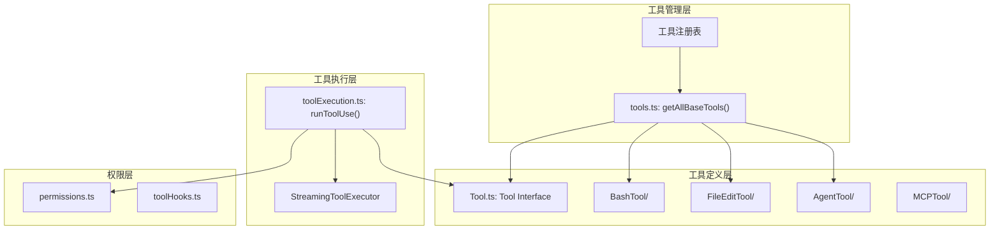
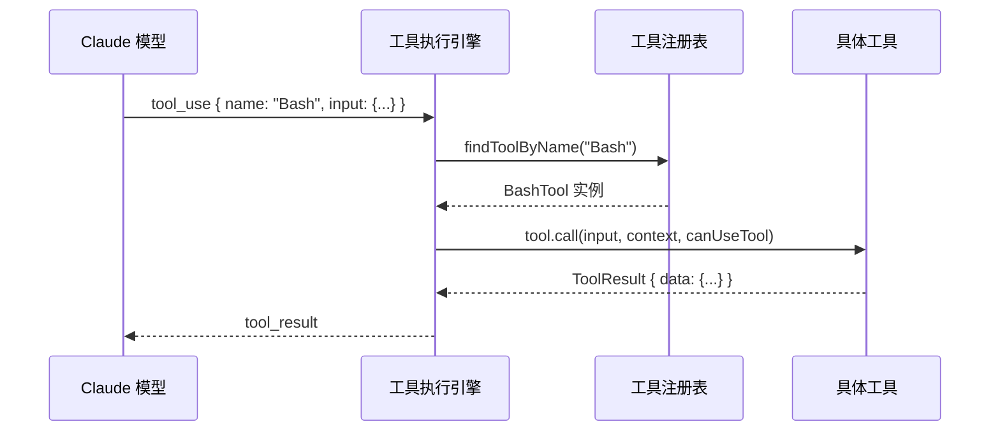

# 第03章：工具系统

> **本章目标**：理解 Claude Code 工具系统的完整架构——从 Tool 接口定义、30+ 工具的注册机制、工具 prompt 设计，到具体工具的实现。能够追踪工具从注册到调用的完整流程。

---

## 1. 学习目标

- [ ] 理解 Tool 接口的核心字段及其作用
- [ ] 掌握工具注册表 getAllBaseTools() 的结构
- [ ] 能够追踪工具从 prompt 注册到 call() 调用的完整流程
- [ ] 理解 assembleToolPool() 如何合并内置工具和 MCP 工具
- [ ] 了解 BashTool、FileEditTool、AgentTool 的核心实现差异

---

## 2. 背景问题

### 2.1 为什么需要统一的工具接口？

Claude Code 的核心价值在于让 Claude 模型能够执行操作（文件编辑、Bash 命令、API 调用等）。每种操作都有不同的输入输出：
- BashTool: `{ command: string }` → `{ stdout: string, stderr: string }`
- FileEditTool: `{ file_path, old_string, new_string }` → `{ success: boolean }`
- AgentTool: `{ goal: string, agentType: string }` → `{ result: string }`

如果没有统一接口，工具执行引擎需要为每种工具编写专门的处理逻辑，导致：
- 代码重复：权限检查、输入校验、结果格式化需要重复实现
- 难以扩展：添加新工具需要修改核心执行逻辑
- 无法静态分析：工具列表、schema、权限规则无法统一管理

### 2.2 工具系统解决了什么问题？

1. **统一抽象**：Tool 接口定义了所有工具的标准形状
2. **声明式配置**：inputSchema 使用 Zod 进行类型安全的输入校验
3. **权限隔离**：checkPermissions() 方法将权限判断委托给工具自身
4. **可发现性**：prompt() 方法让模型知道何时如何使用工具

### 2.3 为什么用 Zod 做输入校验而不是 TypeScript 类型？

Zod 是运行时校验器，TypeScript 类型仅在编译时有效。Claude Code 的输入来自：
1. 模型生成的 JSON（可能类型错误）
2. 用户通过 CLI 传入的参数
3. MCP 服务器返回的数据

这些数据在运行时需要被验证，Zod 提供了声明式 schema 和友好的错误消息。

---

## 3. 源码入口

| 项目 | 内容 |
|------|------|
| 文件路径 | `src/Tool.ts` |
| 核心类型 | `Tool<Input, Output, P>` |
| 工具注册表 | `src/tools.ts:193` — `getAllBaseTools()` |
| 工具池组装 | `src/tools.ts:345` — `assembleToolPool()` |
| 工具执行入口 | `src/services/tools/toolExecution.ts:337` — `runToolUse()` |
| 调用链 | 模型 → tool_use → runToolUse() → findToolByName() → tool.call() |

---

## 4. 架构定位

### 4.1 模块职责

工具系统是 Claude Code 的**操作抽象层**，负责：
1. 定义所有工具的统一接口
2. 管理内置工具的注册和条件加载
3. 组装内置工具与 MCP 工具的合并池
4. 提供工具的 prompt 描述供模型理解

### 4.2 生命周期

```text
工具注册（模块加载时）
    ↓
getAllBaseTools() — 收集所有工具
    ↓
filterToolsByDenyRules() — 根据权限规则过滤
    ↓
assembleToolPool() — 合并内置+MCP工具
    ↓
getToolPermissionContext() — 构建权限上下文
    ↓
模型收到工具列表
    ↓
模型发出 tool_use
    ↓
runToolUse() → tool.call()
```

### 4.3 模块关系



---

## 5. 核心源码分析

### 5.1 Tool 接口定义 (Tool.ts:362-695)

```typescript
// src/Tool.ts:362
export type Tool<
  Input extends AnyObject = AnyObject,
  Output = unknown,
  P extends ToolProgressData = ToolProgressData,
> = {
  // === 身份标识 ===
  readonly name: string              // 工具唯一名称，如 "Bash"
  aliases?: string[]               // 别名列表（向后兼容）
  searchHint?: string              // ToolSearch 关键词提示

  // === 模型接口 ===
  call(
    args: z.infer<Input>,
    context: ToolUseContext,
    canUseTool: CanUseToolFn,
    parentMessage: AssistantMessage,
    onProgress?: ToolCallProgress<P>,
  ): Promise<ToolResult<Output>>

  description(
    input: z.infer<Input>,
    options: {...}
  ): Promise<string>

  readonly inputSchema: Input      // Zod 输入 schema（必需）
  outputSchema?: z.ZodType<unknown>

  // === 安全与权限 ===
  isConcurrencySafe(input: z.infer<Input>): boolean
  isReadOnly(input: z.infer<Input>): boolean
  isDestructive?(input: z.infer<Input>): boolean
  checkPermissions(
    input: z.infer<Input>,
    context: ToolUseContext,
  ): Promise<PermissionResult>

  // === 生命周期控制 ===
  isEnabled(): boolean
  requiresUserInteraction?(): boolean

  // === UI 渲染 ===
  userFacingName(input: Partial<z.infer<Input>>): string
  maxResultSizeChars: number
  renderToolResultMessage?(...): React.ReactNode
  renderToolUseMessage(...): React.ReactNode
}
```

**设计原因**：Tool 接口采用泛型 `Input/Output/P`，让每种工具声明自己的类型，TypeScript 编译器能进行静态检查。

### 5.2 工具注册表 (tools.ts:193-251)

```typescript
// src/tools.ts:193
export function getAllBaseTools(): Tools {
  return [
    AgentTool,
    TaskOutputTool,
    BashTool,
    // 嵌入式搜索工具存在时，排除 Glob/Grep
    ...(hasEmbeddedSearchTools() ? [] : [GlobTool, GrepTool]),
    ExitPlanModeV2Tool,
    FileReadTool,
    FileEditTool,
    FileWriteTool,
    NotebookEditTool,
    WebFetchTool,
    TodoWriteTool,
    WebSearchTool,
    TaskStopTool,
    AskUserQuestionTool,
    SkillTool,
    EnterPlanModeTool,
    // ANT 构建专属工具
    ...(process.env.USER_TYPE === 'ant' ? [ConfigTool] : []),
    ...(process.env.USER_TYPE === 'ant' ? [TungstenTool] : []),
    // 条件加载的工具（使用 feature flag）
    ...(WebBrowserTool ? [WebBrowserTool] : []),
    ...(isTodoV2Enabled() ? [TaskCreateTool, TaskGetTool, TaskUpdateTool, TaskListTool] : []),
    ...(isWorktreeModeEnabled() ? [EnterWorktreeTool, ExitWorktreeTool] : []),
    ...(isAgentSwarmsEnabled() ? [getTeamCreateTool(), getTeamDeleteTool()] : []),
    // ... 更多条件加载工具
  ]
}
```

**条件加载机制**：使用 `feature('FLAG_NAME')` 或环境变量控制工具是否加载，这是**死码消除（Dead Code Elimination）**的构建时优化。

### 5.3 工具池组装 (tools.ts:345-367)

```typescript
// src/tools.ts:345
export function assembleToolPool(
  permissionContext: ToolPermissionContext,
  mcpTools: Tools,
): Tools {
  // 1. 获取内置工具（已过滤 deny 规则）
  const builtInTools = getTools(permissionContext)

  // 2. 过滤 MCP 工具中的 deny 规则
  const allowedMcpTools = filterToolsByDenyRules(mcpTools, permissionContext)

  // 3. 合并、去重、按名称排序
  // 内置工具作为连续前缀（MCP 工具在后）
  const byName = (a: Tool, b: Tool) => a.name.localeCompare(b.name)
  return uniqBy(
    [...builtInTools].sort(byName).concat(allowedMcpTools.sort(byName)),
    'name',
  )
}
```

**设计原因**：内置工具作为连续前缀是因为 Anthropic API 的**提示缓存策略**——缓存以最后一位内置工具为分界线。MCP 工具排在后面可以避免破坏缓存。

### 5.4 工具查找 (Tool.ts:358-360)

```typescript
// src/Tool.ts:358
export function findToolByName(tools: Tools, name: string): Tool | undefined {
  return tools.find(t => tool.name === name || (t.aliases?.includes(name) ?? false))
}
```

**别名机制**：允许工具通过别名查找，例如 `KillShell` 可能是 `TaskStop` 的别名。

---

## 6. 可视化结构

### 6.1 工具注册与查找流程



### 6.2 工具分类

| 类别 | 工具 | 特点 |
|------|------|------|
| 文件操作 | FileRead, FileEdit, FileWrite, NotebookEdit | 路径验证、权限检查 |
| Shell 执行 | Bash, PowerShell | 沙箱、超时、安全检查 |
| 网络 | WebFetch, WebSearch | URL 验证、内容限制 |
| Agent 协作 | Agent, SendMessage, TeamCreate/Delete | 多 Agent 协调 |
| 任务管理 | TaskCreate/Get/Update/List/Stop/Output | 后台任务跟踪 |
| MCP | MCPTool, ListMcpResources, ReadMcpResource | 外部服务集成 |
| 计划模式 | EnterPlanMode, ExitPlanMode | 模式切换 |
| 系统 | Config, Skill, TodoWrite, Brief | 配置/技能 |

### 6.3 BashTool 内部结构

```text
BashTool/
├── BashTool.tsx        # 主体（~800行）
├── prompt.ts           # 模型描述
├── toolName.ts         # 工具名常量 "Bash"
├── bashPermissions.ts  # 权限匹配逻辑
├── bashSecurity.ts     # 安全检查
├── shouldUseSandbox.ts # 沙箱决策
├── pathValidation.ts   # 路径验证
├── destructiveCommandWarning.ts  # 危险命令警告
└── UI.tsx              # UI 渲染
```

---

## 7. 工程经验

### 7.1 为什么 tool.call() 接收 canUseTool 参数而不是自己调用？

```typescript
call(
  args: z.infer<Input>,
  context: ToolUseContext,
  canUseTool: CanUseToolFn,  // ← 传入而不是内部调用
  parentMessage: AssistantMessage,
  onProgress?: ToolCallProgress<P>,
): Promise<ToolResult<Output>>
```

**设计原因**：权限检查是**跨工具的统一行为**，应该在执行引擎层面处理。工具只负责执行具体操作，不关心权限决策。

**替代方案**：如果让工具自己调用 canUseTool()，会导致：
- 每种工具都要重复实现权限逻辑
- 无法统一处理 Hook、分类器、规则匹配
- 并发执行时的权限检查变得复杂

### 7.2 为什么 inputSchema 用 Zod 而不是 TypeScript 类型？

TypeScript 类型在编译后被擦除，Zod 是运行时校验器：

```typescript
// TypeScript 类型（仅编译时）
function call(args: { command: string }) { ... }

// Zod schema（运行时有效）
const schema = z.object({ command: z.string() })
function call(args: z.infer<typeof schema>) { ... }
```

模型生成的 JSON 可能类型错误，Zod 提供：
- 运行时校验
- 友好的错误消息
- 默认值处理（`z.string().default("")`）

### 7.3 常见坑

| 坑点 | 原因 | 解决方案 |
|------|------|----------|
| 工具找不到 | 使用别名而非原名 | 用 `findToolByName()` 而不是直接比较 `tool.name` |
| 条件工具未加载 | feature flag 未启用 | 检查 `feature('FLAG')` 返回值 |
| MCP 工具不生效 | 未通过 `assembleToolPool()` 合并 | 确保工具池组装时传入 mcpTools |
| inputSchema 校验失败 | 模型生成的类型错误 | 使用 `formatZodValidationError()` 提供友好错误 |

---

## 8. Contributor 指南

### 8.1 适合新手的文件

| 文件 | 难度 | 原因 |
|------|------|------|
| `tools/BashTool/prompt.ts` | L1 | 修改工具描述最简单 |
| `tools/*/prompt.ts` | L1 | 任何工具的 prompt 修改 |
| `Tool.ts` 中的注释 | L1 | 改善文档 |
| `tools.ts` 工具列表 | L2 | 添加新工具需要理解注册机制 |

### 8.2 危险逻辑（修改需谨慎）

| 文件 | 风险等级 | 原因 |
|------|----------|------|
| `toolExecution.ts` — `runToolUse()` | 🔴 高 | 权限检查的入口，绕过会导致安全问题 |
| `Tool.ts` — `inputSchema` 定义 | 🔴 高 | 影响所有工具的类型校验 |
| `tools.ts` — 条件加载逻辑 | 🟡 中 | 可能导致死码消除失效 |

### 8.3 调试方法

1. **追踪工具查找**：
   ```typescript
   // 在 findToolByName() 添加日志
   const tool = tools.find(t => {
     console.log(`Checking tool: ${t.name}, aliases: ${t.aliases}`)
     return toolMatchesName(t, name)
   })
   ```

2. **检查工具注册**：
   ```typescript
   // 在 getAllBaseTools() 返回前打印
   console.log('Registered tools:', getAllBaseTools().map(t => t.name))
   ```

3. **验证工具池组装**：
   ```typescript
   // 在 assembleToolPool() 打印
   console.log('Built-in:', builtInTools.map(t => t.name))
   console.log('MCP:', allowedMcpTools.map(t => t.name))
   ```

### 8.4 添加新工具的步骤

1. 在 `src/tools/` 创建工具目录
2. 定义 `prompt.ts` — 工具描述
3. 定义工具类，实现 `Tool` 接口
4. 在 `tools.ts` 的 `getAllBaseTools()` 中注册
5. 如需条件加载，用 `feature('FLAG')` 包装
6. 在 `tools.ts` 的 `getTools()` 中添加过滤逻辑（如需要）

---

## 练习

### 练习 1：追踪 BashTool 调用链

目标：理解从模型发出 `Bash(command: "ls -la")` 到返回结果的完整路径。

步骤：
1. 从 `runToolUse()` (toolExecution.ts:337) 开始
2. 追踪到 `findToolByName()` (Tool.ts:358)
3. 查看 `tool.call()` 的调用 (toolExecution.ts: 某处)
4. 理解 `canUseTool` 参数的作用

### 练习 2：分析条件加载

场景：启用 `WORKTREE_MODE` feature flag

步骤：
1. 找到 `isWorktreeModeEnabled()` 的定义
2. 追踪它如何影响 `getAllBaseTools()` 的返回值
3. 验证 worktree 工具是否被正确加载

### 练习 3：工具池合并

目标：理解内置工具和 MCP 工具如何合并。

步骤：
1. 阅读 `assembleToolPool()` 实现
2. 理解为什么内置工具要排在 MCP 工具前面
3. 思考：如果混排会有什么影响？

---

## 练习答案速查

| 练习 | 核心答案 |
|------|---------|
| 练习 1 | 调用链：`runToolUse()` → `findToolByName()` → `tool.call()` → `BashTool.call()` |
| 练习 2 | `isWorktreeModeEnabled()` 在 `tools.ts:193` 中检查，返回后用 `feature('WORKTREE_MODE')` 包装工具注册 |
| 练习 3 | 内置工具排在前面确保优先级；MCP 工具覆盖同名内置工具时会被过滤掉 |

---

## 本章 vs Java Spring

| 方面 | Claude Code | Java Spring |
|------|-------------|-------------|
| 接口定义 | `Tool<Input, Output, P>` | `HandlerAdapter` |
| 输入校验 | Zod schema | `@Valid` + Validator |
| 调用方式 | `tool.call(args, ctx, canUseTool)` | `adapter.handle(req, resp)` |
| 结果类型 | `ToolResult<T>` | `ModelAndView` |
| 工具注册 | `getAllBaseTools()` | `@Bean` + `HandlerAdapterRegistry` |
| 条件加载 | `feature('FLAG')` | `@ConditionalOnProperty` |

---

## 下一篇

👉 [第04章-工具执行与安全.md](./第04章-工具执行与安全.md)
