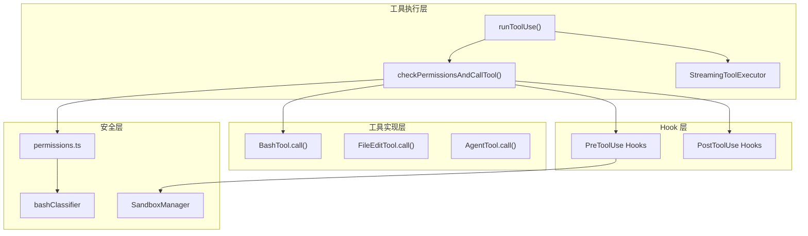
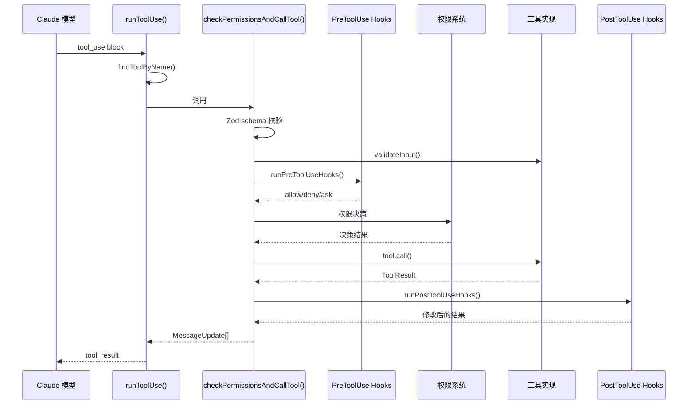
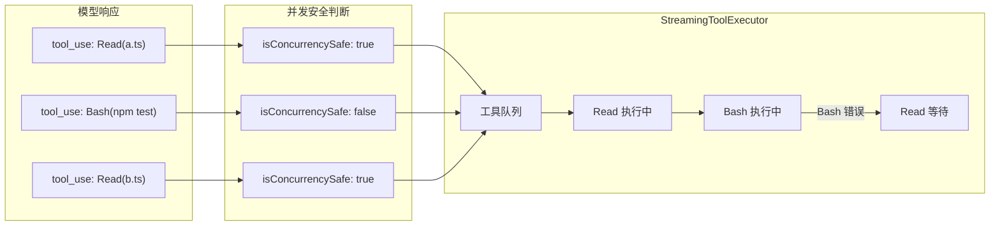

# 第04章：工具执行与安全

> **本章目标**：深入理解 Claude Code 的工具执行管线，包括从模型发出 tool_use 到最终返回 tool_result 的完整流程。掌握权限检查、沙箱隔离、Hook 钩子、并发控制等安全机制的设计原理和实现细节。

---

## 1. 学习目标

- [ ] 理解 runToolUse() 到 checkPermissionsAndCallTool() 的完整调用链
- [ ] 掌握输入校验的双重防护（Zod schema + validateInput）
- [ ] 理解 StreamingToolExecutor 的并发控制机制
- [ ] 了解 Hook 系统的 PreToolUse/PostToolUse 执行流程
- [ ] 理解 Bash 分类器的"投机性预启动"设计

---

## 2. 背景问题

### 2.1 为什么需要工具执行引擎？

当 Claude 模型决定执行操作时，它返回一个 `tool_use` 块：

```json
{
  "type": "tool_use",
  "name": "Bash",
  "input": { "command": "ls -la" },
  "id": "tool_123"
}
```

工具执行引擎负责：
1. 根据名称查找对应工具实现
2. 校验输入参数
3. 检查执行权限
4. 调用工具获取结果
5. 将结果格式化为 `tool_result` 返回

### 2.2 为什么需要流式并发执行？

模型可能在一个响应中发出多个工具调用：

```text
[tool_use: Read(file_path="a.ts")]
[tool_use: Bash(command="npm test")]
[tool_use: Read(file_path="b.ts")]
```

这些工具：
- 有些可以并行执行（Read + Read）
- 有些必须独占执行（Bash 可能修改文件）
- 结果必须按原顺序返回给模型

### 2.3 为什么 Bash 分类器要"投机性"启动？

分类器是 AI 模型判断命令安全性的机制。如果等权限检查时再启动：
- 用户看到对话框后要等分类结果
- 延迟体验差

"投机性预启动"让分类器在权限检查**之前**就开始运行，隐藏计算时间。

---

## 3. 源码入口

| 项目 | 内容 |
|------|------|
| 文件路径 | `src/services/tools/toolExecution.ts` |
| 主入口函数 | `runToolUse()` @ line 337 |
| 核心执行函数 | `checkPermissionsAndCallTool()` @ line 599 |
| 并发执行器 | `StreamingToolExecutor` @ `StreamingToolExecutor.ts:40` |
| Hook 系统 | `toolHooks.ts:39` — `runPostToolUseHooks()` |
| 调用链 | tool_use → runToolUse() → checkPermissionsAndCallTool() → tool.call() |

---

## 4. 架构定位

### 4.1 模块职责

工具执行引擎是**请求处理管道**，负责：
1. 接收模型 tool_use 块
2. 查找并验证工具
3. 执行权限和安全检查
4. 调用工具并处理结果
5. 执行 Hook 钩子
6. 返回结构化结果

### 4.2 执行管线流程

```text
tool_use block
    ↓
输入校验 (Zod schema)
    ↓
工具自定义校验 (tool.validateInput)
    ↓
Bash 分类器预启动 (speculative)
    ↓
Backfill 输入字段
    ↓
PreToolUse Hooks
    ↓
权限决策解析 (resolveHookPermissionDecision)
    ↓
权限通过 → tool.call()
    ↓
PostToolUse Hooks
    ↓
返回 tool_result
```

### 4.3 模块关系



---

## 5. 核心源码分析

### 5.1 runToolUse() 主入口 (toolExecution.ts:337-411)

```typescript
// src/services/tools/toolExecution.ts:337
export async function* runToolUse(
  toolUse: ToolUseBlock,
  assistantMessage: AssistantMessage,
  canUseTool: CanUseToolFn,
  toolUseContext: ToolUseContext,
): AsyncGenerator<MessageUpdateLazy, void> {
  const toolName = toolUse.name

  // 1. 查找工具
  let tool = findToolByName(toolUseContext.options.tools, toolName)

  // 2. 别名兼容（查找废弃名称）
  if (!tool) {
    const fallbackTool = findToolByName(getAllBaseTools(), toolName)
    if (fallbackTool?.aliases?.includes(toolName)) {
      tool = fallbackTool
    }
  }

  // 3. 工具不存在
  if (!tool) {
    yield {
      message: createUserMessage({
        content: [{
          type: 'tool_result',
          content: `<tool_use_error>No such tool available: ${toolName}</tool_use_error>`,
          is_error: true,
          tool_use_id: toolUse.id,
        }],
        toolUseResult: `Error: No such tool available: ${toolName}`,
        sourceToolAssistantUUID: assistantMessage.uuid,
      }),
    }
    return
  }

  // 4. Abort 检查
  if (toolUseContext.abortController.signal.aborted) {
    yield { message: createToolResultStopMessage(toolUse.id) }
    return
  }

  // 5. 权限检查 + 工具调用（流式）
  yield* streamedCheckPermissionsAndCallTool(...)
}
```

### 5.2 输入校验双重防护 (toolExecution.ts:614-733)

```typescript
// 第一层：Zod schema 校验（类型安全）
const parsedInput = tool.inputSchema.safeParse(input)
if (!parsedInput.success) {
  return [{
    message: createUserMessage({
      content: [{
        type: 'tool_result',
        content: `<tool_use_error>InputValidationError: ${errorContent}</tool_use_error>`,
        is_error: true,
        tool_use_id: toolUseID,
      }],
      toolUseResult: `InputValidationError: ${parsedInput.error.message}`,
    }),
  }]
}

// 第二层：工具自定义校验（语义安全）
const isValidCall = await tool.validateInput?.(parsedInput.data, toolUseContext)
if (isValidCall?.result === false) {
  return [{
    message: createUserMessage({
      content: [{
        type: 'tool_result',
        content: `<tool_use_error>${isValidCall.message}</tool_use_error>`,
        is_error: true,
      }],
    }),
  }]
}
```

**设计原因**：Zod 校验类型，validateInput 校验语义。例如：
- Zod：`command: z.string()` — 确保是字符串
- validateInput：`command` 不能包含 `rm -rf /` — 语义检查

### 5.3 投机性分类器启动 (toolExecution.ts:740-752)

```typescript
// 在权限检查之前就启动分类器
if (
  tool.name === BASH_TOOL_NAME &&
  parsedInput.data &&
  'command' in parsedInput.data
) {
  const appState = toolUseContext.getAppState()
  startSpeculativeClassifierCheck(
    (parsedInput.data as BashToolInput).command,
    appState.toolPermissionContext,
    toolUseContext.abortController.signal,
    toolUseContext.options.isNonInteractiveSession,
  )
}
```

**设计原因**：
1. **延迟隐藏**：分类是 I/O 密集型，提前启动可以隐藏计算时间
2. **auto 模式优化**：在 `auto` 模式下，分类结果直接影响权限决策
3. **异步缓存**：`speculativeChecks.get(command)` 在权限检查时消费

### 5.4 StreamingToolExecutor 并发控制 (StreamingToolExecutor.ts:40-200)

```typescript
// src/services/tools/StreamingToolExecutor.ts:40
export class StreamingToolExecutor {
  private tools: TrackedTool[] = []
  private hasErrored = false
  private siblingAbortController: AbortController

  // 判断工具能否执行
  private canExecuteTool(isConcurrencySafe: boolean): boolean {
    const executingTools = this.tools.filter(t => t.status === 'executing')
    return (
      executingTools.length === 0 ||
      (isConcurrencySafe && executingTools.every(t => t.isConcurrencySafe))
    )
  }
}
```

**并发安全规则**：
1. 非并发安全工具必须独占执行
2. 并发安全工具可以并行执行
3. 并发安全工具不能与非并发安全工具并行执行
4. Bash 工具错误会取消兄弟工具（共享文件系统）

### 5.5 Hook 系统 (toolHooks.ts:39-150)

```typescript
// src/services/tools/toolHooks.ts:39
export async function* runPostToolUseHooks<Input, Output>(
  toolUseContext: ToolUseContext,
  tool: Tool<Input, Output>,
  toolUseID: string,
  toolInput: Record<string, unknown>,
  toolResponse: Output,
  ...
): AsyncGenerator<PostToolUseHooksResult<Output>> {
  for await (const result of executePostToolHooks(...)) {
    // 处理 Hook 结果
    if (result.updatedMCPToolOutput && isMcpTool(tool)) {
      toolOutput = result.updatedMCPToolOutput as Output
      yield { updatedMCPToolOutput: toolOutput }
    }
    // ...
  }
}
```

**Hook 类型**：
- `PreToolUse`：工具执行前运行，可拒绝/修改输入
- `PostToolUse`：工具成功后运行，可修改输出
- `PostToolUseFailure`：工具失败后运行

---

## 6. 可视化结构

### 6.1 工具执行完整时序图



### 6.2 并发执行流程



---

## 7. 工程经验

### 7.1 为什么需要 Abort 检查？

```typescript
if (toolUseContext.abortController.signal.aborted) {
  yield { message: createToolResultStopMessage(toolUse.id) }
  return
}
```

**场景**：用户可能在工具执行过程中按 Ctrl+C，或者协调器发送新指令取消当前操作。

### 7.2 双重输入校验的设计

| 校验层 | 作用 | 失败后果 |
|--------|------|----------|
| Zod schema | 类型安全 | InputValidationError |
| validateInput | 语义安全 | 自定义错误消息 |

**设计原因**：类型错误应该给出清晰的"类型错误"消息，语义错误（如路径不存在）应该给出业务含义的错误。

### 7.3 常见坑与避坑指南

| 坑点 | 触发条件 | 解决方案 |
|------|----------|----------|
| 工具执行被意外取消 | AbortController 被触发 | 检查 `abortController.signal.aborted` |
| 权限检查被跳过 | 使用 `bypassPermissions` 模式 | 禁止在生产环境使用 |
| Hook 修改了输入但工具没收到 | `updatedInput` 未正确传递 | 检查 `resolveHookPermissionDecision()` |
| 分类器结果未生效 | 投机检查超时 | 检查 `speculativeChecks` Map |

---

## 8. Contributor 指南

### 8.1 适合新手的文件

| 文件 | 难度 | 原因 |
|------|------|------|
| `toolExecution.ts` — 错误消息 | L1 | 改进错误提示 |
| `toolHooks.ts` — Hook 结果处理 | L2 | 理解 Hook 流程 |
| `StreamingToolExecutor.ts` — 并发逻辑 | L3 | 复杂的状态管理 |

### 8.2 危险逻辑（修改需谨慎）

| 文件 | 风险等级 | 原因 |
|------|----------|------|
| `runToolUse()` — 工具查找 | 🔴 高 | 影响权限检查入口 |
| `checkPermissionsAndCallTool()` — 权限决策 | 🔴 高 | 绕过会导致安全问题 |
| `streamedCheckPermissionsAndCallTool()` — 流式处理 | 🔴 高 | 状态管理复杂 |

### 8.3 调试方法

1. **追踪工具执行**：
   ```typescript
   // 在 runToolUse() 添加日志
   console.log(`[ToolExecution] Starting tool: ${toolName}`)
   ```

2. **检查并发状态**：
   ```typescript
   // 在 StreamingToolExecutor 打印状态
   console.log('Executing tools:', executingTools.map(t => t.block.name))
   ```

3. **验证 Hook 执行**：
   ```typescript
   // 在 runPostToolUseHooks() 打印
   console.log('PostToolUse hook result:', result)
   ```

### 8.4 常见 Issue

- 工具执行超时：`toolExecution.ts` 中的超时处理
- Hook 执行顺序：多个 Hook 时的执行顺序问题
- 并发竞争条件：`StreamingToolExecutor` 的状态管理

---

## 练习

### 练习 1：追踪 Bash 工具调用

目标：理解从模型发出 `Bash(command: "ls -la")` 到返回结果的完整路径。

步骤：
1. 从 `runToolUse()` (toolExecution.ts:337) 开始
2. 追踪到 `checkPermissionsAndCallTool()` (toolExecution.ts:599)
3. 找到 Bash 分类器预启动的位置（约 L740）
4. 找到 `tool.call()` 的调用点

### 练习 2：分析并发执行场景

场景：模型同时发出三个 tool_use：
- `Read(file_path="a.ts")` — isConcurrencySafe = true
- `Bash(command="npm test")` — isConcurrencySafe = false
- `Read(file_path="b.ts")` — isConcurrencySafe = true

步骤：
1. 阅读 `addTool()` 方法
2. 阅读 `canExecuteTool()` 方法
3. 分析如果 `npm test` 失败会发生什么

### 练习 3：Hook 权限决策

目标：理解 Hook 和规则系统的交互。

问题：
1. 如果 Hook 返回 `allow`，但 settings.json 中有 deny 规则，最终结果是什么？
2. 如果 Hook 返回 `allow` 且提供了 `updatedInput`，会发生什么？

---

## 练习答案速查

| 练习 | 核心答案 |
|------|---------|
| 练习 1 | `runToolUse()` → `checkPermissionsAndCallTool()` → Bash 分类器预启动 → `tool.call()` |
| 练习 2 | `Read` 可并发执行，`Bash` 需等待。`addTool()` 根据 `isConcurrencySafe` 决定是否等待 |
| 练习 3 | Hook 的 `allow` 会覆盖规则的 `deny`；`updatedInput` 会替换原输入用于实际执行 |

---

## 本章 vs Java Spring

| 方面 | Claude Code | Java Spring |
|------|-------------|-------------|
| 请求入口 | `runToolUse()` | `DispatcherServlet` |
| 处理器映射 | `findToolByName()` | `HandlerMapping` |
| 参数校验 | Zod schema | `@Valid` + Validator |
| 权限检查 | `checkPermissions()` | `AccessDecisionManager` |
| 拦截器 | Hook 系统 | `HandlerInterceptor` |
| 异步执行 | `StreamingToolExecutor` | `@Async` + `TaskExecutor` |

---

## 下一篇

👉 [第05章-权限系统.md](./第05章-权限系统.md)
