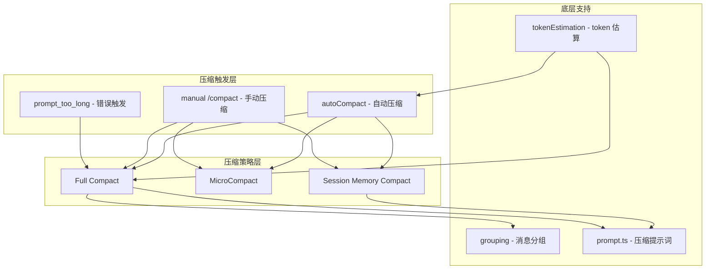
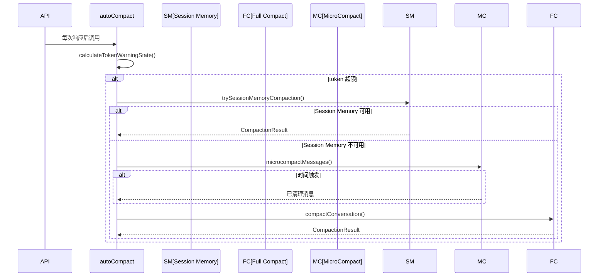
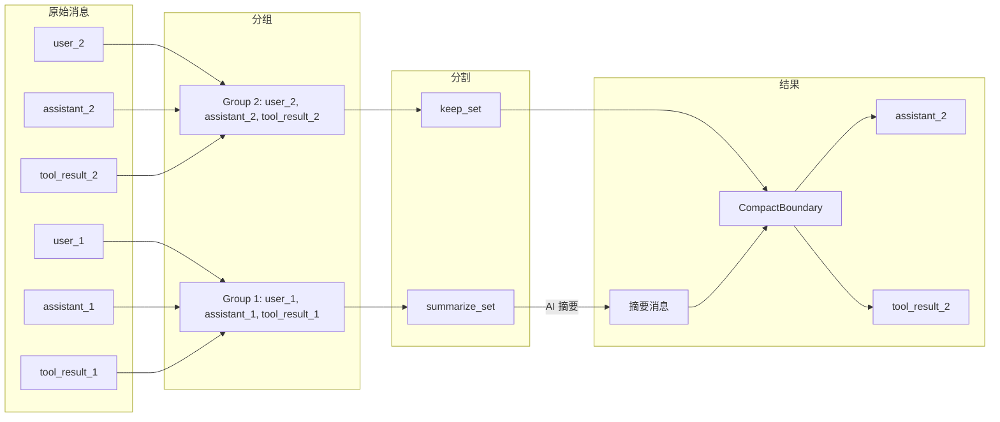

# 06 - 上下文管理与压缩

> **本章目标**：掌握 Claude Code 的上下文管理机制，包括 token 估算、自动压缩触发条件、三种压缩策略（Full Compact、MicroCompact、Session Memory Compact），理解当对话超出上下文窗口时系统如何优雅地压缩历史消息而不丢失关键信息。

---

## 1. 学习目标

- [ ] 理解上下文窗口的构成和有效窗口计算方式
- [ ] 能够追踪 token 估算的完整调用链（粗略估算 → 精确计数）
- [ ] 掌握三种压缩策略的适用场景和执行流程
- [ ] 理解压缩边界标记 `SystemCompactBoundaryMessage` 的作用
- [ ] 能够分析压缩后的资源重新注入机制
- [ ] 了解压缩相关的常见坑点及避坑指南

---

## 2. 背景问题

### 2.1 为什么这个模块存在？

Claude 模型有固定的上下文窗口大小（通常 200K token，1M token 模型可用）。当对话历史增长超过窗口限制时，API 会返回 `prompt_too_long` 错误。上下文压缩模块的存在是为了：

1. **避免错误发生**：在接近窗口限制时主动压缩，而非等到错误发生
2. **保留关键信息**：压缩不是简单截断，而是智能摘要关键内容
3. **维持对话连续性**：压缩后模型仍能理解对话上下文

### 2.2 它解决了什么问题？

- 对话历史无限增长导致的 token 溢出
- 压缩请求本身可能因包含大量图片而触发 `prompt_too_long`
- 压缩后关键资源（最近读取的文件、活跃计划等）的恢复
- 子代理（session_memory、compact）不应触发自动压缩的递归问题

### 2.3 如果没有它会怎样？

用户进行长对话时会频繁遇到 `prompt_too_long` 错误，无法进行超过上下文窗口限制的连续对话。

---

## 3. 源码入口

| 项目 | 内容 |
|------|------|
| 文件路径 | `src/services/compact/` |
| 核心函数 | `compactConversation()` (compact.ts) |
| 自动压缩入口 | `autoCompactIfNeeded()` (autoCompact.ts) |
| MicroCompact | `microcompactMessages()` (microCompact.ts) |
| Session Memory Compact | `trySessionMemoryCompaction()` (sessionMemoryCompact.ts) |
| 消息分组 | `groupMessagesByApiRound()` (grouping.ts) |
| Token 估算 | `tokenCountWithEstimation()` (tokenEstimation.ts) |
| 行号 | compact.ts:200-400, autoCompact.ts:100-200 |

---

## 4. 架构定位

### 4.1 模块职责

上下文压缩模块负责在对话历史接近上下文窗口限制时，智能地压缩消息历史，生成摘要，并重新注入关键资源。

### 4.2 生命周期

```
启动 → 监控 token 使用 → 触发压缩 → 选择策略 → 执行压缩 → 重新注入资源 → 继续对话
```

### 4.3 模块关系



---

## 5. 核心源码分析

### 5.1 自动压缩触发流程

**源码位置**：`src/services/compact/autoCompact.ts:100-200`

```typescript
// 自动压缩阈值计算
export function getAutoCompactThreshold(model: string): number {
  const effectiveContextWindow = getEffectiveContextWindowSize(model)
  return effectiveContextWindow - AUTOCOMPACT_BUFFER_TOKENS  // 13_000
}

// 有效上下文窗口 = 总窗口 - 输出预留
export function getEffectiveContextWindowSize(model: string): number {
  let contextWindow = getContextWindowForModel(model, getSdkBetas())
  const reservedTokensForSummary = Math.min(
    getMaxOutputTokensForModel(model),
    20_000
  )
  return contextWindow - reservedTokensForSummary
}
```

**关键常量**（autoCompact.ts:50-60）：
- `AUTOCOMPACT_BUFFER_TOKENS = 13_000` — 自动压缩触发缓冲区
- `WARNING_THRESHOLD_BUFFER_TOKENS = 20_000` — 警告阈值
- `ERROR_THRESHOLD_BUFFER_TOKENS = 20_000` — 错误阈值
- `MAX_CONSECUTIVE_AUTOCOMPACT_FAILURES = 3` — 熔断器阈值

### 5.2 消息分组机制

**源码位置**：`src/services/compact/grouping.ts:1-60`

消息按 API 轮次分组（不是按用户轮次），允许在单轮对话中进行细粒度压缩：

```typescript
export function groupMessagesByApiRound(messages: Message[]): Message[][] {
  const groups: Message[][] = []
  let current: Message[] = []
  let lastAssistantId: string | undefined

  for (const msg of messages) {
    // 当遇到新的 assistant 消息且 ID 不同时，分组
    if (
      msg.type === 'assistant' &&
      msg.message.id !== lastAssistantId &&
      current.length > 0
    ) {
      groups.push(current)
      current = [msg]
    } else {
      current.push(msg)
    }
    if (msg.type === 'assistant') {
      lastAssistantId = msg.message.id
    }
  }
  // ...
}
```

### 5.3 Full Compact 执行流程

**源码位置**：`src/services/compact/compact.ts:200-400`

```typescript
// 压缩主函数调用链
compactConversation(messages, toolUseContext, options)
  │
  ├─ stripImagesFromMessages()       // 移除图片块节省 token
  ├─ stripReinjectedAttachments()    // 移除会被重新注入的附件
  │
  ├─ groupMessagesByApiRound()       // 按 API 轮次分组
  ├─ 选择压缩策略
  │   ├─ 尝试 Session Memory Compact（优先）
  │   └─ 回退到 Full Compact
  │
  ├─ Full Compact 流程：
  │   ├─ 构建压缩 prompt (getCompactPrompt)
  │   ├─ 调用 forkedAgent 生成摘要
  │   └─ 生成摘要消息
  │
  ├─ createCompactBoundaryMessage()  // 创建压缩边界标记
  └─ buildPostCompactMessages()      // 构建压缩后消息列表
```

### 5.4 图片剥离逻辑

**源码位置**：`src/services/compact/compact.ts:145-180`

```typescript
export function stripImagesFromMessages(messages: Message[]): Message[] {
  return messages.map(message => {
    if (message.type !== 'user') {
      return message
    }
    // 将图片块替换为 [image] 文本标记
    // 将文档块替换为 [document] 文本标记
    // 同时处理嵌套在 tool_result 中的图片/文档
  })
}
```

### 5.5 MicroCompact 策略

**源码位置**：`src/services/compact/microCompact.ts:60-120`

MicroCompact 是一种轻量级压缩，不调用 AI 模型，直接清理旧工具结果：

```typescript
// 可微压缩的工具类型
const COMPACTABLE_TOOLS = new Set([
  FILE_READ_TOOL_NAME,     // 文件读取
  ...SHELL_TOOL_NAMES,    // Bash/PowerShell
  GREP_TOOL_NAME,         // 搜索
  GLOB_TOOL_NAME,         // 文件匹配
  WEB_SEARCH_TOOL_NAME,   // Web 搜索
  WEB_FETCH_TOOL_NAME,    // Web 抓取
  FILE_EDIT_TOOL_NAME,    // 文件编辑
  FILE_WRITE_TOOL_NAME,   // 文件写入
])
```

### 5.6 Session Memory Compact 策略

**源码位置**：`src/services/compact/sessionMemoryCompact.ts:40-80`

```typescript
export const DEFAULT_SM_COMPACT_CONFIG = {
  minTokens: 10_000,          // 压缩后最少保留的 token
  minTextBlockMessages: 5,    // 最少保留的含文本消息数
  maxTokens: 40_000,          // 最大保留 token
}
```

### 5.7 设计原因

1. **为什么按 API 轮次分组而非用户轮次？**
   - SDK/CCR 调用可能是单轮多消息，分组允许更细粒度压缩
   - API 合约保证每轮 tool_use 都有对应的 tool_result

2. **为什么预留 13,000 token 缓冲区？**
   - 基于生产环境数据分析，p99.99 压缩输出约 17,387 tokens
   - 预留空间确保压缩摘要能正常生成

3. **为什么有熔断器（3 次连续失败）？**
   - 防止不可恢复的上下文超限情况下不断重试浪费 API 调用
   - 生产环境数据显示每天约 250K 次浪费的压缩调用

---

## 6. 可视化结构

### 6.1 模块结构图

```mermaid
graph TD
    subgraph "token 监控"
        T[tokenCountFromLastAPIResponse]
        S[calculateTokenWarningState]
    end

    subgraph "压缩触发"
        A[autoCompactIfNeeded]
        M[/compact 命令]
        P[prompt_too_long 错误]
    end

    subgraph "压缩策略"
        SM[Session Memory Compact]
        MB[MicroCompact]
        FC[Full Compact]
    end

    subgraph "后处理"
        RB[buildPostCompactMessages]
        RI[重新注入资源]
        CB[创建边界标记]
    end

    T --> S
    S --> A
    M --> A
    P --> FC
    A --> SM
    A --> MB
    A --> FC
    SM --> RB
    MB --> RB
    FC --> RB
    RB --> CB
    RB --> RI
```

### 6.2 压缩执行时序图



### 6.3 消息压缩数据流



---

## 7. 工程经验

### 7.1 为什么这么设计？

1. **三层压缩策略**：根据场景选择最合适的压缩方式
   - Session Memory Compact 最快但依赖会话记忆文件
   - MicroCompact 轻量但效果有限
   - Full Compact 最全面但最慢

2. **图片剥离防止次生灾害**：压缩请求本身可能包含大量图片导致 `prompt_too_long`

3. **API 轮次分组**：比用户轮次分组更细粒度，适应单轮多消息场景

### 7.2 替代方案

| 方案 | 优点 | 缺点 |
|------|------|------|
| 简单截断 | 实现简单 | 丢失上下文 |
| 只保留最近 N 条 | 简单 | 可能丢失重要中间信息 |
| 被动压缩（等错误） | 简单 | 用户体验差 |

### 7.3 常见坑与避坑指南

1. **压缩循环**：子代理（session_memory、compact）触发压缩会死锁
   - 解决：`querySource === 'session_memory' || querySource === 'compact'` 时跳过

2. **tool_use/tool_result 配对丢失**：压缩点选择不当导致 API 错误
   - 解决：`adjustIndexToPreserveAPIInvariants()` 确保配对完整

3. **压缩后资源丢失**：文件内容、计划等未正确恢复
   - 解决：`buildPostCompactMessages()` 中的重新注入逻辑

---

## 8. Contributor 指南

### 8.1 适合新手的文件

| 文件 | 任务类型 | 难度 |
|------|---------|------|
| `grouping.ts` | 消息分组逻辑修改 | L3 |
| `prompt.ts` | 压缩提示词优化 | L2 |
| `microCompact.ts` | 添加新工具到 COMPACTABLE_TOOLS | L2 |

### 8.2 危险逻辑（修改需谨慎）

| 文件/函数 | 风险等级 | 说明 |
|-----------|---------|------|
| `compactConversation()` | 🔴 高 | 核心压缩逻辑，错误会导致上下文丢失 |
| `adjustIndexToPreserveAPIInvariants()` | 🔴 高 | 确保 tool_use/tool_result 配对 |
| `autoCompactIfNeeded()` | 🟡 中 | 熔断器逻辑影响压缩重试 |

### 8.3 调试方法

1. **查看压缩日志**：
   ```bash
   CLAUDE_DEBUG=true claude
   # 查找 "autocompact" 日志
   ```

2. **强制触发压缩**：
   ```bash
   # 设置极低的压缩阈值
   CLAUDE_AUTOCOMPACT_PCT_OVERRIDE=50
   ```

3. **查看 token 状态**：
   ```bash
   # 在 prompt 中添加调试
   /debug token
   ```

### 8.4 相关 Issue/PR

- CC-1180: 修复 compact.ts ↔ compactMessages.ts 循环依赖
- CC-1179: 修复消息分组导致的 tool_use/tool_result 配对丢失

---

## 练习

### 练习 1：追踪自动压缩完整流程

目标：理解从 token 超限到压缩完成的完整流程。

场景：对话进行中，token 使用量达到有效窗口的 93%。

步骤：
1. 阅读 `autoCompact.ts` 中的 `getAutoCompactThreshold()` — 确认阈值计算
2. 阅读 `calculateTokenWarningState()` — 确认状态判断
3. 追踪 `autoCompactIfNeeded()` → `compactConversation()` 的调用链
4. 在 `compact.ts` 中找到 `groupMessagesByApiRound()` 的调用
5. 追踪摘要消息生成和 `buildPostCompactMessages()` 的构建

**思考题**：为什么自动压缩的缓冲区是 13,000 token 而不是更大或更小？

### 练习 2：MicroCompact vs Full Compact

目标：理解两种压缩策略的适用场景和实现差异。

1. 阅读 `microCompact.ts` 中的工具结果清理逻辑
2. 阅读 `compact.ts` 中的 AI 摘要生成逻辑
3. 对比两种策略在以下场景的效果：
   - 用户读取了 20 个文件（每个 5000 字符），然后问了一个新问题
   - 用户进行了长时间对话，话题已经切换了 3 次

**思考题**：MicroCompact 什么时候会退化为无效操作？

### 练习 3：Session Memory Compact 分析

目标：理解基于会话记忆的压缩策略。

1. 阅读 `sessionMemoryCompact.ts` 中的 `trySessionMemoryCompaction()`
2. 分析 `getSessionMemoryContent()` 和 `waitForSessionMemoryExtraction()` 的关系
3. 对比三种压缩策略的优缺点

**思考题**：会话记忆压缩和 AI 摘要压缩在信息保留上有什么本质区别？

### 练习 4：上下文窗口管理

目标：理解模型上下文窗口的配置和限制。

1. 阅读 `context.ts` 中的 `getContextWindowForModel()`
2. 追踪 `CLAUDE_CODE_DISABLE_1M_CONTEXT` 环境变量的作用
3. 阅读 `autoCompact.ts` 中的 `getEffectiveContextWindowSize()` — 理解为什么有效窗口小于总窗口

**思考题**：如果模型输出 token 预留设得太小，会出现什么问题？

---

## 练习答案速查

| 练习 | 核心答案 |
|------|---------|
| 1 | 缓冲区 13K 预留压缩输出空间（p99.99=17.3K） |
| 2 | MicroCompact 在工具结果少时无效 |
| 3 | Session Memory 用文件替代历史，摘要用 AI 生成 |
| 4 | 预留太小会导致压缩摘要被截断 |

---

## 本章 vs Java

| 方面 | Claude Code | Java |
|------|-------------|------|
| 上下文管理 | 消息历史压缩 | JVM 堆内存管理 |
| 压缩策略 | 三层策略（SM/MC/FC） | GC 算法（分代收集） |
| 触发条件 | token 数量阈值 | 内存使用率阈值 |
| 回收方式 | AI 摘要生成 | 内存释放 |

---

## 下一篇

👉 [第07章-MCP协议集成.md](./第07章-MCP协议集成.md)
