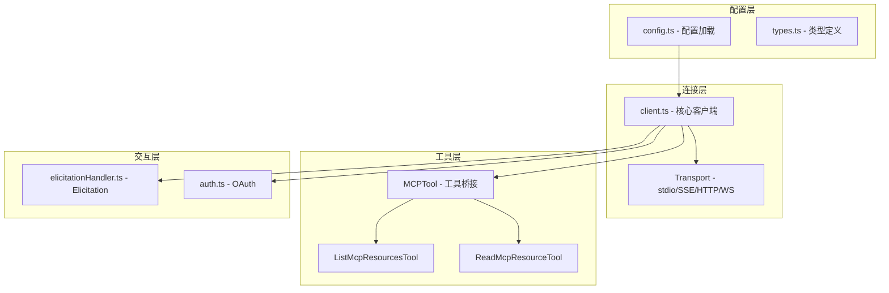
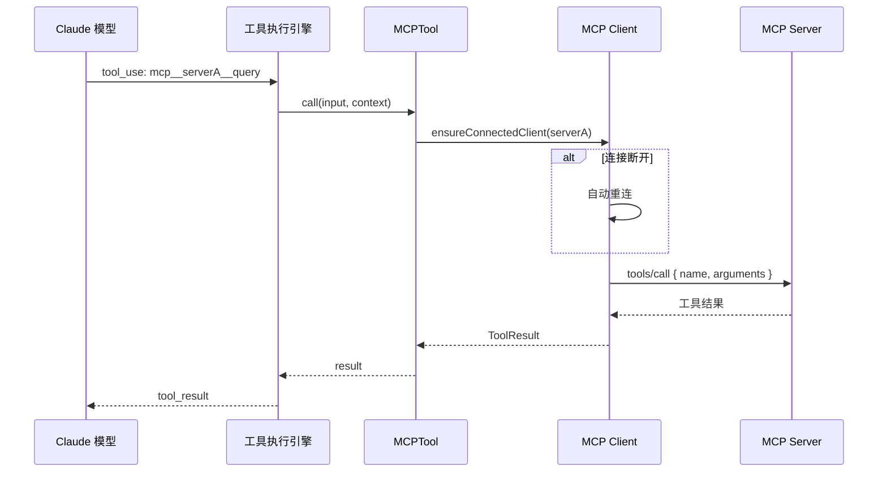
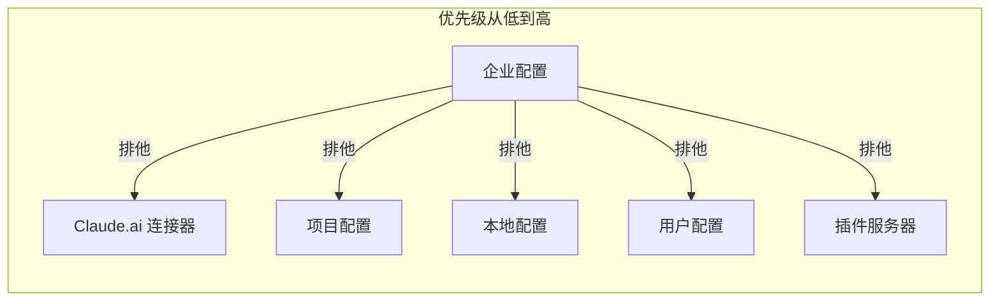
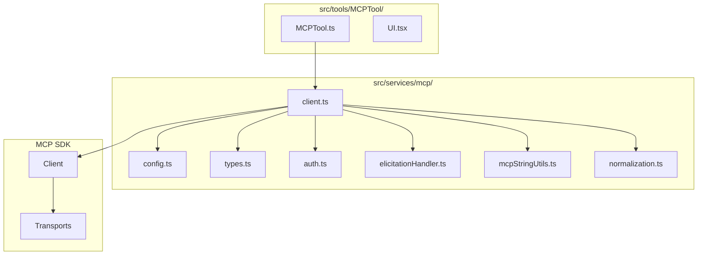

# 07 - MCP 协议集成

> **本章目标**：深入理解 Claude Code 如何通过 MCP (Model Context Protocol) 协议连接外部工具服务器，掌握 MCP 客户端的连接生命周期、工具桥接机制、Elicitation 交互流程，以及 OAuth 认证和企业策略过滤的实现。

---

## 1. 学习目标

- [ ] 理解 MCP 协议在 Claude Code 架构中的位置和作用
- [ ] 能够追踪 MCP 客户端从连接到发现的完整调用链
- [ ] 掌握不同传输类型（stdio / SSE / HTTP / WebSocket）的适用场景
- [ ] 理解 MCP 工具如何通过桥接层暴露给 Claude 模型
- [ ] 掌握 Elicitation 机制——MCP 服务器如何主动请求用户输入
- [ ] 了解 OAuth 认证流程和企业策略过滤机制

---

## 2. 背景问题

### 2.1 为什么这个模块存在？

MCP (Model Context Protocol) 是一个开放协议，允许 AI 应用通过标准化接口连接外部工具和数据源。Claude Code 作为 MCP 客户端，可以连接多个 MCP 服务器，每个服务器提供三类能力：

1. **Tools（工具）**：可调用的函数，如数据库查询、API 调用
2. **Resource（资源）**：可读取的数据对象
3. **Prompts（提示模板）**：预定义的提示词模板

### 2.2 它解决了什么问题？

- 扩展 Claude Code 的能力边界，无需修改核心代码即可添加新工具
- 通过标准化协议连接外部服务，保证互操作性
- 支持本地进程（stdio）、HTTP 长连接（SSE）、流式 HTTP（Streamable HTTP）、WebSocket 等多种传输方式

### 2.3 如果没有它会怎样？

Claude Code 将只能使用内置工具，无法连接外部服务和数据源，能力边界固定。

---

## 3. 源码入口

| 项目 | 内容 |
|------|------|
| 文件路径 | `src/services/mcp/` |
| 核心客户端 | `client.ts` |
| 连接入口 | `connectToServer()` (client.ts:150) |
| 配置管理 | `config.ts` |
| 类型定义 | `types.ts` |
| OAuth 认证 | `auth.ts` |
| Elicitation | `elicitationHandler.ts` |
| 工具桥接 | `src/tools/MCPTool/MCPTool.ts` |

---

## 4. 架构定位

### 4.1 模块职责

MCP 服务模块负责管理 Claude Code 与外部 MCP 服务器的连接生命周期，包括配置加载、连接建立、工具发现、请求转发和结果处理。

### 4.2 连接状态

```typescript
// src/services/mcp/types.ts
type MCPServerConnection =
  | ConnectedMCPServer    // 已连接：client 可用
  | FailedMCPServer       // 连接失败：携带 error 信息
  | NeedsAuthMCPServer    // 需要认证：需要 OAuth 流程
  | PendingMCPServer      // 等待中：正在重连
  | DisabledMCPServer     // 已禁用：用户手动关闭
```

### 4.3 模块关系



---

## 5. 核心源码分析

### 5.1 服务器连接类型

**源码位置**：`src/services/mcp/types.ts:1-80`

| 类型 | 传输层 | 场景 | 配置键 |
|------|--------|------|--------|
| `stdio` | 标准输入/输出 | 本地进程（如 npx 包） | `command`, `args`, `env` |
| `sse` | Server-Sent Events | HTTP 长轮询 | `url`, `headers` |
| `sse-ide` | SSE (IDE 专用) | IDE 扩展集成 | `url`, `ideName` |
| `http` | Streamable HTTP | 现代 HTTP API | `url`, `headers` |
| `ws` | WebSocket | 双向实时通信 | `url`, `headers` |
| `ws-ide` | WebSocket (IDE) | IDE WebSocket 集成 | `url`, `authToken` |
| `sdk` | SDK 内部传输 | SDK 消费者嵌入 | `name` |
| `claudeai-proxy` | Claude.ai 代理 | 官方注册表服务器 | `url`, `id` |

### 5.2 连接建立流程

**源码位置**：`src/services/mcp/client.ts:150-300`

```typescript
// connectToServer 是 memoized 的，同一配置不会重复连接
export const connectToServer = memoize(
  async (name, serverRef, serverStats): Promise<MCPServerConnection> => {
    // 1. 根据 config.type 创建对应的 Transport
    switch (serverRef.type) {
      case 'sse':    // SSEClientTransport
      case 'http':   // StreamableHTTPClientTransport
      case 'ws':     // WebSocketTransport
      case 'stdio':  // StdioClientTransport
      // ...
    }

    // 2. 创建 MCP Client 并连接
    const client = new Client({ name: 'claude-code', version: '...' })
    await client.connect(transport)

    // 3. 发现工具和资源
    const tools = await client.request({ method: 'tools/list' }, ...)
    const resources = await client.request({ method: 'resources/list' }, ...)

    // 4. 注册 Elicitation 处理器
    registerElicitationHandler(client, name, setAppState)

    // 5. 返回连接结果
    return { type: 'connected', client, name, capabilities, ... }
  }
)
```

### 5.3 MCPTool 桥接模板

**源码位置**：`src/tools/MCPTool/MCPTool.ts`

```typescript
// MCPTool 是所有 MCP 工具的模板
export const MCPTool = buildTool({
  isMcp: true,
  name: 'mcp',              // 被 client.ts 覆盖为 mcp__server__tool
  async description() { return DESCRIPTION },  // 被 client.ts 覆盖
  async call() { return { data: '' } },         // 被 client.ts 覆盖

  // 这些渲染方法不被覆盖，所有 MCP 工具共享
  renderToolUseMessage,
  renderToolUseProgressMessage,
  renderToolResultMessage,
})
```

在 `client.ts` 中，每个 MCP 工具被创建为 MCPTool 的变体：

```typescript
// client.ts 中的 createToolOverride()
function createToolOverride(serverName, toolDef) {
  return {
    ...MCPTool,
    name: buildMcpToolName(serverName, toolDef.name),
    //  "mcp__serverName__toolName" 格式
    async description() { return toolDef.description },
    async call(input, context) {
      // 实际调用 MCP 服务器的 tools/call
    },
  }
}
```

### 5.4 工具名规范化

**源码位置**：`src/services/mcp/mcpStringUtils.ts`

```typescript
export function buildMcpToolName(serverName: string, toolName: string): string {
  const normalizedServer = normalizeNameForMCP(serverName)
  const normalizedTool = normalizeNameForMCP(toolName)
  return `mcp__${normalizedServer}__${normalizedTool}`
}
```

### 5.5 Elicitation 机制

**源码位置**：`src/services/mcp/elicitationHandler.ts:40-100`

Elicitation 允许 MCP 服务器主动请求用户输入：

```typescript
export type ElicitationRequestEvent = {
  serverName: string
  requestId: string | number
  params: ElicitRequestParams
  signal: AbortSignal
  respond: (response: ElicitResult) => void
  waitingState?: ElicitationWaitingState
  onWaitingDismiss?: (action) => void
}
```

支持两种模式：
- **form 模式**：服务器发送表单 schema，CLI 渲染为对话框
- **url 模式**：服务器发送 URL，CLI 在浏览器中打开，等待回调

### 5.6 OAuth 认证流程

**源码位置**：`src/services/mcp/auth.ts`

```text
1. discoverAuthorizationServerMetadata(url)
   └── 获取 OAuth 服务器元数据

2. registerClient(metadata)
   └── 动态客户端注册（RFC 7591）

3. authorize(metadata, clientInfo)
   └── 启动本地 HTTP 服务器接收回调
   └── 打开浏览器进行用户授权

4. callback(code)
   └── 交换 authorization code 获取 tokens

5. saveTokens(tokens)
   └── 存储到安全存储（macOS Keychain / 文件）

6. refreshTokens(refreshToken)
   └── 使用 refresh_token 刷新访问令牌
```

### 5.7 配置加载流程

**源码位置**：`src/services/mcp/config.ts:100-200`

```text
启动时调用 getClaudeCodeMcpConfigs()
  │
  ├── 1. getMcpConfigsByScope('enterprise')
  │     └── 读取 managed-mcp.json（企业策略）
  │         └── 如果存在企业配置 → 排他模式，忽略其他配置
  │
  ├── 2. getMcpConfigsByScope('user')
  │     └── 读取 ~/.claude/settings.json 的 mcpServers
  │
  ├── 3. getMcpConfigsByScope('project')
  │     └── 从根目录到 CWD 遍历 .mcp.json
  │
  ├── 4. getMcpConfigsByScope('local')
  │     └── 读取 .claude/settings.local.json
  │
  ├── 5. loadAllPluginsCacheOnly()
  │     └── 加载插件提供的 MCP 服务器
  │
  └── 6. isMcpServerAllowedByPolicy()
        └── 企业策略过滤（allowlist/denylist）
```

### 5.8 设计原因

1. **为什么工具名要用 `mcp__server__tool` 格式？**
   - 避免 MCP 服务器工具名与内置工具名冲突
   - 规范化处理特殊字符（空格、连字符等）

2. **为什么连接是 memoized 的？**
   - 同一 MCP 服务器可能被多个工具引用，避免重复连接
   - 节省资源，加快工具调用速度

3. **为什么有企业排他配置？**
   - 企业安全策略要求强制执行，不允许用户绕过

---

## 6. 可视化结构

### 6.1 MCP 工具调用完整流程



### 6.2 配置优先级



### 6.3 模块结构图



---

## 7. 工程经验

### 7.1 为什么这么设计？

1. **标准化协议**：使用 MCP 协议而非私有协议，实现与外部工具的互操作性
2. **传输层抽象**：支持多种传输方式，适应不同部署场景
3. **工具名规范化**：避免命名冲突，提高可预测性

### 7.2 替代方案

| 方案 | 优点 | 缺点 |
|------|------|------|
| 直接集成 | 性能最好 | 耦合高，扩展性差 |
| Plugin 系统 | 比 MCP 更灵活 | 需要学习新系统 |
| REST API | 通用性强 | 需要额外的认证机制 |

### 7.3 常见坑与避坑指南

1. **401 错误处理**：
   - 捕获 `sentToken` 避免并发竞态
   - 问题：并发请求都收到 401，刷新后重试可能用错 token

2. **连接超时**：
   - stdio 服务器：30 秒默认超时
   - 远程服务器：60 秒请求超时

3. **资源清理**：
   - 二进制 blob 不会直接返回，而是持久化到磁盘
   - 需要正确处理文件生命周期

---

## 8. Contributor 指南

### 8.1 适合新手的文件

| 文件 | 任务类型 | 难度 |
|------|---------|------|
| `mcpStringUtils.ts` | 工具名规范化修改 | L2 |
| `normalization.ts` | 名称规范化规则调整 | L2 |
| `types.ts` | 添加新的连接类型 | L4 |

### 8.2 危险逻辑（修改需谨慎）

| 文件/函数 | 风险等级 | 说明 |
|-----------|---------|------|
| `connectToServer()` | 🟡 中 | 连接管理逻辑错误会导致资源泄漏 |
| `auth.ts` | 🔴 高 | OAuth 处理不当会导致安全问题 |
| `createToolOverride()` | 🟡 中 | 工具名构建错误会影响工具调用 |

### 8.3 调试方法

1. **查看 MCP 日志**：
   ```bash
   CLAUDE_DEBUG=true claude
   # 查找 "mcp" 相关日志
   ```

2. **测试 MCP 服务器连接**：
   ```bash
   claude mcp list
   claude mcp start <server-name>
   ```

3. **强制重新连接**：
   ```bash
   # 删除连接缓存
   rm -rf ~/.claude/mcp/
   ```

### 8.4 相关 Issue/PR

- MCP SDK 相关问题查看 `@modelcontextprotocol/sdk`

---

## 练习

### 练习 1：连接类型对比

| 传输类型 | 创建方式 | 特点 |
|---------|---------|------|
| stdio | `StdioClientTransport` | ? |
| sse | `SSEClientTransport` | ? |
| http | `StreamableHTTPClientTransport` | ? |
| ws | `WebSocketTransport` | ? |

### 练习 2：配置优先级

| 优先级 | 来源 | 说明 |
|--------|------|------|
| 1（最低） | ? | ? |
| 6（最高） | ? | ? |

**企业排他是什么意思？**

### 练习 3：工具桥接

**为什么需要规范化？**

### 练习 4：Elicitation 模式

| 模式 | 流程 | 类比 |
|------|------|------|
| form | ? | ? |
| url | ? | ? |

### 练习 5：OAuth 重试

**为什么捕获 `sentToken`？**

---

## 练习答案速查

| 练习 | 答案 |
|------|------|
| 1 | stdio=进程，sse=HTTP长连接，http=流式HTTP，ws=双向 |
| 2 | 企业排他，存在企业配置时忽略其他配置 |
| 3 | 规范化避免冲突，确保命名合规 |
| 4 | form=对话框，url=浏览器授权 |
| 5 | 捕获sentToken避免并发竞态 |

---

## 本章 vs Java

| 方面 | Claude Code MCP | Java JDBC |
|------|-----------------|-----------|
| 协议 | JSON-RPC over stdio/HTTP/WS | SQL over TCP |
| 发现 | `tools/list` 动态发现 | `DatabaseMetaData` |
| 调用 | `tools/call` | `Statement.execute()` |
| 资源 | `resources/list` | `ResultSet` |
| 认证 | OAuth 2.0 | 数据库用户名/密码 |
| 驱动 | MCP SDK | JDBC Driver |

---

## 下一篇

👉 [第08章-Agent与多Agent协作.md](./第08章-Agent与多Agent协作.md)
