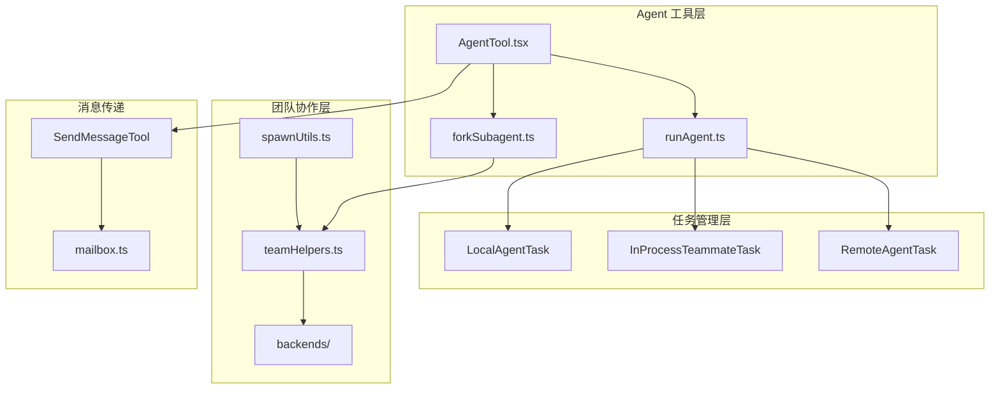
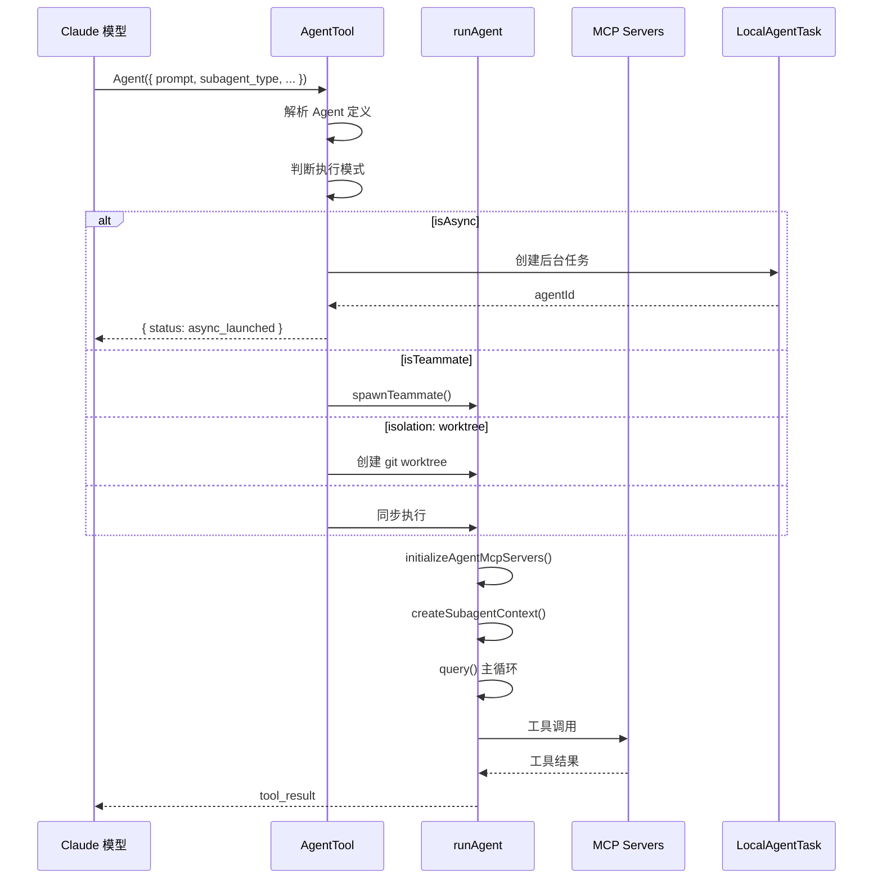
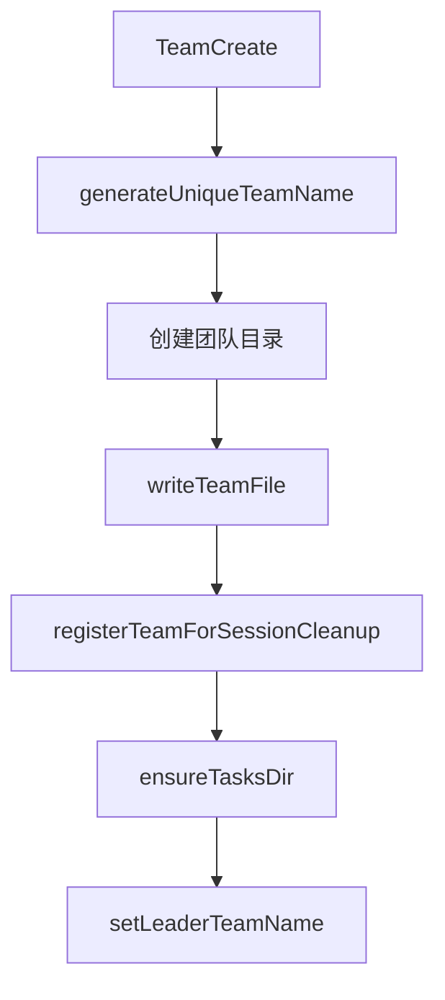
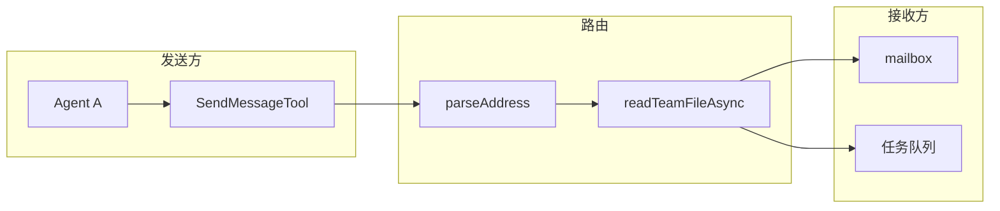

# 08 - Agent 与多 Agent 协作

> **本章目标**：理解 Claude Code 中 Agent 子代理的生成机制、多 Agent 团队（Swarm）的创建与生命周期管理、消息传递系统，以及三种任务类型（LocalAgentTask / InProcessTeammateTask / RemoteAgentTask）的实现差异。

---

## 1. 学习目标

- [ ] 理解 Agent 工具的核心架构：同步/异步/后台执行
- [ ] 掌握 Agent 生成（spawning）的两种模式：fork 共享上下文 vs 独立子代理
- [ ] 了解团队（Team）的创建、成员管理和生命周期
- [ ] 理解三种任务后端（Local / InProcess / Remote）的适用场景
- [ ] 掌握消息传递（SendMessage）和团队协调机制
- [ ] 理解 Coordinator 模式和权限隔离

---

## 2. 背景问题

### 2.1 为什么这个模块存在？

Agent 系统允许 Claude Code 创建子代理来执行独立任务，实现多线程并行工作。团队（Team/Swarm）模式支持多个 Agent 协作，解决复杂任务。

### 2.2 它解决了什么问题？

- 复杂任务分解为多个并行子任务
- 子代理隔离执行，避免相互干扰
- 多 Agent 协作完成单一 Agent 无法完成的任务
- 支持后台执行，不阻塞主对话

### 2.3 核心概念

```text
主会话 (Main Session)
  │
  ├── 同步 Agent (sync)            ← 阻塞主线程，使用父级 abortController
  │     └── 直接返回结果给模型
  │
  ├── 异步 Agent (async)           ← 后台执行，有独立的 abortController
  │     └── LocalAgentTask         ← 后台任务管理
  │     └── 完成后通知主会话
  │
  └── 团队成员 (Teammate)          ← 多 Agent 协作
        ├── InProcessTeammateTask   ← 同进程，AsyncLocalStorage 隔离
        │     └── tmux/iTerm2 pane 展示
        └── RemoteAgentTask        ← 远程 CCR 环境
              └── 独立云环境执行
```

---

## 3. 源码入口

| 项目 | 内容 |
|------|------|
| 文件路径 | `src/tools/AgentTool/` |
| Agent 工具入口 | `AgentTool.tsx` |
| Agent 执行循环 | `runAgent.ts` |
| Fork 子代理 | `forkSubagent.ts` |
| 团队管理 | `src/utils/swarm/teamHelpers.ts` |
| 任务类型 | `src/tasks/LocalAgentTask/`, `InProcessTeammateTask/`, `RemoteAgentTask/` |
| 消息传递 | `src/tools/SendMessageTool/` |

---

## 4. 架构定位

### 4.1 模块职责

Agent 工具模块负责创建和管理子代理，提供任务的并行执行和团队协作能力。

### 4.2 生命周期

```
Agent 创建 → 初始化上下文 → 执行主循环 → 清理资源 → 返回结果
```

### 4.3 模块关系



---

## 5. 核心源码分析

### 5.1 AgentTool 输入 Schema

**源码位置**：`src/tools/AgentTool/AgentTool.tsx:60-120`

```typescript
const baseInputSchema = lazySchema(() => z.object({
  description: z.string(),       // 3-5 词任务描述
  prompt: z.string(),            // 具体任务指令
  subagent_type: z.string().optional(),  // Agent 类型
  model: z.enum(['sonnet', 'opus', 'haiku']).optional(),
  run_in_background: z.boolean().optional(),
}))

// 多 Agent 参数（Swarm 模式）
const multiAgentInputSchema = z.object({
  name: z.string().optional(),          // Agent 名称（可寻址）
  team_name: z.string().optional(),     // 团队名
  mode: permissionModeSchema().optional(), // 权限模式
})

// 隔离参数
isolation: z.enum(['worktree', 'remote']).optional()
cwd: z.string().optional()
```

### 5.2 Agent 执行流程

**源码位置**：`src/tools/AgentTool/runAgent.ts:80-200`

```typescript
export async function* runAgent({
  agentDefinition, promptMessages, toolUseContext,
  canUseTool, isAsync, availableTools, ...
}): AsyncGenerator<Message, void> {

  // 1. 解析模型和权限
  const resolvedAgentModel = getAgentModel(...)
  const agentId = createAgentId()

  // 2. Fork 上下文处理
  const contextMessages = forkContextMessages
    ? filterIncompleteToolCalls(forkContextMessages) : []
  const initialMessages = [...contextMessages, ...promptMessages]

  // 3. 初始化 Agent 专属 MCP 服务器
  const { clients, tools, cleanup } = await initializeAgentMcpServers(...)

  // 4. 创建隔离的子代理上下文
  const agentToolUseContext = createSubagentContext(toolUseContext, {
    options: agentOptions,
    agentId,
    agentType: agentDefinition.agentType,
    abortController: isAsync ? new AbortController() : toolUseContext.abortController,
  })

  // 5. 执行主循环
  try {
    for await (const message of query({...})) {
      if (message.type === 'stream_event') {
        toolUseContext.pushApiMetricsEntry?.(message.ttftMs)
        continue
      }
      if (isRecordableMessage(message)) {
        await recordSidechainTranscript([message], agentId, lastRecordedUuid)
        yield message
      }
    }
  } finally {
    // 清理：MCP、hooks、transcript、bash 任务
    await mcpCleanup()
    clearSessionHooks(rootSetAppState, agentId)
    killShellTasksForAgent(agentId, ...)
  }
}
```

### 5.3 Fork 子代理机制

**源码位置**：`src/tools/AgentTool/forkSubagent.ts:50-100`

```typescript
// Fork 模式通过克隆主会话消息来共享 prompt cache
export function buildForkedMessages(
  parentMessages: Message[],
  promptMessages: Message[],
): Message[] {
  // 1. 过滤不完整的工具调用
  const filtered = filterIncompleteToolCalls(parentMessages)
  // 2. 拼接上下文 + 新 prompt
  return [...filtered, ...promptMessages]
}

// Fork Agent 类型标识（用于防止无限递归 fork）
export const FORK_AGENT = 'fork'
```

### 5.4 团队文件管理

**源码位置**：`src/utils/swarm/teamHelpers.ts:30-80`

```typescript
type TeamFile = {
  name: string
  description?: string
  createdAt: number
  leadAgentId: string
  leadSessionId?: string
  hiddenPaneIds?: string[]
  teamAllowedPaths?: TeamAllowedPath[]
  members: Array<{
    agentId: string           // "researcher@my-team"
    name: string              // "researcher"
    agentType?: string
    model?: string
    color?: string
    planModeRequired?: boolean
    joinedAt: number
    tmuxPaneId: string
    cwd: string
    worktreePath?: string
    sessionId?: string
    subscriptions: string[]
    backendType?: BackendType
    isActive?: boolean
    mode?: PermissionMode
  }>
}
```

### 5.5 三种任务类型

**源码位置**：`src/tasks/`

| 类型 | 特点 | 使用场景 |
|------|------|---------|
| LocalAgentTask | 独立 AbortController，后台执行 | `run_in_background: true` |
| InProcessTeammateTask | 同进程，AsyncLocalStorage 隔离 | 团队成员，同 pane 展示 |
| RemoteAgentTask | 远程 CCR 环境执行 | `isolation: "remote"` |

### 5.6 消息传递流程

**源码位置**：`src/tools/SendMessageTool/`

```text
Agent A: SendMessage({ to: "researcher", message: "..." })
  │
  ├── 1. parseAddress(to)
  │     ├── "researcher" → teammate 名
  │     ├── "*" → 广播
  │     └── "bridge:<session>" → Remote Control
  │
  ├── 2. 查找目标 Agent
  │     ├── readTeamFileAsync(teamName)
  │     ├── findTeammateTaskByAgentId(agentId)
  │     └── isLocalAgentTask() → 后台任务消息队列
  │
  ├── 3. 结构化消息
  │     ├── shutdown_request / shutdown_response
  │     ├── plan_approval_response
  │     └── 自由文本消息
  │
  └── 4. 投递消息
        ├── writeToMailbox(target, message)  ← 队友邮箱
        └── queuePendingMessage(taskId, msg) ← 后台任务队列
```

### 5.7 设计原因

1. **为什么有 Fork 模式？**
   - 共享主会话的 prompt cache（cache_control: ephemeral）
   - 子代理可以直接利用已缓存的上下文

2. **为什么用 AsyncLocalStorage 隔离？**
   - 同进程多任务需要状态隔离
   - 比进程间通信更高效

3. **为什么团队用 tmux pane 展示？**
   - 用户可以同时看到多个 Agent 的输出
   - 支持交互式调试

---

## 6. 可视化结构

### 6.1 Agent 工具调用流程



### 6.2 团队创建流程



### 6.3 消息传递数据流



---

## 7. 工程经验

### 7.1 为什么这么设计？

1. **分层任务架构**：不同任务类型适应不同场景
   - LocalAgentTask：简单后台任务
   - InProcessTeammateTask：需要紧密协作的团队成员
   - RemoteAgentTask：需要隔离环境的长时任务

2. **消息邮箱系统**：解耦发送方和接收方
   - 不需要知道接收方的具体位置
   - 支持异步投递和离线消息

3. **权限桥接**：Leader 可以将自己的权限临时扩展给队友

### 7.2 替代方案

| 方案 | 优点 | 缺点 |
|------|------|------|
| 单进程多线程 | 简单 | 状态隔离困难 |
| 独立进程 | 隔离性好 | 通信开销大 |
| 远程服务 | 可扩展 | 延迟高 |

### 7.3 常见坑与避坑指南

1. **Fork 递归**：
   - Fork Agent 不应再 Fork
   - 解决：`isInForkChild` 标志防止递归

2. **资源清理**：
   - 正常退出：优雅清理
   - SIGINT：强制杀进程

3. **消息丢失**：
   - 目标 Agent 不存在时消息被丢弃
   - 解决：检查 Agent 状态后再发送

---

## 8. Contributor 指南

### 8.1 适合新手的文件

| 文件 | 任务类型 | 难度 |
|------|---------|------|
| `forkSubagent.ts` | Fork 逻辑修改 | L3 |
| `teamHelpers.ts` | 团队文件 CRUD | L3 |
| `agentColorManager.ts` | Agent 颜色分配 | L2 |

### 8.2 危险逻辑（修改需谨慎）

| 文件/函数 | 风险等级 | 说明 |
|-----------|---------|------|
| `runAgent()` | 🔴 高 | Agent 执行循环，错误会影响所有 Agent |
| `createSubagentContext()` | 🟡 中 | 上下文隔离逻辑 |
| `spawnInProcess.ts` | 🟡 中 | 进程内队友生成 |
| `killShellTasksForAgent()` | 🟡 中 | 资源清理 |

### 8.3 调试方法

1. **查看 Agent 日志**：
   ```bash
   CLAUDE_DEBUG=true claude
   # 查找 "agent" 相关日志
   ```

2. **查看团队状态**：
   ```bash
   ls -la ~/.claude/teams/
   cat ~/.claude/teams/<team-name>/config.json
   ```

3. **手动触发消息**：
   ```bash
   # 直接写入邮箱文件
   echo "message" > ~/.claude/teams/<team-name>/mailbox/<agent-name>
   ```

### 8.4 相关 Issue/PR

- Team 清理相关：确保退出时删除临时资源

---

## 练习

### 练习 1：Agent 生命周期

| 模式 | 行为 | Java 类比 |
|------|------|----------|
| sync | ? | ? |
| async | ? | ? |
| teammate | ? | ? |

### 练习 2：Fork 机制

**共享 prompt cache 的原理？**

### 练习 3：团队清理

| 退出类型 | 清理方式 | 原因 |
|---------|---------|------|
| 正常退出 | ? | ? |
| SIGINT | ? | ? |

### 练习 4：消息传递

| 消息类型 | 投递方式 | 说明 |
|---------|---------|------|
| shutdown_request | ? | ? |
| plan_approval_response | ? | ? |
| 自由文本 | ? | ? |

### 练习 5：权限隔离

- **继承**：子代理默认继承父级的权限模式
- **覆盖**：?
- **隔离**：?

---

## 练习答案速查

| 练习 | 答案 |
|------|------|
| 1 | sync=阻塞，async=独立线程，teammate=进程隔离 |
| 2 | fork 克隆消息共享 prompt cache |
| 3 | SIGINT 强制杀进程，正常退出优雅清理 |
| 4 | 消息通过邮箱系统投递 |
| 5 | `mode` 参数可显式覆盖 |

---

## 本章 vs Java

| 方面 | Claude Code Agent | Java 线程 |
|------|-----------------|----------|
| 创建 | `AgentTool` 工具 | `new Thread()` |
| 上下文 | fork/subagent | `InheritableThreadLocal` |
| 通信 | SendMessage | `BlockingQueue` |
| 隔离 | AsyncLocalStorage | 进程/ClassLoader |
| 生命周期 | 自动管理 | 手动管理 |

---

## 下一篇

👉 [第09章-记忆与持久化.md](./第09章-记忆与持久化.md)
