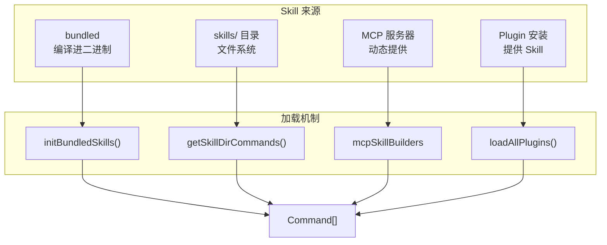
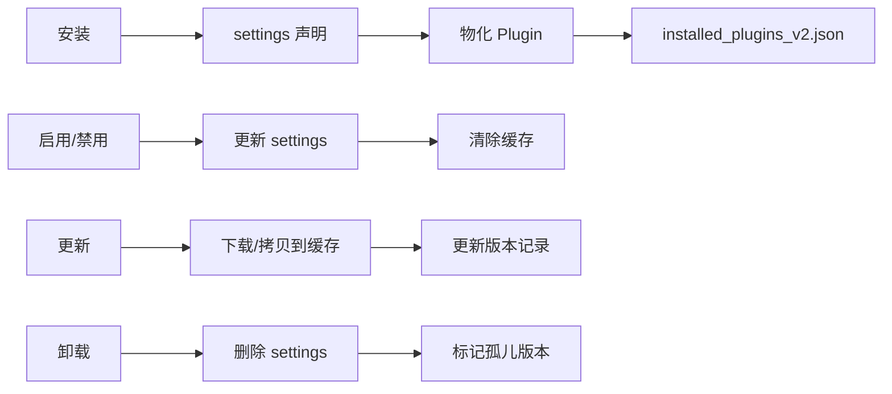
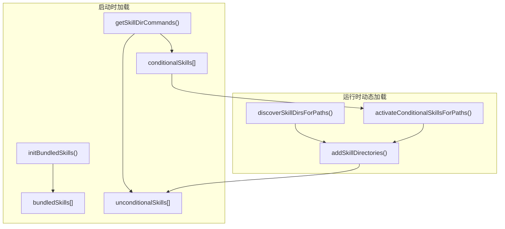
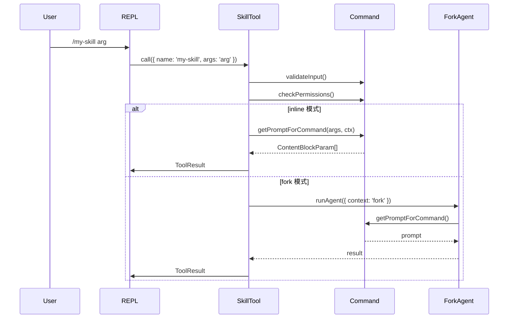
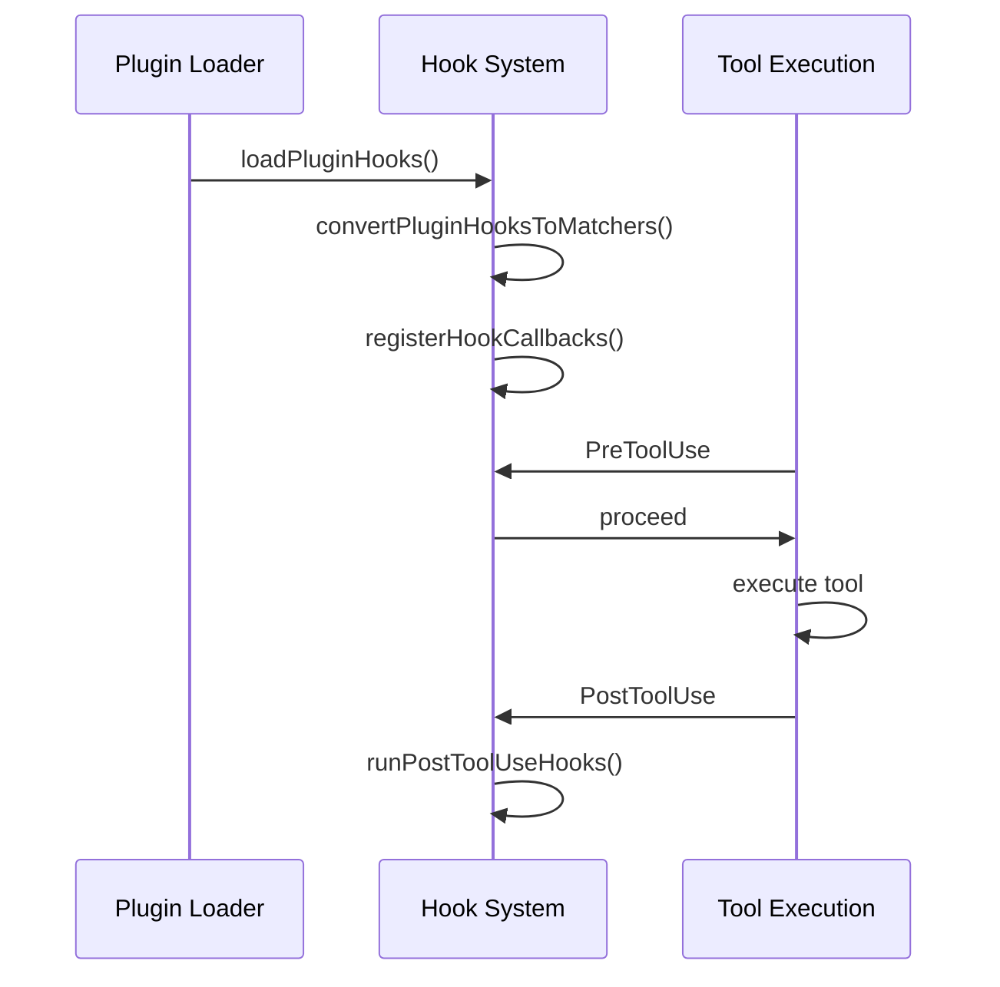

# 第10章：Skills 与插件系统

> **本章目标**：理解 Claude Code 的 Skill（技能）和 Plugin（插件）系统。涵盖四种 Skill 来源、加载去重机制、inline/fork 执行模式、Plugin 生命周期和 hook 注入机制。

---

## 1. 学习目标

- [ ] 理解 Skill 的四种来源（bundled、skills 文件系统、MCP、Plugin）
- [ ] 掌握 Skill 加载、去重和条件激活机制
- [ ] 理解 inline 和 fork 两种 Skill 执行模式的区别
- [ ] 掌握 Plugin 的生命周期管理（安装、启用/禁用、更新、卸载）
- [ ] 理解 Plugin hook 注入机制和热重载原理

---

## 2. 背景问题

### 2.1 为什么需要 Skill 系统？

Claude Code 的 Skill 系统解决以下问题：

1. **可复用的工作流**：用户可以将常用操作封装为 Skill
2. **动态发现**：文件系统中的 Skill 无需重启即可被发现
3. **条件激活**：基于文件路径的 Skill 可以在特定场景下自动激活
4. **权限控制**：Skill 可以声明允许使用的工具列表

### 2.2 Skill vs Plugin 的区别

| 维度 | Skill（技能） | Plugin（插件） |
|------|--------------|---------------|
| 形式 | Markdown 文件（SKILL.md）或 TypeScript 注册 | 一个目录，含 plugin.json + skills/ + hooks/ |
| 来源 | 文件系统、内建、MCP、Plugin | Marketplace 安装、本地目录、内建 |
| 执行 | SkillTool 调用，展开为 prompt 注入对话 | 通过 Skill 暴露功能；通过 Hook 注入行为 |
| 可见性 | 在 system-reminder 中列出 | 在 /plugin UI 中管理 |
| 用户交互 | `/skill-name` 斜杠命令 | `/plugin` 管理界面 |

---

## 3. 源码入口

| 项目 | 内容 |
|------|------|
| 文件路径 | `src/skills/loadSkillsDir.ts` |
| 核心函数 | `getSkillDirCommands()`, `loadSkillsFromSkillsDir()`, `createSkillCommand()` |
| 调用入口 | `getCommandDirCommands()` → `getSkillDirCommands()` |
| 行号 | `getSkillDirCommands`: #380-480, `loadSkillsFromSkillsDir`: #280-340 |

**Bundled Skill 源码**：

| 项目 | 内容 |
|------|------|
| 文件路径 | `src/skills/bundledSkills.ts` |
| 核心函数 | `registerBundledSkill()`, `getBundledSkills()` |
| 调用入口 | `initBundledSkills()` 在启动时注册 |
| 行号 | `registerBundledSkill`: #45-80 |

**Plugin 生命周期源码**：

| 项目 | 内容 |
|------|------|
| 文件路径 | `src/services/plugins/pluginOperations.ts` |
| 核心函数 | `installPluginOp()`, `setPluginEnabledOp()`, `updatePluginOp()`, `uninstallPluginOp()` |
| 调用入口 | CLI 命令或 UI 操作触发 |
| 行号 | `installPluginOp`: #140-200, `setPluginEnabledOp`: #240-320 |

---

## 4. 架构定位

### 4.1 模块职责

**Skill 加载** (`src/skills/loadSkillsDir.ts`)：
- 负责发现和加载所有来源的 Skill
- 处理去重（realpath 解析符号链接）
- 管理条件 Skill 的动态激活

**Bundled Skill 注册** (`src/skills/bundledSkills.ts`)：
- 编译时注册的内建 Skill
- 支持惰性提取的参考文件（`files` 字段）

**Plugin 生命周期** (`src/services/plugins/pluginOperations.ts`)：
- 安装、启用/禁用、更新、卸载操作
- settings-first 设计（先写设置，再物化）

### 4.2 Skill 来源架构



### 4.3 Plugin 生命周期



---

## 5. 核心源码分析

### 5.1 Skill 加载核心逻辑

**文件**：`src/skills/loadSkillsDir.ts:380-480`

```typescript
export const getSkillDirCommands = memoize(
  async (cwd: string): Promise<Command[]> => {
    // 并行加载多个来源
    const [
      managedSkills,
      userSkills,
      projectSkillsNested,
      legacyCommands,
    ] = await Promise.all([
      loadSkillsFromSkillsDir(managedSkillsDir, 'policySettings'),
      isSettingSourceEnabled('userSettings') ? loadSkillsFromSkillsDir(userSkillsDir, 'userSettings') : [],
      projectSettingsEnabled ? Promise.all(projectSkillsDirs.map(...)) : [],
      loadSkillsFromCommandsDir(cwd),  // legacy 格式
    ])

    // 去重：使用 realpath 解析符号链接
    const fileIds = await Promise.all(
      allSkillsWithPaths.map(({ filePath }) =>
        skill.type === 'prompt' ? getFileIdentity(filePath) : null
      )
    )

    // 按来源优先级保留第一个
    for (const entry of allSkillsWithPaths) {
      const fileId = fileIds[i]
      if (existingSource !== undefined) continue  // 已存在则跳过
      seenFileIds.set(fileId, skill.source)
      deduplicatedSkills.push(skill)
    }

    // 分离条件 Skill（有 paths frontmatter）
    for (const skill of deduplicatedSkills) {
      if (skill.paths && skill.paths.length > 0) {
        conditionalSkills.set(skill.name, skill)
      } else {
        unconditionalSkills.push(skill)
      }
    }
  }
)
```

**去重策略**：`realpath` 解析符号链接，确保同一文件不会被重复加载。

### 5.2 Bundled Skill 注册

**文件**：`src/skills/bundledSkills.ts:45-80`

```typescript
export function registerBundledSkill(definition: BundledSkillDefinition): void {
  const command: Command = {
    type: 'prompt',
    name: definition.name,
    description: definition.description,
    allowedTools: definition.allowedTools ?? [],
    disableModelInvocation: definition.disableModelInvocation ?? false,
    userInvocable: definition.userInvocable ?? true,
    source: 'bundled',
    loadedFrom: 'bundled',
    hooks: definition.hooks,
    skillRoot,
    context: definition.context,
    getPromptForCommand: definition.getPromptForCommand,
  }
  bundledSkills.push(command)
}
```

**支持惰性提取文件**：

```typescript
if (files && Object.keys(files).length > 0) {
  skillRoot = getBundledSkillExtractDir(definition.name)
  getPromptForCommand = async (args, ctx) => {
    extractionPromise ??= extractBundledSkillFiles(definition.name, files)
    const extractedDir = await extractionPromise
    const blocks = await inner(args, ctx)
    return prependBaseDir(blocks, extractedDir)
  }
}
```

### 5.3 Plugin 安装流程

**文件**：`src/services/plugins/pluginOperations.ts:140-200`

```typescript
export async function installPluginOp(
  plugin: string,
  scope: InstallableScope = 'user',
): Promise<PluginOperationResult> {
  // 1. 在 Marketplace 中查找 Plugin
  let foundPlugin: PluginMarketplaceEntry | undefined
  for (const [mktName, mktConfig] of Object.entries(marketplaces)) {
    const marketplace = await getMarketplace(mktName)
    const pluginEntry = marketplace.plugins.find(p => p.name === pluginName)
    if (pluginEntry) {
      foundPlugin = pluginEntry
      foundMarketplace = mktName
      break
    }
  }

  // 2. 写入 settings（声明意图）
  updateSettingsForSource(settingSource, {
    enabledPlugins: { [pluginId]: true }
  })

  // 3. 物化 Plugin
  await installResolvedPlugin({ pluginId, entry, scope, marketplaceInstallLocation })
}
```

**settings-first 设计**：先写 settings，再物化。确保即使物化失败，settings 也会触发下次启动时的 reconciliation。

### 5.4 hook 注入机制

**文件**：`src/utils/plugins/loadPluginHooks.ts`

```typescript
export function loadPluginHooks(): void {
  const allPlugins = loadAllPluginsCacheOnly()

  for (const plugin of allPlugins.enabled) {
    const hookMatchers = convertPluginHooksToMatchers(plugin)
    for (const matcher of hookMatchers) {
      registerHookCallbacks(matcher.hooks.map(h => ({
        ...h,
        pluginName: plugin.name,
      })))
    }
  }
}

// 热重载：监听 settings 变化
settingsChangeDetector.subscribe(() => {
  clearRegisteredPluginHooks()
  loadPluginHooks()
})
```

---

## 6. 可视化结构

### 6.1 Skill 加载架构图



### 6.2 Skill 调用流程时序图



### 6.3 Plugin hook 注入时序图



---

## 7. 工程经验

### 7.1 为什么这么设计？

**1. realpath 去重而非 inode**

某些文件系统（虚拟/容器/NFS）报告不可靠的 inode 值。使用 `realpath` 解析符号链接得到规范路径，更可靠。

**2. settings-first 安装**

先写 settings，再物化。如果物化失败，下次启动时 reconciliation 会修复。避免 settings 和实际状态不一致。

**3. 原子 hook 注册**

先 `clearRegisteredPluginHooks()`，再 `registerHookCallbacks()`。确保新 hook 完全就绪前，旧 hook 始终有效。

### 7.2 替代方案

| 方案 | 优点 | 缺点 |
|------|------|------|
| inode 去重 | 简单 | 某些文件系统不可靠 |
| 立即物化安装 | 操作是原子的 | 失败难以恢复 |
| 非原子 hook 注册 | 简单 | 可能出现中间状态 |

### 7.3 常见坑与避坑指南

| 坑点 | 触发条件 | 解决方案 |
|------|---------|---------|
| 符号链接导致重复加载 | 同一 Skill 通过不同路径引用 | `realpath` 解析后去重 |
| Skill 描述超出预算 | 大量 Skill 导致上下文溢出 | 截断非 bundled Skill 描述 |
| Plugin 卸载后仍运行 | settings 和缓存不一致 | 原子操作 + 缓存清除 |
| hook 注册时差 | 多线程并发注册 | 原子 clear + register |

---

## 8. Contributor 指南

### 8.1 适合新手的文件

| 文件 | 难度 | 说明 |
|------|------|------|
| `src/skills/bundled/` | L2 | 添加新 bundled Skill |
| `src/skills/bundledSkills.ts` (类型定义) | L2 | 修改 Skill 结构 |
| `src/tools/SkillTool/prompt.ts` | L3 | 修改预算管理逻辑 |

### 8.2 危险逻辑（修改需谨慎）

| 区域 | 风险等级 | 说明 |
|------|---------|------|
| `realpath` 去重逻辑 | 🟡 中 | 破坏会导致重复加载或遗漏 |
| `O_NOFOLLOW | O_EXCL` 安全写入 | 🔴 高 | 保护参考文件不被覆盖 |
| hook 原子注册 | 🔴 高 | 破坏会导致 hook 状态不一致 |
| Plugin 缓存清除 | 🟡 中 | 错误清除可能导致功能丢失 |

### 8.3 调试方法

**1. 追踪 Skill 加载**：
```typescript
// 在 getSkillDirCommands() 添加日志
console.log('Loaded skills:', deduplicatedSkills.map(s => s.name))
```

**2. 观察条件 Skill 激活**：
```typescript
// 在 activateConditionalSkillsForPaths() 添加日志
console.log('Activated:', activated)
```

**3. 检查 Plugin hook 注册**：
```typescript
// 在 registerHookCallbacks() 后检查
console.log('Registered hooks:', STATE.registeredHooks.length)
```

### 8.4 相关 Issue/PR

- [Skill system architecture](https://github.com/anthropics/claude-code/issues?q=skills)
- [Plugin hooks](https://github.com/anthropics/claude-code/issues?q=plugin+hook)
- [Dynamic skill discovery](https://github.com/anthropics/claude-code/issues?q=dynamic+skill)

---

## 练习

### 练习 1：Skill 加载来源优先级

**答案**：

当同一 Skill 存在于多个来源时，按以下优先级保留：

| 优先级 | 来源 | 说明 |
|--------|------|------|
| 1（最高） | bundled | 编译进二进制 |
| 2 | managed | `/etc/claude-code/.claude/skills/` |
| 3 | user | `~/.claude/skills/` |
| 4 | project | `.claude/skills/` |
| 5 | additional | `--add-dir` 指定的目录 |
| 6（最低） | commands (legacy) | `.claude/commands/` |

### 练习 2：inline vs fork 执行模式

**答案**：

| 方面 | inline 模式 | fork 模式 |
|------|------------|-----------|
| 执行位置 | 主对话流 | 隔离子 agent |
| token 预算 | 共享主会话 | 独立预算 |
| 上下文 | 共享主上下文 | 独立上下文 |
| 适用场景 | 简单 prompt 操作 | 复杂任务、长期运行 |
| 工具权限 | 继承主会话 | `allowedTools` 限制 |

### 练习 3：Plugin 安装流程

**答案**：

1. 在 Marketplace 中查找 Plugin（`getPluginById()`）
2. 写入 settings（`updateSettingsForSource()`）- 声明意图
3. 物化 Plugin（`installResolvedPlugin()`）- 下载/拷贝到缓存
4. 记录到 `installed_plugins_v2.json`

**为什么 settings-first？**
- 即使物化失败，settings 也会触发下次启动时的 reconciliation
- 避免 settings 和实际状态不一致

---

## 练习答案速查

| 练习 | 核心答案 |
|------|---------|
| 1 | bundled > managed > user > project > additional > commands |
| 2 | inline 共享上下文；fork 隔离独立预算 |
| 3 | settings-first 先写设置再物化，支持 reconciliation |

---

## 本章 vs Java

| 方面 | Claude Code | Java |
|------|-------------|------|
| Skill 定义 | Markdown/SKILL.md | 注解 + 配置类 |
| Skill 加载 | 文件系统发现 + memoize | Spring @ComponentScan |
| 执行模式 | inline/fork 分离 | 同步/异步 @Async |
| Plugin 生命周期 | settings-first | Bean 生命周期 |
| Hook 注入 | 事件驱动注册 | Spring 事件 + @EventListener |

---

## 下一篇

👉 [第11章-API通信与远程.md](./第11章-API通信与远程.md)
