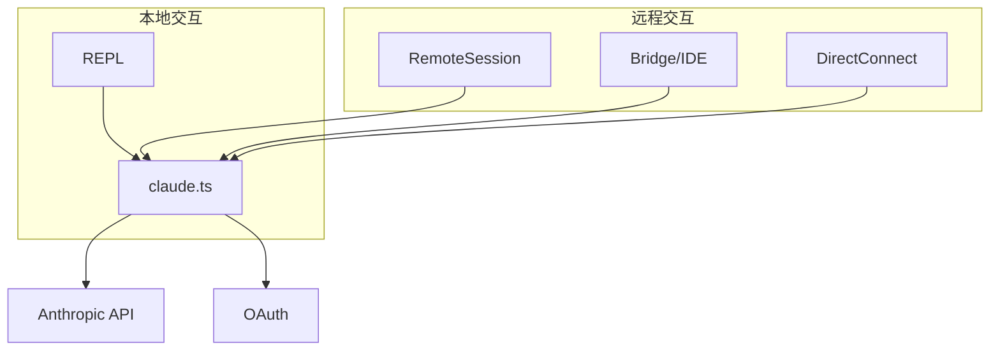
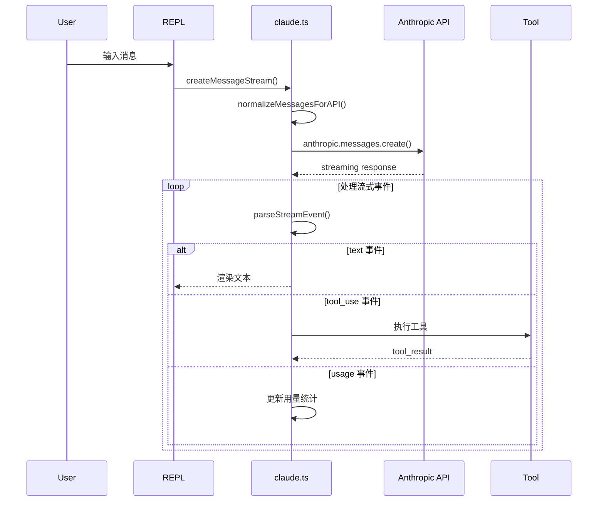
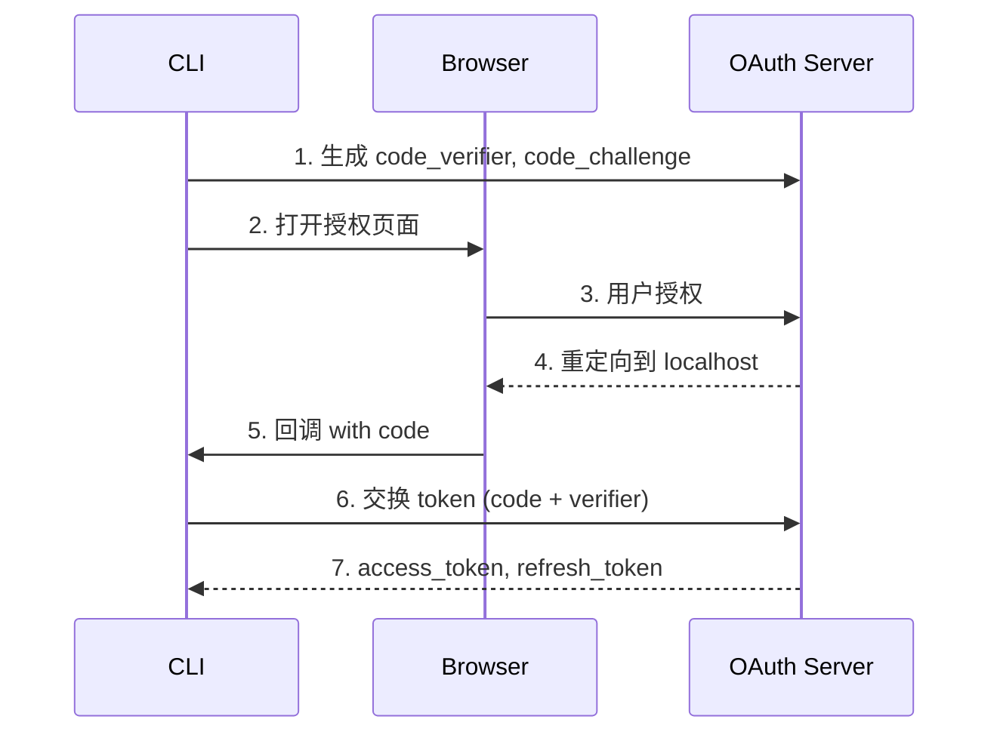
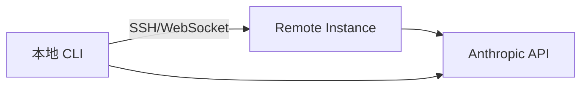

# 第11章：API 通信与远程

> **本章目标**：理解 Claude Code 的 API 通信机制和远程会话架构。涵盖消息流式传输、认证流程、重试策略、远程会话、Bridge 模式和 Direct Connect。

---

## 1. 学习目标

- [ ] 理解 `createMessageStream()` 的完整调用链
- [ ] 掌握消息标准化和工具 Schema 转换机制
- [ ] 理解 OAuth PKCE 认证流程和 token 刷新
- [ ] 掌握重试策略（指数退避）和错误类型处理
- [ ] 理解 Remote Session、Bridge 模式和 Direct Connect 的架构差异

---

## 2. 背景问题

### 2.1 为什么需要分层通信架构？

Claude Code 支持多种运行模式：

1. **本地交互**：直接在终端运行
2. **远程会话**：通过 SSH/WebSocket 连接到远程实例
3. **IDE 集成**：通过 Bridge 模式与 VS Code/JetBrains 集成
4. **Direct Connect**：通过 URL 直接连接远程会话

### 2.2 认证方式对比

| 方式 | 配置 | 适用场景 |
|------|------|---------|
| API Key | `ANTHROPIC_API_KEY` | 直连 API |
| OAuth | 浏览器授权 | Claude.ai 订阅用户 |
| AWS Bedrock | `CLAUDE_CODE_USE_BEDROCK` | AWS 用户 |
| Google Vertex | `CLAUDE_CODE_USE_VERTEX` | GCP 用户 |

---

## 3. 源码入口

| 项目 | 内容 |
|------|------|
| 文件路径 | `src/services/api/claude.ts` |
| 核心函数 | `createMessageStream()`, `normalizeMessagesForAPI()` |
| 调用入口 | `query()` → `claude.ts` → API 调用 |
| 行号 | `createMessageStream`: #100-150, `normalizeMessagesForAPI`: #50-80 |

**重试和错误处理**：

| 项目 | 内容 |
|------|------|
| 文件路径 | `src/services/api/withRetry.ts` |
| 核心函数 | `withRetry()` |
| 行号 | `withRetry`: #30-60 |

**认证**：

| 项目 | 内容 |
|------|------|
| 文件路径 | `src/services/oauth/client.ts` |
| 核心函数 | `authenticateWithOAuth()` |
| 行号 | `authenticateWithOAuth`: #50-80 |

---

## 4. 架构定位

### 4.1 模块职责

**API 通信层** (`src/services/api/`)：
- 消息流式传输（`createMessageStream`）
- 消息标准化（过滤、转换）
- 工具 Schema 转换
- 重试策略和错误处理

**认证层** (`src/services/oauth/`)：
- OAuth PKCE 流程
- Token 管理和刷新
- Keychain 安全存储

**远程层** (`src/remote/`, `src/bridge/`)：
- RemoteSessionManager：远程会话管理
- Bridge 模式：IDE 集成
- Direct Connect：URL 直连

### 4.2 通信架构



---

## 5. 核心源码分析

### 5.1 消息流式传输

**文件**：`src/services/api/claude.ts:100-150`

```typescript
export async function* createMessageStream(params: CreateMessageParams) {
  // 1. 标准化消息
  const normalizedMessages = normalizeMessagesForAPI(params.messages)

  // 2. 构建 system prompt
  const system = buildSystemPrompt(params.systemPrompt, {
    includeTools: params.tools.length > 0,
    toolDefinitions: params.tools.map(toolToAPISchema),
  })

  // 3. 发送 API 请求（流式）
  const response = await anthropic.messages.create({
    model: params.model,
    messages: normalizedMessages,
    system,
    tools: params.tools.map(toolToAPISchema),
    stream: true,
    max_tokens: params.maxTokens ?? getMaxOutputTokensForModel(params.model),
  })

  // 4. 处理流式响应
  for await (const event of response) {
    yield parseStreamEvent(event)
  }
}
```

### 5.2 消息标准化

**文件**：`src/services/api/claude.ts:50-80`

```typescript
export function normalizeMessagesForAPI(messages: Message[]): NormalizedMessage[] {
  return messages
    .filter(isAPISendable)  // 过滤 UI-only 消息
    .map(normalizeMessage)
}

// 过滤掉的消息类型
function isAPISendable(message: Message): boolean {
  if (message.type === 'progress') return false      // 进度消息
  if (message.type === 'context_collapse') return false  // 压缩记录
  if (isCompactBoundaryMessage(message)) return false  // 压缩边界
  return true
}
```

### 5.3 重试策略

**文件**：`src/services/api/withRetry.ts:30-60`

```typescript
export async function withRetry<T>(
  fn: () => Promise<T>,
  options: RetryOptions = {}
): Promise<T> {
  const { maxRetries = 3, initialDelayMs = 1000, backoffMultiplier = 2 } = options

  for (let attempt = 0; attempt <= maxRetries; attempt++) {
    try {
      return await fn()
    } catch (error) {
      if (attempt === maxRetries || !shouldRetry(error)) {
        throw error
      }
      const delay = initialDelayMs * Math.pow(backoffMultiplier, attempt)
      await sleep(delay)
    }
  }
  throw new Error('Should not reach here')
}
```

**重试条件**：
- 429 (Rate Limit) → 指数退避重试
- 500 (Server Error) → 重试
- 503 (Service Unavailable) → 重试
- 其他错误 → 不重试，抛出

### 5.4 OAuth PKCE 流程

**文件**：`src/services/oauth/client.ts:50-80`

```typescript
export async function authenticateWithOAuth(): Promise<OAuthTokens> {
  // 1. 生成 PKCE 参数
  const { codeVerifier, codeChallenge } = await generatePKCEChallenge()

  // 2. 启动本地回调服务器
  const callbackPort = await findAvailablePort(3100, 3200)

  // 3. 打开浏览器授权
  await openBrowser(buildAuthUrl({ codeChallenge, callbackPort }))

  // 4. 等待回调并交换 token
  const callback = await waitForOAuthCallback(callbackPort)
  return await exchangeCodeForToken(callback.code, codeVerifier)
}
```

---

## 6. 可视化结构

### 6.1 API 调用流程



### 6.2 OAuth PKCE 流程



### 6.3 远程会话架构



---

## 7. 工程经验

### 7.1 为什么流式传输？

1. **实时反馈**：用户可以看到模型逐步输出
2. **减少延迟**：无需等待完整响应
3. **流量优化**：可以逐步处理

### 7.2 错误处理策略

| 策略 | 适用场景 |
|------|---------|
| 指数退避重试 | Rate Limit、Server Error |
| 立即失败 | 认证错误、参数错误 |
| 静默重试 | 网络瞬断 |

### 7.3 常见坑与避坑指南

| 坑点 | 触发条件 | 解决方案 |
|------|---------|---------|
| Token 过期 | OAuth refresh_token 过期 | 重新授权 |
| Rate Limit | 频繁请求 | 指数退避 |
| 消息截断 | prompt 超出限制 | 上下文压缩 |
| 连接断开 | 网络不稳定 | 自动重连（Remote Session） |

---

## 8. Contributor 指南

### 8.1 适合新手的文件

| 文件 | 难度 | 说明 |
|------|------|------|
| `src/services/api/errors.ts` | L1 | 添加新错误类型 |
| `src/services/api/withRetry.ts` | L2 | 修改重试策略 |
| `src/services/api/claude.ts` (部分) | L3 | 理解 API 调用流程 |

### 8.2 危险逻辑（修改需谨慎）

| 区域 | 风险等级 | 说明 |
|------|---------|------|
| `createMessageStream()` | 🔴 高 | 核心 API 调用 |
| OAuth token 处理 | 🔴 高 | 涉及安全存储 |
| 重试策略 | 🟡 中 | 影响用户体验 |
| 流式事件解析 | 🟡 中 | 可能导致响应错乱 |

### 8.3 调试方法

**1. 追踪 API 调用**：
```typescript
// 在 createMessageStream() 添加日志
console.log('API request:', { model: params.model, messageCount: params.messages.length })
```

**2. 观察重试行为**：
```typescript
// 在 withRetry() 添加日志
console.log(`Attempt ${attempt + 1} failed, retrying in ${delay}ms`)
```

**3. 检查 OAuth 流程**：
```typescript
// 在 authenticateWithOAuth() 添加日志
console.log('OAuth callback received:', callback.code)
```

### 8.4 相关 Issue/PR

- [API communication](https://github.com/anthropics/claude-code/issues?q=api)
- [OAuth authentication](https://github.com/anthropics/claude-code/issues?q=oauth)
- [Remote sessions](https://github.com/anthropics/claude-code/issues?q=remote)

---

## 练习

### 练习 1：API 调用链追踪

**答案**：

```text
REPL.tsx → createUserMessage()
  → query.ts / QueryEngine.ts
  → claude.ts → createMessageStream()
  → normalizeMessagesForAPI()
  → anthropic.messages.create()
  → 流式响应 → parseStreamEvent()
  → text/tool_use/usage 事件处理
```

### 练习 2：OAuth PKCE 流程

**答案**：

1. 生成 `code_verifier`（随机字符串）和 `code_challenge`（SHA256 哈希）
2. 打开浏览器授权页面
3. 用户授权后重定向到 `localhost:{port}/callback`
4. 接收 `code` 参数
5. 用 `code + code_verifier` 交换 `access_token + refresh_token`

### 练习 3：重试策略分析

**答案**：

| 尝试 | 延迟计算 | 累计延迟 |
|------|---------|---------|
| 1 | - (首次) | 0ms |
| 2 | 1000 * 2^0 = 1000ms | 1000ms |
| 3 | 1000 * 2^1 = 2000ms | 3000ms |
| 4 | 1000 * 2^2 = 4000ms | 7000ms |

---

## 练习答案速查

| 练习 | 核心答案 |
|------|---------|
| 1 | REPL → query → claude.ts → API → 流式响应 |
| 2 | PKCE = code_verifier + code_challenge 交换 token |
| 3 | 指数退避：1000 * 2^(attempt-1) |

---

## 本章 vs Java

| 方面 | Claude Code | Java |
|------|-------------|------|
| API 调用 | AsyncGenerator 流式 | RestTemplate / WebClient |
| 消息标准化 | filter + map | 消息转换器 |
| 重试策略 | 指数退避 | Spring Retry / Resilience4j |
| 认证 | OAuth PKCE | Spring Security OAuth |
| 远程调用 | WebSocket/SSH | RMI / gRPC |

---

## 下一篇

👉 [第12章-TypeScript实战对比.md](./第12章-TypeScript实战对比.md)
