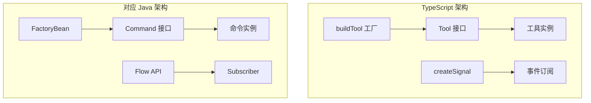
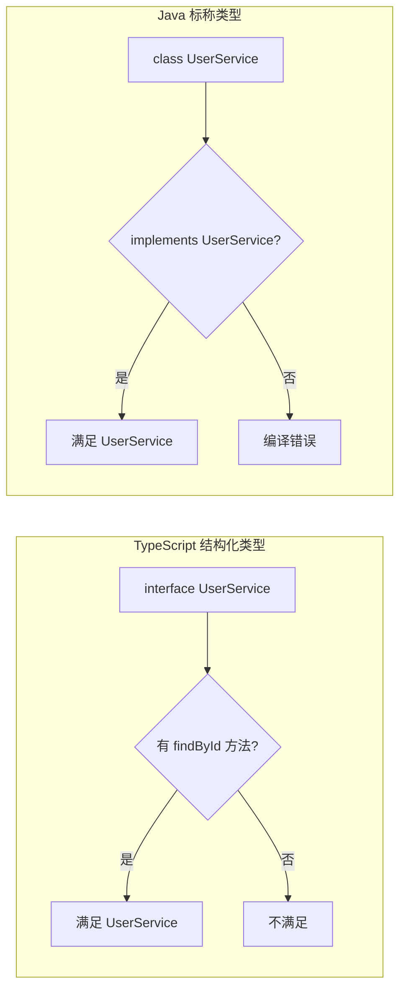
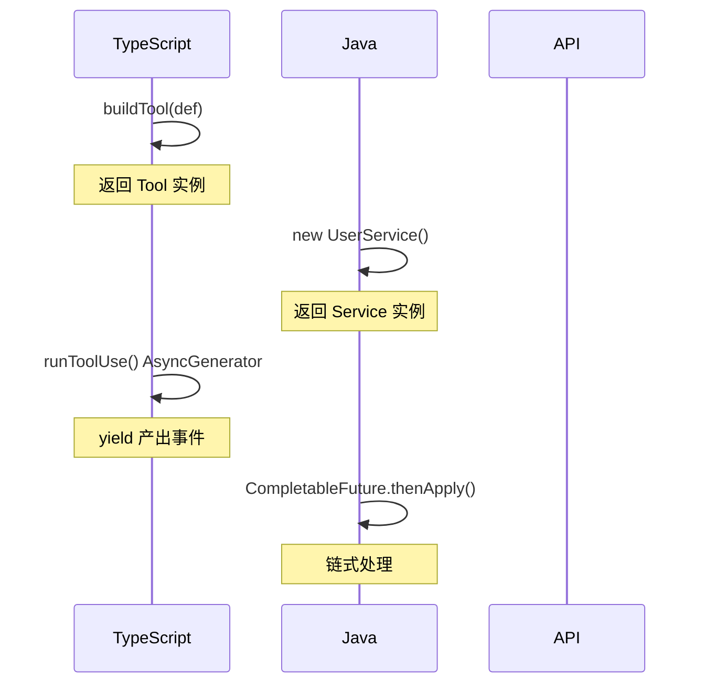
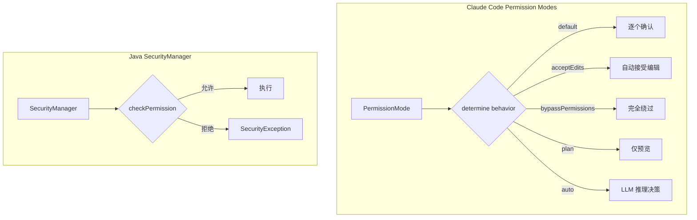

# 第12章：TypeScript 与 Java：架构思想对比

> **本章目标**：通过 TypeScript 与 Java 的架构模式对比，帮助 Java 开发者快速建立 Claude Code 的架构思维模型。学完后能够理解 TypeScript 类型系统、异步模式、响应式编程的实际落地，以及这些思想如何迁移到 Java。

---

## 1. 学习目标

- [ ] 理解 TypeScript 结构化类型 vs Java 标称类型的本质差异
- [ ] 掌握 Tool 接口、buildTool 工厂模式与 Java Command 模式的对应关系
- [ ] 理解 createSignal 响应式状态实现与 Java Observable/Flow 的区别
- [ ] 掌握 AsyncGenerator 流式执行模式与 CompletableFuture 的对比
- [ ] 理解 Permission Modes 权限模式与 Java SecurityManager 的设计差异
- [ ] 能够建立跨语言架构直觉，迁移最佳实践

---

## 2. 背景问题

### 2.1 为什么需要语言对比？

作为 Java 开发者，你可能已经在生产环境中使用了 Spring、Jakarta EE 或其他企业级框架。Claude Code 使用 TypeScript 开发，但许多设计决策在两种语言中有着相似的目标，只是实现路径不同。

理解这些对应关系可以帮助你：
1. **快速建立直觉**：知道"它类似 Java 中的 X"就能快速理解
2. **识别设计权衡**：理解两种语言约束背后的设计决策
3. **迁移最佳实践**：TypeScript 中有效的模式可以迁移到 Java

### 2.2 为什么 Claude Code 选择 TypeScript？

| 因素 | TypeScript 优势 | Java 对应 |
|------|----------------|----------|
| 动态类型 | 结构化类型更灵活 | 标称类型更严格 |
| 运行时 | 单一语言栈 | 需要编译+运行时 |
| 生态 | NPM 生态丰富 | Maven/Gradle 成熟 |
| 工具链 | VS Code 原生支持 | IntelliJ 成熟 |
| 编译 | 无需编译（JS） | 需要编译 |

---

## 3. 源码入口

| 项目 | 内容 |
|------|------|
| 文件路径 | `src/Tool.ts` |
| 核心函数/类 | `Tool` interface, `buildTool()` |
| 行号 | `Tool`: #362-695, `buildTool`: #783-792 |

**Signal 响应式状态**：

| 项目 | 内容 |
|------|------|
| 文件路径 | `src/utils/signal.ts` |
| 核心函数 | `createSignal()` |
| 行号 | `createSignal`: #27-43 |

**权限模式**：

| 项目 | 内容 |
|------|------|
| 文件路径 | `src/types/permissions.ts` |
| 核心类型 | `PermissionMode`, `PermissionResult` |
| 行号 | `PermissionMode`: #16-38, `PermissionResult`: #251-267 |

**AsyncGenerator 工具执行**：

| 项目 | 内容 |
|------|------|
| 文件路径 | `src/services/tools/toolExecution.ts` |
| 核心函数 | `runToolUse()` |
| 行号 | `runToolUse`: #337-412 |

---

## 4. 架构定位

### 4.1 模块职责

**Tool 系统** (`src/Tool.ts`)：
- 定义 Tool 接口（30+ 方法）包含执行、渲染、验证、元数据
- buildTool 工厂模式创建工具实例

**响应式状态** (`src/utils/signal.ts`)：
- 极简事件信号实现（15行代码）
- 订阅/发布模式，无存储状态

**权限系统** (`src/types/permissions.ts`)：
- 声明式权限模式定义
- 运行时决策与规则匹配

### 4.2 模块关系



---

## 5. 核心源码分析

### 5.1 buildTool 工厂模式

**文件**：`src/Tool.ts:783-792`

```typescript
export function buildTool<D extends AnyToolDef>(def: D): BuiltTool<D> {
  return {
    ...TOOL_DEFAULTS,
    userFacingName: () => def.name,
    ...def,
  } as BuiltTool<D>
}
```

**默认值填充**（`TOOL_DEFAULTS`）：

```typescript
const TOOL_DEFAULTS = {
  isEnabled: () => true,
  isConcurrencySafe: (_input?: unknown) => false,
  isReadOnly: (_input?: unknown) => false,
  isDestructive: (_input?: unknown) => false,
  checkPermissions: (input, _ctx?) => Promise.resolve({ behavior: 'allow', updatedInput: input }),
  toAutoClassifierInput: (_input?: unknown) => '',
  userFacingName: (_input?: unknown) => '',
}
```

**Java 对比**（Spring FactoryBean）：

```java
@Component
public class ToolFactoryBean implements FactoryBean<Tool> {
    @Override
    public Tool getObject() {
        return switch (type) {
            case MCP -> createMcpTool(config);
            case BUILTIN -> createBuiltinTool(config);
        };
    }
    @Override
    public Class<?> getObjectType() { return Tool.class; }
}
```

### 5.2 createSignal 响应式状态

**文件**：`src/utils/signal.ts:27-43`

```typescript
export function createSignal<Args extends unknown[] = []>(): Signal<Args> {
  const listeners = new Set<(...args: Args) => void>()
  return {
    subscribe(listener) {
      listeners.add(listener)
      return () => { listeners.delete(listener) }
    },
    emit(...args) {
      for (const listener of listeners) listener(...args)
    },
    clear() {
      listeners.clear()
    },
  }
}
```

**设计特点**：
- 无存储状态，纯事件发布-订阅
- 返回取消订阅函数（类似 RxJS subscription）
- 极简实现，仅15行代码

**Java 对比**（java.util.concurrent.Flow）：

```java
SubmissionPublisher<T> publisher = new SubmissionPublisher<>();
subscriber.subscribe(new Flow.Subscriber<T>() {
    @Override
    public void onSubscribe(Subscription s) { s.request(1); }
    @Override
    public void onNext(T item) { /* 处理 */ }
    @Override
    public void onError(Throwable t) { /* 错误处理 */ }
    @Override
    public void onComplete() { /* 完成处理 */ }
});
```

### 5.3 runToolUse AsyncGenerator

**文件**：`src/services/tools/toolExecution.ts:337-412`

```typescript
export async function* runToolUse(
  toolUse: ToolUseBlock,
  assistantMessage: AssistantMessage,
  canUseTool: CanUseToolFn,
  toolUseContext: ToolUseContext,
): AsyncGenerator<MessageUpdateLazy, void> {
  const toolName = toolUse.name
  let tool = findToolByName(toolUseContext.options.tools, toolName)

  if (!tool) {
    // 工具不存在处理...
    yield { message: createUserMessage({...}) }
    return
  }

  try {
    for await (const update of streamedCheckPermissionsAndCallTool(...)) {
      yield update
    }
  } catch (error) {
    // 错误处理...
    yield { message: createUserMessage({...}) }
  }
}
```

**Java 对比**（CompletableFuture 链式）：

```java
CompletableFuture<ToolResult> future = tool.call(input, context)
    .thenApply(result -> processResult(result))
    .thenAccept(finalResult -> displayResult(finalResult))
    .exceptionally(error -> handleError(error));
```

---

## 6. 可视化结构

### 6.1 类型系统对比



### 6.2 工具执行流程对比



### 6.3 权限决策对比



---

## 7. 工程经验

### 7.1 为什么 TypeScript 选择结构化类型？

| 方面 | 结构化类型优势 | 适用场景 |
|------|--------------|----------|
| 协议定义 | 无需显式声明 implements | 工具接口、API 契约 |
| 鸭式类型 | 有 findById 即满足 UserService | 快速组合 |
| 灵活组合 | 接口可以交叉合并 | 插件系统 |

**为什么 Java 选择标称类型？**
- 企业级代码需要显式声明依赖
- 编译时检查更严格
- 二进制兼容性更好

### 7.2 为什么 Signal 实现如此简单？

Claude Code 的 Signal 只有15行，而 Java 的响应式库（Reactor）有数千行。原因是：
- CLI 场景是单线程同步交互
- 不需要背压（backpressure）机制
- 不需要多线程发布-订阅

### 7.3 常见坑与避坑指南

| 坑点 | TypeScript | Java |
|------|-----------|------|
| 类型推断 | 结构化类型可能匹配意外对象 | 必须显式声明 |
| 内存泄漏 | 未清理的 subscribe 闭包 | 未取消的 CompletableFuture |
| 异步错误 | AsyncGenerator try/catch | CompletableFuture.exceptionally |
| 泛型约束 | TypeScript 泛型协变 | Java 泛型不变 |

---

## 8. Contributor 指南

### 8.1 适合新手的文件

| 文件 | 难度 | 说明 |
|------|------|------|
| `src/utils/signal.ts` | L1 | 15行代码，理解发布-订阅 |
| `src/types/permissions.ts` (部分) | L2 | 添加新 PermissionMode |
| `src/Tool.ts` (ToolDef 部分) | L3 | 理解 buildTool 工厂 |

### 8.2 危险逻辑（修改需谨慎）

| 区域 | 风险等级 | 说明 |
|------|---------|------|
| `buildTool` 默认值填充 | 🟡 中 | 影响所有工具行为 |
| `runToolUse` AsyncGenerator | 🔴 高 | 核心执行流程 |
| 权限模式决策 | 🔴 高 | 影响安全策略 |

### 8.3 调试方法

**追踪 Signal 事件**：
```typescript
const signal = createSignal<[string]>()
const originalEmit = signal.emit
signal.emit = (...args) => {
  console.log('Signal emit:', args)
  originalEmit(...args)
}
```

**追踪 AsyncGenerator**：
```typescript
for await (const update of runToolUse(...)) {
  console.log('Tool progress:', update)
  yield update
}
```

### 8.4 相关 Issue/PR

- [Type system design](https://github.com/anthropics/claude-code/issues?q=typescript)
- [Permission modes](https://github.com/anthropics/claude-code/issues?q=permission+mode)

---

## 练习

### 练习 1：类型系统对比

**问题**：TypeScript 的结构化类型允许以下代码：

```typescript
interface Dog { bark(): void }
interface Cat { meow(): void }
function makeNoise(animal: Dog) { animal.bark() }
const cat: Cat = { meow: () => console.log('meow') }
makeNoise(cat as any) // TypeScript 允许，Java 不允许
```

**为什么 Java 不允许这种隐式转换？哪种方式更安全？**

**答案**：
Java 的标称类型要求显式声明接口实现，这确保了：
1. 调用者明确知道依赖关系
2. 编译时能发现所有不匹配
3. 重构时能追踪所有实现

TypeScript 的结构化类型更灵活但可能在运行时才发现问题。

### 练习 2：Signal vs Flow

**问题**：将以下 TypeScript Signal 代码转换为 Java Flow：

```typescript
const changed = createSignal<[SettingSource]>()
changed.subscribe(source => console.log('Setting changed:', source))
changed.emit('userSettings')
```

**答案**：
```java
SubmissionPublisher<SettingSource> publisher = new SubmissionPublisher<>();
publisher.subscribe(new Flow.Subscriber<>() {
    @Override
    public void onSubscribe(Subscription s) { s.request(1); }
    @Override
    public void onNext(SettingSource item) {
        System.out.println("Setting changed: " + item);
        s.request(1);
    }
    @Override
    public void onError(Throwable t) { t.printStackTrace(); }
    @Override
    public void onComplete() {}
});
publisher.submit(SettingSource.userSettings);
```

### 练习 3：AsyncGenerator vs CompletableFuture

**问题**：AsyncGenerator 的 `yield` 和 CompletableFuture 的 `thenApply` 本质区别是什么？

**答案**：

| 方面 | AsyncGenerator yield | CompletableFuture thenApply |
|------|---------------------|---------------------------|
| 迭代方式 | 同步代码风格 | 回调链式风格 |
| 取消 | 通过 AbortController | 需要 completeExceptionally |
| 组合 | yield* 委托 | allOf/anyOf |
| 错误传播 | try/catch 在 generator 内 | exceptionally 回调 |

---

## 练习答案速查

| 练习 | 核心答案 |
|------|---------|
| 1 | 标称类型更安全，编译时检查 |
| 2 | SubmissionPublisher + Flow.Subscriber |
| 3 | yield 同步风格 vs thenApply 回调链式 |

---

## 本章 vs Java

| 方面 | Claude Code (TypeScript) | Java (Spring) |
|------|------------------------|--------------|
| 工厂模式 | `buildTool()` 返回对象字面量 | `FactoryBean` 实现接口 |
| Tool 接口 | 30+ 方法的胖接口 | `Command` + `Renderable` |
| 响应式状态 | `createSignal()` 15行 | `Flow.Subscriber` |
| 异步生成器 | `AsyncGenerator` yield | `CompletableFuture` 链式 |
| 权限模式 | 运行时 `PermissionMode` | `SecurityManager` 固定策略 |
| 类型系统 | 结构化类型 duck typing | 标称类型必须声明 |
| 配置验证 | Zod schema | `@ConfigurationProperties` |

---

## 总结：设计模式映射表

| TypeScript 模式 | Claude Code 实现 | Java 等价 | Spring 等价 |
|---------------|-----------------|----------|------------|
| 工厂模式 | `buildTool()` | `FactoryBean` | `@Bean` 方法 |
| 胖接口 | `Tool` (30+ 方法) | `Command` + `Renderable` | `HandlerInterceptor` |
| 响应式 | `createSignal()` | `Flow.Subscriber` | `Reactor Flux` |
| 异步生成器 | `AsyncGenerator` | `CompletableFuture` | `Mono`/`Flux` |
| 依赖注入 | `getAppState()` | ServiceLocator | `@Autowired` |
| 缓存 | `Map` + LRU | `HashMap` | `@Cacheable` |
| Schema 验证 | Zod | Hibernate Validator | `BindingResult` |
| 权限 | Permission modes | `SecurityManager` | Spring Security |

---

## 下一篇

👉 [第00章-全局架构总览.md](./第00章-全局架构总览.md)
